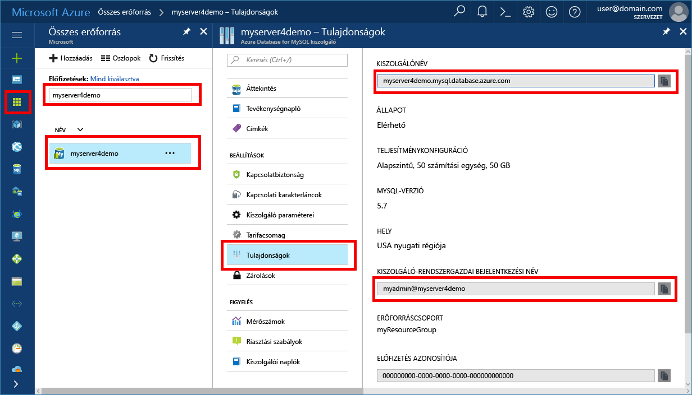

# <a name="azure-database-for-mysql-use-connectorc-to-connect-and-query-data"></a>A MySQL-hez készült Azure Database: Csatlakozás és adatlekérdezés összekötő/C++ használatával
Ebben a rövid útmutatóban azt szemléltetjük, hogy miként lehet C++-alkalmazás használatával csatlakozni a MySQL-hez készült Azure Database-hez. Azt is bemutatja, hogyan lehet SQL-utasítások használatával adatokat lekérdezni, beszúrni, frissíteni és törölni az adatbázisban. A cikkben ismertetett lépések feltételezik, hogy Ön rendelkezik fejlesztési tapasztalatokkal a C++ használatával kapcsolatban, a MySQL-hez készült Azure Database használatában pedig még járatlan.

## <a name="prerequisites"></a>Előfeltételek
Ebben a rövid útmutatóban a következő útmutatók valamelyikében létrehozott erőforrásokat használunk kiindulási pontként:
- [Azure-adatbázis létrehozása MySQL-kiszolgálóhoz az Azure Portal használatával](./quickstart-create-mysql-server-database-using-azure-portal.md)
- [Azure-adatbázis létrehozása MySQL-kiszolgálóhoz az Azure CLI használatával](./quickstart-create-mysql-server-database-using-azure-cli.md)

Emellett a következőket kell elvégezni:
- A [.NET-keretrendszer](https://www.microsoft.com/net/download) telepítése
- A [Visual Studio](https://www.visualstudio.com/downloads/) telepítése
- A [MySQL-összekötő/C++](https://dev.mysql.com/downloads/connector/cpp/) telepítése 
- A [Boost](http://www.boost.org/) telepítése

## <a name="install-visual-studio-and-net"></a>A Visual Studio és a .NET telepítése
A jelen szakaszban ismertetett lépések feltételezik, hogy Ön rendelkezik .NET-fejlesztési tapasztalatokkal.

### <a name="windows"></a>**Windows**
1. Telepítse a Visual Studio 2017 Communityt, amely egy minden funkcióval ellátott, bővíthető, ingyenes IDE, és amellyel korszerű alkalmazásokat hozhat létre Android, iOS és Windows operációs rendszerre, valamint webes illetve adatbázis-alkalmazásokhoz és felhőszolgáltatásokhoz. Telepítheti a teljes .NET-keretrendszert vagy csak a .NET Core-t. A rövid útmutatóban foglalt kódrészletek mindkettővel működnek. Ha a Visual Studio már telepítve van a számítógépén, a következő két lépés kihagyható.
   - Töltse le a [Visual Studio 2017 telepítőt](https://www.visualstudio.com/thank-you-downloading-visual-studio/?sku=Community&rel=15). 
   - Futtassa a telepítőt, és kövesse a telepítési utasításokat a telepítés befejezéséhez.

### <a name="configure-visual-studio"></a>**A Visual Studio konfigurálása**
1. A Visual Studióban a project property (projekttulajdonság) > configuration properties (konfigurációs tulajdonságok) > C/C++ > linker (kapcsolószerkesztő) > general (általános) > additional library directories (további kódtárkönyvtárak) menüpontban adja hozzá a c++-összekötő lib\opt könyvtárát (pl.: C:\Program Files (x86)\MySQL\MySQL Connector C++ 1.1.9\lib\opt).
2. A Visual Studióban a project property (projekttulajdonság) > configuration properties (konfigurációs tulajdonságok) > C/C++ > general (általános) > additional include directories (további belefoglalt könyvtárak) menüpontban
   - Adja hozzá a c++-összekötő \include könyvtárát (pl.: C:\Program Files (x86)\MySQL\MySQL Connector C++ 1.1.9\include\)
   - Adja hozzá a Boost kódtár gyökérkönyvtárát (pl.: C:\boost_1_64_0\)
3. A Visual Studióban a project property (projekttulajdonság) > configuration properties (konfigurációs tulajdonságok) > C/C++ > linker (kapcsolószerkesztő) > Input (Bemenet) > Additional Dependencies (További függőségek) menüpontban adja hozzá a mysqlcppconn.lib elemet a szövegmezőhöz
4. Másolja át a mysqlcppconn.dll fájlt a 3. lépésben szereplő c++-összekötő könyvtárából az alkalmazás futtatható fájlját tartalmazó könyvtárba, vagy adja hozzá környezeti változóként, hogy az alkalmazás megtalálhassa azt.

## <a name="get-connection-information"></a>Kapcsolatadatok lekérése
Kérje le a MySQL-hez készült Azure Database-hez való csatlakozáshoz szükséges kapcsolatadatokat. Ehhez szükség lesz a teljes kiszolgálónévre és bejelentkezési hitelesítő adatokra.

1. Jelentkezzen be az [Azure portálra](https://portal.azure.com/).
2. Az Azure Portal bal oldali menüjében kattintson az **Összes erőforrás** lehetőségre, és keressen rá a létrehozott kiszolgálóra, például **myserver4demo**.
3. Kattintson a kiszolgálónévre.
4. Válassza a kiszolgáló **tulajdonságlapját**. Jegyezze fel a **Kiszolgálónevet** és a **Kiszolgáló-rendszergazdai bejelentkezési nevet**.
 
5. Amennyiben elfelejtette a kiszolgáló bejelentkezési adatait, lépjen az **Overview** (Áttekintés) oldalra, és itt megtudhatja a kiszolgáló rendszergazdájának bejelentkezési nevét, valamint szükség esetén visszaállíthatja a jelszót.

## <a name="connect-create-table-and-insert-data"></a>Csatlakozás, táblák létrehozása és adatok beszúrása
Az alábbi kód használatával csatlakozhat és töltheti be az adatokat a **CREATE TABLE** és az **INSERT INTO** SQL-utasítások segítségével. A kód az sql::Driver osztályt használja a connect() metódussal a MySQL-lel létesített kapcsolat létrehozásához. A kód ezután a createStatement() és az execute() metódust használja az adatbázis-parancsok futtatásához. 

Cserélje le a gazdagép, az adatbázisnév, a felhasználó és a jelszó paramétereit azokra az értékekre, amelyeket a kiszolgáló és az adatbázis létrehozásakor adott meg. 

```c++
#include <stdlib.h>
#include <iostream>
#include "stdafx.h"

#include "mysql_connection.h"
#include <cppconn/driver.h>
#include <cppconn/exception.h>
#include <cppconn/prepared_statement.h>
using namespace std;

int main()
{
    sql::Driver *driver;
    sql::Connection *con;
    sql::Statement *stmt;
    sql::PreparedStatement *pstmt;

    try
    {
        driver = get_driver_instance();
        //for demonstration only. never save password in the code!
        con = driver>connect("tcp://myserver4demo.mysql.database.azure.com:3306/quickstartdb", "myadmin@myserver4demo", "server_admin_password");
    }
    catch (sql::SQLException e)
    {
        cout << "Could not connect to database. Error message: " << e.what() << endl;
        system("pause");
        exit(1);
    }

    stmt = con>createStatement();
    stmt>execute("DROP TABLE IF EXISTS inventory");
    cout << "Finished dropping table (if existed)" << endl;
    stmt>execute("CREATE TABLE inventory (id serial PRIMARY KEY, name VARCHAR(50), quantity INTEGER);");
    cout << "Finished creating table" << endl;
    delete stmt;

    pstmt = con>prepareStatement("INSERT INTO inventory(name, quantity) VALUES(?,?)");
    pstmt>setString(1, "banana");
    pstmt>setInt(2, 150);
    pstmt>execute();
    cout << "One row inserted." << endl;

    pstmt>setString(1, "orange");
    pstmt>setInt(2, 154);
    pstmt>execute();
    cout << "One row inserted." << endl;

    pstmt>setString(1, "apple");
    pstmt>setInt(2, 100);
    pstmt>execute();
    cout << "One row inserted." << endl;
    
    delete pstmt;   
    delete con;
    system("pause");
    return 0;

```

## <a name="read-data"></a>Adatok olvasása

A következő kóddal csatlakozhat, és beolvashatja az adatokat a **SELECT** SQL-utasítással. A kód az sql::Driver osztályt használja a connect() metódussal a MySQL-lel létesített kapcsolat létrehozásához. A kód ezután a prepareStatement() és az executeQuery() metódust használja a select-parancsok futtatásához. Végül a kód a next() metódust használja az eredményekben lévő rekordokra lépéshez. Ezután a kód a getInt() és a getString() metódussal elemzi a rekord értékeit.

Cserélje le a gazdagép, az adatbázisnév, a felhasználó és a jelszó paramétereit azokra az értékekre, amelyeket a kiszolgáló és az adatbázis létrehozásakor adott meg. 

```csharp
#include <stdlib.h>
#include <iostream>
#include "stdafx.h"

#include "mysql_connection.h"
#include <cppconn/driver.h>
#include <cppconn/exception.h>
#include <cppconn/resultset.h>
#include <cppconn/prepared_statement.h>
using namespace std;

int main()
{
    sql::Driver *driver;
    sql::Connection *con;
    sql::PreparedStatement *pstmt;
    sql::ResultSet *result;

    try
    {
        driver = get_driver_instance();
        //for demonstration only. never save password in the code!
        con = driver>connect("tcp://myserver4demo.mysql.database.azure.com:3306/quickstartdb", "myadmin@myserver4demo", "server_admin_password");
    }
    catch (sql::SQLException e)
    {
        cout << "Could not connect to database. Error message: " << e.what() << endl;
        system("pause");
        exit(1);
    }   

//  select  
    pstmt = con>prepareStatement("SELECT * FROM inventory;");
    result = pstmt>executeQuery();  
    
    while (result>next())
        printf("Reading from table=(%d, %s, %d)\n", result>getInt(1), result>getString(2).c_str(), result>getInt(3));   
    
    delete result;
    delete pstmt;   
    delete con;
    system("pause");
    return 0;
}
```

## <a name="update-data"></a>Adatok frissítése
Az alábbi kód használatával csatlakozhat és végezheti el az adatok olvasását **UPDATE** SQL-utasítás segítségével. A kód az sql::Driver osztályt használja a connect() metódussal a MySQL-lel létesített kapcsolat létrehozásához. A kód ezután a prepareStatement() és az executeQuery() metódust használja az update-parancsok futtatásához. 

Cserélje le a gazdagép, az adatbázisnév, a felhasználó és a jelszó paramétereit azokra az értékekre, amelyeket a kiszolgáló és az adatbázis létrehozásakor adott meg. 

```csharp
#include <stdlib.h>
#include <iostream>
#include "stdafx.h"

#include "mysql_connection.h"
#include <cppconn/driver.h>
#include <cppconn/exception.h>
#include <cppconn/prepared_statement.h>
using namespace std;

int main()
{
    sql::Driver *driver;
    sql::Connection *con;
    sql::PreparedStatement *pstmt;

    try
    {
        driver = get_driver_instance();
        //for demonstration only. never save password in the code!
        con = driver>connect("tcp://myserver4demo.mysql.database.azure.com:3306/quickstartdb", "myadmin@myserver4demo", "server_admin_password");
    }
    catch (sql::SQLException e)
    {
        cout << "Could not connect to database. Error message: " << e.what() << endl;
        system("pause");
        exit(1);
    }   

    //update
    pstmt = con>prepareStatement("UPDATE inventory SET quantity = ? WHERE name = ?");
    pstmt>setInt(1, 200);
    pstmt>setString(2, "banana");
    pstmt>executeQuery();
    printf("Row updated\n");
    
    delete con;
    delete pstmt;
    system("pause");
    return 0;
}
```


## <a name="delete-data"></a>Adat törlése
A következő kód használatával csatlakozhat, és beolvashatja az adatokat a **DELETE** SQL-utasítással. A kód az sql::Driver osztályt használja a connect() metódussal a MySQL-lel létesített kapcsolat létrehozásához. A kód ezután a prepareStatement() és az executeQuery() metódust használja a delete-parancsok futtatásához.

Cserélje le a gazdagép, az adatbázisnév, a felhasználó és a jelszó paramétereit azokra az értékekre, amelyeket a kiszolgáló és az adatbázis létrehozásakor adott meg. 

```csharp
#include <stdlib.h>
#include <iostream>
#include "stdafx.h"

#include "mysql_connection.h"
#include <cppconn/driver.h>
#include <cppconn/exception.h>
#include <cppconn/resultset.h>
#include <cppconn/prepared_statement.h>
using namespace std;

int main()
{
    sql::Driver *driver;
    sql::Connection *con;
    sql::PreparedStatement *pstmt;
    sql::ResultSet *result;

    try
    {
        driver = get_driver_instance();
        //for demonstration only. never save password in the code!
        con = driver>connect("tcp://myserver4demo.mysql.database.azure.com:3306/quickstartdb", "myadmin@myserver4demo", "server_admin_password");
    }
    catch (sql::SQLException e)
    {
        cout << "Could not connect to database. Error message: " << e.what() << endl;
        system("pause");
        exit(1);
    }
        
    //delete
    pstmt = con>prepareStatement("DELETE FROM inventory WHERE name = ?");
    pstmt>setString(1, "orange");
    result = pstmt>executeQuery();
    printf("Row deleted\n");    
    
    delete pstmt;
    delete con;
    delete result;
    system("pause");
    return 0;
}
```

## <a name="next-steps"></a>Következő lépések
> [!div class="nextstepaction"]
> [MySQL-adatbázis migrálása a MySQL-hez készült Azure Database-be memóriakép és visszaállítás használatával](concepts-migrate-dump-restore.md)

