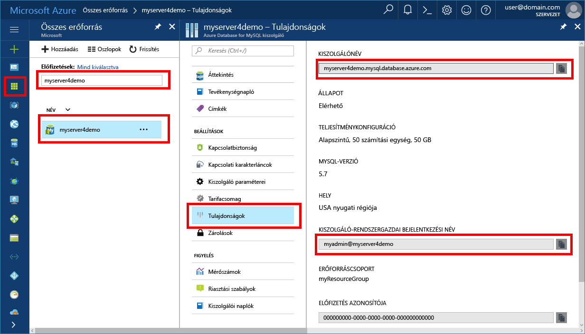

# <a name="azure-database-for-mysql-use-net-c-to-connect-and-query-data"></a>A MySQL-hez készült Azure-adatbázis: Csatlakozás és adatlekérdezés a .Net C# használatával
Ebben a rövid útmutatóban azt szemléltetjük, hogy miként lehet C#-alkalmazás használatával csatlakozni a MySQL-hez készült Azure Database-hez. Azt is bemutatja, hogyan lehet SQL-utasítások használatával adatokat lekérdezni, beszúrni, frissíteni és törölni az adatbázisban. A cikkben ismertetett lépések feltételezik, hogy Ön rendelkezik fejlesztési tapasztalatokkal a C# használatával kapcsolatban, a MySQL-hez készült Azure Database használatában pedig még járatlan.

## <a name="prerequisites"></a>Előfeltételek
Ebben a rövid útmutatóban a következő útmutatók valamelyikében létrehozott erőforrásokat használunk kiindulási pontként:
- [Azure-adatbázis létrehozása MySQL-kiszolgálóhoz az Azure Portal használatával](./quickstart-create-mysql-server-database-using-azure-portal.md)
- [Azure-adatbázis létrehozása MySQL-kiszolgálóhoz az Azure CLI használatával](./quickstart-create-mysql-server-database-using-azure-cli.md)

Emellett a következőket kell elvégezni:
- A [.NET](https://www.microsoft.com/net/download) telepítése. A .NET-keretrendszer az adott platformon (Windows, Ubuntu Linux vagy macOS) történő telepítéséhez kövesse a hivatkozott cikk lépéseit. 
- A [Visual Studio](https://www.visualstudio.com/downloads/) telepítése.
- A [MySQL-hez készült ODBC-illesztő](https://dev.mysql.com/downloads/connector/odbc/) telepítése.

## <a name="get-connection-information"></a>Kapcsolatadatok lekérése
Kérje le a MySQL-hez készült Azure Database-hez való csatlakozáshoz szükséges kapcsolatadatokat. Ehhez szükség lesz a teljes kiszolgálónévre és bejelentkezési hitelesítő adatokra.

1. Jelentkezzen be az [Azure portálra](https://portal.azure.com/).
2. Az Azure Portal bal oldali menüjében kattintson az **Összes erőforrás** lehetőségre, és keressen rá a létrehozott kiszolgálóra, például **myserver4demo**.
3. Kattintson a kiszolgálónévre.
4. Válassza a kiszolgáló **tulajdonságlapját**. Jegyezze fel a **Kiszolgálónevet** és a **Kiszolgáló-rendszergazdai bejelentkezési nevet**.
 
5. Amennyiben elfelejtette a kiszolgáló bejelentkezési adatait, lépjen az **Overview** (Áttekintés) oldalra, és itt megtudhatja a kiszolgáló rendszergazdájának bejelentkezési nevét, valamint szükség esetén visszaállíthatja a jelszót.

## <a name="connect-create-table-and-insert-data"></a>Csatlakozás, táblák létrehozása és adatok beszúrása
Az alábbi kód használatával csatlakozhat és töltheti be az adatokat a **CREATE TABLE** és az **INSERT INTO** SQL-utasítások segítségével. A kód ODBC-osztályt használ az [Open()](https://msdn.microsoft.com/en-us/library/system.data.odbc.odbcconnection.open(v=vs.110).aspx) metódussal, hogy kapcsolatot létesítsen a MySQL-lel. A kód ezután a [CreateCommand()](https://msdn.microsoft.com/en-us/library/system.data.odbc.odbcconnection.createcommand(v=vs.110).aspx) metódust használja, beállítja a CommandText tulajdonságot, és meghívja az [ExecuteNonQuery()](https://msdn.microsoft.com/en-us/library/system.data.odbc.odbccommand.executenonquery(v=vs.110).aspx) metódust az adatbázis-parancsok futtatásához. 

Cserélje le a gazdagép, az adatbázisnév, a felhasználó és a jelszó paramétereit azokra az értékekre, amelyeket a kiszolgáló és az adatbázis létrehozásakor adott meg. 

```csharp
using System;
using System.Collections.Generic;
using System.Linq;
using System.Text;
using System.Threading.Tasks;
using MySql.Data;
using System.Data.Odbc;

namespace driver
{
    class MySQLCreate
    {
        static void Main(string[] args)
        {
            var conn = new OdbcConnection("DRIVER={MySQL ODBC 5.3 unicode Driver}; Server=myserver4demo.mysql.database.azure.com; Port=3306;" +
            " Database=quickstartdb; Uid=myadmin@myserver4demo; Pwd=server_admin_password; sslverify=0; Option=3;MULTI_STATEMENTS=1");

            Console.Out.WriteLine("Opening connection");
            conn.Open();

            var command = conn.CreateCommand();
            command.CommandText = "DROP TABLE IF EXISTS inventory;";
            command.ExecuteNonQuery();
            Console.Out.WriteLine("Finished dropping table (if existed)");

            command.CommandText = "CREATE TABLE inventory (id serial PRIMARY KEY, name VARCHAR(50), quantity INTEGER);";
            command.ExecuteNonQuery();
            Console.Out.WriteLine("Finished creating table");

            command.CommandText =
                String.Format(
                    @"INSERT INTO inventory (name, quantity) VALUES ({0}, {1});
                    INSERT INTO inventory (name, quantity) VALUES ({2}, {3});
                    INSERT INTO inventory (name, quantity) VALUES ({4}, {5});",
                    "\'banana\'", 150,
                    "\'orange\'", 154,
                    "\'apple\'", 100
                    );

            int nRows = command.ExecuteNonQuery();
            Console.Out.WriteLine(String.Format("Number of rows inserted={0}", nRows));

            Console.Out.WriteLine("Closing connection");
            conn.Close();

            Console.WriteLine("Press RETURN to exit");
            Console.ReadLine();
        }

    }
}

```

## <a name="read-data"></a>Adatok olvasása

A következő kóddal csatlakozhat, és beolvashatja az adatokat a **SELECT** SQL-utasítással. A kód ODBC-osztályt használ az [Open()](https://msdn.microsoft.com/en-us/library/system.data.odbc.odbcconnection.open(v=vs.110).aspx) metódussal, hogy kapcsolatot létesítsen a MySQL-lel. A kód ezután a [CreateCommand()](https://msdn.microsoft.com/en-us/library/system.data.odbc.odbcconnection.createcommand(v=vs.110).aspx) és az [ExecuteReader()](https://msdn.microsoft.com/en-us/library/system.data.odbc.odbccommand.executereader(v=vs.110).aspx) metódust használja az adatbázis-parancsok futtatásához. Ezután a kód a [Read()](https://msdn.microsoft.com/en-us/library/system.data.odbc.odbcdatareader.read(v=vs.110).aspx) metódust használja az eredményekben lévő rekordokra lépéshez. Ezután a kód a GetInt32 és a GetString metódussal elemzi a rekord értékeit.

Cserélje le a gazdagép, az adatbázisnév, a felhasználó és a jelszó paramétereit azokra az értékekre, amelyeket a kiszolgáló és az adatbázis létrehozásakor adott meg. 

```csharp
using System;
using System.Collections.Generic;
using System.Linq;
using System.Text;
using System.Threading.Tasks;
using MySql.Data;
using System.Data.Odbc;


namespace driver
{
    class MySQLRead
    {

        static void Main(string[] args)
        {
            var conn = new OdbcConnection("DRIVER={MySQL ODBC 5.3 unicode Driver}; Server=myserver4demo.mysql.database.azure.com; Port=3306;" +
            " Database=quickstartdb; Uid=myadmin@myserver4demo; Pwd=server_admin_password; sslverify=0; Option=3;MULTI_STATEMENTS=1");

            Console.Out.WriteLine("Opening connection");
            conn.Open();

            var command = conn.CreateCommand();
            command.CommandText = "SELECT * FROM inventory;";

            var reader = command.ExecuteReader();
            while (reader.Read())
            {
                Console.WriteLine(
                    string.Format(
                        "Reading from table=({0}, {1}, {2})",
                        reader.GetInt32(0).ToString(),
                        reader.GetString(1),
                        reader.GetInt32(2).ToString()
                        )
                    );
            }

            Console.Out.WriteLine("Closing connection");
            conn.Close();

            Console.WriteLine("Press RETURN to exit");
            Console.ReadLine();
        }
    }
}


```

## <a name="update-data"></a>Adatok frissítése
Az alábbi kód használatával csatlakozhat és végezheti el az adatok olvasását **UPDATE** SQL-utasítás segítségével. A kód ODBC-osztályt használ az [Open()](https://msdn.microsoft.com/en-us/library/system.data.odbc.odbcconnection.open(v=vs.110).aspx) metódussal, hogy kapcsolatot létesítsen a MySQL-lel. A kód ezután a [CreateCommand()](https://msdn.microsoft.com/en-us/library/system.data.odbc.odbcconnection.createcommand(v=vs.110).aspx) metódust használja, beállítja a CommandText tulajdonságot, és meghívja az [ExecuteNonQuery()](https://msdn.microsoft.com/en-us/library/system.data.odbc.odbccommand.executenonquery(v=vs.110).aspx) metódust az adatbázis-parancsok futtatásához.

Cserélje le a gazdagép, az adatbázisnév, a felhasználó és a jelszó paramétereit azokra az értékekre, amelyeket a kiszolgáló és az adatbázis létrehozásakor adott meg. 

```csharp
using System;
using System.Collections.Generic;
using System.Linq;
using System.Text;
using System.Threading.Tasks;
using System.Data.Odbc;

namespace driver
{
    class MySQLUpdate
    {
        static void Main(string[] args)
        {
            var conn = new OdbcConnection("DRIVER={MySQL ODBC 5.3 unicode Driver}; Server=myserver4demo.mysql.database.azure.com; Port=3306;" +
            " Database=quickstartdb; Uid=myadmin@myserver4demo; Pwd=server_admin_password; sslverify=0; Option=3;MULTI_STATEMENTS=1");

            Console.Out.WriteLine("Opening connection");
            conn.Open();

            var command = conn.CreateCommand();
            command.CommandText =
            String.Format("UPDATE inventory SET quantity = {0} WHERE name = {1};",
                200,
                "\'banana\'"
                );

            int nRows = command.ExecuteNonQuery();
            Console.Out.WriteLine(String.Format("Number of rows updated={0}", nRows));

            Console.Out.WriteLine("Closing connection");
            conn.Close();

            Console.WriteLine("Press RETURN to exit");
            Console.ReadLine();
        }
    }
}


```


## <a name="delete-data"></a>Adat törlése
Az alábbi kód használatával csatlakozhat és végezheti el az adatok törlését egy **DELETE** SQL-utasítás segítségével. 

A kód ODBC-osztályt használ az [Open()](https://msdn.microsoft.com/en-us/library/system.data.odbc.odbcconnection.open(v=vs.110).aspx) metódussal, hogy kapcsolatot létesítsen a MySQL-lel. A kód ezután a [CreateCommand()](https://msdn.microsoft.com/en-us/library/system.data.odbc.odbcconnection.createcommand(v=vs.110).aspx) metódust használja, beállítja a CommandText tulajdonságot, és meghívja az [ExecuteNonQuery()](https://msdn.microsoft.com/en-us/library/system.data.odbc.odbccommand.executenonquery(v=vs.110).aspx) metódust az adatbázis-parancsok futtatásához.

Cserélje le a gazdagép, az adatbázisnév, a felhasználó és a jelszó paramétereit azokra az értékekre, amelyeket a kiszolgáló és az adatbázis létrehozásakor adott meg. 

```csharp
using System;
using System.Collections.Generic;
using System.Linq;
using System.Text;
using System.Threading.Tasks;
using System.Data.Odbc;

namespace driver
{
    class MySQLDelete
    {
        static void Main(string[] args)
        {
            var conn = new OdbcConnection("DRIVER={MySQL ODBC 5.3 unicode Driver}; Server=myserver4demo.mysql.database.azure.com; Port=3306;" +
            " Database=quickstartdb; Uid=myadmin@myserver4demo; Pwd=server_admin_password; sslverify=0; Option=3;MULTI_STATEMENTS=1");

            Console.Out.WriteLine("Opening connection");
            conn.Open();

            var command = conn.CreateCommand();
            command.CommandText =
                String.Format("DELETE FROM inventory WHERE name = {0};",
                    "\'orange\'");
            int nRows = command.ExecuteNonQuery();
            Console.Out.WriteLine(String.Format("Number of rows deleted={0}", nRows));

            Console.Out.WriteLine("Closing connection");
            conn.Close();

            Console.WriteLine("Press RETURN to exit");
            Console.ReadLine();
        }
    }
}

```

## <a name="next-steps"></a>Következő lépések
> [!div class="nextstepaction"]
> [MySQL-adatbázis migrálása a MySQL-hez készült Azure Database-be memóriakép és visszaállítás használatával](concepts-migrate-dump-restore.md)

