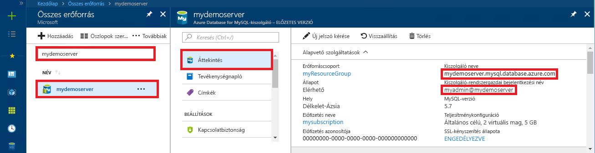

# <a name="azure-database-for-mysql-use-net-c-to-connect-and-query-data"></a>A MySQL-hez készült Azure-adatbázis: Csatlakozás és adatlekérdezés a .Net C# használatával
Ebben a rövid útmutatóban azt szemléltetjük, hogy miként lehet C#-alkalmazás használatával csatlakozni az Azure Database for MySQL-hez. Azt is bemutatja, hogyan lehet SQL-utasítások használatával adatokat lekérdezni, beszúrni, frissíteni és törölni az adatbázisban. Ez a témakör azt feltételezi, hogy a C# használata terén rendelkezik fejlesztési tapasztalatokkal, de az Azure Database for MySQL használatában még járatlan.

## <a name="prerequisites"></a>Előfeltételek
Ebben a rövid útmutatóban a következő útmutatók valamelyikében létrehozott erőforrásokat használunk kiindulási pontként:
- [Azure-adatbázis létrehozása MySQL-kiszolgálóhoz az Azure Portal használatával](./quickstart-create-mysql-server-database-using-azure-portal.md)
- [Azure-adatbázis létrehozása MySQL-kiszolgálóhoz az Azure CLI használatával](./quickstart-create-mysql-server-database-using-azure-cli.md)

Emellett a következőket kell elvégezni:
- A [.NET](https://www.microsoft.com/net/download) telepítése. A .NET-keretrendszer az adott platformon (Windows, Ubuntu Linux vagy macOS) történő telepítéséhez kövesse a hivatkozott cikk lépéseit. 
- A [Visual Studio](https://www.visualstudio.com/downloads/) telepítése.

## <a name="create-a-c-project"></a>C#-projekt létrehozása
Egy parancssorból futtassa az alábbi parancsot:

```
mkdir AzureMySqlExample
cd AzureMySqlExample
dotnet new console
dotnet add package MySqlConnector
```

## <a name="get-connection-information"></a>Kapcsolatadatok lekérése
Kérje le a MySQL-hez készült Azure Database-hez való csatlakozáshoz szükséges kapcsolatadatokat. Ehhez szükség lesz a teljes kiszolgálónévre és bejelentkezési hitelesítő adatokra.

1. Jelentkezzen be az [Azure portálra](https://portal.azure.com/).
2. Az Azure Portal bal oldali menüjében kattintson a **Minden erőforrás** lehetőségre, és keressen rá a létrehozott kiszolgálóra (például **mydemoserver**).
3. Kattintson a kiszolgálónévre.
4. A kiszolgáló **Áttekintés** paneléről jegyezze fel a **Kiszolgálónevet** és a **Kiszolgáló-rendszergazdai bejelentkezési nevet**. Ha elfelejti a jelszavát, ezen a panelen új jelszót is tud kérni.
 

## <a name="connect-create-table-and-insert-data"></a>Csatlakozás, táblák létrehozása és adatok beszúrása
A következő kóddal csatlakozhat, és betöltheti az adatokat a `CREATE TABLE` és az `INSERT INTO` SQL-utasítással. A kód a `MySqlConnection` osztályt használja az [OpenAsync()](https://docs.microsoft.com/dotnet/api/system.data.common.dbconnection.openasync#System_Data_Common_DbConnection_OpenAsync) metódussal, hogy kapcsolatot létesítsen a MySQL-lel. A kód ezután a [CreateCommand()](https://docs.microsoft.com/dotnet/api/system.data.common.dbconnection.createcommand) metódust használja, beállítja a CommandText tulajdonságot, és meghívja az [ExecuteNonQueryAsync()](https://docs.microsoft.com/dotnet/api/system.data.common.dbcommand.executenonqueryasync) metódust az adatbázis-parancsok futtatásához. 

Cserélje le a `Server`, `Database`, `UserID` és `Password` paramétert azokkal az értékekkel, amelyeket a kiszolgáló és az adatbázis létrehozásakor adott meg. 

```csharp
using System;
using System.Threading.Tasks;
using MySql.Data.MySqlClient;

namespace AzureMySqlExample
{
    class MySqlCreate
    {
        static async Task Main(string[] args)
        {
            var builder = new MySqlConnectionStringBuilder
            {
                Server = "YOUR-SERVER.mysql.database.azure.com",
                Database = "YOUR-DATABASE",
                UserID = "USER@YOUR-SERVER",
                Password = "PASSWORD",
                SslMode = MySqlSslMode.Required,
            };

            using (var conn = new MySqlConnection(builder.ConnectionString))
            {
                Console.WriteLine("Opening connection");
                await conn.OpenAsync();

                using (var command = conn.CreateCommand())
                {
                    command.CommandText = "DROP TABLE IF EXISTS inventory;";
                    await command.ExecuteNonQueryAsync();
                    Console.WriteLine("Finished dropping table (if existed)");

                    command.CommandText = "CREATE TABLE inventory (id serial PRIMARY KEY, name VARCHAR(50), quantity INTEGER);";
                    await command.ExecuteNonQueryAsync();
                    Console.WriteLine("Finished creating table");

                    command.CommandText = @"INSERT INTO inventory (name, quantity) VALUES (@name1, @quantity1),
                        (@name2, @quantity2), (@name3, @quantity3);";
                    command.Parameters.AddWithValue("@name1", "banana");
                    command.Parameters.AddWithValue("@quantity1", 150);
                    command.Parameters.AddWithValue("@name2", "orange");
                    command.Parameters.AddWithValue("@quantity2", 154);
                    command.Parameters.AddWithValue("@name3", "apple");
                    command.Parameters.AddWithValue("@quantity3", 100);

                    int rowCount = await command.ExecuteNonQueryAsync();
                    Console.WriteLine(String.Format("Number of rows inserted={0}", rowCount));
                }

                // connection will be closed by the 'using' block
                Console.WriteLine("Closing connection");
            }

            Console.WriteLine("Press RETURN to exit");
            Console.ReadLine();
        }
    }
}
```

## <a name="read-data"></a>Adatok olvasása

A következő kóddal csatlakozhat, és beolvashatja az adatokat a `SELECT` SQL-utasítással. A kód a `MySqlConnection` osztályt használja az [OpenAsync()](https://docs.microsoft.com/dotnet/api/system.data.common.dbconnection.openasync#System_Data_Common_DbConnection_OpenAsync) metódussal, hogy kapcsolatot létesítsen a MySQL-lel. A kód ezután a [CreateCommand()](https://docs.microsoft.com/dotnet/api/system.data.common.dbconnection.createcommand) és az [ExecuteReaderAsync()](https://docs.microsoft.com/dotnet/api/system.data.common.dbcommand.executereaderasync) metódust használja az adatbázis-parancsok futtatásához. Ezután a kód a [ReadAsync()](https://docs.microsoft.com/dotnet/api/system.data.common.dbdatareader.readasync#System_Data_Common_DbDataReader_ReadAsync) metódust használja az eredményekben lévő rekordokra lépéshez. Ezután a kód a GetInt32 és a GetString metódussal elemzi a rekord értékeit.

Cserélje le a `Server`, `Database`, `UserID` és `Password` paramétert azokkal az értékekkel, amelyeket a kiszolgáló és az adatbázis létrehozásakor adott meg. 

```csharp
using System;
using System.Threading.Tasks;
using MySql.Data.MySqlClient;

namespace AzureMySqlExample
{
    class MySqlRead
    {
        static async Task Main(string[] args)
        {
            var builder = new MySqlConnectionStringBuilder
            {
                Server = "YOUR-SERVER.mysql.database.azure.com",
                Database = "YOUR-DATABASE",
                UserID = "USER@YOUR-SERVER",
                Password = "PASSWORD",
                SslMode = MySqlSslMode.Required,
            };

            using (var conn = new MySqlConnection(builder.ConnectionString))
            {
                Console.WriteLine("Opening connection");
                await conn.OpenAsync();

                using (var command = conn.CreateCommand())
                {
                    command.CommandText = "SELECT * FROM inventory;";

                    using (var reader = await command.ExecuteReaderAsync())
                    {
                        while (await reader.ReadAsync())
                        {
                            Console.WriteLine(string.Format(
                                "Reading from table=({0}, {1}, {2})",
                                reader.GetInt32(0),
                                reader.GetString(1),
                                reader.GetInt32(2)));
                        }
                    }
                }

                Console.WriteLine("Closing connection");
            }

            Console.WriteLine("Press RETURN to exit");
            Console.ReadLine();
        }
    }
}
```

## <a name="update-data"></a>Adatok frissítése
A következő kóddal csatlakozhat, és beolvashatja az adatokat az `UPDATE` SQL-utasítással. A kód a `MySqlConnection` osztályt használja az [OpenAsync()](https://docs.microsoft.com/dotnet/api/system.data.common.dbconnection.openasync#System_Data_Common_DbConnection_OpenAsync) metódussal, hogy kapcsolatot létesítsen a MySQL-lel. A kód ezután a [CreateCommand()](https://docs.microsoft.com/dotnet/api/system.data.common.dbconnection.createcommand) metódust használja, beállítja a CommandText tulajdonságot, és meghívja az [ExecuteNonQueryAsync()](https://docs.microsoft.com/dotnet/api/system.data.common.dbcommand.executenonqueryasync) metódust az adatbázis-parancsok futtatásához. 

Cserélje le a `Server`, `Database`, `UserID` és `Password` paramétert azokkal az értékekkel, amelyeket a kiszolgáló és az adatbázis létrehozásakor adott meg. 

```csharp
using System;
using System.Threading.Tasks;
using MySql.Data.MySqlClient;

namespace AzureMySqlExample
{
    class MySqlUpdate
    {
        static async Task Main(string[] args)
        {
            var builder = new MySqlConnectionStringBuilder
            {
                Server = "YOUR-SERVER.mysql.database.azure.com",
                Database = "YOUR-DATABASE",
                UserID = "USER@YOUR-SERVER",
                Password = "PASSWORD",
                SslMode = MySqlSslMode.Required,
            };

            using (var conn = new MySqlConnection(builder.ConnectionString))
            {
                Console.WriteLine("Opening connection");
                await conn.OpenAsync();

                using (var command = conn.CreateCommand())
                {
                    command.CommandText = "UPDATE inventory SET quantity = @quantity WHERE name = @name;";
                    command.Parameters.AddWithValue("@quantity", 200);
                    command.Parameters.AddWithValue("@name", "banana");

                    int rowCount = await command.ExecuteNonQueryAsync();
                    Console.WriteLine(String.Format("Number of rows updated={0}", rowCount));
                }

                Console.WriteLine("Closing connection");
            }

            Console.WriteLine("Press RETURN to exit");
            Console.ReadLine();
        }
    }
}
```

## <a name="delete-data"></a>Adat törlése
A következő kóddal csatlakozhat, és törölheti az adatokat a `DELETE` SQL-utasítással. 

A kód a `MySqlConnection` osztályt használja az [OpenAsync()](https://docs.microsoft.com/dotnet/api/system.data.common.dbconnection.openasync#System_Data_Common_DbConnection_OpenAsync) metódussal, hogy kapcsolatot létesítsen a MySQL-lel. A kód ezután a [CreateCommand()](https://docs.microsoft.com/dotnet/api/system.data.common.dbconnection.createcommand) metódust használja, beállítja a CommandText tulajdonságot, és meghívja az [ExecuteNonQueryAsync()](https://docs.microsoft.com/dotnet/api/system.data.common.dbcommand.executenonqueryasync) metódust az adatbázis-parancsok futtatásához. 

Cserélje le a `Server`, `Database`, `UserID` és `Password` paramétert azokkal az értékekkel, amelyeket a kiszolgáló és az adatbázis létrehozásakor adott meg. 

```csharp
using System;
using System.Threading.Tasks;
using MySql.Data.MySqlClient;

namespace AzureMySqlExample
{
    class MySqlDelete
    {
        static async Task Main(string[] args)
        {
            var builder = new MySqlConnectionStringBuilder
            {
                Server = "YOUR-SERVER.mysql.database.azure.com",
                Database = "YOUR-DATABASE",
                UserID = "USER@YOUR-SERVER",
                Password = "PASSWORD",
                SslMode = MySqlSslMode.Required,
            };

            using (var conn = new MySqlConnection(builder.ConnectionString))
            {
                Console.WriteLine("Opening connection");
                await conn.OpenAsync();

                using (var command = conn.CreateCommand())
                {
                    command.CommandText = "DELETE FROM inventory WHERE name = @name;";
                    command.Parameters.AddWithValue("@name", "orange");

                    int rowCount = await command.ExecuteNonQueryAsync();
                    Console.WriteLine(String.Format("Number of rows deleted={0}", rowCount));
                }

                Console.WriteLine("Closing connection");
            }

            Console.WriteLine("Press RETURN to exit");
            Console.ReadLine();
        }
    }
}
```

## <a name="next-steps"></a>További lépések
> [!div class="nextstepaction"]
> [MySQL-adatbázis migrálása a MySQL-hez készült Azure Database-be memóriakép és visszaállítás használatával](concepts-migrate-dump-restore.md)
