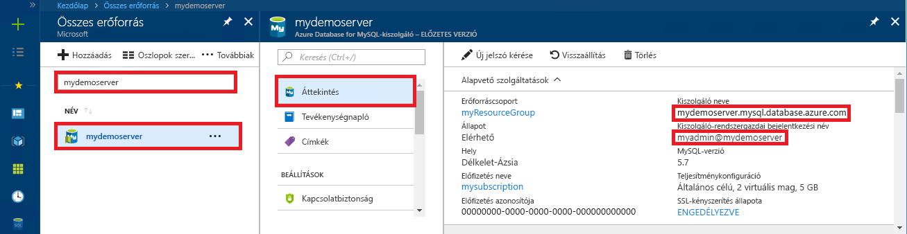

# <a name="quickstart-use-java-to-connect-to-and-query-data-in-azure-database-for-mysql"></a>Gyors útmutató: A Java használatával csatlakozhat a Azure Database for MySQLhoz, és lekérdezheti azokat

Ez a rövid útmutató azt ismerteti, hogyan csatlakozhat egy Azure Database for MySQLhoz egy Java-alkalmazás és a [MariaDB Connector/J JDBC-](https://mariadb.com/kb/en/library/mariadb-connector-j/)illesztő használatával. Azt is bemutatja, hogyan lehet SQL-utasítások használatával adatokat lekérdezni, beszúrni, frissíteni és törölni az adatbázisban. A cikk feltételezi, hogy Ön rendelkezik fejlesztési tapasztalatokkal a Java használatával kapcsolatban, az Azure Database for MySQL használatában pedig még járatlan.

## <a name="prerequisites"></a>Előfeltételek
1. Ebben a rövid útmutatóban a következő útmutatók valamelyikében létrehozott erőforrásokat használunk kiindulási pontként:
   - [Azure-adatbázis létrehozása MySQL-kiszolgálóhoz az Azure Portal használatával](./quickstart-create-mysql-server-database-using-azure-portal.md)
   - [Azure-adatbázis létrehozása MySQL-kiszolgálóhoz az Azure CLI használatával](./quickstart-create-mysql-server-database-using-azure-cli.md)

2. A MySQL-hez készült Azure Database-kapcsolat biztonsága megnyitott tűzfallal van konfigurálva és az SSL-beállítások úgy vannak megadva, hogy csatlakozni tudjon az alkalmazás.

3. Szerezze be a MariaDB-összekötő/J-összekötőt az alábbi módszerek egyikével:
   - A [MariaDB-Java-Client](https://search.maven.org/search?q=a:mariadb-java-client) Maven-csomaggal adja meg a [MariaDB-Java-Client függőséget](https://mvnrepository.com/artifact/org.mariadb.jdbc/mariadb-java-client) a projekt Pom-fájljában.
   - Töltse le a [MariaDB Connector/J](https://downloads.mariadb.org/connector-java/) JDBC-illesztőt, és adja meg a JDBC jar-fájlt (például MariaDB-Java-Client-2.4.3. jar) az alkalmazás osztályútvonal. Ha problémát tapasztal az osztályútvonalakkal kapcsolatban, tekintse meg környezete dokumentációját az osztályok elérési útvonalával kapcsolatban (például: [Apache Tomcat](https://tomcat.apache.org/tomcat-7.0-doc/class-loader-howto.html) vagy [Java SE](https://docs.oracle.com/javase/7/docs/technotes/tools/windows/classpath.html)).

## <a name="get-connection-information"></a>Kapcsolatadatok lekérése
Kérje le a MySQL-hez készült Azure Database-hez való csatlakozáshoz szükséges kapcsolatadatokat. Ehhez szükség lesz a teljes kiszolgálónévre és bejelentkezési hitelesítő adatokra.

1. Jelentkezzen be az [Azure Portalra](https://portal.azure.com/).
2. Azure Portal bal oldali menüjében válassza a **minden erőforrás**elemet, majd keresse meg a létrehozott kiszolgálót (például **mydemoserver**).
3. Válassza ki a kiszolgálónevet.
4. A kiszolgáló **Áttekintés** paneléről jegyezze fel a **Kiszolgálónevet** és a **Kiszolgáló-rendszergazdai bejelentkezési nevet**. Ha elfelejti a jelszavát, ezen a panelen új jelszót is tud kérni.
 

## <a name="connect-create-table-and-insert-data"></a>Csatlakozás, táblák létrehozása és adatok beszúrása
Az alábbi kód használatával csatlakozhat és tölthet be adatokat az **INSERT SQL-utasítással** használt függvény segítségével. A [getConnection()](https://mariadb.com/kb/en/library/about-mariadb-connector-j/#using-drivermanager) metódus a MySQL-hez való kapcsolódásra szolgál. A [createStatement()](https://mariadb.com/kb/en/library/about-mariadb-connector-j/#creating-a-table-on-a-mariadb-or-mysql-server) és az execute() metódusok a tábla létrehozásához, illetve törléséhez használatosak. A prepareStatement objektummal hozhatja létre a beszúrási parancsokat, valamint a setString() és a setInt() metódusokkal végezheti el a paraméterértékek kötését. Az executeUpdate() metódussal futtathatja az egyes paraméterkészletekhez tartozó értékek beszúrására szolgáló parancsot. 

Cserélje le a gazdagép, az adatbázis, a felhasználó és a jelszó paramétereit azokra az értékekre, amelyeket a saját kiszolgáló és adatbázis létrehozásakor adott meg.

```java
import java.sql.*;
import java.util.Properties;

public class CreateTableInsertRows {

    public static void main (String[] args)  throws Exception
    {
        // Initialize connection variables. 
        String host = "mydemoserver.mysql.database.azure.com";
        String database = "quickstartdb";
        String user = "myadmin@mydemoserver";
        String password = "<server_admin_password>";

        // check that the driver is installed
        try
        {
            Class.forName("org.mariadb.jdbc");
        }
        catch (ClassNotFoundException e)
        {
            throw new ClassNotFoundException("MariaDB JDBC driver NOT detected in library path.", e);
        }

        System.out.println("MariaDB JDBC driver detected in library path.");

        Connection connection = null;

        // Initialize connection object
        try
        {
            String url = String.format("jdbc:mariadb://%s/%s", host, database);

            // Set connection properties.
            Properties properties = new Properties();
            properties.setProperty("user", user);
            properties.setProperty("password", password);
            properties.setProperty("useSSL", "true");
            properties.setProperty("verifyServerCertificate", "true");
            properties.setProperty("requireSSL", "false");

            // get connection
            connection = DriverManager.getConnection(url, properties);
        }
        catch (SQLException e)
        {
            throw new SQLException("Failed to create connection to database.", e);
        }
        if (connection != null) 
        { 
            System.out.println("Successfully created connection to database.");
        
            // Perform some SQL queries over the connection.
            try
            {
                // Drop previous table of same name if one exists.
                Statement statement = connection.createStatement();
                statement.execute("DROP TABLE IF EXISTS inventory;");
                System.out.println("Finished dropping table (if existed).");
    
                // Create table.
                statement.execute("CREATE TABLE inventory (id serial PRIMARY KEY, name VARCHAR(50), quantity INTEGER);");
                System.out.println("Created table.");
                
                // Insert some data into table.
                int nRowsInserted = 0;
                PreparedStatement preparedStatement = connection.prepareStatement("INSERT INTO inventory (name, quantity) VALUES (?, ?);");
                preparedStatement.setString(1, "banana");
                preparedStatement.setInt(2, 150);
                nRowsInserted += preparedStatement.executeUpdate();

                preparedStatement.setString(1, "orange");
                preparedStatement.setInt(2, 154);
                nRowsInserted += preparedStatement.executeUpdate();

                preparedStatement.setString(1, "apple");
                preparedStatement.setInt(2, 100);
                nRowsInserted += preparedStatement.executeUpdate();
                System.out.println(String.format("Inserted %d row(s) of data.", nRowsInserted));
    
                // NOTE No need to commit all changes to database, as auto-commit is enabled by default.
    
            }
            catch (SQLException e)
            {
                throw new SQLException("Encountered an error when executing given sql statement.", e);
            }       
        }
        else {
            System.out.println("Failed to create connection to database.");
        }
        System.out.println("Execution finished.");
    }
}

```

## <a name="read-data"></a>Adatok olvasása
Az alábbi kód használatával végezheti el az adatok olvasását a **SELECT** SQL-utasítás segítségével. A [getConnection()](https://mariadb.com/kb/en/library/about-mariadb-connector-j/#using-drivermanager) metódus a MySQL-hez való kapcsolódásra szolgál. A [createStatement ()](https://mariadb.com/kb/en/library/about-mariadb-connector-j/#creating-a-table-on-a-mariadb-or-mysql-server) és a executeQuery () metódus a SELECT utasítás összekapcsolására és futtatására szolgál. Az eredmények feldolgozása egy eredményhalmazt objektum használatával történik. 

Cserélje le a gazdagép, az adatbázis, a felhasználó és a jelszó paramétereit azokra az értékekre, amelyeket a saját kiszolgáló és adatbázis létrehozásakor adott meg.

```java
import java.sql.*;
import java.util.Properties;

public class ReadTable {

    public static void main (String[] args)  throws Exception
    {
        // Initialize connection variables.
        String host = "mydemoserver.mysql.database.azure.com";
        String database = "quickstartdb";
        String user = "myadmin@mydemoserver";
        String password = "<server_admin_password>";

        // check that the driver is installed
        try
        {
            Class.forName("org.mariadb.jdbc");
        }
        catch (ClassNotFoundException e)
        {
            throw new ClassNotFoundException("MariaDB JDBC driver NOT detected in library path.", e);
        }

        System.out.println("MariaDB JDBC driver detected in library path.");

        Connection connection = null;

        // Initialize connection object
        try
        {
            String url = String.format("jdbc:mariadb://%s/%s", host, database);

            // Set connection properties.
            Properties properties = new Properties();
            properties.setProperty("user", user);
            properties.setProperty("password", password);
            properties.setProperty("useSSL", "true");
            properties.setProperty("verifyServerCertificate", "true");
            properties.setProperty("requireSSL", "false");
            
            // get connection
            connection = DriverManager.getConnection(url, properties);
        }
        catch (SQLException e)
        {
            throw new SQLException("Failed to create connection to database", e);
        }
        if (connection != null) 
        { 
            System.out.println("Successfully created connection to database.");
        
            // Perform some SQL queries over the connection.
            try
            {
    
                Statement statement = connection.createStatement();
                ResultSet results = statement.executeQuery("SELECT * from inventory;");
                while (results.next())
                {
                    String outputString = 
                        String.format(
                            "Data row = (%s, %s, %s)",
                            results.getString(1),
                            results.getString(2),
                            results.getString(3));
                    System.out.println(outputString);
                }
            }
            catch (SQLException e)
            {
                throw new SQLException("Encountered an error when executing given sql statement", e);
            }       
        }
        else {
            System.out.println("Failed to create connection to database."); 
        }
        System.out.println("Execution finished.");
    }
}
```

## <a name="update-data"></a>Adatok frissítése
Az alábbi kód használatával végezheti el az adatok módosítását az **UPDATE** SQL-utasítás segítségével. A [getConnection()](https://mariadb.com/kb/en/library/about-mariadb-connector-j/#using-drivermanager) metódus a MySQL-hez való kapcsolódásra szolgál. A [prepareStatement()](https://docs.oracle.com/javase/tutorial/jdbc/basics/prepared.html) és az executeUpdate() metódusok előkészítésre, valamint az UPDATE-utasítás futtatására szolgálnak. 

Cserélje le a gazdagép, az adatbázis, a felhasználó és a jelszó paramétereit azokra az értékekre, amelyeket a saját kiszolgáló és adatbázis létrehozásakor adott meg.

```java
import java.sql.*;
import java.util.Properties;

public class UpdateTable {
    public static void main (String[] args)  throws Exception
    {
        // Initialize connection variables. 
        String host = "mydemoserver.mysql.database.azure.com";
        String database = "quickstartdb";
        String user = "myadmin@mydemoserver";
        String password = "<server_admin_password>";

        // check that the driver is installed
        try
        {
            Class.forName("org.mariadb.jdbc");
        }
        catch (ClassNotFoundException e)
        {
            throw new ClassNotFoundException("MariaDB JDBC driver NOT detected in library path.", e);
        }

        System.out.println("MariaDB JDBC driver detected in library path.");

        Connection connection = null;

        // Initialize connection object
        try
        {
            String url = String.format("jdbc:mariadb://%s/%s", host, database);
            
            // set up the connection properties
            Properties properties = new Properties();
            properties.setProperty("user", user);
            properties.setProperty("password", password);
            properties.setProperty("useSSL", "true");
            properties.setProperty("verifyServerCertificate", "true");
            properties.setProperty("requireSSL", "false");

            // get connection
            connection = DriverManager.getConnection(url, properties);
        }
        catch (SQLException e)
        {
            throw new SQLException("Failed to create connection to database.", e);
        }
        if (connection != null) 
        { 
            System.out.println("Successfully created connection to database.");
        
            // Perform some SQL queries over the connection.
            try
            {
                // Modify some data in table.
                int nRowsUpdated = 0;
                PreparedStatement preparedStatement = connection.prepareStatement("UPDATE inventory SET quantity = ? WHERE name = ?;");
                preparedStatement.setInt(1, 200);
                preparedStatement.setString(2, "banana");
                nRowsUpdated += preparedStatement.executeUpdate();
                System.out.println(String.format("Updated %d row(s) of data.", nRowsUpdated));
    
                // NOTE No need to commit all changes to database, as auto-commit is enabled by default.
            }
            catch (SQLException e)
            {
                throw new SQLException("Encountered an error when executing given sql statement.", e);
            }       
        }
        else {
            System.out.println("Failed to create connection to database.");
        }
        System.out.println("Execution finished.");
    }
}
```

## <a name="delete-data"></a>Adat törlése
Az alábbi kód használatával végezheti el az adatok eltávolítását a **DELETE** SQL-utasítás segítségével. A [getConnection()](https://mariadb.com/kb/en/library/about-mariadb-connector-j/#using-drivermanager) metódus a MySQL-hez való kapcsolódásra szolgál.  A [prepareStatement ()](https://docs.oracle.com/javase/tutorial/jdbc/basics/prepared.html) és a executeUpdate () metódus a DELETE utasítás előkészítésére és futtatására szolgál. 

Cserélje le a gazdagép, az adatbázis, a felhasználó és a jelszó paramétereit azokra az értékekre, amelyeket a saját kiszolgáló és adatbázis létrehozásakor adott meg.

```java
import java.sql.*;
import java.util.Properties;

public class DeleteTable {
    public static void main (String[] args)  throws Exception
    {
        // Initialize connection variables.
        String host = "mydemoserver.mysql.database.azure.com";
        String database = "quickstartdb";
        String user = "myadmin@mydemoserver";
        String password = "<server_admin_password>";
        
        // check that the driver is installed
        try
        {
            Class.forName("org.mariadb.jdbc");
        }
        catch (ClassNotFoundException e)
        {
            throw new ClassNotFoundException("MariaDB JDBC driver NOT detected in library path.", e);
        }

        System.out.println("MariaDB JDBC driver detected in library path.");

        Connection connection = null;

        // Initialize connection object
        try
        {
            String url = String.format("jdbc:mariadb://%s/%s", host, database);
            
            // set up the connection properties
            Properties properties = new Properties();
            properties.setProperty("user", user);
            properties.setProperty("password", password);
            properties.setProperty("useSSL", "true");
            properties.setProperty("verifyServerCertificate", "true");
            properties.setProperty("requireSSL", "false");
            
            // get connection
            connection = DriverManager.getConnection(url, properties);
        }
        catch (SQLException e)
        {
            throw new SQLException("Failed to create connection to database", e);
        }
        if (connection != null) 
        { 
            System.out.println("Successfully created connection to database.");
        
            // Perform some SQL queries over the connection.
            try
            {
                // Delete some data from table.
                int nRowsDeleted = 0;
                PreparedStatement preparedStatement = connection.prepareStatement("DELETE FROM inventory WHERE name = ?;");
                preparedStatement.setString(1, "orange");
                nRowsDeleted += preparedStatement.executeUpdate();
                System.out.println(String.format("Deleted %d row(s) of data.", nRowsDeleted));
    
                // NOTE No need to commit all changes to database, as auto-commit is enabled by default.
            }
            catch (SQLException e)
            {
                throw new SQLException("Encountered an error when executing given sql statement.", e);
            }       
        }
        else {
            System.out.println("Failed to create connection to database.");
        }
        System.out.println("Execution finished.");
    }
}
```

## <a name="next-steps"></a>További lépések

> [!div class="nextstepaction"]
> [MySQL-adatbázis migrálása a MySQL-hez készült Azure Database-be memóriakép és visszaállítás használatával](concepts-migrate-dump-restore.md)
