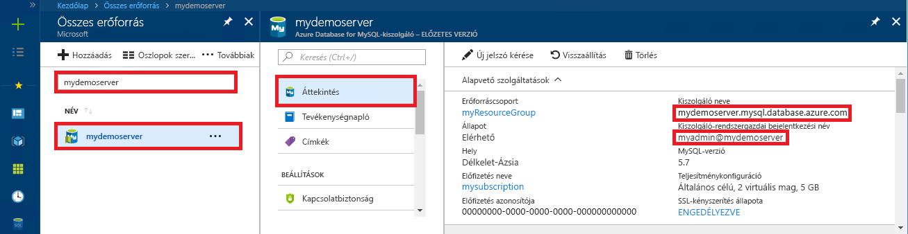

# <a name="azure-database-for-mysql-use-php-to-connect-and-query-data"></a>A MySQL-hez készült Azure Database: Csatlakozás és adatlekérdezés a PHP használatával
Ebben a gyors útmutatóban azt szemléltetjük, hogy miként lehet [PHP](https://secure.php.net/manual/intro-whatis.php)-alkalmazás használatával csatlakozni a MySQL-hez készült Azure Database-hez. Azt is bemutatja, hogyan lehet SQL-utasítások használatával adatokat lekérdezni, beszúrni, frissíteni és törölni az adatbázisban. Ez a témakör azt feltételezi, hogy Ön a PHP használata terén rendelkezik fejlesztési tapasztalatokkal, de a MySQL-hez készült Azure Database használatában még járatlan.

## <a name="prerequisites"></a>Előfeltételek
Ebben a rövid útmutatóban a következő útmutatók valamelyikében létrehozott erőforrásokat használunk kiindulási pontként:
- [Azure-adatbázis létrehozása MySQL-kiszolgálóhoz az Azure Portal használatával](./quickstart-create-mysql-server-database-using-azure-portal.md)
- [Azure-adatbázis létrehozása MySQL-kiszolgálóhoz az Azure CLI használatával](./quickstart-create-mysql-server-database-using-azure-cli.md)

## <a name="install-php"></a>A PHP telepítése
Telepítse a PHP-t saját kiszolgálón, vagy hozzon létre egy, a PHP-t tartalmazó Azure-[webalkalmazást](../app-service/app-service-web-overview.md).

### <a name="macos"></a>MacOS
- Töltse le a [PHP 7.1.4-es verzióját](https://secure.php.net/downloads.php).
- Telepítse a PHP-t, majd a további konfigurációs lehetőségekért tekintse meg a [PHP kézikönyvét](https://secure.php.net/manual/install.macosx.php).

### <a name="linux-ubuntu"></a>Linux (Ubuntu)
- Töltse le a [PHP 7.1.4 non-thread safe (NTS) x64-es verzióját](https://secure.php.net/downloads.php).
- Telepítse a PHP-t, majd a további konfigurációs lehetőségekért tekintse meg a [PHP kézikönyvét](https://secure.php.net/manual/install.unix.php).

### <a name="windows"></a>Windows
- Töltse le a [PHP 7.1.4 non-thread safe (NTS) x64-es verzióját](https://windows.php.net/download#php-7.1).
- Telepítse a PHP-t, majd a további konfigurációs lehetőségekért tekintse meg a [PHP kézikönyvét](https://secure.php.net/manual/install.windows.php).

## <a name="get-connection-information"></a>Kapcsolatadatok lekérése
Kérje le a MySQL-hez készült Azure Database-hez való csatlakozáshoz szükséges kapcsolatadatokat. Ehhez szükség lesz a teljes kiszolgálónévre és bejelentkezési hitelesítő adatokra.

1. Jelentkezzen be az [Azure Portalra](https://portal.azure.com/).
2. Az Azure Portal bal oldali menüjében kattintson a **Minden erőforrás** lehetőségre, és keressen rá a létrehozott kiszolgálóra (például **mydemoserver**).
3. Kattintson a kiszolgálónévre.
4. A kiszolgáló **Áttekintés** paneléről jegyezze fel a **Kiszolgálónevet** és a **Kiszolgáló-rendszergazdai bejelentkezési nevet**. Ha elfelejti a jelszavát, ezen a panelen új jelszót is tud kérni.
 

## <a name="connect-and-create-a-table"></a>Csatlakozás és tábla létrehozása
A következő kód segítségével csatlakozzon, és hozzon létre egy táblát a **CREATE TABLE** SQL-utasítás használatával. 

A kód a PHP beépített **MySQL Improved extension** (mysqli) osztályát használja. A kód meghívja a [mysqli_init](https://secure.php.net/manual/mysqli.init.php) és [mysqli_real_connect](https://secure.php.net/manual/mysqli.real-connect.php) metódust a MySQL-hez történő csatlakozáshoz. Ezután a kód meghívja [mysqli_query](https://secure.php.net/manual/mysqli.query.php) metódust a lekérdezés futtatásához. Végül pedig a [mysqli_close](https://secure.php.net/manual/mysqli.close.php) meghívásával bontja a kapcsolatot.

A host (gazdagép), a username (felhasználónév), a password (jelszó) és a db_name (adatbázisnév) paramétereket cserélje le a saját értékeire. 

```php
<?php
$host = 'mydemoserver.mysql.database.azure.com';
$username = 'myadmin@mydemoserver';
$password = 'your_password';
$db_name = 'your_database';

//Establishes the connection
$conn = mysqli_init();
mysqli_real_connect($conn, $host, $username, $password, $db_name, 3306);
if (mysqli_connect_errno($conn)) {
die('Failed to connect to MySQL: '.mysqli_connect_error());
}

// Run the create table query
if (mysqli_query($conn, '
CREATE TABLE Products (
`Id` INT NOT NULL AUTO_INCREMENT ,
`ProductName` VARCHAR(200) NOT NULL ,
`Color` VARCHAR(50) NOT NULL ,
`Price` DOUBLE NOT NULL ,
PRIMARY KEY (`Id`)
);
')) {
printf("Table created\n");
}

//Close the connection
mysqli_close($conn);
?>
```

## <a name="insert-data"></a>Adat beszúrása
Az alábbi kód használatával csatlakozhat, és adatokat szúrhat be egy **INSERT** SQL-utasítás segítségével.

A kód a PHP beépített **MySQL Improved extension** (mysqli) osztályát használja. A kód a [mysqli_prepare](https://secure.php.net/manual/mysqli.prepare.php) metódus használatával létrehoz egy előkészített beillesztési parancsot, majd a [mysqli_stmt_bind_param](https://secure.php.net/manual/mysqli-stmt.bind-param.php) metódus használatával hozzáköti az egyes beillesztett oszlopokhoz a paramétereket. A kód a [mysqli_stmt_execute](https://secure.php.net/manual/mysqli-stmt.execute.php) metódus használatával futtatja az utasítást, majd a [mysqli_stmt_close](https://secure.php.net/manual/mysqli-stmt.close.php) metódussal lezárja azt.

A host (gazdagép), a username (felhasználónév), a password (jelszó) és a db_name (adatbázisnév) paramétereket cserélje le a saját értékeire. 

```php
<?php
$host = 'mydemoserver.mysql.database.azure.com';
$username = 'myadmin@mydemoserver';
$password = 'your_password';
$db_name = 'your_database';

//Establishes the connection
$conn = mysqli_init();
mysqli_real_connect($conn, $host, $username, $password, $db_name, 3306);
if (mysqli_connect_errno($conn)) {
die('Failed to connect to MySQL: '.mysqli_connect_error());
}

//Create an Insert prepared statement and run it
$product_name = 'BrandNewProduct';
$product_color = 'Blue';
$product_price = 15.5;
if ($stmt = mysqli_prepare($conn, "INSERT INTO Products (ProductName, Color, Price) VALUES (?, ?, ?)")) {
mysqli_stmt_bind_param($stmt, 'ssd', $product_name, $product_color, $product_price);
mysqli_stmt_execute($stmt);
printf("Insert: Affected %d rows\n", mysqli_stmt_affected_rows($stmt));
mysqli_stmt_close($stmt);
}

// Close the connection
mysqli_close($conn);
?>
```

## <a name="read-data"></a>Adatok olvasása
A következő kóddal csatlakozhat, és beolvashatja az adatokat a **SELECT** SQL-utasítással.  A kód a PHP beépített **MySQL Improved extension** (mysqli) osztályát használja. A kód a [mysqli_query](https://secure.php.net/manual/mysqli.query.php) metódus használatával végrehajtja az SQL-lekérdezést, és a [mysqli_fetch_assoc](https://secure.php.net/manual/mysqli-result.fetch-assoc.php) metódussal beolvassa az eredményül kapott sorokat.

A host (gazdagép), a username (felhasználónév), a password (jelszó) és a db_name (adatbázisnév) paramétereket cserélje le a saját értékeire. 

```php
<?php
$host = 'mydemoserver.mysql.database.azure.com';
$username = 'myadmin@mydemoserver';
$password = 'your_password';
$db_name = 'your_database';

//Establishes the connection
$conn = mysqli_init();
mysqli_real_connect($conn, $host, $username, $password, $db_name, 3306);
if (mysqli_connect_errno($conn)) {
die('Failed to connect to MySQL: '.mysqli_connect_error());
}

//Run the Select query
printf("Reading data from table: \n");
$res = mysqli_query($conn, 'SELECT * FROM Products');
while ($row = mysqli_fetch_assoc($res)) {
var_dump($row);
}

//Close the connection
mysqli_close($conn);
?>
```

## <a name="update-data"></a>Adatok frissítése
Az alábbi kód használatával csatlakozhat és végezheti el az adatok módosítását egy **UPDATE** SQL-utasítás segítségével.

A kód a PHP beépített **MySQL Improved extension** (mysqli) osztályát használja. A kód a [mysqli_prepare](https://secure.php.net/manual/mysqli.prepare.php) metódus használatával létrehoz egy előkészített módosítási parancsot, majd a [mysqli_stmt_bind_param](https://secure.php.net/manual/mysqli-stmt.bind-param.php) metódus használatával hozzáköti az egyes módosított oszlopokhoz a paramétereket. A kód a [mysqli_stmt_execute](https://secure.php.net/manual/mysqli-stmt.execute.php) metódus használatával futtatja az utasítást, majd a [mysqli_stmt_close](https://secure.php.net/manual/mysqli-stmt.close.php) metódussal lezárja azt.

A host (gazdagép), a username (felhasználónév), a password (jelszó) és a db_name (adatbázisnév) paramétereket cserélje le a saját értékeire. 

```php
<?php
$host = 'mydemoserver.mysql.database.azure.com';
$username = 'myadmin@mydemoserver';
$password = 'your_password';
$db_name = 'your_database';

//Establishes the connection
$conn = mysqli_init();
mysqli_real_connect($conn, $host, $username, $password, $db_name, 3306);
if (mysqli_connect_errno($conn)) {
die('Failed to connect to MySQL: '.mysqli_connect_error());
}

//Run the Update statement
$product_name = 'BrandNewProduct';
$new_product_price = 15.1;
if ($stmt = mysqli_prepare($conn, "UPDATE Products SET Price = ? WHERE ProductName = ?")) {
mysqli_stmt_bind_param($stmt, 'ds', $new_product_price, $product_name);
mysqli_stmt_execute($stmt);
printf("Update: Affected %d rows\n", mysqli_stmt_affected_rows($stmt));

//Close the connection
mysqli_stmt_close($stmt);
}

mysqli_close($conn);
?>
```


## <a name="delete-data"></a>Adat törlése
A következő kóddal csatlakozhat, és beolvashatja az adatokat a **DELETE** SQL-utasítással. 

A kód a PHP beépített **MySQL Improved extension** (mysqli) osztályát használja. A kód a [mysqli_prepare](https://secure.php.net/manual/mysqli.prepare.php) metódus használatával létrehoz egy előkészített törlési parancsot, majd hozzáköti a paramétereket a parancs where záradékához a [mysqli_stmt_bind_param](https://secure.php.net/manual/mysqli-stmt.bind-param.php) metódus használatával. A kód a [mysqli_stmt_execute](https://secure.php.net/manual/mysqli-stmt.execute.php) metódus használatával futtatja az utasítást, majd a [mysqli_stmt_close](https://secure.php.net/manual/mysqli-stmt.close.php) metódussal lezárja azt.

A host (gazdagép), a username (felhasználónév), a password (jelszó) és a db_name (adatbázisnév) paramétereket cserélje le a saját értékeire. 

```php
<?php
$host = 'mydemoserver.mysql.database.azure.com';
$username = 'myadmin@mydemoserver';
$password = 'your_password';
$db_name = 'your_database';

//Establishes the connection
$conn = mysqli_init();
mysqli_real_connect($conn, $host, $username, $password, $db_name, 3306);
if (mysqli_connect_errno($conn)) {
die('Failed to connect to MySQL: '.mysqli_connect_error());
}

//Run the Delete statement
$product_name = 'BrandNewProduct';
if ($stmt = mysqli_prepare($conn, "DELETE FROM Products WHERE ProductName = ?")) {
mysqli_stmt_bind_param($stmt, 's', $product_name);
mysqli_stmt_execute($stmt);
printf("Delete: Affected %d rows\n", mysqli_stmt_affected_rows($stmt));
mysqli_stmt_close($stmt);
}

//Close the connection
mysqli_close($conn);
?>
```

## <a name="next-steps"></a>További lépések
> [!div class="nextstepaction"]
> [Csatlakozás az Azure Database for MySQL-hez SSL-en keresztül](howto-configure-ssl.md)
