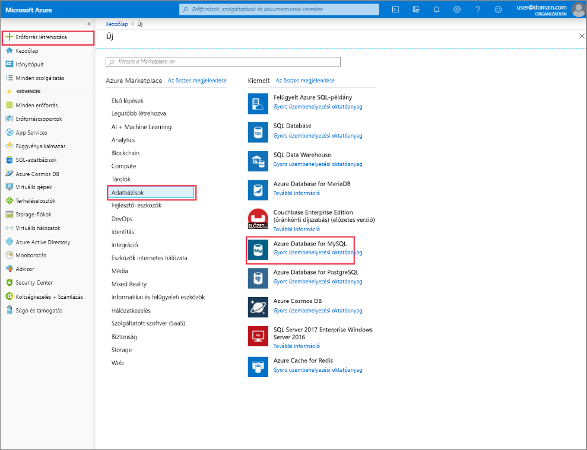

# Hozzon létre és kezelhető az Azure Database for MySQL-kiszolgálóhoz az Azure portal használatával
Ez a témakör ismerteti, hogyan gyorsan létrehozhat egy új, Azure Database for MySQL-kiszolgálóhoz. A kiszolgáló kezelése az Azure portal használatával kapcsolatos információkat is tartalmaz. Felügyeleti kiszolgáló többek között a kiszolgáló adatait, és adatbázisok, a jelszó alaphelyzetbe állítása, erőforrások skálázása és a kiszolgáló törlése megtekintésére.

## Bejelentkezés az Azure Portalra
Jelentkezzen be az [Azure Portalra](https://portal.azure.com).

## Azure-adatbázis létrehozása MySQL-kiszolgálóhoz
Kövesse az alábbi lépéseket követve létrehozhat egy Azure Database for MySQL-kiszolgáló neve "mydemoserver."

1. Kattintson a **erőforrás létrehozása** az Azure portal bal felső sarkában található gomb.

2. Az új oldalon válassza ki a **adatbázisok**, és az adatbázisok lapon válassza ki **, Azure Database for MySQL**.

    > Egy meghatározott készletével együtt jön létre egy Azure Database for MySQL-kiszolgáló [számítási és tárolási](./concepts-pricing-tiers.md) erőforrásokat. Az adatbázis létrehozása az Azure-erőforráscsoporton belül, és a egy Azure Database for MySQL-kiszolgálóhoz.

   

3. Adja meg az Azure Database for MySQL-űrlapot a következő információk alapján:

    | **Űrlapmező** | **Mező leírása** |
    |----------------|-----------------------|
    | *Kiszolgálónév* | mydemoserver (a kiszolgáló nevét a globálisan egyedi) |
    | *Előfizetés* | mysubscription (a legördülő menüből válassza ki) |
    | *Erőforráscsoport* | myresourcegroup (hozzon létre egy új erőforráscsoportot, vagy használjon egy meglévőt) |
    | *Forrás kiválasztása* | Üres (hozzon létre egy üres MySQL-kiszolgáló) |
    | *Kiszolgálói rendszergazdai bejelentkezés* | myadmin (állítsa be a rendszergazdafiók nevét) |
    | *Jelszó* | rendszergazdai fiók jelszó beállítása |
    | *Jelszó megerősítése* | erősítse meg a rendszergazdafiók jelszavát |
    | *Hely* | Délkelet-Ázsia (Észak-Európa és az USA nyugati RÉGIÓJA között kijelölés) |
    | *Verzió* | (válassza ki az Azure Database for MySQL-kiszolgáló verziójától) 5.7 |

4. Kattintson a **tarifacsomag** , adja meg a szolgáltatási szint és a teljesítmény szint az új kiszolgáló. Válassza ki a **általános célú** fülre. A **Számítási generáció**, **Virtuális mag**, **Tárolás** és **Biztonsági mentések megőrzési időszaka** beállítások alapértelmezett értékei a következők: *4. generációs*, *2 virtuális mag*, *5 GB* és *7 nap*. A csúszkákat nem szükséges módosítania. A kiszolgáló georedundáns tárhelyre való biztonsági mentésének engedélyezéséhez válassza a **Biztonsági másolat redundanciabeállításai** területen a **Georedundáns** lehetőséget.

   

5. A kiszolgáló üzembe helyezéséhez kattintson a **Létrehozás** elemre. Az üzembe helyezés eltarthat néhány percig.

    > Válassza ki a **rögzítés az irányítópulton** lehetőség kiválasztásával egyszerűen nyomon követheti az üzembe helyezést.

## Egy Azure Database for MySQL-kiszolgáló frissítése
Miután az új kiszolgáló kiépítését követően a felhasználók számára számos lehetőség közül választhat a meglévő kiszolgáló, többek között a rendszergazdai jelszó alaphelyzetbe állítása és méretezéssel a kiszolgáló virtuális mag, vagy tárolási módosításával konfigurálása.

### A rendszergazda felhasználói jelszó módosítása
1. A kiszolgáló **áttekintése**, kattintson a **jelszó alaphelyzetbe állítása** a jelszó-visszaállítási ablak megjelenítése.

   

2. Adjon meg egy új jelszót, és a jelszavát az ablakban látható módon:

   

3. Kattintson a **OK** mentse az új jelszót.

### Felfelé és lefelé méretezési csoport virtuális magok

1. Kattintson a **tarifacsomag**, alatt található **beállítások**.

2. Módosítsa a **virtuális mag** a csúszka mozgatásával a kívánt értékre állítja.

    

3. Kattintson az **OK** gombra a módosítások mentéséhez.

### A tárhely méretezése felfelé

1. Kattintson a **tarifacsomag**, alatt található **beállítások**.

2. Módosítsa a **tárolási** a csúszka mozgatásával a kívánt értékre állítja.

    

3. Kattintson az **OK** gombra a módosítások mentéséhez.

## Egy Azure Database for MySQL-kiszolgáló törlése

1. A kiszolgáló **áttekintése**, kattintson a **törlése** gombra kattintva nyissa meg a törlés megerősítésének kérését.

    

2. A kiszolgáló nevét a mezőbe írja be a bemeneti dupla megerősítést.

    

3. Kattintson a **törlése** gombra annak megerősítéséhez, hogy a kiszolgáló törlése. Várjon, amíg a "a MySQL-kiszolgáló törlése sikeresen megtörtént" pop akár az értesítési sáv jelenik meg.

## Az Azure Database for MySQL-adatbázisok listája
A kiszolgáló **áttekintése**, görgessen lefelé, amíg meg nem látja a csempe alsó adatbázis. A táblázatban felsorolt összes adatbázis a kiszolgálón.

   

## Egy Azure Database for MySQL-kiszolgáló részleteinek megjelenítése
Kattintson a **tulajdonságok**, alatt található **beállítások** a kiszolgálókkal kapcsolatos részletes információk megtekintéséhez.

## További lépések

[Gyors útmutató: Hozzon létre az Azure Database for MySQL-kiszolgálóhoz az Azure portal használatával](./quickstart-create-mysql-server-database-using-azure-portal.md)