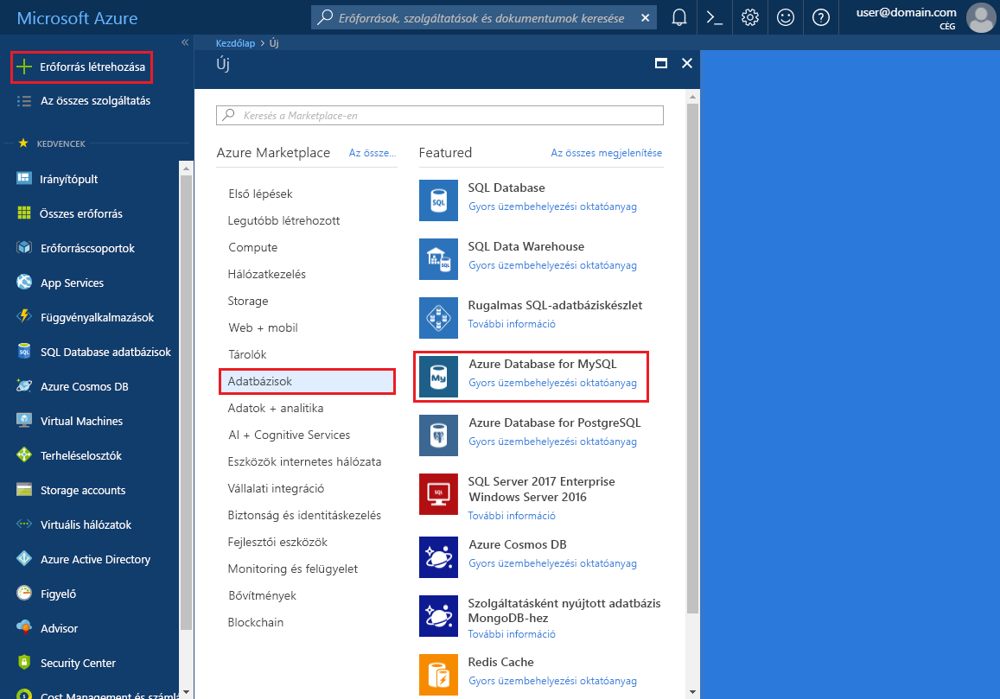
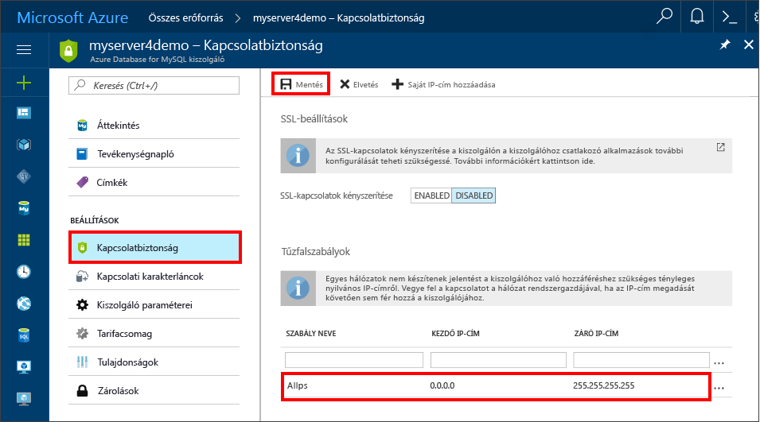

# <a name="create-an-azure-database-for-mysql-server-by-using-the-azure-portal"></a>Azure-adatbázis létrehozása MySQL-kiszolgálóhoz az Azure Portal használatával
A MySQL-hez készült Azure Database egy felügyelt szolgáltatás, amellyel a magas rendelkezésre állású MySQL-adatbázisokat futtathatja, kezelheti és skálázhatja a felhőben. Ez a rövid útmutató bemutatja, hogyan hozhat létre nagyjából öt perc alatt egy Azure-adatbázist MySQL-kiszolgálóhoz az Azure Portal használatával.  

Ha nem rendelkezik Azure-előfizetéssel, mindössze néhány perc alatt létrehozhat egy [ingyenes Azure-fiókot](https://azure.microsoft.com/free/) a virtuális gép létrehozásának megkezdése előtt.

## <a name="sign-in-to-azure"></a>Bejelentkezés az Azure-ba
Nyissa meg a webböngészőjét, és keresse fel az [Azure Portalt](https://portal.azure.com/). Adja meg a hitelesítő adatait a Portalra való bejelentkezéshez. Az alapértelmezett nézet a szolgáltatási irányítópult.

## <a name="create-an-azure-database-for-mysql-server"></a>Azure-adatbázis létrehozása MySQL-kiszolgálóhoz
A MySQL-kiszolgálóhoz való Azure-adatbázist [számítási és tárolási erőforrások](./concepts-compute-unit-and-storage.md) egy meghatározott készletével együtt fogja létrehozni. A kiszolgálót egy [Azure-erőforráscsoporton](../azure-resource-manager/resource-group-overview.md) belül hozza létre.

Kövesse az alábbi lépéseket egy, a MySQL-kiszolgálóhoz készült Azure-adatbázis létrehozásához:

1. A portál bal felső sarkában válassza az **Új** gombot (+).

2. Válassza a **Databases** > **Azure Database for MySQL** lehetőséget. A keresőmezőbe be is írhatja a **MySQL** szöveget, hogy gyorsan megtalálja a szolgáltatást.

    

4. Töltse ki az új kiszolgáló adatainak űrlapját az alábbi információkkal az előző képen látható módon:

    **Beállítás** | **Ajánlott érték** | **Mező leírása** 
    ---|---|---
    Kiszolgálónév | Egyedi kiszolgálónév | Válasszon egy egyedi nevet, amely azonosítja a MySQL-kiszolgálóhoz készült Azure-adatbázist. Például: myserver4demo. A rendszer hozzáfűzi a *mysql.database.azure.com* tartománynevet a megadott kiszolgálónévhez. A kiszolgálónév csak kisbetűket, számokat és a kötőjel (-) karaktert tartalmazhatja. 3–63 karakter hosszúságú lehet.
    Előfizetés | Az Ön előfizetése | Válassza ki a kiszolgálóhoz használni kívánt Azure-előfizetést. Ha több előfizetéssel rendelkezik, válassza ki azt az előfizetést, amely részeként fizet az erőforrásért.
    Erőforráscsoport | myResourceGroup | Adjon meg egy új vagy egy létező erőforráscsoportnevet.
    Kiszolgáló-rendszergazdai bejelentkezés | myadmin | A kiszolgálóhoz való csatlakozáshoz használni kívánt bejelentkezési fiók. A rendszergazdai bejelentkezési név nem lehet **azure_superuser**, **admin**, **administrator**, **root**, **guest** vagy **public**.
    Jelszó | *A választása szerint* | Adjon meg új jelszót a kiszolgálói rendszergazdai fiók számára. 8–128 karakter hosszúságú lehet. A jelszónak tartalmaznia kell karaktereket a következő kategóriák közül legalább háromból: angol nagybetűs karakterek, angol kisbetűs karakterek, számjegyek (0–9) és nem alfanumerikus karakterek (!, $, #, % stb.).
    Jelszó megerősítése | *A választása szerint*| Erősítse meg a rendszergazdafiók jelszavát.
    Hely | *A felhasználókhoz legközelebb eső régió*| Válassza ki a felhasználókhoz vagy más Azure-alkalmazásokhoz legközelebb eső helyet.
    Verzió | *A legújabb verzió*| A legújabb verzió (ha nincsenek más verzió használatát megkövetelő egyedi igényei).
    Tarifacsomag | **Alapszintű**, **50 számítási egység**, **50 GB** | Válassza ki az új adatbázis szolgáltatás- és teljesítményszintjét. Válassza a felső fülön az **Alapszintű tarifacsomagot**. Válassza a **Számítási egységek** csúszka bal oldali végét az ebben a rövid útmutatóban elérhető legkisebb mennyiség kiválasztásához. Kattintson az **OK** gombra a tarifacsomag beállításának mentéséhez. További információkért tekintse meg a következő képernyőképet.
    Rögzítés az irányítópulton | Jelölőnégyzet | Ha bejelöli ezt a lehetőséget, egyszerűen nyomon követheti a kiszolgálót az Azure Portal irányítópultjának első lapján.

    > [!IMPORTANT]
    > A kiszolgáló itt megadott rendszergazdai bejelentkezési nevét és jelszavát kell majd használnia a rövid útmutató későbbi szakaszaiban a kiszolgálóra és az adatbázisaira való bejelentkezéshez. Jegyezze meg vagy jegyezze fel ezt az információt későbbi használatra.
    > 

    

4.  A kiszolgáló üzembe helyezéséhez válassza a **Létrehozás** lehetőséget. Az üzembe helyezés akár 20 percet is igénybe vehet.
   
5.  Az eszköztáron válassza az **Értesítések** elemet (a harang ikont) az üzembehelyezési folyamat nyomon követéséhez.

## <a name="configure-a-server-level-firewall-rule"></a>Kiszolgálószintű tűzfalszabály konfigurálása

A MySQL szolgáltatáshoz készült Azure-adatbázis a kiszolgáló szintjén hoz létre tűzfalat. Ez megakadályozza, hogy külső alkalmazások és eszközök csatlakozzanak a kiszolgálóhoz vagy a kiszolgálón lévő adatbázisokhoz, kivéve, ha olyan tűzfalszabályt hoz létre, amely adott IP-címek számára megnyitja a tűzfalat. 

1.   Az üzembe helyezés végeztével keresse meg a kiszolgálót. Ha szükséges, használja a keresési funkciót. Válassza például a **Minden erőforrás** elemet a bal oldali menüben. Ezután írja be a kiszolgáló nevét (például: **myserver4demo**) az újonnan létrehozott kiszolgáló megkereséséhez. Válassza ki a keresési eredmények listájában a kiszolgálónevet. Megnyílik a kiszolgáló **Áttekintés** oldala, amely további konfigurációs lehetőségeket biztosít.

2. A kiszolgáló lapján válassza a **Kapcsolatbiztonság** elemet.

3.  A **Tűzfalszabályok** szakaszban kattintson az üres mezőbe a **Szabály neve** oszlopban egy új tűzfalszabály létrehozásának megkezdéséhez. 

   

   Ebben a rövid útmutatóban engedélyezünk minden bemenő IP-címet a kiszolgálón. Ehhez adjuk meg az egyes oszlopok mezőjében a következő értékeket:

   Szabály neve | Kezdő IP-cím | Záró IP-cím 
   ---|---|---
   AllowAllIps |  0.0.0.0 | 255.255.255.255
   
   Az összes IP-cím engedélyezése nem biztonságos. Ez a példa az egyszerűséget tartja szem előtt, de valós környezetben ismernie kell a pontos IP-címtartományokat az alkalmazások és felhasználók számára történő hozzáadáshoz. 

4. A **Kapcsolatbiztonság** lap felső eszköztárában kattintson a **Mentés** gombra. A folytatás előtt várjon, amíg meg nem jelenik a frissítés sikeres befejezését jelző értesítés. 

   > [!NOTE]
   > A MySQL-hez készült Azure-adatbázis kapcsolatai a 3306-os porton keresztül kommunikálnak. Ha vállalati hálózaton belülről próbál csatlakozni, elképzelhető, hogy nem engedélyezett a kimenő forgalom a 3306-as porton keresztül. Ebben az esetben addig nem tud csatlakozni a kiszolgálóhoz, amíg az informatikai részleg meg nem nyitja a 3306-os portot.
   > 

## <a name="get-the-connection-information"></a>Kapcsolatadatok lekérése
Az adatbázis-kiszolgálóhoz való csatlakozáshoz szüksége van a teljes kiszolgálónévre és a rendszergazdai bejelentkezési hitelesítő adatokra. Ezeket a rövid útmutatóban korábban már feljegyezhette. Ha nem jegyezte fel, a kiszolgáló nevét és bejelentkezési adatait megtalálja a kiszolgáló **Áttekintés** vagy **Tulajdonságok** lapján az Azure Portalon.

A kikeresésükhöz: 

1. Nyissa meg kiszolgáló **Áttekintés** lapját. Jegyezze fel a **Kiszolgálónevet** és a **Kiszolgáló-rendszergazdai bejelentkezési nevet**. 

2. Helyezze az egérmutatót az egyes mezők fölé. Ekkor a szövegtől jobbra megjelenik a másolási ikon. Az értékek másolásához kattintson a másolási ikonra.

Ebben a példában a kiszolgáló neve **myserver4demo.mysql.database.azure.com**, a kiszolgáló-rendszergazdai bejelentkezési név pedig **myadmin@myserver4demo**.

## <a name="connect-to-mysql-by-using-the-mysql-command-line-tool"></a>Csatlakozás a MySQL-hez a mysql parancssori eszköz használatával
Számos különféle alkalmazással csatlakozhat a MySQL-kiszolgálóhoz készült Azure-adatbázishoz. 

Először használjuk a [mysql](https://dev.mysql.com/doc/refman/5.7/en/mysql.html) parancssori eszközt a kiszolgálóhoz való csatlakozás bemutatásához. Az itt leírtak szerint használhatja a webböngészőt és az Azure Cloud Shellt is, anélkül, hogy valamilyen más szoftvert telepítenie kéne. Ha helyileg telepítve van a mysql segédprogram, onnan is csatlakozhat.

1. Indítsa el az Azure Cloud Shellt az Azure Portal jobb felső részén található terminálikonnal (**>_**).

2.  Az Azure Cloud Shell megnyílik a böngészőben, ami lehetővé teszi Bash rendszerhéjparancsok beírását.

    

3. A Cloud Shell parancssorában csatlakozzon a MySQL-kiszolgálóhoz készült Azure-adatbázishoz. Ehhez írja be a mysql parancsot.

    A következő szintaxissal kapcsolódhat a mysql segédprogrammal egy MySQL-kiszolgálóhoz készült Azure-adatbázishoz:

    ```bash
    mysql --host <fully qualified servername> --user <serveradminlogin@servername> -p
    ```

    Például a következő paranccsal a példakiszolgálónkhoz csatlakozhat:

    ```azurecli-interactive
    mysql --host myserver4demo.mysql.database.azure.com --user myadmin@myserver4demo -p
    ```

    mysql-paraméter |Ajánlott érték|Leírás
    ---|---|---
    --host | *Kiszolgálónév* | Az a kiszolgálónév, amelyet korábban a MySQL-hez készült Azure-adatbázis létrehozásakor használt. A példakiszolgáló a **myserver4demo.mysql.database.azure.com**. Használja a teljes tartománynevet (**\*.mysql.database.azure.com**), ahogyan az a példában látható. Ha nem emlékszik a kiszolgáló nevére, a kapcsolati adatok lekéréséhez kövesse az előző szakasz lépéseit. 
    --user | *Kiszolgáló-rendszergazdai bejelentkezési név* |A kiszolgáló-rendszergazdai bejelentkezési felhasználónév, amelyet korábban a MySQL-kiszolgálóhoz készült Azure-adatbázis létrehozásakor adott meg. Ha nem emlékszik a felhasználónévre, a kapcsolati adatok lekéréséhez kövesse az előző szakasz lépéseit. A formátum *username@servername*.
    -p | *Várjon a hitelesítőadat-kérésig* |Amikor a rendszer kéri, írja be a kiszolgáló létrehozásakor megadott jelszót. Vegye figyelembe, hogy a beírt jelszókarakterek nem jelennek meg a Bash parancssorban, amikor beírja őket. A jelszó beírása után nyomja le az **Enter** billentyűt.

   Miután csatlakozott, a mysql segédprogram egy `mysql>` parancssort jelenít meg a parancsok beviteléhez. 

   A következő egy példa a mysql-kimenetre:

    ```bash
    Welcome to the MySQL monitor.  Commands end with ; or \g.
    Your MySQL connection id is 65505
    Server version: 5.6.26.0 MySQL Community Server (GPL)
    
    Copyright (c) 2000, 2017, Oracle and/or its affiliates. All rights reserved.
    
    Oracle is a registered trademark of Oracle Corporation and/or its
    affiliates. Other names may be trademarks of their respective
    owners.

    Type 'help;' or '\h' for help. Type '\c' to clear the current input statement.
    
    mysql>
    ```
    > [!TIP]
    > Ha a tűzfal nincs konfigurálva az Azure Cloud Shell IP-címének engedélyezésére, a következő hiba jelenik meg:
    >
    > HIBA 2003 (28000): A következő IP-címmel rendelkező ügyfél nem rendelkezik hozzáféréssel a kiszolgálóhoz: 123.456.789.0
    >
    > A hiba elhárításához győződjön meg róla, hogy a kiszolgáló konfigurációja megegyezik a cikk „Kiszolgálószintű tűzfalszabály konfigurálása” részében található lépésekkel.

4. Annak ellenőrzéséhez, hogy a kapcsolat működőképes-e, a mysql> parancssorba írja be a `status` parancsot a kiszolgáló állapotának megtekintéséhez.

    ```sql
    status
    ```

   > [!TIP]
   > További parancsokért lásd [a MySQL 5.7 referencia-útmutatójának 4.5.1-es fejezetét](https://dev.mysql.com/doc/refman/5.7/en/mysql.html).

5.  Hozzon létre egy üres adatbázist a következő parancs **mysql>** parancssorba való beírásával:
    ```sql
    CREATE DATABASE quickstartdb;
    ```
    A parancs teljesítése pár percet is igénybe vehet. 

    A MySQL-kiszolgálóhoz létrehozott Azure-adatbázisban egy vagy több adatbázist is létrehozhat. Dönthet úgy, hogy az erőforrások teljes kihasználása érdekében kiszolgálónként egy adatbázist hoz létre, vagy úgy, hogy több adatbázis létrehozásával megosztja az erőforrásokat. A létrehozható adatbázisok száma nincs korlátozva, de több adatbázis ugyanazokon a kiszolgáló-erőforrásokon osztozik. 

6. Jelenítse meg az adatbázisok listáját a következő parancs **mysql>** parancssorba való beírásával:

    ```sql
    SHOW DATABASES;
    ```

7.  A mysql segédprogramból való kilépéshez írja be a `\q` karakterláncot, majd nyomja le az **Enter** billentyűt. Miután végzett, bezárhatja az Azure Cloud Shellt.

Ezzel csatlakozott a MySQL-kiszolgálóhoz készült Azure-adatbázishoz, és létrehozott egy üres felhasználói adatbázist. Folytassa a következő szakasszal, ha további gyakorlatokat szeretne végrehajtani. A következő gyakorlatban megtudhatja, hogyan csatlakozhat ugyanazon kiszolgálóhoz egy másik ismert eszköz, a MySQL Workbench segítségével.

## <a name="connect-to-the-server-by-using-the-mysql-workbench-gui-tool"></a>Csatlakozás a kiszolgálóhoz a MySQL Workbench GUI eszközzel
Ha a MySQL Workbench GUI eszközzel szeretne csatlakozni a kiszolgálóhoz, végezze el a következő lépéseket:

1.  Nyissa meg a MySQL Workbench alkalmazást az ügyfélszámítógépen. A MySQL Workbench-et [a MySQL Workbench letöltési](https://dev.mysql.com/downloads/workbench/) oldaláról töltheti le és telepítheti.

2. Hozzon létre egy új kapcsolatot. Kattintson a **MySQL Connections** (MySQL-kapcsolatok) fejléc melletti plusz (+) ikonra.

3. A **Setup New Connection** (Új kapcsolat beállítása) párbeszédpanelen írja be a kiszolgáló kapcsolatadatait a **Parameters** (Paraméterek) lapon. A helyőrző értékek példaként szerepelnek. A gazdanevet, a felhasználónevet és a jelszót cserélje le a saját értékeire.

    

    |Beállítás |Ajánlott érték|Mező leírása|
    |---|---|---|
     Kapcsolat neve | Bemutató kapcsolat | A kapcsolat címkéje. |
    Kapcsolati módszer | Standard (TCP/IP) | A Standard (TCP/IP) elégséges. |
    Gazdanév | *Kiszolgálónév* | Az a kiszolgálónév, amelyet korábban a MySQL-hez készült Azure-adatbázis létrehozásakor használt. A példakiszolgáló a **myserver4demo.mysql.database.azure.com**. Használja a teljes tartománynevet (**\*.mysql.database.azure.com**), ahogyan az a példában látható. Ha nem emlékszik a kiszolgáló nevére, a kapcsolati adatok lekéréséhez kövesse az előző szakasz lépéseit.|
     Port | 3306 | A MySQL-kiszolgálóhoz készült Azure-adatbázishoz való csatlakozáskor használandó port. |
    Felhasználónév |  *Kiszolgáló-rendszergazdai bejelentkezési név* | A kiszolgáló-rendszergazdai bejelentkezési információk, amelyeket korábban a MySQL-kiszolgálóhoz készült Azure-adatbázis létrehozásakor adott meg. A példában szereplő felhasználónév a következő: **myadmin@myserver4demo**. Ha nem emlékszik a felhasználónévre, a kapcsolati adatok lekéréséhez kövesse az előző szakasz lépéseit. A formátum *username@servername*.
    Jelszó | *Az Ön jelszava* | A jelszó mentéséhez kattintson a **Store in Vault...** (Tárolás a tárolóban) gombra. |

4. Válassza a **Test Connection** (Kapcsolat tesztelése) lehetőséget annak teszteléséhez, hogy minden paraméter helyesen lett-e konfigurálva. Ezután a kapcsolat mentéséhez kattintson az **OK** gombra. 

    > [!NOTE]
    > Alapértelmezés szerint az SSL kényszerítve van a kiszolgálón, és további konfigurációt igényel a sikeres csatlakozás érdekében. További információkért lásd [Az SSL-kapcsolatok a MySQL-hez készült Azure Database-hez való kapcsolódásra az alkalmazásban való konfigurálását](./howto-configure-ssl.md) bemutató cikket. Ha le szeretné tiltani a rövid útmutató során az SSL-t, látogasson el az Azure Portalra. A Kapcsolatbiztonság lapon használja az **SSL-kapcsolat kikényszerítése** váltógombot.

## <a name="clean-up-resources"></a>Az erőforrások eltávolítása
Kétféleképpen távolíthatja el a rövid útmutatóban létrehozott erőforrásokat. Törölheti az [Azure-erőforráscsoportot](../azure-resource-manager/resource-group-overview.md), amely tartalmazza az erőforráscsoportban lévő összes erőforrást. Ha a többi erőforrást érintetlenül szeretné hagyni, csak egy kiszolgálói erőforrást töröljön.

> [!TIP]
> Az ebben a gyűjteményben található többi rövid útmutató erre a rövid útmutatóra épül. Ha azt tervezi, hogy folytatja ezen rövid útmutatók használatát, akkor ne törölje az ebben a rövid útmutatóban létrehozott erőforrásokat. Ha nem folytatja a munkát, akkor a következő lépésekkel törölheti a rövid útmutatóval létrehozott összes erőforrást.
>

Ha az újonnan létrehozott kiszolgálót is magában foglaló teljes erőforráscsoportot törölni szeretné, végezze el a következő lépéseket:

1.  Keresse meg az erőforráscsoportot az Azure Portalon. A bal oldali menüben válassza az **Erőforráscsoportok** elemet, majd válassza ki az erőforráscsoport nevét (ami a példánkban a **myresourcegroup**).

2.  Az erőforráscsoport oldalán kattintson a **Törlés** parancsra. Írja be az erőforrás nevét (a példánkban: **myresourcegroup**) a mezőbe a törlés megerősítéséhez, majd kattintson a **Törlés** gombra.

Ha csak az újonnan létrehozott kiszolgálót szeretné törölni, végezze el a következő lépéseket:

1.  Keresse meg a kiszolgálóját az Azure Portalon, ha még nincs megnyitva. Az Azure Portal bal oldali menüjében válassza a **Minden erőforrás** elemet. Ezután keressen rá az Ön által létrehozott kiszolgálóra.

2.  Az **Áttekintés** oldalon válassza a **Törlés** elemet. 

    

3.  Erősítse meg a törölni kívánt kiszolgáló nevét, és jelenítse meg az érintett adatbázisokat. Írja be a kiszolgáló nevét (a példánkban: **myserver4demo**) a mezőbe. Válassza a **Törlés** elemet.

## <a name="next-steps"></a>Következő lépések

> [!div class="nextstepaction"]
> [Az első Azure-adatbázis MySQL-adatbázishoz megtervezése](./tutorial-design-database-using-portal.md)

