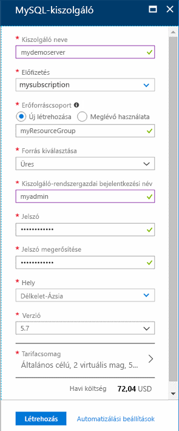
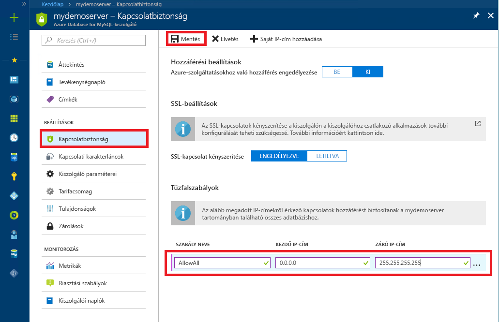

# <a name="tutorial-design-an-azure-database-for-mysql-database-using-the-azure-portal"></a>Oktatóanyag: Azure Database for MySQL-adatbázis tervezése az Azure Portal használatával

A MySQL-hez készült Azure Database egy felügyelt szolgáltatás, amely lehetővé teszi a magas rendelkezésre állású MySQL-adatbázisok futtatását, kezelését és skálázását a felhőben. Az Azure Portallal könnyedén kezelheti a kiszolgálót és tervezhet adatbázist.

Ebből az oktatóanyagból az Azure Portal használatával megtanulhatja a következőket:

> [!div class="checklist"]
> * Azure Database for MySQL létrehozása
> * A kiszolgáló tűzfalának konfigurálása
> * Adatbázis létrehozása a mysql parancssori eszközzel
> * Mintaadatok betöltése
> * Adatok lekérdezése
> * Adatok frissítése
> * Adatok visszaállítása

Ha nem rendelkezik Azure-előfizetéssel, mindössze néhány perc alatt létrehozhat egy [ingyenes Azure-fiókot](https://azure.microsoft.com/free/) a virtuális gép létrehozásának megkezdése előtt.

## <a name="sign-in-to-the-azure-portal"></a>Jelentkezzen be az Azure Portalra

Nyissa meg a kedvenc webböngészőjét, és keresse fel a [Microsoft Azure Portalt](https://portal.azure.com/). Adja meg a hitelesítő adatait a Portalra való bejelentkezéshez. Az alapértelmezett nézet a szolgáltatási irányítópult.

## <a name="create-an-azure-database-for-mysql-server"></a>Azure-adatbázis létrehozása MySQL-kiszolgálóhoz

A MySQL-kiszolgálóhoz készült Azure-adatbázis [számítási és tárolási erőforrások](./concepts-compute-unit-and-storage.md) egy meghatározott készletével együtt jön létre. A kiszolgáló egy [Azure-erőforráscsoporton](https://docs.microsoft.com/azure/azure-resource-manager/resource-group-overview) belül jön létre.

1. A portál bal felső sarkában válassza az **Erőforrás létrehozása** (+) gombot.

2. Válassza az **adatbázisok**  >  **Azure Database for MySQL**elemet. Ha nem találja a MySQL-kiszolgálót az **adatbázisok** kategóriában, kattintson az **összes megtekintése** lehetőségre az összes elérhető adatbázis-szolgáltatás megjelenítéséhez. A keresőmezőbe be is írhatja az **Azure Database for MySQL** szöveget, hogy gyorsan megtalálja a szolgáltatást.
   
   

3. Kattintson **Azure Database for MySQL** csempére. Töltse ki az Azure Database for MySQL-űrlapot.
   
   

    **Beállítás** | **Ajánlott érték** | **Mező leírása**
    ---|---|---
    Kiszolgálónév | Egyedi kiszolgálónév | Válasszon egy egyedi nevet, amely azonosítja a MySQL-kiszolgálóhoz készült Azure-adatbázist. Például mydemoserver. A rendszer hozzáfűzi a *.mysql.database.azure.com* tartománynevet a megadott kiszolgálónévhez. A kiszolgálónév csak kisbetűket, számokat és a kötőjel (-) karaktert tartalmazhatja. 3–63 karakter hosszúságú lehet.
    Előfizetés | Az Ön előfizetése | Válassza ki a kiszolgálóhoz használni kívánt Azure-előfizetést. Ha több előfizetéssel rendelkezik, válassza ki azt az előfizetést, amely részeként fizet az erőforrásért.
    Erőforráscsoport | *myResourceGroup* | Adjon meg egy új vagy egy létező erőforráscsoportnevet.
    Forrás kiválasztása | *Üres* | Válassza az *Üres* lehetőséget egy teljesen új kiszolgáló létrehozásához. (Ha egy meglévő Azure Database for MySQL-kiszolgáló georedundáns biztonsági mentéséből hoz létre kiszolgálót, válassza a *Biztonsági mentés* lehetőséget).
    Kiszolgáló-rendszergazdai bejelentkezés | myadmin | A kiszolgálóhoz való csatlakozáshoz használni kívánt bejelentkezési fiók. A rendszergazdai bejelentkezési név nem lehet **azure_superuser**, **admin**, **administrator**, **root**, **guest** vagy **public**.
    Jelszó | *Az Ön választása* | Adjon meg új jelszót a kiszolgálói rendszergazdai fiók számára. 8–128 karakter hosszúságú lehet. A jelszónak tartalmaznia kell karaktereket a következő kategóriák közül legalább háromból: angol nagybetűs karakterek, angol kisbetűs karakterek, számjegyek (0–9) és nem alfanumerikus karakterek (!, $, #, % stb.).
    Jelszó megerősítése | *Az Ön választása*| Erősítse meg a rendszergazdafiók jelszavát.
    Hely | *A felhasználókhoz legközelebb eső régió*| Válassza ki a felhasználókhoz vagy a többi Azure-alkalmazásához legközelebb eső helyet.
    Verzió | *A legújabb verzió*| A legújabb verzió (ha nincsenek más verzió használatát megkövetelő egyedi igényei).
    Tarifacsomag | **Általános célú**, **5. generációs**, **2 virtuális mag**, **5 GB**, **7 nap**, **Georedundáns** | Az új kiszolgáló számítási, tárolási és biztonsági mentési konfigurációi. Válassza ki az **árképzési szintet**. Ezután válassza a **általános célú** fület. a *Gen 5*, *2 virtuális mag*, *5 GB*és *7 nap* a **számítási generáció**, a **virtuális mag**, a **tárolás**és a **biztonsági másolatok megőrzési időszakának**alapértelmezett értékei. A csúszkákat nem szükséges módosítania. Ha engedélyezni szeretné a kiszolgáló biztonsági mentését a földrajzilag redundáns tárolóban, válassza a **földrajzilag redundáns** **lehetőséget a biztonsági mentési redundancia lehetőségei**közül. A tarifacsomag beállításának mentéséhez válassza az **OK** gombot. A következő képernyőkép ezeket a beállításokat tartalmazza.

   

   > [!TIP]
   > Az **automatikus növekedés** lehetővé teszi, hogy a kiszolgáló növelje a tárterületet, ha közeledik a lefoglalt korláthoz, anélkül, hogy ez befolyásolná a munkaterhelést.

4. Kattintson a **Felülvizsgálat + létrehozás** elemre. Az eszköztár **értesítések** gombjára kattintva figyelheti a telepítési folyamatot. Az üzembe helyezés akár 20 percet is igénybe vehet.

## <a name="configure-firewall"></a>Tűzfal konfigurálása

Az Azure Database for MySQL-adatbázisokat tűzfal védi. A rendszer alapértelmezés szerint elutasítja a kiszolgálóra és a kiszolgálón lévő adatbázisokra irányuló összes kapcsolatot. Mielőtt először csatlakozna az Azure Database for MySQL-hez, konfigurálja a tűzfalat, és adja hozzá az ügyfél gépének nyilvános hálózati IP-címét (vagy IP-címtartományát).

1. Kattintson az újonnan létrehozott kiszolgálóra, majd a **Kapcsolatbiztonság** elemre.

   
2. Itt **hozzáadhat saját IP-címet**, vagy tűzfalszabályokat konfigurálhat. Ne felejtsen a **Mentés** gombra kattintani, miután létrehozta a szabályokat.
Most a mysql parancssori eszközzel vagy a MySQL Workbench GUI eszközzel csatlakozhat a kiszolgálóhoz.

> [!TIP]
> Az Azure Database for MySQL-kiszolgáló a 3306-os porton keresztül kommunikál. Ha vállalati hálózaton belülről próbál csatlakozni, elképzelhető, hogy a hálózati tűzfal nem engedélyezi a kimenő forgalmat a 3306-os porton keresztül. Ebben az esetben csak akkor tud csatlakozni az Azure MySQL kiszolgálóhoz, ha az informatikai részleg megnyitja a 3306-as portot.

## <a name="get-connection-information"></a>Kapcsolatadatok lekérése

Kérje le az Azure Database for MySQL-kiszolgáló teljes **kiszolgálónevét** és **kiszolgáló-rendszergazdai bejelentkezési nevét** az Azure Portalon. A teljes kiszolgálónévvel csatlakozhat a kiszolgálóhoz a mysql parancssori eszköz használatával.

1. Az [Azure Portalon](https://portal.azure.com/) kattintson a **Minden erőforrás** elemre a bal oldali menüben, és keresse meg az Azure Database for MySQL-kiszolgálót. Válassza ki a kiszolgáló nevét a részletek megtekintéséhez.

2. Az **Áttekintés** oldalon jegyezze fel a **Kiszolgálónév** és a **Kiszolgálói rendszergazda bejelentkezési neve** értékét. A mezők melletti másolás gombra kattintva a vágólapra másolhatja az értékeket.
   

Ebben a példában a kiszolgáló neve *mydemoserver.mysql.database.Azure.com*, és a kiszolgáló-rendszergazdai bejelentkezés *myadmin \@ mydemoserver*.

## <a name="connect-to-the-server-using-mysql"></a>Csatlakozás a kiszolgálóhoz a mysql használatával

A MySQL-hez készült Azure Database-kiszolgálóhoz a [mysql parancssori eszköz](https://dev.mysql.com/doc/refman/5.7/en/mysql.html) használatával kapcsolódhat. A mysql parancssori eszköz a böngészőben az Azure Cloud Shell használatával, a saját számítógépen pedig a helyileg telepített mysql eszközök használatával futtatható. Az Azure Cloud Shell indításához kattintson a `Try It` gombra ennek a cikknek valamelyik kódblokkjában, vagy kattintson az Azure Portal jobb felső eszköztárának `>_` ikonjára.

Gépelje be a parancsot a csatlakozáshoz:

```azurecli-interactive
mysql -h mydemoserver.mysql.database.azure.com -u myadmin@mydemoserver -p
```

## <a name="create-a-blank-database"></a>Hozzon létre egy üres adatbázist

Ha csatlakozott a kiszolgálóhoz, hozzon létre egy üres adatbázist a következővel való együttműködéshez.

```sql
CREATE DATABASE mysampledb;
```

Futtassa a parancssorban a következő parancsot a kapcsolat az újonnan létrehozott adatbázisra történő átállítására:

```sql
USE mysampledb;
```

## <a name="create-tables-in-the-database"></a>Táblák létrehozása az adatbázisban

Most, hogy tudja, hogyan csatlakozhat az Azure Database for MySQL-adatbázishoz, elvégezhet néhány alapvető feladatot:

Először hozzunk létre egy táblát, és töltsük fel adatokkal. Hozzunk létre egy táblát leltáradatok tárolásához.

```sql
CREATE TABLE inventory (
    id serial PRIMARY KEY, 
    name VARCHAR(50), 
    quantity INTEGER
);
```

## <a name="load-data-into-the-tables"></a>Adatok betöltése a táblákba

Most, hogy már rendelkezünk egy táblával, szúrjunk be néhány adatot. A megnyitott parancssori ablakban futtassa a következő lekérdezést néhány adatsor beszúrásához.

```sql
INSERT INTO inventory (id, name, quantity) VALUES (1, 'banana', 150);
INSERT INTO inventory (id, name, quantity) VALUES (2, 'orange', 154);
```

Most két mintaadatsorral rendelkezünk a korábban létrehozott táblában.

## <a name="query-and-update-the-data-in-the-tables"></a>A táblákban lévő adatok lekérdezése és frissítése

Hajtsa végre a következő lekérdezést az adatbázistáblában lévő információk lekéréséhez.

```sql
SELECT * FROM inventory;
```

A táblákban lévő adatokat frissítheti is.

```sql
UPDATE inventory SET quantity = 200 WHERE name = 'banana';
```

A sor az adatok lekérésekor megfelelően frissül.

```sql
SELECT * FROM inventory;
```

## <a name="restore-a-database-to-a-previous-point-in-time"></a>Adatbázis visszaállítása egy korábbi időpontra

Tegyük fel, hogy véletlenül törölt egy fontos adatbázistáblát, és nem tudja könnyen helyreállítani az adatokat. Az Azure Database for MySQL lehetővé teszi a kiszolgáló visszaállítását egy időpontra, és egy új kiszolgálón létrehozza az adatbázisok másolatát. Az új kiszolgáló segítségével helyreállíthatja a törölt adatokat. Az alábbi lépések a mintakiszolgálót a tábla hozzáadása előtti időpontra állítják vissza.

1. Az Azure Portalon keresse meg az Azure Database for MySQL-adatbázist. Az **Áttekintés** oldalon kattintson az eszköztár **Visszaállítás** gombjára. Megnyílik a Visszaállítás oldal.

   

2. Töltse ki a **visszaállítási** űrlapot a szükséges információkkal.

   

   - **Visszaállítási pont**: A listában szereplő időkereten belül válasszon ki egy időpontot, amelyre vissza kívánja állítani az adatbázist. Ne felejtse el UTC időre átalakítani a helyi időzóna szerinti időt.
   - **Visszaállítás új kiszolgálóra**: Adja meg egy új kiszolgáló nevét, amelyre vissza kívánja állítani az adatbázist.
   - **Hely**: A régió megegyezik a forráskiszolgálóéval, és nem módosítható.
   - **Tarifacsomag**: A tarifacsomag megegyezik a forráskiszolgálóéval, és nem módosítható.
   
3. Kattintson **az OK** gombra, ha vissza szeretné állítani a kiszolgálót a tábla törlése előtti [időpontra](./howto-restore-server-portal.md) . A kiszolgáló visszaállítása létrehoz egy új másolatot a kiszolgálóról a megadott időpontban aktuális állapotában.

## <a name="next-steps"></a>Következő lépések

Ebben az oktatóanyagban a következők elvégzését sajátította el az Azure Portallal:

> [!div class="checklist"]
> * Azure Database for MySQL létrehozása
> * A kiszolgáló tűzfalának konfigurálása
> * Adatbázis létrehozása a mysql parancssori eszközzel
> * Mintaadatok betöltése
> * Adatok lekérdezése
> * Adatok frissítése
> * Adatok visszaállítása

> [!div class="nextstepaction"]
> [Alkalmazások csatlakoztatása az Azure Database for MySQL-adatbázishoz](./howto-connection-string.md)
