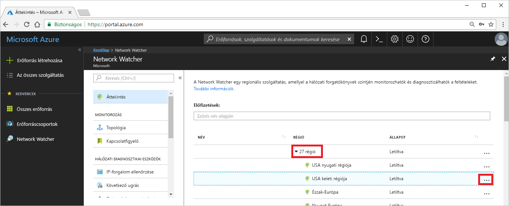
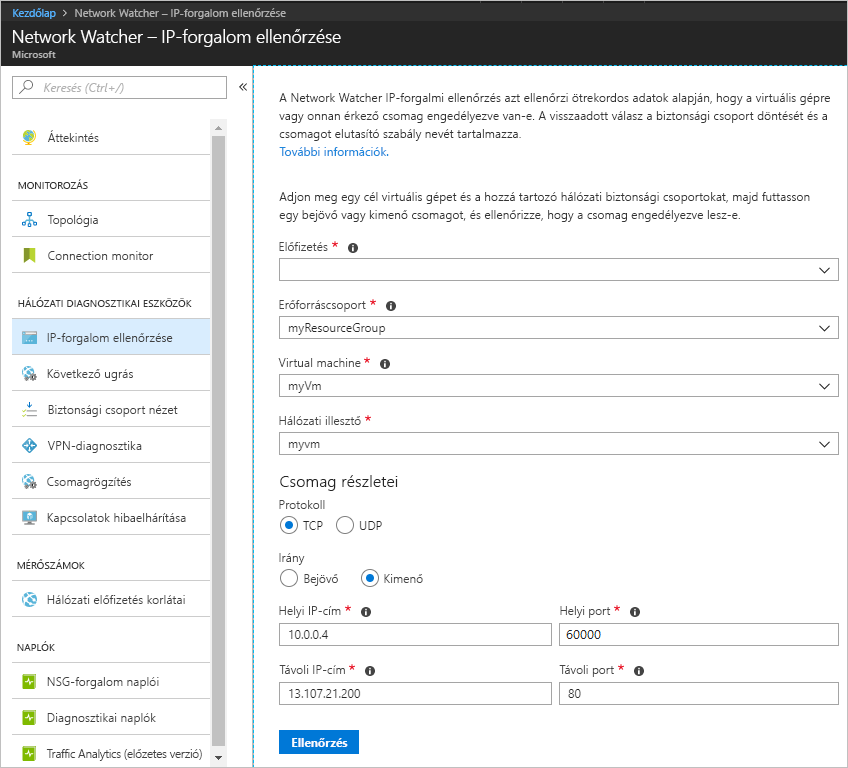
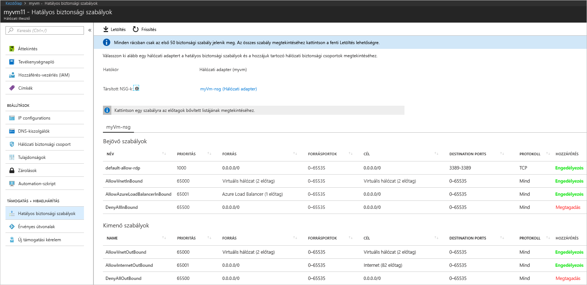
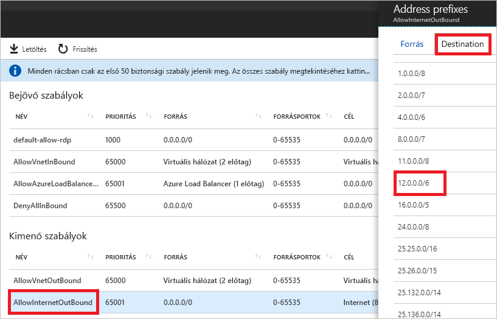

# Rövid útmutató: Virtuális gép hálózati forgalmi szűrőhibájának diagnosztizálása az Azure Portal használatával

Ennek a rövid útmutatónak a követésével egy virtuális gépet fog üzembe helyezni, majd ellenőriz egy IP-címre és URL-címre irányuló és egy IP-címről érkező kommunikációt. Meghatározza a kommunikációs hiba okát és feloldásának módját.

Ha nem rendelkezik Azure-előfizetéssel, mindössze néhány perc alatt létrehozhat egy [ingyenes fiókot](https://azure.microsoft.com/free/?WT.mc_id=A261C142F) a virtuális gép létrehozásának megkezdése előtt.

## Jelentkezzen be az Azure-ba

Jelentkezzen be az Azure Portalra a https://portal.azure.com címen.

## Virtuális gép létrehozása

1. Az Azure Portal bal felső sarkában kattintson az **+ Erőforrás létrehozása** gombra.
2. Válassza a **Számítás**, majd a **Windows Server 2016 Datacenter** vagy az **Ubuntu Server 17.10-es virtuális gép** lehetőséget.
3. Adja meg vagy válassza ki az alábbi adatokat, a többi beállítás esetében fogadja el az alapértelmezett értéket, majd válassza az **OK** elemet:

    |Beállítás|Érték|
    |---|---|
    |Name (Név)|myVm|
    |Felhasználónév| Adjon meg egy tetszőleges felhasználónevet.|
    |Jelszó| Adjon meg egy tetszőleges jelszót. A jelszónak legalább 12 karakter hosszúságúnak kell lennie, [az összetettségre vonatkozó követelmények teljesülése mellett](../virtual-machines/windows/faq.md?toc=%2fazure%2fnetwork-watcher%2ftoc.json#what-are-the-password-requirements-when-creating-a-vm).|
    |Előfizetés| Válassza ki előfizetését.|
    |Erőforráscsoport| Válassza az **Új létrehozása** elemet, és adja meg a **myResourceGroup** nevet.|
    |Hely| Válassza az **USA keleti régiója** lehetőséget.|

4. Válassza ki a virtuális gép méretét, majd kattintson a **Kiválasztás** gombra.
5. A **Beállítások** területen fogadja el az összes alapértelmezett beállítást, majd kattintson az **OK** gombra.
6. Az **Összegzés** lap **Létrehozás** területén kattintson a **Létrehozás** elemre a virtuális gép üzembe helyezésének megkezdéséhez. A virtuális gép üzembe helyezése néhány percet vesz igénybe. Várjon, amíg befejeződik a virtuális gép üzembe helyezése, mielőtt tovább folytatná a fennmaradó lépések követését.

## Hálózati kommunikáció tesztelése

A hálózati kommunikáció Network Watcherrel való teszteléséhez először engedélyeznie kell azt legalább egy Azure-régióban, majd használja a Network Watcher IP-folyamat ellenőrzése funkcióját.

### A Network Watcher engedélyezése

Ha már van hálózati figyelő engedélyezve legalább egy régióban, akkor folytassa az [IP-folyamat ellenőrzésének használata](#use-ip-flow-verify) lépéssel.

1. Válassza a portálon a **Minden szolgáltatás** lehetőséget. A **Szűrőmezőben** adja meg a *Network Watcher* kifejezést. Ha megjelenik a **Network Watcher** az eredmények között, jelölje ki.
2. Engedélyezze a hálózati figyelőt az USA keleti régiójában, mert az előző lépésben ebben a régióban helyezte üzembe a virtuális gépet. Válassza a **Régiók** lehetőséget a kibontáshoz, majd válassza a **...** jelet az **USA keleti régiója** melletti jobb oldalon, az alábbi ábrán látható módon:

    

3. Válassza a **Network Watcher engedélyezése** lehetőséget.

### IP-folyamat ellenőrzésének használata

Amikor létrehoz egy virtuális gépet, az Azure az alapértelmezésnek megfelelően engedélyezi és tiltja le a virtuális gépre irányuló és onnan érkező forgalmat. Később felülbírálhatja az Azure alapértelmezett beállításait, és további forgalomtípusokat engedélyezhet vagy tilthat le.

1. Válassza a portálon a **Minden szolgáltatás** lehetőséget. A **Minden szolgáltatás** *Szűrő* mezőbe írja be a *Network Watcher* kifejezést. Ha megjelenik a **Network Watcher** az eredmények között, jelölje ki.
2. A **HÁLÓZATI DIAGNOSZTIKAI ESZKÖZÖK** területen válassza az **IP-folyamat ellenőrzése** lehetőséget.
3. Jelölje ki az előfizetését, adja meg vagy válassza ki a következő értékeket, és válassza az **Ellenőrzés** lehetőséget, az alábbi képen látható módon:

    |Beállítás            |Érték                                                                                              |
    |---------          |---------                                                                                          |
    | Erőforráscsoport    | Válassza a myResourceGroup lehetőséget                                                                            |
    | Virtuális gép   | Válassza a myVm lehetőséget                                                                                       |
    | Hálózati illesztő | myvm – A portál által a virtuális gép létrehozásakor létrehozott hálózati adapter neve ettől eltérő. |
    | Protokoll          | TCP                                                                                               |
    | Irány         | Kimenő                                                                                          |
    | Helyi IP-cím  | 10.0.0.4                                                                                          |
    | Helyi port      | 60000                                                                                                |
    | Távoli IP-cím | 13.107.21.200 – A www.bing.com címeinek egyike.                                             |
    | Távoli port       | 80                                                                                                |

    

    Néhány másodperc múlva a visszaadott eredmény tájékoztatja, hogy a hozzáférést egy **AllowInternetOutbound** nevű biztonsági szabály engedélyezte. Az ellenőrzés futtatásakor a Network Watcher automatikusan létrehoz egy hálózati figyelőt az USA keleti régiójában, ha az ellenőrzés futtatása előtt az USA keleti régiójától eltérő régióban rendelkezett hálózati figyelővel.
4. Végezze el újra a 3. lépést, de módosítsa a **Távoli IP-cím** beállítását a **172.31.0.100** értékre. A visszaadott eredmény tájékoztatja, hogy a hozzáférés egy **DefaultOutboundDenyAll** nevű biztonsági szabály miatt meg lett tagadva.
5. Végezze el újra a 3. lépést, de módosítsa az **Irány** értékét a **Bejövő**, a **Helyi port** értékét a **80**, a **Távoli port** értékét pedig a **60000** megadásával. A visszaadott eredmény tájékoztatja, hogy a hozzáférés egy **DefaultInboundDenyAll** nevű biztonsági szabály miatt meg lett tagadva.

Most, hogy tudja, hogy mely biztonsági szabályok engedélyezik vagy tagadják meg a virtuális gépre érkező vagy onnan induló forgalmat, meghatározhatja a problémák megoldásának módját.

## Biztonsági szabály részleteinek megtekintése

1. Annak meghatározásához, hogy az [IP-folyamat ellenőrzésének használata](#use-ip-flow-verify) 3–5. lépésében ismertetett szabályok miért engedélyezik vagy tiltják le a kommunikációt, tekintse át a virtuális gép hálózati adapterének hatályos biztonsági szabályait. A portál tetején a keresési mezőbe írja be a *myvm* kifejezést. Ha a **myvm** (vagy bármi is a neve a hálózati adapternek) hálózati adapter megjelenik a keresési eredmények között, válassza ki.
2. A **TÁMOGATÁS + HIBAELHÁRÍTÁS** területen válassza ki az **Érvényes biztonsági szabályok** lehetőséget az alábbi ábrán látható módon:

    

    Az [IP-folyamat ellenőrzésének használata](#use-ip-flow-verify) 3. lépésében megtudta, hogy a kommunikáció engedélyezésének oka az **AllowInternetOutbound** szabály. Megtekintheti az előző képen, hogy a szabály **CÉL** értékeként az **Internet** van megadva. Nem egyértelmű azonban, hogy az [IP-folyamat ellenőrzésének használata](#use-ip-flow-verify) 3. lépésében tesztelt 13.107.21.200 cím hogyan viszonyul az **Internet** eredményhez.
3. Válassza ki az **AllowInternetOutBound** szabályt, majd a **Cél** értékét, az alábbi ábrán látható módon:

    

    A listában lévő előtagok egyike a **12.0.0.0/6**, amely magában foglalja a 12.0.0.1–15.255.255.254 tartományba tartozó IP-címeket. Mivel a 13.107.21.200 ebbe a címtartományba esik, az **AllowInternetOutBound** szabály engedélyezi a kimenő forgalmat. Emellett nincsenek magasabb prioritású (alacsonyabb számú) szabályok megjelenítve a 2. lépésben szereplő ábrán, amelyek felülbírálnák ezt a szabályt. Zárja be a **Címelőtagok** mezőt. Ha szeretné letiltani a 13.107.21.200 címre kimenő kommunikációt, akkor felvehet egy magasabb prioritású biztonsági szabályt, amely letiltja az IP-címre kimenő forgalmat a 80-as porton.
4. Amikor az [IP-folyamat ellenőrzésének használata](#use-ip-flow-verify) 4. lépésében futtatta a 172.131.0.100 címre kimenő forgalom ellenőrzését, megtudta, hogy a **DefaultOutboundDenyAll** szabály letiltotta a kommunikációt. Ez a szabály egyenértékű a 2. lépésben megjelenített ábrán látható **DenyAllOutBound** szabállyal, amely a **0.0.0.0/0** értéket határozza meg a **CÉL** értékeként. A szabály megtagadja a 172.131.0.100 címre kimenő kommunikációt, mert a cím nincs semmilyen más, az ábrán látható **Kimeneti szabály** **CÉL** értékén belül. Ha szeretné engedélyezni a kimenő kommunikációt, akkor felvehet egy magasabb prioritású biztonsági szabályt, amely engedélyezi az 172.131.0.100 IP-címre kimenő forgalmat a 80-as porton.
5. Amikor az [IP-folyamat ellenőrzésének használata](#use-ip-flow-verify) 5. lépésében futtatta a 172.131.0.100 címről bejövő forgalom ellenőrzését, megtudta, hogy a **DefaultInboundDenyAll** szabály letiltotta a kommunikációt. Ez a szabály megfelel a 2. lépésben az ábrán látható **DenyAllInBound** szabálynak. A **DenyAllInBound** szabály érvényesül, mert nincs magasabb prioritású szabály, amely lehetővé tenné a 172.31.0.100 címről a 80-as porton a virtuális gépre érkező bejövő forgalmat. Ha szeretné engedélyezni a bejövő kommunikációt, akkor felvehet egy magasabb prioritású biztonsági szabályt, amely engedélyezi a 172.31.0.100 címről bejövő forgalmat a 80-as porton.

Az ebben a rövid útmutatóban található ellenőrzések az Azure-konfigurációt tesztelték. Ha az ellenőrzések a várt eredményt adták vissza, és továbbra is hálózati problémákat tapasztal, ellenőrizze, hogy nincs-e tűzfal a virtuális gép és a között a végpont között, amelyikkel kommunikál, és hogy a virtuális gép operációs rendszerének tűzfala nem engedélyezi-e vagy tagadja meg a kommunikációt.

## Az erőforrások eltávolítása

Ha már nincs rá szükség, törölje az erőforráscsoportot és a benne lévő összes erőforrást:

1. Írja be a *myResourceGroup* nevet a portál tetején lévő **keresőmezőbe**. Amikor a **myResourceGroup** megjelenik a keresési eredmények között, válassza ki.
2. Válassza az **Erőforráscsoport törlése** elemet.
3. Írja be a *myResourceGroup* nevet az **ÍRJA BE AZ ERŐFORRÁSCSOPORT NEVÉT:** mezőbe, majd válassza a **Törlés** lehetőséget.

## További lépések

Ebben a rövid útmutatóban létrehozott egy virtuális gépet, és diagnosztizálta a bejövő és kimenő hálózati forgalom szűrőit. Megtudta, hogy hálózati biztonsági csoportszabályok engedélyezik vagy tiltják le a virtuális gépekről érkező vagy oda irányuló adatforgalmat. További információ a [biztonsági szabályokról](../virtual-network/security-overview.md?toc=%2fazure%2fnetwork-watcher%2ftoc.json) és a [biztonsági szabályok létrehozásának](../virtual-network/manage-network-security-group.md?toc=%2fazure%2fnetwork-watcher%2ftoc.json#create-a-security-rule) módjáról.

Még ha megfelelő hálózati adatforgalmi szűrők vannak is a helyükön, a virtuális géppel folytatott kommunikáció meghiúsulhat az útválasztás konfigurációja miatt. Ha szeretné elsajátítani a virtuális gépek hálózati útválasztási problémáinak diagnosztizálási módját, olvassa el [A virtuális gép útválasztási problémáinak diagnosztizálása](diagnose-vm-network-routing-problem.md) fejezetet, vagy ha a kimenő útválasztási, késési és forgalomszűrés problémák diagnosztizálását egyetlen eszközzel szeretné elvégezni, olvassa el a [Kapcsolatok hibaelhárítása](network-watcher-connectivity-portal.md) fejezetet.