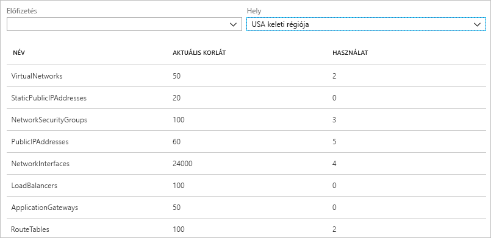
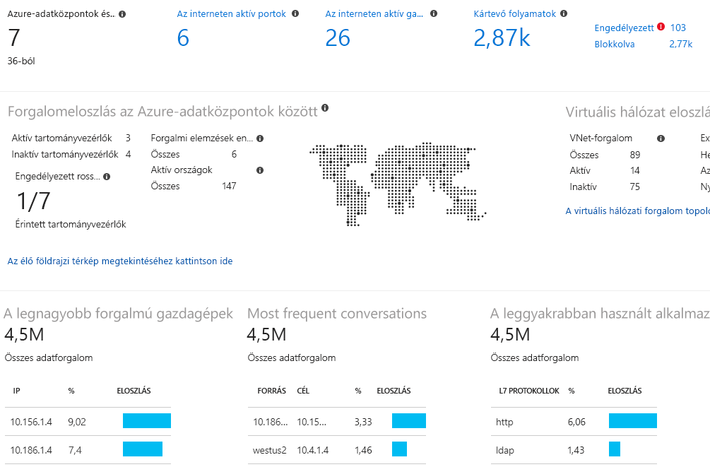

# Mi az az Azure Network Watcher?

Az Azure Network Watcher eszközeivel monitorozhatja és diagnosztizálhatja az erőforrásokat egy Azure virtuális hálózaton belül, illetve megtekintheti azok metrikáit, és engedélyezheti vagy letiltja azok naplóit.

## Figyelés

### Virtuális gépek és végpontok közötti kommunikáció monitorozása

A végpontok lehetnek másik virtuális gépek (VM), teljes tartománynevek (FQDN), URI-k vagy IPv4-címek. A *kapcsolatmonitor* funkció rendszeres időközönként monitorozza a kommunikációt, és értesíti Önt az elérhetőségről, a késésről, valamint a virtuális gép és a végpont közötti hálózati topológiai változásokról. Rendelkezhet például olyan webkiszolgáló virtuális géppel, amely egy adatbázis-kiszolgáló virtuális géppel kommunikál. Valaki a cégén belül az Ön tudta nélkül alkalmazhat egy egyéni útvonalat vagy hálózati biztonsági szabályt a webkiszolgáló vagy adatbázis-kiszolgáló virtuális gépre vagy alhálózatra.

Ha egy végpont elérhetetlenné válik, a kapcsolat-hibaelhárítási funkció értesíti Önt ennek okáról. Ennek lehetséges okai többek között: DNS-névfeloldási probléma, a virtuális gép processzora, memóriája vagy az operációs rendszeren belüli tűzfal, egy egyéni útvonal ugrástípusa, a virtuális gép vagy a kimenő kapcsolat alhálózatának biztonsági szabálya. További információ az Azure [biztonsági szabályaival](../virtual-network/security-overview.md?toc=%2fazure%2fnetwork-watcher%2ftoc.json#security-rules) és [útvonalugrási típusaival](../virtual-network/virtual-networks-udr-overview.md?toc=%2fazure%2fnetwork-watcher%2ftoc.json) kapcsolatban.

A kapcsolatmonitor továbbá az adott idő alatt megfigyelt minimális, átlag- és maximális késést is megmutatja. Egy kapcsolat késésének ismeretében előfordulhat, hogy csökkentheti a késést, ha az Azure-erőforrásokat más Azure-régiókba helyezi át. További információ az [Azure-régiók és az internetszolgáltatók közötti relatív késés](#determine-relative-latencies-between-azure-regions-and-internet-service-providers) meghatározásával, illetve azzal kapcsolatban, hogyan monitorozható a virtuális gépek és végpontok közötti kommunikáció a [kapcsolatmonitor](connection-monitor.md) használatával. Ha a kapcsolat adott időn keresztül történő monitorozása helyett (ahogyan ezt a kapcsolatmonitorral tenné), inkább egy adott időpontban szeretné tesztelni a kapcsolatot, használja a [kapcsolat-hibaelhárítási](#connection-troubleshoot) funkciót.

A hálózati teljesítményfigyelő egy felhőalapú, hibrid hálózatmonitorozási megoldás, amelynek segítségével a hálózati teljesítményt monitorozhatja a hálózati infrastruktúra különböző pontjai között. Emellett monitorozhatja a hálózat szolgáltatással és az alkalmazás végpontjaival való kapcsolatát is, illetve az Azure ExpressRoute teljesítményét is figyelheti. A hálózati teljesítményfigyelő észleli a hálózat olyan hibáit, mint a forgalmi fekete lyukak, az útválasztási hibák és más olyan problémák, amelyeket a szokványos hálózatmonitorozási módszerek nem képesek észlelni. A megoldás riasztásokat készít, és értesíti, amikor egy hálózati kapcsolat meghaladja a küszöbértéket. Emellett biztosítja a hálózat teljesítményével kapcsolatos problémák időbeni észlelését és leszűkíti a hiba forrásának helyszínét egy hálózati szegmensre vagy eszközre. Tudjon meg többet a [hálózati teljesítményfigyelőről](../azure-monitor/insights/network-performance-monitor.md?toc=%2fazure%2fnetwork-watcher%2ftoc.json).

### Egy virtuális hálózaton belüli erőforrások és azok kapcsolatainak megtekintése

Ahogy erőforrásokat ad hozzá egy virtuális hálózathoz, egyre nehezebb lehet átlátni, milyen erőforrások vannak egy virtuális hálózatban, és hogy ezek hogyan kapcsolódnak egymáshoz. A *topológia* funkció lehetővé teszi egy vizuális diagram létrehozását az egy virtuális hálózatba tartozó erőforrásokról, illetve az ezek közötti kapcsolatokról. Az alábbi ábrán egy példa topológiai diagram látható egy olyan virtuális hálózatról, amely három alhálózattal, két virtuális géppel, hálózati adapterrel, nyilvános IP-címmel, hálózati biztonsági csoporttal és útválasztási táblázattal rendelkezik, illetve az erőforrások közötti kapcsolatok is jól láthatók:

A kép szerkeszthető változata letölthető svg formátumban. További információ a [topológiai nézetről](view-network-topology.md).

## Diagnosztika

### Virtuális gépek be- és kimenő hálózatiforgalom-szűrési problémáinak diagnosztizálása

Egy virtuális gép üzembe helyezésekor az Azure számos alapértelmezett biztonsági szabályt alkalmaz a virtuális gépen, amelyek engedélyezik vagy letiltják a virtuális gép be- és kimenő forgalmát. Lehetősége van az Azure alapértelmezett szabályainak felülírására, vagy további szabályok létrehozására. Előfordulhat, hogy egy virtuális gép egy biztonsági szabály miatt képtelenné válik a más erőforrásokkal való kommunikációra. Az *IP-forgalom ellenőrzése* funkció lehetővé teszi egy forrás és cél IPv4-cím, port, protokoll (TCP vagy UDP), illetve a forgalom irányának (bejövő vagy kimenő) megadását. Az IP-forgalom ellenőrzése funkció ezután teszteli a kommunikációt, és értesíti Önt, hogy a kapcsolat sikeres vagy sikertelen volt-e. Ha a kapcsolat sikertelen, a probléma megoldásának elősegítése érdekében az IP-forgalom ellenőrzése funkció megmutatja, melyik biztonsági szabály engedélyezte vagy tiltotta le a kommunikációt. Az IP-forgalom ellenőrzésével kapcsolatos további információkért végezze el a [virtuális gépek hálózatiforgalom-szűrési problémájának diagnosztizálását](diagnose-vm-network-traffic-filtering-problem.md) ismertető oktatóanyagot.

### Hálózati útválasztási problémák diagnosztizálása egy virtuális gépről

Virtuális hálózat létrehozása esetén az Azure számos alapértelmezett kimenő útvonalat hoz létre a hálózati forgalom számára. Az összes erőforrásból (pl. a virtuális hálózatokon üzembe helyezett virtuális gépekről) származó kimenő forgalom átirányítása az Azure alapértelmezett útvonalai alapján történik. Lehetősége van az Azure alapértelmezett útvonalainak felülírására, vagy további útvonalak létrehozására. Előfordulhat, hogy egy bizonyos útvonal miatt egy virtuális gép képtelenné válik a más erőforrásokkal való kommunikációra. A *következő ugrás* funkció lehetővé teszi egy forrás és cél IPv4-cím megadását. A következő ugrás funkció ezután teszteli a kommunikációt, és értesíti Önt, hogy milyen típusú következő ugrást használt a rendszer a forgalom átirányításához. Ezt követően Ön megoldhatja az útválasztási problémát egy útvonal eltávolításával, módosításával vagy hozzáadásával. További információ a [következő ugrás](diagnose-vm-network-routing-problem.md) funkcióról.

### Virtuális gépekről származó kimenő kapcsolati problémák diagnosztizálása

A *kapcsolat-hibaelhárítási* funkció lehetővé teszi egy virtuális gép és egy másik virtuális gép, egy teljes tartománynév, egy URI vagy egy IPv4-cím közötti kapcsolat tesztelését. A teszt a [kapcsolatmonitor](#connection-monitor) funkcióhoz hasonló információt ad vissza, de egy adott időpontban teszteli a kapcsolatot, és nem adott időszakon keresztül monitorozza azt, ahogy azt a kapcsolatmonitor teszi. További információ a kapcsolatok hibaelhárításáról a [kapcsolat-hibaelhárítási](network-watcher-connectivity-overview.md) funkció használatával.

### Virtuális gépek felé és azok felől érkező csomagok rögzítése

A fejlett szűrési lehetőségek és finomhangolt vezérlők, mint például az idő- és méretkorlátok megadásának képessége, sokoldalúságot biztosít. A rögzítés tárolható Azure Storage-tárterületen, a virtuális gép lemezén vagy akár mindkettőn. Ezután számos standard hálózatirögzítés-elemző eszközzel elemezheti a rögzítésfájlt. További információ a [csomagok rögzítésével](network-watcher-packet-capture-overview.md) kapcsolatban.

### Az Azure virtuális hálózati átjárók és a kapcsolatok problémáinak diagnosztizálása

A virtuális hálózati átjárók biztosítják a helyszíni erőforrások és az Azure virtuális hálózatok közötti kapcsolatot. Az átjárók és azok kapcsolatainak monitorozása kritikus fontosságú a kommunikáció megfelelő működésének biztosításában. A *VPN-diagnosztika* funkció segítségével diagnosztizálhatja az átjárókat és a kapcsolatokat. A VPN-diagnosztika diagnosztizálja az átjáró vagy az átjárókapcsolat állapotát, és értesíti Önt, hogy az átjáró vagy az átjárókapcsolat elérhető-e. Ha az átjáró vagy a kapcsolat nem érhető el, a VPN-diagnosztika megmutatja, miért, így Ön megoldhatja a problémát. A VPN-diagnosztikával kapcsolatos további információkért végezze el a [hálózatok közötti kommunikációs probléma diagnosztizálását](diagnose-communication-problem-between-networks.md) ismertető oktatóanyagot.

### Az Azure-régiók és az internetszolgáltatók közötti relatív késés meghatározása

A Network Watcher szolgáltatásból lekérheti az Azure-régiók közötti és az internetszolgáltatóknál tapasztalt késéssel kapcsolatos információkat. Az Azure-régiók közötti és az internetszolgáltatóknál tapasztalt késések ismeretében a hálózati válaszidő optimalizálására alkalmas módon helyezhet üzembe Azure-erőforrásokat. További információ a [relatív késéssel](view-relative-latencies.md) kapcsolatban.

### Egy hálózati adapter biztonsági szabályainak megtekintése

Egy hálózati adapter érvényben lévő biztonsági szabályai a hálózati adapteren, valamint az azon az alhálózaton alkalmazott összes biztonsági szabályból állnak, amelyen az adapter található.  A *biztonsági csoport nézet* képesség megmutatja a hálózati adapteren és az azon az alhálózaton alkalmazott összes biztonsági szabályt, amelyen az adapter található, majd összesíti ezeket. Miután megértette, hogy melyik szabályok vannak alkalmazva a hálózati adapteren, hozzáadhat, eltávolíthat és módosíthat szabályokat, ha azok nem a kívánt módon engedélyezik vagy tiltják le a forgalmat. További információ a [biztonsági csoport nézettel](network-watcher-security-group-view-overview.md) kapcsolatban.

## Mérőszámok

Az egy Azure-előfizetésen és -régión belül létrehozható hálózati erőforrások száma [korlátozott](../azure-subscription-service-limits.md?toc=%2fazure%2fnetwork-watcher%2ftoc.json#azure-resource-manager-virtual-networking-limits). Ha eléri a korlátot, nem fog tudni további erőforrásokat létrehozni az előfizetésen vagy régión belül. A *hálózati előfizetés korlátja* funkció összegzést biztosít az egy előfizetésben és régióban üzembe helyezett hálózati erőforrások számáról, illetve az erőforrás korlátairól. Az alábbi képen az USA keleti régiójában üzembe helyezett hálózati erőforrások részleges kimenete látható egy példa-előfizetés esetében:

Ez az információ hasznosnak bizonyulhat a későbbi erőforrások üzembe helyezésének tervezése során.

## Logs

### Egy hálózati biztonsági csoport be- és kimenő forgalmának elemzése

A hálózati biztonsági csoportok (NSG-k) engedélyezik vagy elutasítják a virtuális gépek hálózati adaptereinek bejövő vagy kimenő forgalmát. Az *NSG-forgalom naplója* funkció lehetővé teszi a forrás és cél IP-cím, port, protokoll, valamint annak naplózását, hogy egy hálózati biztonsági csoport engedélyezte vagy elutasította-e a forgalmat. A naplók számos eszközzel elemezhetők (pl. PowerBI és a *Traffic Analytics* funkció). A Traffic Analytics gazdag vizualizációs lehetőségeket biztosít az NSG-forgalom naplóiba írt adatok számára. Az alábbi képen a Traffic Analytics által az NSG-forgalom naplóinak adataiból létrehozott információk és vizualizációk egy része látható:

Az NSG-forgalomnaplókkal kapcsolatos további információkért végezze el a [virtuális gép bejövő és kimenő hálózati forgalmának naplózását](network-watcher-nsg-flow-logging-portal.md) és a [Traffic Analytics megvalósítását](traffic-analytics.md) ismertető oktatóanyagot.

### Hálózati erőforrások diagnosztikai naplóinak megtekintése

Lehetősége van engedélyezni az Azure hálózati erőforrások (pl. hálózati biztonsági csoportok, nyilvános IP-címek, terheléselosztók, virtuális hálózati átjárók és alkalmazásátjárók) diagnosztikai naplózását. A *Diagnosztikai naplók* funkció egyetlen felületet biztosít, ahol engedélyezheti vagy letilthatja azon már meglévő hálózati erőforrások diagnosztikai naplóit, amelyek ilyen naplókat hoznak létre. A diagnosztikai naplók például a Microsoft Power BI és az Azure Log Analytics eszközzel tekinthetők meg. Az Azure hálózati diagnosztikai naplóinak elemzésével kapcsolatos további információért tekintse meg a [Log Analyticsben elérhető Azure hálózati megoldásokat](../azure-monitor/insights/azure-networking-analytics.md?toc=%2fazure%2fnetwork-watcher%2ftoc.json) ismertető cikket.

## Network Watcher automatikus engedélyezése
Ha hoz létre, vagy frissítse a virtuális hálózat az előfizetésben, Network Watcher a virtuális hálózati régióban automatikusan lesz engedélyezve. A Network Warcher automatikus engedélyezése semmilyen hatással sincs az Ön erőforrásaira, sem a díjaikra. További információkért lásd: [Network Watcher létrehozásához](network-watcher-create.md).

## További lépések

A cikk az Azure Network Watcherről nyújtott áttekintést. A Network Watcher használatának első lépéseként diagnosztizálja egy virtuális gép bejövő és kimenő kommunikációjának egy gyakori problémáját az IP-forgalom ellenőrzése funkcióval. Ennek ismertetését a [virtuális gépek hálózatiforgalom-szűrési problémájának diagnosztizálását](diagnose-vm-network-traffic-filtering-problem.md) ismertető rövid útmutatóban találja.
