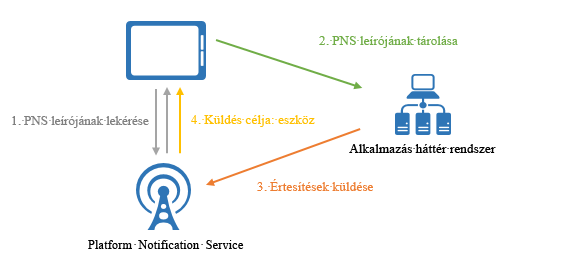
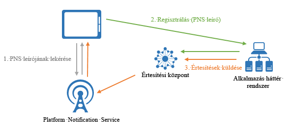

# Mi az az Azure Notification Hubs?
Az Azure Notification Hubs egy egyszerűen használható és kibővített leküldéses értesítési alrendszert biztosít, amellyel értesítéseket küldhet bármilyen platformra (iOS, Android, Windows, Kindle, Baidu stb.) bármilyen háttérrendszerből (felhőbeli vagy helyszíni). A Notification Hubs vállalati és végfelhasználói célokra is egyaránt nagyszerűen használható. Íme, néhány példaforgatókönyv:

- Legfrissebb híreket tartalmazó értesítések küldése felhasználók millióinak minimális késéssel.
- Helyalapú kuponok küldése az ez iránt érdeklődő felhasználói szegmenseknek.
- Eseményekkel kapcsolatos értesítések küldése felhasználóknak vagy csoportoknak média-/sport-/pénzügyi/játékalkalmazásokban.
- Promóciós tartalmak leküldése alkalmazásokba marketingcéllal az ügyfelek bevonása érdekében.
- Felhasználók értesítése olyan vállalati eseményekről, mint az új üzenetek vagy munkaelemek.
- Kódok küldése többtényezős hitelesítéshez.

## Mik azok a leküldéses értesítések?
A leküldéses értesítés az alkalmazás és felhasználó közötti kommunikáció egy formája, amelyben a mobilalkalmazások felhasználói bizonyos kívánt információkról értesülnek általában egy előugró ablakban vagy párbeszédpanelen. A felhasználók általában eldönthetik, hogy megtekintik vagy bezárják az üzenetet. Ha az előbbit választják, azzal megnyitják a mobilalkalmazást, amelyik az értesítést küldte.

A leküldéses értesítések fontos részei a végfelhasználói alkalmazásoknak az alkalmazással kapcsolatos marketingtevékenységek elősegítésében és az alkalmazáshasználat növelésében, illetve a vállalati alkalmazásoknak a naprakész üzleti információk kommunikálásában. Ez a legjobb módja az alkalmazás és a felhasználó közötti kommunikációnak, mivel energiatakarékos a mobileszközök tekintetében, rugalmasságot nyújt az értesítés küldőinek, valamint akkor is elérhetők, amikor az adott alkalmazás nem aktív.

Az alábbi témakörökben tekinthet meg további információt a leküldéses értesítésekkel kapcsolatban néhány népszerű platform esetén: 
* [iOS](https://developer.apple.com/notifications/)
* [Android](https://developer.android.com/guide/topics/ui/notifiers/notifications.html)
* [Windows](http://msdn.microsoft.com/library/windows/apps/hh779725.aspx)

## Hogyan működnek a leküldéses értesítések?
A leküldéses értesítéseket a rendszerek platformspecifikus, *Platform Notification System* (PNS) nevű infrastruktúrákon keresztül küldik el. Ezek az infrastruktúrák lecsupaszított leküldéses funkciókat kínálnak, amelyekkel üzeneteket kézbesítenek egy adott leíróval rendelkező eszközöknek, és nem biztosítanak közös felületet. Ha a fejlesztő egy alkalmazás iOS-, Android- és Windows-verziójának is szeretne elküldeni egy értesítést, az Apple Push Notification Service-t (APNs), a Firebase Cloud Messaginget (FCM) és a Windows Notification Service-t (WNS) is használnia kell.

A leküldés lényegében a következőképpen működik:

1. Az ügyfélalkalmazás úgy dönt, hogy értesítést szeretne kapni. Ezért kapcsolatba lép megfelelő a PNS-sel, hogy lekérje az egyedi és ideiglenes leküldési leíróját. A leíró típusa a rendszertől függ (például a WNS URI-ket, míg az APNs jogkivonatokat használ).
2. Az ügyfélalkalmazás ezt a leírót az alkalmazás háttérrendszerében vagy szolgáltatójában tárolja.
3. Egy leküldéses értesítés elküldéséhez az alkalmazás háttérrendszere a leíró használatával kapcsolatba lép a PNS-sel, hogy egy adott ügyfélalkalmazást célozzon meg.
4. A PNS továbbküldi az értesítést a leíróban meghatározott eszközre.

## A leküldéses értesítések kihívásai
A PNS-ek hatékonyak. Számos teendőt hagynak ugyanakkor az alkalmazásfejlesztőre még a gyakori leküldéses értesítési forgatókönyvek, például a leküldéses értesítések szegmentált felhasználóknak való szórásos küldésének megvalósítása esetén is.

Az értesítések leküldéséhez összetett infrastruktúrára van szükség, amely nem kapcsolódik az alkalmazás fő üzleti logikájához. Néhány infrastrukturális kihívás:

- **Platformfüggőség**
    - A háttérrendszernek összetett és nehezen fenntartható platformfüggő logikával kell rendelkeznie, hogy különböző eszközplatformokra küldjön értesítéseket, mivel a PNS-ek nem egységesek.
- **Méretezés**
    - A PNS-irányelvek szerint az eszközök jogkivonatait az alkalmazás minden indításakor frissíteni kell. A háttérrendszer nagy forgalmat és rengeteg adatbázis-elérést kezel pusztán csak a jogkivonatok naprakészen tartása érdekében is. Amikor az eszközök száma akár több száz- vagy ezermillióra nő, az infrastruktúra létrehozásának és fenntartásának költsége hatalmasra rúg.
    - A legtöbb PNS nem támogatja a több eszközre küldött szórásos küldést. Egy millió eszközre való szórásos küldés egy millió, PNS-ekre küldött hívást eredményez. Ekkora forgalomra való méretezés minimális késéssel egyáltalán nem egyszerű feladat.
- **Útválasztás** 
    - Jóllehet a PNS-ekkel küldhet értesítéseket az eszközökre, a legtöbb alkalmazás értesítéseinek célpontjai felhasználók vagy érdeklődési körök. A háttérrendszernek nyilvántartás kell fenntartania, hogy az eszközöket érdeklődési körökhöz, felhasználókhoz, tulajdonságokhoz stb. társítsa. Ez a terhelés hozzáadódik az alkalmazások piacra kerülési idejéhez és fenntartási költségeihez.

## Miért érdemes az Azure Notification Hubs szolgáltatást használni?
A Notification Hubs megszünteti az értesítéseknek az alkalmazás háttérrendszeréből manuális leküldésével járó minden összetettséget. A szolgáltatás többplatformos, kibővített leküldéses értesítési infrastruktúrája csökkenti a leküldéses értesítésekkel kapcsolatos kódolást, valamint egyszerűsíti a háttérrendszert. A Notification Hubs segítségével az eszközök csak a PNS-leíróknak egy központban való regisztrálásáért, a háttérrendszer pedig az üzenetek felhasználóknak vagy érdekcsoportoknak való elküldéséért felelős, ahogy az alábbi ábrán is látható:

A Notification Hubs egy használatra kész leküldéses értesítési alrendszer az alábbi előnyökkel:

- **Platformfüggetlen**
    - Támogatja az összes jelentős leküldési platformot, beleértve az iOS, az Android, a Windows, valamint a Kindle és a Baidu platformot.
    - Közös felület, ahonnan leküldéses értesítéseket küldhet minden platformra platformspecifikus vagy platformfüggetlen formátumban platformspecifikus munka nélkül.
    - Eszközleírók kezelése egy helyen.
- **Háttérrendszertől független**
    - Felhőalapú vagy helyszíni.
    - .NET, Node.js, Java stb.
- **Sokféle kézbesítési minta**
    - Szórás egy vagy több platformra: Különféle rendszerű eszközök millióira szórhat azonnal értesítéseket egyetlen API-hívással.
    - Leküldés eszközökre: Az értesítésekkel adott eszközöket célozhat meg.
    - Leküldés felhasználóknak: A címkéket és sablonokat kezelő szolgáltatások segítségével elérheti a felhasználók összes eszközét, platformtól függetlenül.
    - Leküldés szegmenseknek dinamikus címkékkel: A címkéket kezelő szolgáltatással szegmentálhatja az eszközöket, és az igényeinek megfelelően küldhet azokra leküldéses értesítéseket, függetlenül attól, hogy egyetlen szegmensnek vagy a szegmensek feltételekkel meghatározott halmazának küld értesítéseket (például aktív ÉS Budapesten lakik NEM új felhasználó). Mivel nincs a közzétételi-feliratkozási (pub-sub) modellre lenne korlátozva, az eszközcímkéket bárhol és bármikor frissítheti.
    - Honosított leküldés: A sablonokat kezelő szolgáltatás segítségével a honosítást a háttérkód módosítása nélkül valósíthatja meg.
    - Csendes leküldés: Engedélyezheti a leküldés és lekérés (push-to-pull) mintát, így az eszközökön csendes értesítések küldésével aktiválhatja bizonyos lekérések vagy műveletek végrehajtását.
    - Ütemezett leküldés: Az értesítések küldését bármikorra ütemezheti.
    - Közvetlen leküldés: Kihagyhatja az eszközök regisztrációját a Notification Hubs szolgáltatásban, és közvetlenül kötegelt értesítéseket küldhet le eszközleírók egy listájára.
    - Személyre szabott leküldés: Az eszközök leküldési változói segítségével eszközspecifikus, személyre szabott leküldéses értesítéseket küldhet egyéni kulcs-érték párokkal.
- **Részletes telemetria**
    - Az általános leküldési, eszköz-, hiba- és műveleti telemetria az Azure Portalon és szoftveresen is elérhető.
    - Az üzenetszintű telemetriai adatok nyomon követik az összes leküldést a kezdeti kérelemhívástól a Notification Hubs szolgáltatás általi sikeres kötegelt leküldésig.
    - A Platform Notification System-visszajelzések a Platform Notification Systems minden visszajelzését kommunikálják, hogy segítsék a hibakeresést.
- **Méretezhetőség** 
    - Gyors üzeneteket küldhet eszközök millióinak új architektúrára való áttérés vagy az eszközök horizontális skálázása nélkül.
- **Biztonság**
    - Közös hozzáférésű jogosultságkód (SAS) vagy összevont hitelesítés.

## App Service Mobile Apps-integráció
A különböző Azure-szolgáltatásokon elérhető zökkenőmentes és egységes élmény érdekében az [App Service Mobile Apps](../app-service-mobile/app-service-mobile-value-prop.md) a leküldéses értesítések beépített támogatását nyújtja a Notification Hubs használatával. Az [App Service Mobile Apps](../app-service-mobile/app-service-mobile-value-prop.md) jól skálázható, világszerte elérhető, vállalati fejlesztők és rendszerintegrátorok számára készült mobilalkalmazás-fejlesztő platform, amely számos lehetőséget kínál a mobilos fejlesztésekhez.

A Mobile Apps-fejlesztők a következő munkafolyamatoknál használhatják a Notification Hubs szolgáltatást:

1. Eszköz PNS-leírójának lekérése
2. Eszközök regisztrálása a Notification Hubsban a Mobile Apps-ügyfél kényelmesen használható SDK-regisztrációs API-ján keresztül

    > [!NOTE]
    > Vegye figyelembe, hogy a Mobile Apps biztonsági okokból eltávolítja az összes regisztrációs címkét. Közvetlenül a háttérrendszerről használhatja a Notification Hubst a címkék és eszközök társításához.
1. Értesítések küldése az alkalmazás háttérrendszeréből a Notification Hubs használatával

Íme néhány hasznos szolgáltatás a fejlesztők számára, amelyeket ez az integráció tett elérhetővé:

- **Mobile Apps-ügyfél SDK-k**: Ezek a többplatformos SDK-k egyszerű API-kat biztosítanak a regisztrációhoz, illetve a mobilalkalmazáshoz automatikusan kapcsolódó értesítési központtal való kommunikációhoz. A fejlesztőknek nem kell átrágniuk magukat a Notification Hubs hitelesítő adatain, és egy másik szolgáltatást használniuk.
    - *Leküldés felhasználónak*: Az SDK-k automatikusan felcímkézik az adott eszközt a Mobile Apps által hitelesített felhasználói azonosítóval, így lehetővé teszik a felhasználóknak küldött leküldéses értesítéseket.
    - *Leküldés eszközre*: Az SDK-k a Mobile Apps telepítési azonosítót automatikusan GUID-ként használják a Notification Hubsban való regisztrációhoz, így a fejlesztőknek nem kell több szolgáltatásbeli GUID azonosítót fenntartaniuk.
- **Telepítési modell**: A Mobile Apps a Notification Hubs legújabb leküldési modelljével mutatja be az eszközök leküldéses tulajdonságait egy JSON-telepítésben, amely egyszerűen használható, és igazodik a leküldéses értesítési szolgáltatásokhoz.
- **Rugalmasság**: A fejlesztők mindig választhatják a Notification Hubs közvetlen használatát, még az integráció megvalósítása után is.
- **Integrált élmény az [Azure Portalon](https://portal.azure.com)**: A leküldési funkció vizuálisan megjelenik a Mobile Appsban, és a fejlesztők könnyedén használhatják a kapcsolódó értesítési központtal a Mobile Appson keresztül.

## További lépések
Az értesítési központ létrehozásának és használatának első lépéseinek végrehajtásához kövesse az [értesítések mobilalkalmazásokba való leküldésével](notification-hubs-android-push-notification-google-fcm-get-started.md) foglalkozó oktatóanyagot. [0]: ./media/notification-hubs-overview/registration-diagram.png [1]: ./media/notification-hubs-overview/notification-hub-diagram.png [Így használják az ügyfelek a Notification Hubs szolgáltatást]: http://azure.microsoft.com/services/notification-hubs [A Notification Hubs szolgáltatással kapcsolatos oktatóanyagok és útmutatók]: http://azure.microsoft.com/documentation/services/notification-hubs [iOS]: http://azure.microsoft.com/documentation/articles/notification-hubs-ios-get-started [Android]: http://azure.microsoft.com/documentation/articles/notification-hubs-android-get-started [Univerzális Windows]: http://azure.microsoft.com/documentation/articles/notification-hubs-windows-store-dotnet-get-started [Windows Phone]: http://azure.microsoft.com/documentation/articles/notification-hubs-windows-phone-get-started [Kindle]: http://azure.microsoft.com/documentation/articles/notification-hubs-kindle-get-started [Xamarin.iOS]: http://azure.microsoft.com/documentation/articles/partner-xamarin-notification-hubs-ios-get-started [Xamarin.Android]: http://azure.microsoft.com/documentation/articles/partner-xamarin-notification-hubs-android-get-started [Microsoft.WindowsAzure.Messaging.NotificationHub]: http://msdn.microsoft.com/library/microsoft.windowsazure.messaging.notificationhub.aspx [Microsoft.ServiceBus.Notifications]: http://msdn.microsoft.com/library/microsoft.servicebus.notifications.aspx [App Service Mobile Apps]: https://azure.microsoft.com/documentation/articles/app-service-mobile-value-prop/ [templates]: notification-hubs-templates-cross-platform-push-messages.md [Azure Portal]: https://portal.azure.com [címkék]: (http://msdn.microsoft.com/library/azure/dn530749.aspx)
