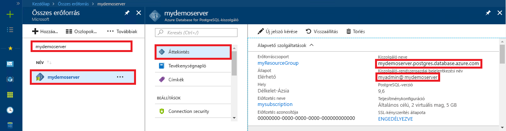

# <a name="azure-database-for-postgresql-use-net-c-to-connect-and-query-data"></a>A PostgreSQL-hez készült Azure Database: csatlakozás és adatlekérdezés .NET (C#) használatával
Ebben a gyors útmutatóban azt szemléltetjük, hogy miként lehet C# nyelven írt alkalmazás használatával csatlakozni a PostgreSQL-hez készült Azure Database-hez. Bemutatjuk, hogy az SQL-utasítások használatával hogyan kérdezhetők le, illeszthetők be, frissíthetők és törölhetők az adatok az adatbázisban. A cikkben ismertetett lépések feltételezik, hogy Ön rendelkezik fejlesztési tapasztalatokkal a C# használatával kapcsolatban, a PostgreSQL-hez készült Azure Database használatában pedig még járatlan.

## <a name="prerequisites"></a>Előfeltételek
A rövid útmutató az alábbi útmutatók valamelyikében létrehozott erőforrásokat használja kiindulópontként:
- [DB létrehozása – portál](quickstart-create-server-database-portal.md)
- [DB létrehozása – CLI](quickstart-create-server-database-azure-cli.md)

Emellett a következőket kell elvégezni:
- Telepítse a [.NET-keretrendszer](https://www.microsoft.com/net/download). A .NET-keretrendszer az adott platformon (Windows, Ubuntu Linux vagy macOS) történő telepítéséhez kövesse a hivatkozott cikk lépéseit. 
- A kód beírásához és szerkesztéséhez telepítse a [Visual Studiót](https://www.visualstudio.com/downloads/) vagy a Visual Studio Code-ot.
- Töltse le és telepítse [Npgsql](https://github.com/npgsql/Npgsql/releases) könyvtárban.

## <a name="get-connection-information"></a>Kapcsolatadatok lekérése
Kérje le a PostgreSQL-hez készült Azure-adatbázishoz való csatlakozáshoz szükséges kapcsolatadatokat. Szüksége lesz a teljes kiszolgálónévre és a bejelentkezési hitelesítő adatokra.

1. Jelentkezzen be az [Azure portálra](https://portal.azure.com/).
2. Az Azure Portal bal oldali menüjében kattintson az **Összes erőforrás** lehetőségre, és keressen rá a létrehozott kiszolgálóra (például **mypgserver-20170401**).
3. Kattintson a **mypgserver-20170401** kiszolgálónévre.
4. Válassza ki a kiszolgáló **Áttekintés** oldalát. Jegyezze fel a **Kiszolgálónevet** és a **Kiszolgáló-rendszergazdai bejelentkezési nevet**.
 
5. Ha elfelejti a kiszolgálói bejelentkezési adatok, navigáljon a **áttekintése** lap használatával jeleníthetők meg a **kiszolgálói rendszergazda bejelentkezési név** , és ha szükséges, a jelszó alaphelyzetbe állítása.

## <a name="connect-create-table-and-insert-data"></a>Csatlakozás, táblák létrehozása és adatok beszúrása
Az alábbi kód használatával csatlakozhat és töltheti be az adatokat a **CREATE TABLE** és az **INSERT INTO** SQL-utasítások segítségével. A kód módszert használ, NpgsqlCommand osztály [Open()](http://www.npgsql.org/api/Npgsql.NpgsqlConnection.html#Npgsql_NpgsqlConnection_Open) való kapcsolatot létrehozni a PostgreSQL-adatbázisból. Az módszert használ majd [CreateCommand()](http://www.npgsql.org/api/Npgsql.NpgsqlConnection.html#Npgsql_NpgsqlConnection_CreateCommand), beállítja a CommandText tulajdonság, és meghívja a [ExecuteNonQuery()](http://www.npgsql.org/api/Npgsql.NpgsqlCommand.html#Npgsql_NpgsqlCommand_ExecuteNonQuery) metódus adatbázis-parancsok futtatásához. 

Cserélje le a gazdagép, az adatbázisnév, a felhasználó és a jelszó paramétereit azokra az értékekre, amelyeket a kiszolgáló és az adatbázis létrehozásakor adott meg. 

```csharp
using System;
using System.Collections.Generic;
using System.Linq;
using System.Text;
using System.Threading.Tasks;
using Npgsql;

namespace Driver
{
    public class AzurePostgresCreate
    {
        // Obtain connection string information from the portal
        //
        private static string Host = "mypgserver-20170401.postgres.database.azure.com";
        private static string User = "mylogin@mypgserver-20170401";
        private static string DBname = "mypgsqldb";
        private static string Password = "<server_admin_password>";
        private static string Port = "5432";

        static void Main(string[] args)
        {
            // Build connection string using parameters from portal
            //
            string connString =
                String.Format(
                    "Server={0}; User Id={1}; Database={2}; Port={3}; Password={4}; SSL Mode=Prefer; Trust Server Certificate=true",
                    Host,
                    User,
                    DBname,
                    Port,
                    Password);

            var conn = new NpgsqlConnection(connString);

            Console.Out.WriteLine("Opening connection");
            conn.Open();

            var command = conn.CreateCommand();
            command.CommandText = "DROP TABLE IF EXISTS inventory;";
            command.ExecuteNonQuery();
            Console.Out.WriteLine("Finished dropping table (if existed)");

            command.CommandText = "CREATE TABLE inventory (id serial PRIMARY KEY, name VARCHAR(50), quantity INTEGER);";
            command.ExecuteNonQuery();
            Console.Out.WriteLine("Finished creating table");

            command.CommandText =
                String.Format(
                    @"
                                INSERT INTO inventory (name, quantity) VALUES ({0}, {1});
                                INSERT INTO inventory (name, quantity) VALUES ({2}, {3});
                                INSERT INTO inventory (name, quantity) VALUES ({4}, {5});
                            ",
                    "\'banana\'", 150,
                    "\'orange\'", 154,
                    "\'apple\'", 100
                    );

            int nRows = command.ExecuteNonQuery();
            Console.Out.WriteLine(String.Format("Number of rows inserted={0}", nRows));

            Console.Out.WriteLine("Closing connection");
            conn.Close();

            Console.WriteLine("Press RETURN to exit");
            Console.ReadLine();
        }
    }
}
```

## <a name="read-data"></a>Adatok olvasása
Az alábbi kód használatával csatlakozhat és végezheti el az adatok olvasását az adott **SELECT** SQL-utasítás segítségével. A kód az NpgsqlCommand osztályt használja az [Open()](http://www.npgsql.org/api/Npgsql.NpgsqlConnection.html#Npgsql_NpgsqlConnection_Open) metódussal egy PostgreSQL-kapcsolat létesítésére. Ezt követően a kód a módszereket használja [CreateCommand()](http://www.npgsql.org/api/Npgsql.NpgsqlConnection.html#Npgsql_NpgsqlConnection_CreateCommand) és [ExecuteReader()](http://www.npgsql.org/api/Npgsql.NpgsqlCommand.html#Npgsql_NpgsqlCommand_ExecuteReader) adatbázis-parancsok futtatásához. A kódot használja a következő [Read()](http://www.npgsql.org/api/Npgsql.NpgsqlDataReader.html#Npgsql_NpgsqlDataReader_Read) ahhoz, hogy az eredmények rekordjához. Végezetül az használ [GetInt32()](http://www.npgsql.org/api/Npgsql.NpgsqlDataReader.html#Npgsql_NpgsqlDataReader_GetInt32_System_Int32_) és [GetString()](http://www.npgsql.org/api/Npgsql.NpgsqlDataReader.html#Npgsql_NpgsqlDataReader_GetString_System_Int32_) elemzése a bejegyzésben szereplő értékeket.

Cserélje le a gazdagép, az adatbázisnév, a felhasználó és a jelszó paramétereit azokra az értékekre, amelyeket a kiszolgáló és az adatbázis létrehozásakor adott meg. 

```csharp
using System;
using System.Collections.Generic;
using System.Linq;
using System.Text;
using System.Threading.Tasks;
using Npgsql;

namespace Driver
{
    public class AzurePostgresRead
    {
        // Obtain connection string information from the portal
        //
        private static string Host = "mypgserver-20170401.postgres.database.azure.com";
        private static string User = "mylogin@mypgserver-20170401";
        private static string DBname = "mypgsqldb";
        private static string Password = "<server_admin_password>";
        private static string Port = "5432";

        static void Main(string[] args)
        {
            // Build connection string using parameters from portal
            //
            string connString =
                String.Format(
                    "Server={0}; User Id={1}; Database={2}; Port={3}; Password={4};",
                    Host,
                    User,
                    DBname,
                    Port,
                    Password);

            var conn = new NpgsqlConnection(connString);

            Console.Out.WriteLine("Opening connection");
            conn.Open();

            var command = conn.CreateCommand();
            command.CommandText = "SELECT * FROM inventory;";

            var reader = command.ExecuteReader();
            while (reader.Read())
            {
                Console.WriteLine(
                    string.Format(
                        "Reading from table=({0}, {1}, {2})",
                        reader.GetInt32(0).ToString(),
                        reader.GetString(1),
                        reader.GetInt32(2).ToString()
                        )
                    );
            }

            Console.Out.WriteLine("Closing connection");
            conn.Close();

            Console.WriteLine("Press RETURN to exit");
            Console.ReadLine();
        }
    }
}
```


## <a name="update-data"></a>Adatok frissítése
A következő kódot használja a csatlakozáshoz, és frissíti a használatával végzett egy **frissítése** SQL-utasításban. A kód az NpgsqlCommand osztályt használja az [Open()](http://www.npgsql.org/api/Npgsql.NpgsqlConnection.html#Npgsql_NpgsqlConnection_Open) metódussal egy PostgreSQL-kapcsolat létesítésére. Ezt követően a kód módszerrel [CreateCommand()](http://www.npgsql.org/api/Npgsql.NpgsqlConnection.html#Npgsql_NpgsqlConnection_CreateCommand), beállítja a CommandText tulajdonság, és a [ExecuteNonQuery()](http://www.npgsql.org/api/Npgsql.NpgsqlCommand.html#Npgsql_NpgsqlCommand_ExecuteNonQuery) metódus adatbázis-parancsok futtatásához.

Cserélje le a gazdagép, az adatbázisnév, a felhasználó és a jelszó paramétereit azokra az értékekre, amelyeket a kiszolgáló és az adatbázis létrehozásakor adott meg. 

```csharp
using System;
using System.Collections.Generic;
using System.Linq;
using System.Text;
using System.Threading.Tasks;
using Npgsql;

namespace Driver
{
    public class AzurePostgresUpdate
    {
        // Obtain connection string information from the portal
        //
        private static string Host = "mypgserver-20170401.postgres.database.azure.com";
        private static string User = "mylogin@mypgserver-20170401";
        private static string DBname = "mypgsqldb";
        private static string Password = "<server_admin_password>";
        private static string Port = "5432";

        static void Main(string[] args)
        {
            // Build connection string using parameters from portal
            //
            string connString =
                String.Format(
                    "Server={0}; User Id={1}; Database={2}; Port={3}; Password={4};",
                    Host,
                    User,
                    DBname,
                    Port,
                    Password);

            var conn = new NpgsqlConnection(connString);

            Console.Out.WriteLine("Opening connection");
            conn.Open();

            var command = conn.CreateCommand();
            command.CommandText =
            String.Format("UPDATE inventory SET quantity = {0} WHERE name = {1};",
                200,
                "\'banana\'"
                );

            int nRows = command.ExecuteNonQuery();
            Console.Out.WriteLine(String.Format("Number of rows updated={0}", nRows));

            Console.Out.WriteLine("Closing connection");
            conn.Close();

            Console.WriteLine("Press RETURN to exit");
            Console.ReadLine();
        }
    }
}
```


## <a name="delete-data"></a>Adat törlése
Az alábbi kód segítségével csatlakozzon, és törli az adatokat egy **törlése** SQL-utasításban. 

A kód módszert használ, NpgsqlCommand osztály [Open()](http://www.npgsql.org/api/Npgsql.NpgsqlConnection.html#Npgsql_NpgsqlConnection_Open) való kapcsolatot létrehozni a PostgreSQL-adatbázisból. Ezt követően a kódot használja a [CreateCommand()](http://www.npgsql.org/api/Npgsql.NpgsqlConnection.html#Npgsql_NpgsqlConnection_CreateCommand) metódus, beállítja a CommandText tulajdonság és metódus [ExecuteNonQuery()](http://www.npgsql.org/api/Npgsql.NpgsqlCommand.html#Npgsql_NpgsqlCommand_ExecuteNonQuery) adatbázis-parancsok futtatásához.

Cserélje le a gazdagép, az adatbázisnév, a felhasználó és a jelszó paramétereit azokra az értékekre, amelyeket a kiszolgáló és az adatbázis létrehozásakor adott meg. 

```csharp
using System;
using System.Collections.Generic;
using System.Linq;
using System.Text;
using System.Threading.Tasks;
using Npgsql;

namespace Driver
{
    public class AzurePostgresDelete
    {
        // Obtain connection string information from the portal
        //
        private static string Host = "mypgserver-20170401.postgres.database.azure.com";
        private static string User = "mylogin@mypgserver-20170401";
        private static string DBname = "mypgsqldb";
        private static string Password = "<server_admin_password>";
        private static string Port = "5432";

        static void Main(string[] args)
        {
            // Build connection string using parameters from portal
            //
            string connString =
                String.Format(
                    "Server={0}; User Id={1}; Database={2}; Port={3}; Password={4};",
                    Host,
                    User,
                    DBname,
                    Port,
                    Password);

            var conn = new NpgsqlConnection(connString);

            Console.Out.WriteLine("Opening connection");
            conn.Open();

            var command = conn.CreateCommand();
            command.CommandText =
            String.Format("DELETE FROM inventory WHERE name = {0};",
                "\'orange\'");
            int nRows = command.ExecuteNonQuery();
            Console.Out.WriteLine(String.Format("Number of rows deleted={0}", nRows));

            Console.Out.WriteLine("Closing connection");
            conn.Close();

            Console.WriteLine("Press RETURN to exit");
            Console.ReadLine();
        }
    }
}
```

## <a name="next-steps"></a>Következő lépések
> [!div class="nextstepaction"]
> [Adatbázis migrálása exportálással és importálással](./howto-migrate-using-export-and-import.md)
