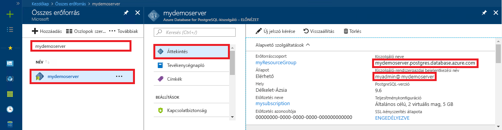

<a id="azure-database-for-postgresql-use-go-language-to-connect-and-query-data" class="xliff"></a>

# PostgreSQL-hez készült Azure-adatbázis: Csatlakozás és adatok lekérdezése a Go nyelv használatával
Ez a rövid útmutató azt ismerteti, hogyan lehet csatlakozni a PostgreSQL-hez készült Azure-adatbázishoz [Go](https://golang.org/) nyelven írt kóddal. Azt is bemutatja, hogyan lehet SQL-utasítások használatával adatokat lekérdezni, beszúrni, frissíteni és törölni az adatbázisban. A cikk feltételezi, hogy Ön ismeri a Go-t használó fejlesztéseket, de még járatlan a PostgreSQL-hez készült Azure-adatbázis használatában.

<a id="prerequisites" class="xliff"></a>

## Előfeltételek
A rövid útmutató az alábbi útmutatók valamelyikében létrehozott erőforrásokat használja kiindulópontként:
- [DB létrehozása – portál](quickstart-create-server-database-portal.md)
- [DB létrehozása – Azure CLI](quickstart-create-server-database-azure-cli.md)

<a id="install-go-and-pq" class="xliff"></a>

## A Go és a pq telepítése
- Töltse le és telepítse a Go-t a platformjának megfelelő [telepítési utasítások](https://golang.org/doc/install) szerint.
- Hozzon létre egy mappát a projekt számára (például C:\Postgresql\). A parancssorban módosítsa a könyvtárat a projektmappára (például `cd C:\Postgres\`).
- Töltse le a [Pure Go Postgres illesztőprogramot (pq)](https://github.com/lib/pq) a projektmappába. Ehhez írja be a `go get github.com/lib/pq` parancsot, miközben a mappában van.

<a id="build-and-run-go-code" class="xliff"></a>

## Go kód felépítése és futtatása 
- Mentse a kódot egy szövegfájlba *.go kiterjesztéssel, majd mentse a szövegfájlt a projektmappába (például `C:\postgres\read.go`).
- A kód futtatásához módosítsa a könyvtárt a projektmappára (`cd postgres`), majd írja be a `go run read.go` parancsot az alkalmazás lefordításához és futtatásához.
- A kód natív alkalmazásba való beépítéséhez írja be a `go build read.go` parancsot, majd indítsa el a read.exe fájlt az alkalmazás futtatásához.

<a id="get-connection-information" class="xliff"></a>

## Kapcsolatadatok lekérése
Kérje le a PostgreSQL-hez készült Azure-adatbázishoz való csatlakozáshoz szükséges kapcsolatadatokat. Szüksége lesz a teljes kiszolgálónévre és a bejelentkezési hitelesítő adatokra.

1. Jelentkezzen be az [Azure portálra](https://portal.azure.com/).
2. Az Azure Portal bal oldali menüjében kattintson az **Összes erőforrás** lehetőségre, és keressen rá a létrehozott kiszolgálóra (például **mypgserver-20170401**).
3. Kattintson a **mypgserver-20170401** kiszolgálónévre.
4. Válassza ki a kiszolgáló **Áttekintés** oldalát. Jegyezze fel a **Kiszolgálónevet** és a **Kiszolgáló-rendszergazdai bejelentkezési nevet**.
 
5. Amennyiben elfelejtette a kiszolgálója bejelentkezési adatait, lépjen az **Áttekintés** oldalra, és keresse ki a kiszolgáló-rendszergazda bejelentkezési nevét. Szükség esetén kérjen új jelszót.

<a id="connect-and-create-a-table" class="xliff"></a>

## Csatlakozás és tábla létrehozása
A következő kód használatával csatlakozhat, és létrehozhat egy táblát a **CREATE TABLE** SQL-utasítással, majd az **INSERT INTO** SQL-utasításokkal sorokat adhat hozzá a táblához.

A kód három csomagot importál, az [sql package](https://golang.org/pkg/database/sql/) és a [pq package](http://godoc.org/github.com/lib/pq) csomagot illesztőprogramként a Postgres-kiszolgálóval való kommunikációhoz, illetve az [fmt package](https://golang.org/pkg/fmt/) csomagot a nyomtatott bemenetekhez és kimenetekhez a parancssoron.

A kód meghívja az [sql.Open()](http://godoc.org/github.com/lib/pq#Open) metódust a PostgreSQL-hez készült Azure-adatbázishoz való csatlakozáshoz, majd a [db.Ping()](https://golang.org/pkg/database/sql/#DB.Ping) metódussal ellenőrzi a kapcsolatot. A rendszer a folyamat során [adatbázis-leírót](https://golang.org/pkg/database/sql/#DB) használ, amely az adatbázis-kiszolgáló kapcsolatkészletét tárolja. A kód többször is meghívja az [Exec()](https://golang.org/pkg/database/sql/#DB.Exec) metódust, hogy különböző SQL-parancsokat futtasson. A rendszer minden alkalommal egyéni checkError() metódust hív meg, hogy ellenőrizze a hibákat, és hiba esetén kilépjen.


Cserélje le a `HOST`, `DATABASE`, `USER` és `PASSWORD` paramétereket a saját értékeire. 

```go
package main

import (
    "database/sql"
    "fmt"
    _ "github.com/lib/pq"
)

const (
    // Initialize connection constants.
    HOST     = "mypgserver-20170401.postgres.database.azure.com"
    DATABASE = "mypgsqldb"
    USER     = "mylogin@mypgserver-20170401"
    PASSWORD = "<server_admin_password>"
)

func checkError(err error) {
    if err != nil {
        panic(err)
    }
}

func main() {
    // Initialize connection string.
    var connectionString string = fmt.Sprintf("host=%s user=%s password=%s dbname=%s sslmode=require", HOST, USER, PASSWORD, DATABASE)

    // Initialize connection object.
    db, err := sql.Open("postgres", connectionString)
    checkError(err)

    err = db.Ping()
    checkError(err)
    fmt.Println("Successfully created connection to database")

    // Drop previous table of same name if one exists.
    _, err = db.Exec("DROP TABLE IF EXISTS inventory;")
    checkError(err)
    fmt.Println("Finished dropping table (if existed)")

    // Create table.
    _, err = db.Exec("CREATE TABLE inventory (id serial PRIMARY KEY, name VARCHAR(50), quantity INTEGER);")
    checkError(err)
    fmt.Println("Finished creating table")

    // Insert some data into table.
    sql_statement := "INSERT INTO inventory (name, quantity) VALUES ($1, $2);"
    _, err = db.Exec(sql_statement, "banana", 150)
    checkError(err)
    _, err = db.Exec(sql_statement, "orange", 154)
    checkError(err)
    _, err = db.Exec(sql_statement, "apple", 100)
    checkError(err)
    fmt.Println("Inserted 3 rows of data")
}
```

<a id="read-data" class="xliff"></a>

## Adatok beolvasása
A következő kóddal csatlakozhat, és beolvashatja az adatokat a **SELECT** SQL-utasítással. 

A kód három csomagot importál, az [sql package](https://golang.org/pkg/database/sql/) és a [pq package](http://godoc.org/github.com/lib/pq) csomagot illesztőprogramként a Postgres-kiszolgálóval való kommunikációhoz, illetve az [fmt package](https://golang.org/pkg/fmt/) csomagot a nyomtatott bemenetekhez és kimenetekhez a parancssoron.

A kód meghívja az [sql.Open()](http://godoc.org/github.com/lib/pq#Open) metódust a PostgreSQL-hez készült Azure-adatbázishoz való csatlakozáshoz, majd a [db.Ping()](https://golang.org/pkg/database/sql/#DB.Ping) metódussal ellenőrzi a kapcsolatot. A rendszer a folyamat során [adatbázis-leírót](https://golang.org/pkg/database/sql/#DB) használ, amely az adatbázis-kiszolgáló kapcsolatkészletét tárolja. A választó lekérdezést a [db.Query()](https://golang.org/pkg/database/sql/#DB.Query) metódus meghívásával lehet futtatni, és az így kapott sorokat a rendszer egy [rows](https://golang.org/pkg/database/sql/#Rows) (sorok) típusú változóban tárolja. A kód beolvassa az aktuális sorban található oszlopok adatértékeit a [rows.Scan()](https://golang.org/pkg/database/sql/#Rows.Scan) metódussal, majd a [rows.Next()](https://golang.org/pkg/database/sql/#Rows.Next) iterátor használatával ismétlődően fut a sorokon, amíg azok el nem fogynak. Az egyes sorok oszlopértékei megjelennek a konzolon. A rendszer minden alkalommal egyéni checkError() metódust hív meg, hogy ellenőrizze a hibákat, és hiba esetén kilépjen.

Cserélje le a `HOST`, `DATABASE`, `USER` és `PASSWORD` paramétereket a saját értékeire. 

```go
package main

import (
    "database/sql"
    "fmt"
    _ "github.com/lib/pq"
)

const (
    // Initialize connection constants.
    HOST     = "mypgserver-20170401.postgres.database.azure.com"
    DATABASE = "mypgsqldb"
    USER     = "mylogin@mypgserver-20170401"
    PASSWORD = "<server_admin_password>"
)

func checkError(err error) {
    if err != nil {
        panic(err)
    }
}

func main() {

    // Initialize connection string.
    var connectionString string = fmt.Sprintf("host=%s user=%s password=%s dbname=%s sslmode=require", HOST, USER, PASSWORD, DATABASE)

    // Initialize connection object.
    db, err := sql.Open("postgres", connectionString)
    checkError(err)

    err = db.Ping()
    checkError(err)
    fmt.Println("Successfully created connection to database")

    // Read rows from table.
    var id int
    var name string
    var quantity int

    sql_statement := "SELECT * from inventory;"
    rows, err := db.Query(sql_statement)
    checkError(err)

    for rows.Next() {
        switch err := rows.Scan(&id, &name, &quantity); err {
        case sql.ErrNoRows:
            fmt.Println("No rows were returned")
        case nil:
            fmt.Printf("Data row = (%d, %s, %d)\n", id, name, quantity)
        default:
            checkError(err)
        }
    }
}
```

<a id="update-data" class="xliff"></a>

## Adatok frissítése
A következő kód használatával csatlakozhat, és frissítheti az adatokat az **UPDATE** SQL-utasítással.

A kód három csomagot importál, az [sql package](https://golang.org/pkg/database/sql/) és a [pq package](http://godoc.org/github.com/lib/pq) csomagot illesztőprogramként a Postgres-kiszolgálóval való kommunikációhoz, illetve az [fmt package](https://golang.org/pkg/fmt/) csomagot a nyomtatott bemenetekhez és kimenetekhez a parancssoron.

A kód meghívja az [sql.Open()](http://godoc.org/github.com/lib/pq#Open) metódust a PostgreSQL-hez készült Azure-adatbázishoz való csatlakozáshoz, majd a [db.Ping()](https://golang.org/pkg/database/sql/#DB.Ping) metódussal ellenőrzi a kapcsolatot. A rendszer a folyamat során [adatbázis-leírót](https://golang.org/pkg/database/sql/#DB) használ, amely az adatbázis-kiszolgáló kapcsolatkészletét tárolja. A kód meghívja az [Exec()](https://golang.org/pkg/database/sql/#DB.Exec) metódust, hogy futtassa a táblát frissítő SQL-utasítást. Egyéni checkError() metódust hív meg, hogy ellenőrizze a hibákat, és hiba esetén kilépjen.

Cserélje le a `HOST`, `DATABASE`, `USER` és `PASSWORD` paramétereket a saját értékeire. 
```go
package main

import (
  "database/sql"
  _ "github.com/lib/pq"
  "fmt"
)

const (
    // Initialize connection constants.
    HOST     = "mypgserver-20170401.postgres.database.azure.com"
    DATABASE = "mypgsqldb"
    USER     = "mylogin@mypgserver-20170401"
    PASSWORD = "<server_admin_password>"
)

func checkError(err error) {
    if err != nil {
        panic(err)
    }
}

func main() {
    
    // Initialize connection string.
    var connectionString string = 
        fmt.Sprintf("host=%s user=%s password=%s dbname=%s sslmode=require", HOST, USER, PASSWORD, DATABASE)

    // Initialize connection object.
    db, err := sql.Open("postgres", connectionString)
    checkError(err)

    err = db.Ping()
    checkError(err)
    fmt.Println("Successfully created connection to database")

    // Modify some data in table.
    sql_statement := "UPDATE inventory SET quantity = $2 WHERE name = $1;"
    _, err = db.Exec(sql_statement, "banana", 200)
    checkError(err)
    fmt.Println("Updated 1 row of data")
}
```

<a id="delete-data" class="xliff"></a>

## Adat törlése
A következő kód használatával csatlakozhat, és beolvashatja az adatokat a **DELETE** SQL-utasítással. 

A kód három csomagot importál, az [sql package](https://golang.org/pkg/database/sql/) és a [pq package](http://godoc.org/github.com/lib/pq) csomagot illesztőprogramként a Postgres-kiszolgálóval való kommunikációhoz, illetve az [fmt package](https://golang.org/pkg/fmt/) csomagot a nyomtatott bemenetekhez és kimenetekhez a parancssoron.

A kód meghívja az [sql.Open()](http://godoc.org/github.com/lib/pq#Open) metódust a PostgreSQL-hez készült Azure-adatbázishoz való csatlakozáshoz, majd a [db.Ping()](https://golang.org/pkg/database/sql/#DB.Ping) metódussal ellenőrzi a kapcsolatot. A rendszer a folyamat során [adatbázis-leírót](https://golang.org/pkg/database/sql/#DB) használ, amely az adatbázis-kiszolgáló kapcsolatkészletét tárolja. A kód meghívja az [Exec()](https://golang.org/pkg/database/sql/#DB.Exec) metódust, hogy futtassa a táblát frissítő SQL-utasítást. Egyéni checkError() metódust hív meg, hogy ellenőrizze a hibákat, és hiba esetén kilépjen.

Cserélje le a `HOST`, `DATABASE`, `USER` és `PASSWORD` paramétereket a saját értékeire. 
```go
package main

import (
  "database/sql"
  _ "github.com/lib/pq"
  "fmt"
)

const (
    // Initialize connection constants.
    HOST     = "mypgserver-20170401.postgres.database.azure.com"
    DATABASE = "mypgsqldb"
    USER     = "mylogin@mypgserver-20170401"
    PASSWORD = "<server_admin_password>"
)

func checkError(err error) {
    if err != nil {
        panic(err)
    }
}

func main() {
    
    // Initialize connection string.
    var connectionString string = 
        fmt.Sprintf("host=%s user=%s password=%s dbname=%s sslmode=require", HOST, USER, PASSWORD, DATABASE)

    // Initialize connection object.
    db, err := sql.Open("postgres", connectionString)
    checkError(err)

    err = db.Ping()
    checkError(err)
    fmt.Println("Successfully created connection to database")

    // Delete some data from table.
    sql_statement := "DELETE FROM inventory WHERE name = $1;"
    _, err = db.Exec(sql_statement, "orange")
    checkError(err)
    fmt.Println("Deleted 1 row of data")
}
```

<a id="next-steps" class="xliff"></a>

## Következő lépések
> [!div class="nextstepaction"]
> [Adatbázis migrálása exportálással és importálással](./howto-migrate-using-export-and-import.md)

