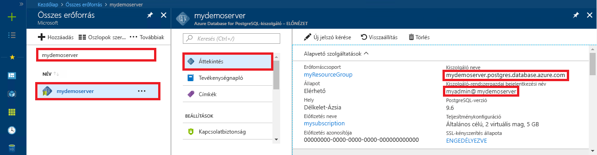

# <a name="azure-database-for-postgresql-use-java-to-connect-and-query-data"></a>A PostgreSQL-hez készült Azure Database: csatlakozás és adatlekérdezés a Java használatával
Ebben a rövid útmutatóban azt szemléltetjük, hogy miként lehet Java-alkalmazás használatával csatlakozni a PostgreSQL-hez készült Azure Database-hez. Azt is bemutatja, hogyan lehet SQL-utasítások használatával adatokat lekérdezni, beszúrni, frissíteni és törölni az adatbázisban. Ez a cikk a lépések azt feltételezik, hogy ismeri a Java használatával történő fejlesztéséhez, és nem ismeri a működik az Azure Database-PostgreSQL.

## <a name="prerequisites"></a>Előfeltételek
A rövid útmutató az alábbi útmutatók valamelyikében létrehozott erőforrásokat használja kiindulópontként:
- [DB létrehozása – portál](quickstart-create-server-database-portal.md)
- [DB létrehozása – Azure CLI](quickstart-create-server-database-azure-cli.md)

Emellett a következőket kell elvégezni:
- Töltse le a Java és a Java fejlesztői készlet verziójának megfelelő [PostgreSQL JDBC-illesztőprogramot](https://jdbc.postgresql.org/download.html).
- Illessze be a PostgreSQL JDBC jar-fájlját (például postgresql-42.1.1.jar) az alkalmazás osztályútvonalába. További információért lásd: [Az osztályútvonal részletei](https://jdbc.postgresql.org/documentation/head/classpath.html).

## <a name="get-connection-information"></a>Kapcsolatadatok lekérése
Kérje le a PostgreSQL-hez készült Azure-adatbázishoz való csatlakozáshoz szükséges kapcsolatadatokat. Szüksége lesz a teljes kiszolgálónévre és a bejelentkezési hitelesítő adatokra.

1. Jelentkezzen be az [Azure portálra](https://portal.azure.com/).
2. Az Azure Portal bal oldali menüjében kattintson az **Összes erőforrás** lehetőségre, és keressen rá a létrehozott kiszolgálóra (például **mypgserver-20170401**).
3. Kattintson a **mypgserver-20170401** kiszolgálónévre.
4. Válassza ki a kiszolgáló **Áttekintés** oldalát. Jegyezze fel a **Kiszolgálónevet** és a **Kiszolgáló-rendszergazdai bejelentkezési nevet**.
 
5. Amennyiben elfelejtette a kiszolgáló bejelentkezési adatait, lépjen az **Overview** (Áttekintés) oldalra, és itt megtudhatja a kiszolgáló rendszergazdájának bejelentkezési nevét, valamint szükség esetén visszaállíthatja a jelszót.

## <a name="connect-create-table-and-insert-data"></a>Csatlakozás, táblák létrehozása és adatok beszúrása
Az alábbi kód segítségével csatlakozzon, és az adatok betöltése az adatbázisba, a függvény használatával egy **BESZÚRÁSA** SQL-utasításban. A módszerek [getConnection()](https://www.postgresql.org/docs/7.4/static/jdbc-use.html), [createStatement()](https://jdbc.postgresql.org/documentation/head/query.html), és [executeQuery()](https://jdbc.postgresql.org/documentation/head/query.html) van az adatbázishoz való kapcsolódáshoz használt, dobja el, és a tábla létrehozásához. A [prepareStatement](https://jdbc.postgresql.org/documentation/head/query.html) objektummal hozhatja létre a beszúrási parancsokat, valamint a setString() és a setInt() metódusokkal végezheti el a paraméterértékek kötését. Az [executeUpdate()](https://jdbc.postgresql.org/documentation/head/update.html) metódussal futtathatja az egyes paraméterkészletekhez tartozó parancsot. 

Cserélje le a gazdagép, az adatbázis, a felhasználó és a jelszó paramétereit azokra az értékekre, amelyeket a saját kiszolgáló és adatbázis létrehozásakor adott meg.

```java
import java.sql.*;
import java.util.Properties;

public class CreateTableInsertRows {

    public static void main (String[] args)  throws Exception
    {

        // Initialize connection variables.
        String host = "mypgserver-20170401.postgres.database.azure.com";
        String database = "mypgsqldb";
        String user = "mylogin@mypgserver-20170401";
        String password = "<server_admin_password>";

        // check that the driver is installed
        try
        {
            Class.forName("org.postgresql.Driver");
        }
        catch (ClassNotFoundException e)
        {
            throw new ClassNotFoundException("PostgreSQL JDBC driver NOT detected in library path.", e);
        }

        System.out.println("PostgreSQL JDBC driver detected in library path.");

        Connection connection = null;

        // Initialize connection object
        try
        {
            String url = String.format("jdbc:postgresql://%s/%s", host, database);
            
            // set up the connection properties
            Properties properties = new Properties();
            properties.setProperty("user", user);
            properties.setProperty("password", password);
            properties.setProperty("ssl", "true");

            // get connection
            connection = DriverManager.getConnection(url, properties);
        }
        catch (SQLException e)
        {
            throw new SQLException("Failed to create connection to database.", e);
        }
        if (connection != null) 
        { 
            System.out.println("Successfully created connection to database.");
        
            // Perform some SQL queries over the connection.
            try
            {
                // Drop previous table of same name if one exists.
                Statement statement = connection.createStatement();
                statement.execute("DROP TABLE IF EXISTS inventory;");
                System.out.println("Finished dropping table (if existed).");
    
                // Create table.
                statement.execute("CREATE TABLE inventory (id serial PRIMARY KEY, name VARCHAR(50), quantity INTEGER);");
                System.out.println("Created table.");
    
                // Insert some data into table.
                int nRowsInserted = 0;
                PreparedStatement preparedStatement = connection.prepareStatement("INSERT INTO inventory (name, quantity) VALUES (?, ?);");
                preparedStatement.setString(1, "banana");
                preparedStatement.setInt(2, 150);
                nRowsInserted += preparedStatement.executeUpdate();

                preparedStatement.setString(1, "orange");
                preparedStatement.setInt(2, 154);
                nRowsInserted += preparedStatement.executeUpdate();

                preparedStatement.setString(1, "apple");
                preparedStatement.setInt(2, 100);
                nRowsInserted += preparedStatement.executeUpdate();
                System.out.println(String.format("Inserted %d row(s) of data.", nRowsInserted));
    
                // NOTE No need to commit all changes to database, as auto-commit is enabled by default.
    
            }
            catch (SQLException e)
            {
                throw new SQLException("Encountered an error when executing given sql statement.", e);
            }       
        }
        else {
            System.out.println("Failed to create connection to database.");
        }
        System.out.println("Execution finished.");
    }
}
```

## <a name="read-data"></a>Adatok olvasása
Az alábbi kód használatával végezheti el az adatok olvasását a **SELECT** SQL-utasítás segítségével. A módszerek [getConnection()](https://www.postgresql.org/docs/7.4/static/jdbc-use.html), [createStatement()](https://jdbc.postgresql.org/documentation/head/query.html), és [executeQuery()](https://jdbc.postgresql.org/documentation/head/query.html) kapcsolódni az adatbázishoz, létrehozása és futtatása a select utasítás segítségével. Az eredmények feldolgozása a [ResultSet](https://www.postgresql.org/docs/7.4/static/jdbc-query.html) objektum használatával történik. 

Cserélje le a gazdagép, az adatbázis, a felhasználó és a jelszó paramétereit azokra az értékekre, amelyeket a saját kiszolgáló és adatbázis létrehozásakor adott meg.

```java
import java.sql.*;
import java.util.Properties;

public class ReadTable {

    public static void main (String[] args)  throws Exception
    {

        // Initialize connection variables.
        String host = "mypgserver-20170401.postgres.database.azure.com";
        String database = "mypgsqldb";
        String user = "mylogin@mypgserver-20170401";
        String password = "<server_admin_password>";

        // check that the driver is installed
        try
        {
            Class.forName("org.postgresql.Driver");
        }
        catch (ClassNotFoundException e)
        {
            throw new ClassNotFoundException("PostgreSQL JDBC driver NOT detected in library path.", e);
        }

        System.out.println("PostgreSQL JDBC driver detected in library path.");

        Connection connection = null;

        // Initialize connection object
        try
        {
            String url = String.format("jdbc:postgresql://%s/%s", host, database);
            
            // set up the connection properties
            Properties properties = new Properties();
            properties.setProperty("user", user);
            properties.setProperty("password", password);
            properties.setProperty("ssl", "true");

            // get connection
            connection = DriverManager.getConnection(url, properties);
        }
        catch (SQLException e)
        {
            throw new SQLException("Failed to create connection to database.", e);
        }
        if (connection != null) 
        { 
            System.out.println("Successfully created connection to database.");
        
            // Perform some SQL queries over the connection.
            try
            {
    
                Statement statement = connection.createStatement();
                ResultSet results = statement.executeQuery("SELECT * from inventory;");
                while (results.next())
                {
                    String outputString = 
                        String.format(
                            "Data row = (%s, %s, %s)",
                            results.getString(1),
                            results.getString(2),
                            results.getString(3));
                    System.out.println(outputString);
                }
            }
            catch (SQLException e)
            {
                throw new SQLException("Encountered an error when executing given sql statement.", e);
            }       
        }
        else {
            System.out.println("Failed to create connection to database.");
        }
        System.out.println("Execution finished.");
    }
}

```

## <a name="update-data"></a>Adatok frissítése
Az alábbi kód használatával végezheti el az adatok módosítását az **UPDATE** SQL-utasítás segítségével. A módszerek [getConnection()](https://www.postgresql.org/docs/7.4/static/jdbc-use.html), [prepareStatement()](https://jdbc.postgresql.org/documentation/head/query.html), és [executeUpdate()](https://jdbc.postgresql.org/documentation/head/update.html) kapcsolódni az adatbázishoz, előkészítése, és futtassa az update utasításban használt. 

Cserélje le a gazdagép, az adatbázis, a felhasználó és a jelszó paramétereit azokra az értékekre, amelyeket a saját kiszolgáló és adatbázis létrehozásakor adott meg.

```java
import java.sql.*;
import java.util.Properties;

public class UpdateTable {
    public static void main (String[] args)  throws Exception
    {

        // Initialize connection variables.
        String host = "mypgserver-20170401.postgres.database.azure.com";
        String database = "mypgsqldb";
        String user = "mylogin@mypgserver-20170401";
        String password = "<server_admin_password>";

        // check that the driver is installed
        try
        {
            Class.forName("org.postgresql.Driver");
        }
        catch (ClassNotFoundException e)
        {
            throw new ClassNotFoundException("PostgreSQL JDBC driver NOT detected in library path.", e);
        }

        System.out.println("PostgreSQL JDBC driver detected in library path.");

        Connection connection = null;

        // Initialize connection object
        try
        {
            String url = String.format("jdbc:postgresql://%s/%s", host, database);
            
            // set up the connection properties
            Properties properties = new Properties();
            properties.setProperty("user", user);
            properties.setProperty("password", password);
            properties.setProperty("ssl", "true");

            // get connection
            connection = DriverManager.getConnection(url, properties);
        }
        catch (SQLException e)
        {
            throw new SQLException("Failed to create connection to database.", e);
        }
        if (connection != null) 
        { 
            System.out.println("Successfully created connection to database.");
        
            // Perform some SQL queries over the connection.
            try
            {
                // Modify some data in table.
                int nRowsUpdated = 0;
                PreparedStatement preparedStatement = connection.prepareStatement("UPDATE inventory SET quantity = ? WHERE name = ?;");
                preparedStatement.setInt(1, 200);
                preparedStatement.setString(2, "banana");
                nRowsUpdated += preparedStatement.executeUpdate();
                System.out.println(String.format("Updated %d row(s) of data.", nRowsUpdated));
    
                // NOTE No need to commit all changes to database, as auto-commit is enabled by default.
            }
            catch (SQLException e)
            {
                throw new SQLException("Encountered an error when executing given sql statement.", e);
            }       
        }
        else {
            System.out.println("Failed to create connection to database.");
        }
        System.out.println("Execution finished.");
    }
}
```
## <a name="delete-data"></a>Adat törlése
Az alábbi kód használatával végezheti el az adatok eltávolítását a **DELETE** SQL-utasítás segítségével. A módszerek [getConnection()](https://www.postgresql.org/docs/7.4/static/jdbc-use.html), [prepareStatement()](https://jdbc.postgresql.org/documentation/head/query.html), és [executeUpdate()](https://jdbc.postgresql.org/documentation/head/update.html) kapcsolódni az adatbázishoz, előkészítése, és a delete utasítás segítségével. 

Cserélje le a gazdagép, az adatbázis, a felhasználó és a jelszó paramétereit azokra az értékekre, amelyeket a saját kiszolgáló és adatbázis létrehozásakor adott meg.

```java
import java.sql.*;
import java.util.Properties;

public class DeleteTable {
    public static void main (String[] args)  throws Exception
    {

        // Initialize connection variables.
        String host = "mypgserver-20170401.postgres.database.azure.com";
        String database = "mypgsqldb";
        String user = "mylogin@mypgserver-20170401";
        String password = "<server_admin_password>";

        // check that the driver is installed
        try
        {
            Class.forName("org.postgresql.Driver");
        }
        catch (ClassNotFoundException e)
        {
            throw new ClassNotFoundException("PostgreSQL JDBC driver NOT detected in library path.", e);
        }

        System.out.println("PostgreSQL JDBC driver detected in library path.");

        Connection connection = null;

        // Initialize connection object
        try
        {
            String url = String.format("jdbc:postgresql://%s/%s", host, database);
            
            // set up the connection properties
            Properties properties = new Properties();
            properties.setProperty("user", user);
            properties.setProperty("password", password);
            properties.setProperty("ssl", "true");

            // get connection
            connection = DriverManager.getConnection(url, properties);
        }
        catch (SQLException e)
        {
            throw new SQLException("Failed to create connection to database.", e);
        }
        if (connection != null) 
        { 
            System.out.println("Successfully created connection to database.");
        
            // Perform some SQL queries over the connection.
            try
            {
                // Delete some data from table.
                int nRowsDeleted = 0;
                PreparedStatement preparedStatement = connection.prepareStatement("DELETE FROM inventory WHERE name = ?;");
                preparedStatement.setString(1, "orange");
                nRowsDeleted += preparedStatement.executeUpdate();
                System.out.println(String.format("Deleted %d row(s) of data.", nRowsDeleted));
    
                // NOTE No need to commit all changes to database, as auto-commit is enabled by default.
            }
            catch (SQLException e)
            {
                throw new SQLException("Encountered an error when executing given sql statement.", e);
            }       
        }
        else {
            System.out.println("Failed to create connection to database.");
        }
        System.out.println("Execution finished.");
    }
}
```

## <a name="next-steps"></a>Következő lépések
> [!div class="nextstepaction"]
> [Adatbázis migrálása exportálással és importálással](./howto-migrate-using-export-and-import.md)
