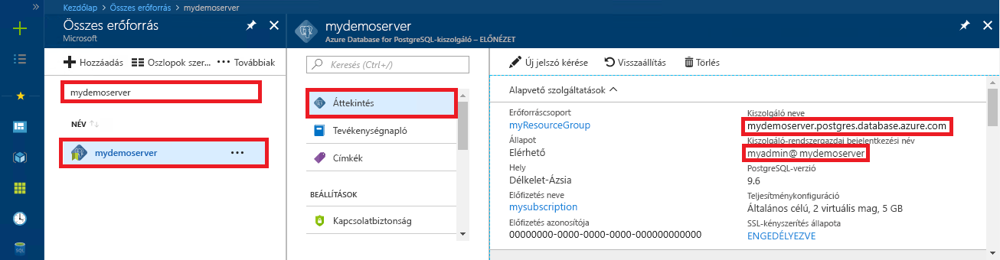

# <a name="azure-database-for-postgresql-use-nodejs-to-connect-and-query-data"></a>A PostgreSQL-hez készült Azure Database: Csatlakozás és adatlekérdezés a Node.js használatával
A gyors üzembe helyezés mutatja be egy PostgreSQL az Azure-adatbázishoz való kapcsolódáshoz a [Node.js](https://nodejs.org/) alkalmazás. Azt is bemutatja, hogyan lehet SQL-utasítások használatával adatokat lekérdezni, beszúrni, frissíteni és törölni az adatbázisban. Ebben a cikkben azt feltételezi, hogy ismeri a Node.js használatával történő fejlesztéséhez, és nem ismeri a PostgreSQL az Azure-adatbázis használata.

## <a name="prerequisites"></a>Előfeltételek
A rövid útmutató az alábbi útmutatók valamelyikében létrehozott erőforrásokat használja kiindulópontként:
- [DB létrehozása – portál](quickstart-create-server-database-portal.md)
- [DB létrehozása – CLI](quickstart-create-server-database-azure-cli.md)

Emellett a következőket kell elvégezni:
- [Node.js](https://nodejs.org) telepítése

## <a name="install-pg-client"></a>pg-ügyfél telepítése
Telepítés [pg](https://www.npmjs.com/package/pg), ez a Node.js PostgreSQL-ügyfél.

A pg-ügyfél telepítéséhez futtassa a node package managert (npm) a parancssorban.
```bash
npm install pg
```

A telepítést a telepített csomagok listázásával ellenőrizheti.
```bash
npm list
```

## <a name="get-connection-information"></a>Kapcsolatadatok lekérése
Kérje le a PostgreSQL-hez készült Azure-adatbázishoz való csatlakozáshoz szükséges kapcsolatadatokat. Szüksége lesz a teljes kiszolgálónévre és a bejelentkezési hitelesítő adatokra.

1. Jelentkezzen be az [Azure portálra](https://portal.azure.com/).
2. Azure-portálon a bal oldali menüben kattintson a **összes erőforrás** és keressen rá az imént létrehozott kiszolgálót.
3. Kattintson a kiszolgálónévre.
4. Válassza ki a kiszolgáló **Áttekintés** oldalát. Jegyezze fel a **Kiszolgálónevet** és a **Kiszolgáló-rendszergazdai bejelentkezési nevet**.
 
5. Amennyiben elfelejtette a kiszolgáló bejelentkezési adatait, lépjen az **Overview** (Áttekintés) oldalra, és itt megtudhatja a kiszolgáló rendszergazdájának bejelentkezési nevét, valamint szükség esetén visszaállíthatja a jelszót.

## <a name="running-the-javascript-code-in-nodejs"></a>A JavaScript-kód futtatása a Node.js-ben
Előfordulhat, hogy indíthatja el Node.js a Bash rendszerhéj, a Terminálszolgáltatások vagy a Windows parancssorba írja be a `node`, majd a JavaScript-kód Példa interaktív módon futtatható példány által, és illeszti be a parancssorba. Másik megoldásként el is mentheti a JavaScript-kódot az adott szövegfájlba, majd a futtatáshoz végezze el a `node filename.js` indítását a paraméterként megadott fájlnévvel.

## <a name="connect-create-table-and-insert-data"></a>Csatlakozás, táblák létrehozása és adatok beszúrása
Az alábbi kód használatával csatlakozhat és töltheti be az adatokat a **CREATE TABLE** és az **INSERT INTO** SQL-utasítások segítségével.
A [pg.Client](https://github.com/brianc/node-postgres/wiki/Client) objektum a PostgreSQL-kiszolgálóval való használatra szolgál. A [pg.Client.connect()](https://github.com/brianc/node-postgres/wiki/Client#method-connect) függvény a kiszolgálóval való kapcsolat létesítésére szolgál. A [pg.Client.query()](https://github.com/brianc/node-postgres/wiki/Query) függvény az SQL-lekérdezés PostgreSQL-adatbázison való végrehajtására szolgál. 

Cserélje le a gazdagép, az adatbázisnév, a felhasználó és a jelszó paramétereit azokra az értékekre, amelyeket a kiszolgáló és az adatbázis létrehozásakor adott meg.

```javascript
const pg = require('pg');

const config = {
    host: '<your-db-server-name>.postgres.database.azure.com',
    // Do not hard code your username and password.
    // Consider using Node environment variables.
    user: '<your-db-username>',     
    password: '<your-password>',
    database: '<name-of-database>',
    port: 5432,
    ssl: true
};

const client = new pg.Client(config);

client.connect(err => {
    if (err) throw err;
    else {
        queryDatabase();
    }
});

function queryDatabase() {
    const query = `
        DROP TABLE IF EXISTS inventory;
        CREATE TABLE inventory (id serial PRIMARY KEY, name VARCHAR(50), quantity INTEGER);
        INSERT INTO inventory (name, quantity) VALUES ('banana', 150);
        INSERT INTO inventory (name, quantity) VALUES ('orange', 154);
        INSERT INTO inventory (name, quantity) VALUES ('apple', 100);
    `;

    client
        .query(query)
        .then(() => {
            console.log('Table created successfully!');
            client.end(console.log('Closed client connection'));
        })
        .catch(err => console.log(err))
        .then(() => {
            console.log('Finished execution, exiting now');
            process.exit();
        });
}
```

## <a name="read-data"></a>Adatok olvasása
Az alábbi kód használatával csatlakozhat és végezheti el az adatok olvasását **SELECT** SQL-utasítás segítségével. A [pg.Client](https://github.com/brianc/node-postgres/wiki/Client) objektum a PostgreSQL-kiszolgálóval való használatra szolgál. A [pg.Client.connect()](https://github.com/brianc/node-postgres/wiki/Client#method-connect) függvény a kiszolgálóval való kapcsolat létesítésére szolgál. A [pg.Client.query()](https://github.com/brianc/node-postgres/wiki/Query) függvény az SQL-lekérdezés PostgreSQL-adatbázison való végrehajtására szolgál. 

Cserélje le a gazdagép, az adatbázisnév, a felhasználó és a jelszó paramétereit azokra az értékekre, amelyeket a kiszolgáló és az adatbázis létrehozásakor adott meg. 

```javascript
const pg = require('pg');

const config = {
    host: '<your-db-server-name>.postgres.database.azure.com',
    // Do not hard code your username and password.
    // Consider using Node environment variables.
    user: '<your-db-username>',     
    password: '<your-password>',
    database: '<name-of-database>',
    port: 5432,
    ssl: true
};

const client = new pg.Client(config);

client.connect(err => {
    if (err) throw err;
    else { queryDatabase(); }
});

function queryDatabase() {
  
    console.log(`Running query to PostgreSQL server: ${config.host}`);

    const query = 'SELECT * FROM inventory;';

    client.query(query)
        .then(res => {
            const rows = res.rows;

            rows.map(row => {
                console.log(`Read: ${JSON.stringify(row)}`);
            });

            process.exit();
        })
        .catch(err => {
            console.log(err);
        });
}
```

## <a name="update-data"></a>Adatok frissítése
Az alábbi kód használatával csatlakozhat és végezheti el az adatok olvasását **UPDATE** SQL-utasítás segítségével. A [pg.Client](https://github.com/brianc/node-postgres/wiki/Client) objektum a PostgreSQL-kiszolgálóval való használatra szolgál. A [pg.Client.connect()](https://github.com/brianc/node-postgres/wiki/Client#method-connect) függvény a kiszolgálóval való kapcsolat létesítésére szolgál. A [pg.Client.query()](https://github.com/brianc/node-postgres/wiki/Query) függvény az SQL-lekérdezés PostgreSQL-adatbázison való végrehajtására szolgál. 

Cserélje le a gazdagép, az adatbázisnév, a felhasználó és a jelszó paramétereit azokra az értékekre, amelyeket a kiszolgáló és az adatbázis létrehozásakor adott meg. 

```javascript
const pg = require('pg');

const config = {
    host: '<your-db-server-name>.postgres.database.azure.com',
    // Do not hard code your username and password.
    // Consider using Node environment variables.
    user: '<your-db-username>',     
    password: '<your-password>',
    database: '<name-of-database>',
    port: 5432,
    ssl: true
};

const client = new pg.Client(config);

client.connect(err => {
    if (err) throw err;
    else {
        queryDatabase();
    }
});

function queryDatabase() {
    const query = `
        UPDATE inventory 
        SET quantity= 1000 WHERE name='banana';
    `;

    client
        .query(query)
        .then(result => {
            console.log('Update completed');
            console.log(`Rows affected: ${result.rowCount}`);
        })
        .catch(err => {
            console.log(err);
            throw err;
        });
}
```

## <a name="delete-data"></a>Adat törlése
Az alábbi kód használatával csatlakozhat és végezheti el az adatok olvasását **DELETE** SQL-utasítás segítségével. A [pg.Client](https://github.com/brianc/node-postgres/wiki/Client) objektum a PostgreSQL-kiszolgálóval való használatra szolgál. A [pg.Client.connect()](https://github.com/brianc/node-postgres/wiki/Client#method-connect) függvény a kiszolgálóval való kapcsolat létesítésére szolgál. A [pg.Client.query()](https://github.com/brianc/node-postgres/wiki/Query) függvény az SQL-lekérdezés PostgreSQL-adatbázison való végrehajtására szolgál. 

Cserélje le a gazdagép, az adatbázisnév, a felhasználó és a jelszó paramétereit azokra az értékekre, amelyeket a kiszolgáló és az adatbázis létrehozásakor adott meg. 

```javascript
const pg = require('pg');

const config = {
    host: '<your-db-server-name>.postgres.database.azure.com',
    // Do not hard code your username and password.
    // Consider using Node environment variables.
    user: '<your-db-username>',     
    password: '<your-password>',
    database: '<name-of-database>',
    port: 5432,
    ssl: true
};

const client = new pg.Client(config);

client.connect(err => {
    if (err) {
        throw err;
    } else {
        queryDatabase();
    }
});

function queryDatabase() {
    const query = `
        DELETE FROM inventory 
        WHERE name = 'apple';
    `;

    client
        .query(query)
        .then(result => {
            console.log('Delete completed');
            console.log(`Rows affected: ${result.rowCount}`);
        })
        .catch(err => {
            console.log(err);
            throw err;
        });
}
```

## <a name="next-steps"></a>Következő lépések
> [!div class="nextstepaction"]
> [Adatbázis migrálása exportálással és importálással](./howto-migrate-using-export-and-import.md)
