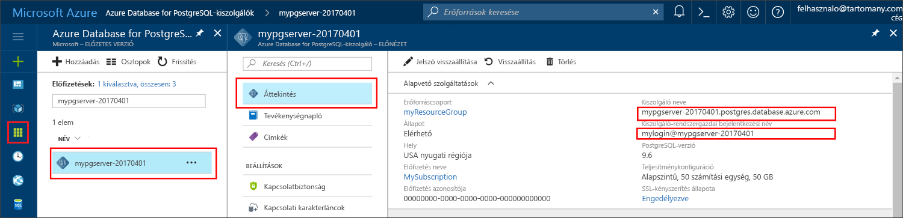

# <a name="azure-database-for-postgresql-use-php-to-connect-and-query-data"></a>PostgreSQL-hez készült Azure-adatbázis: Csatlakozás és adatok lekérdezése a PHP-vel
Ez a rövid útmutató azt ismerteti, hogyan lehet csatlakozni a PostgreSQL-hez készült Azure-adatbázishoz egy [PHP](http://php.net/manual/intro-whatis.php)-alkalmazással. Azt is bemutatja, hogyan lehet SQL-utasítások használatával adatokat lekérdezni, beszúrni, frissíteni és törölni az adatbázisban. A cikk feltételezi, hogy Ön ismeri a PHP-t használó fejlesztéseket, de még járatlan a PostgreSQL-hez készült Azure-adatbázis használatában.

## <a name="prerequisites"></a>Előfeltételek
A rövid útmutató az alábbi útmutatók valamelyikében létrehozott erőforrásokat használja kiindulópontként:
- [DB létrehozása – portál](quickstart-create-server-database-portal.md)
- [DB létrehozása – Azure CLI](quickstart-create-server-database-azure-cli.md)

## <a name="install-php"></a>A PHP telepítése
Telepítse a PHP-t a kiszolgálójára, vagy hozzon létre egy PHP-t tartalmazó Azure-[webalkalmazást](https://docs.microsoft.com/en-us/azure/app-service-web/app-service-web-overview).

### <a name="windows"></a>Windows
- Töltse le a [PHP 7.1.4 non-thread safe (NTS) x64-es verzióját](http://windows.php.net/download#php-7.1)
- Telepítse a PHP-t, majd a további konfigurációs lehetőségekért tekintse meg a [PHP kézikönyvét](http://php.net/manual/install.windows.php)
- A kód a **pgsql** osztályt használja (ext/php_pgsql.dll), amely a PHP-telepítés része. 
- Engedélyezze a **pgsql** bővítményt a php.ini konfigurációs fájl szerkesztésével, amely általában a következő helyen található: `C:\Program Files\PHP\v7.1\php.ini`. A konfigurációs fájlnak tartalmaznia kell egy sort a következő szöveggel: `extension=php_pgsql.so`. Ha ez nem jelenik meg, adja hozzá a szöveget, és mentse a fájlt. Ha a szöveg megvan, de pontosvessző előtaggal van ellátva, távolítsa el a megjegyzést a pontosvessző törlésével.

### <a name="linux-ubuntu"></a>Linux (Ubuntu)
- Töltse le a [PHP 7.1.4 non-thread safe (NTS) x64-es verzióját](http://php.net/downloads.php) 
- Telepítse a PHP-t, majd a további konfigurációs lehetőségekért tekintse meg a [PHP kézikönyvét](http://php.net/manual/install.unix.php)
- A kód a **pgsql** osztályt használja (php_pgsql.so). Telepítse a `sudo apt-get install php-pgsql` futtatásával.
- Engedélyezze a **pgsql** bővítményt az `/etc/php/7.0/mods-available/pgsql.ini` konfigurációs fájl szerkesztésével. A konfigurációs fájlnak tartalmaznia kell egy sort a következő szöveggel: `extension=php_pgsql.so`. Ha ez nem jelenik meg, adja hozzá a szöveget, és mentse a fájlt. Ha a szöveg megvan, de pontosvessző előtaggal van ellátva, távolítsa el a megjegyzést a pontosvessző törlésével.

### <a name="macos"></a>MacOS
- Töltse le a [PHP 7.1.4-es verzióját](http://php.net/downloads.php)
- Telepítse a PHP-t, majd a további konfigurációs lehetőségekért tekintse meg a [PHP kézikönyvét](http://php.net/manual/install.macosx.php)

## <a name="get-connection-information"></a>Kapcsolatadatok lekérése
Kérje le a PostgreSQL-hez készült Azure-adatbázishoz való csatlakozáshoz szükséges kapcsolatadatokat. Szüksége lesz a teljes kiszolgálónévre és a bejelentkezési hitelesítő adatokra.

1. Jelentkezzen be az [Azure portálra](https://portal.azure.com/).
2. Az Azure Portal bal oldali menüjében kattintson az **Összes erőforrás** lehetőségre, és keressen rá a létrehozott kiszolgálóra (például **mypgserver-20170401**).
3. Kattintson a **mypgserver-20170401** kiszolgálónévre.
4. Válassza ki a kiszolgáló **Áttekintés** oldalát. Jegyezze fel a **Kiszolgálónevet** és a **Kiszolgáló-rendszergazdai bejelentkezési nevet**.
 
5. Amennyiben elfelejtette a kiszolgálója bejelentkezési adatait, lépjen az **Áttekintés** oldalra, ahol kikeresheti a kiszolgáló-rendszergazda bejelentkezési nevét, valamint szükség esetén új jelszót kérhet.

## <a name="connect-and-create-a-table"></a>Csatlakozás és tábla létrehozása
A következő kód használatával csatlakozhat, és létrehozhat egy táblát a **CREATE TABLE** SQL-utasítással, majd az **INSERT INTO** SQL-utasításokkal sorokat adhat hozzá a táblához.

A kód meghívja a [pg_connect()](http://php.net/manual/en/function.pg-connect.php) metódust, hogy csatlakozni tudjon a PostgreSQL-hez készült Azure-adatbázishoz. Ezután többször is meghívja a [pg_query()](http://php.net/manual/en/function.pg-query.php) metódust, hogy különböző parancsokat futtasson, majd a [pg_last_error()](http://php.net/manual/en/function.pg-last-error.php) metódust, hogy ellenőrizze a részleteket, ha minden alkalommal hibába ütközött. Végül meghívja a [pg_close()](http://php.net/manual/en/function.pg-close.php) metódust, hogy bontsa a kapcsolatot.

Cserélje le a `$host`, `$database`, `$user` és `$password` paramétereket a saját értékeire. 

```php
<?php
    // Initialize connection variables.
    $host = "mypgserver-20170401.postgres.database.azure.com";
    $database = "mypgsqldb";
    $user = "mylogin@mypgserver-20170401";
    $password = "<server_admin_password>";

    // Initialize connection object.
    $connection = pg_connect("host=$host dbname=$database user=$user password=$password") 
        or die("Failed to create connection to database: ". pg_last_error(). "<br/>");
    print "Successfully created connection to database.<br/>";

    // Drop previous table of same name if one exists.
    $query = "DROP TABLE IF EXISTS inventory;";
    pg_query($connection, $query) 
        or die("Encountered an error when executing given sql statement: ". pg_last_error(). "<br/>");
    print "Finished dropping table (if existed).<br/>";

    // Create table.
    $query = "CREATE TABLE inventory (id serial PRIMARY KEY, name VARCHAR(50), quantity INTEGER);";
    pg_query($connection, $query) 
        or die("Encountered an error when executing given sql statement: ". pg_last_error(). "<br/>");
    print "Finished creating table.<br/>";

    // Insert some data into table.
    $name = '\'banana\'';
    $quantity = 150;
    $query = "INSERT INTO inventory (name, quantity) VALUES ($1, $2);";
    pg_query($connection, $query) 
        or die("Encountered an error when executing given sql statement: ". pg_last_error(). "<br/>");

    $name = '\'orange\'';
    $quantity = 154;
    $query = "INSERT INTO inventory (name, quantity) VALUES ($name, $quantity);";
    pg_query($connection, $query) 
        or die("Encountered an error when executing given sql statement: ". pg_last_error(). "<br/>");

    $name = '\'apple\'';
    $quantity = 100;
    $query = "INSERT INTO inventory (name, quantity) VALUES ($name, $quantity);";
    pg_query($connection, $query) 
        or die("Encountered an error when executing given sql statement: ". pg_last_error()). "<br/>";

    print "Inserted 3 rows of data.<br/>";

    // Closing connection
    pg_close($connection);
?>
```

## <a name="read-data"></a>Adatok beolvasása
A következő kóddal csatlakozhat, és beolvashatja az adatokat a **SELECT** SQL-utasítással. 

 A kód meghívja a [pg_connect()](http://php.net/manual/en/function.pg-connect.php) metódust, hogy csatlakozni tudjon a PostgreSQL-hez készült Azure-adatbázishoz. Ezután meghívja a [pg_query()](http://php.net/manual/en/function.pg-query.php) metódust, hogy futtassa a SELECT parancsot, az eredményeket egy eredményhalmazban tárolja, majd meghívja a [pg_last_error()](http://php.net/manual/en/function.pg-last-error.php) metódust, hogy hiba esetén ellenőrizze a részleteket.  Az eredményhalmaz olvasásához a kód többször, soronként egyszer meghívja a [pg_fetch_row()](http://php.net/manual/en/function.pg-fetch-row.php) metódust. A soradatokat `$row` tömbben kéri le, minden egyes tömbpozícióban oszloponként egy adatértékkel.  Az eredményhalmaz felszabadításához a [pg_fetch_row()](http://php.net/manual/en/function.pg-free-result.php) metódust hívja meg. Végül meghívja a [pg_close()](http://php.net/manual/en/function.pg-close.php) metódust, hogy bontsa a kapcsolatot.

Cserélje le a `$host`, `$database`, `$user` és `$password` paramétereket a saját értékeire. 

```php
<?php
    // Initialize connection variables.
    $host = "mypgserver-20170401.postgres.database.azure.com";
    $database = "mypgsqldb";
    $user = "mylogin@mypgserver-20170401";
    $password = "<server_admin_password>";
    
    // Initialize connection object.
    $connection = pg_connect("host=$host dbname=$database user=$user password=$password")
                or die("Failed to create connection to database: ". pg_last_error(). "<br/>");

    print "Successfully created connection to database. <br/>";

    // Perform some SQL queries over the connection.
    $query = "SELECT * from inventory";
    $result_set = pg_query($connection, $query) 
        or die("Encountered an error when executing given sql statement: ". pg_last_error(). "<br/>");
    while ($row = pg_fetch_row($result_set))
    {
        print "Data row = ($row[0], $row[1], $row[2]). <br/>";
    }

    // Free result_set
    pg_free_result($result_set);

    // Closing connection
    pg_close($connection);
?>
```

## <a name="update-data"></a>Adatok frissítése
A következő kód használatával csatlakozhat, és frissítheti az adatokat az **UPDATE** SQL-utasítással.

A kód meghívja a [pg_connect()](http://php.net/manual/en/function.pg-connect.php) metódust, hogy csatlakozni tudjon a PostgreSQL-hez készült Azure-adatbázishoz. Ezután meghívja a [pg_query()](http://php.net/manual/en/function.pg-query.php) metódust, hogy futtasson egy parancsot, majd a [pg_last_error()](http://php.net/manual/en/function.pg-last-error.php) metódust, hogy hiba esetén ellenőrizze a részleteket. Végül meghívja a [pg_close()](http://php.net/manual/en/function.pg-close.php) metódust, hogy bontsa a kapcsolatot.

Cserélje le a `$host`, `$database`, `$user` és `$password` paramétereket a saját értékeire. 

```php
<?php
    // Initialize connection variables.
    $host = "mypgserver-20170401.postgres.database.azure.com";
    $database = "mypgsqldb";
    $user = "mylogin@mypgserver-20170401";
    $password = "<server_admin_password>";

    // Initialize connection object.
    $connection = pg_connect("host=$host dbname=$database user=$user password=$password")
                or die("Failed to create connection to database: ". pg_last_error(). ".<br/>");

    print "Successfully created connection to database. <br/>";

    // Modify some data in table.
    $new_quantity = 200;
    $name = '\'banana\'';
    $query = "UPDATE inventory SET quantity = $new_quantity WHERE name = $name;";
    pg_query($connection, $query) 
        or die("Encountered an error when executing given sql statement: ". pg_last_error(). ".<br/>");
    print "Updated 1 row of data. </br>";

    // Closing connection
    pg_close($connection);
?>
```


## <a name="delete-data"></a>Adat törlése
A következő kód használatával csatlakozhat, és beolvashatja az adatokat a **DELETE** SQL-utasítással. 

 A kód meghívja a [pg_connect()](http://php.net/manual/en/function.pg-connect.php) metódust, hogy csatlakozni tudjon a PostgreSQL-hez készült Azure Database-hez. Ezután meghívja a [pg_query()](http://php.net/manual/en/function.pg-query.php) metódust, hogy futtasson egy parancsot, majd a [pg_last_error()](http://php.net/manual/en/function.pg-last-error.php) metódust, hogy hiba esetén ellenőrizze a részleteket. Végül meghívja a [pg_close()](http://php.net/manual/en/function.pg-close.php) metódust, hogy bontsa a kapcsolatot.

Cserélje le a `$host`, `$database`, `$user` és `$password` paramétereket a saját értékeire. 

```php
<?php
    // Initialize connection variables.
    $host = "mypgserver-20170401.postgres.database.azure.com";
    $database = "mypgsqldb";
    $user = "mylogin@mypgserver-20170401";
    $password = "<server_admin_password>";

    // Initialize connection object.
    $connection = pg_connect("host=$host dbname=$database user=$user password=$password")
            or die("Failed to create connection to database: ". pg_last_error(). ". </br>");

    print "Successfully created connection to database. <br/>";

    // Delete some data from table.
    $name = '\'orange\'';
    $query = "DELETE FROM inventory WHERE name = $name;";
    pg_query($connection, $query) 
        or die("Encountered an error when executing given sql statement: ". pg_last_error(). ". <br/>");
    print "Deleted 1 row of data. <br/>";

    // Closing connection
    pg_close($connection);
?>
```

## <a name="next-steps"></a>Következő lépések
> [!div class="nextstepaction"]
> [Adatbázis migrálása exportálással és importálással](./howto-migrate-using-export-and-import.md)

