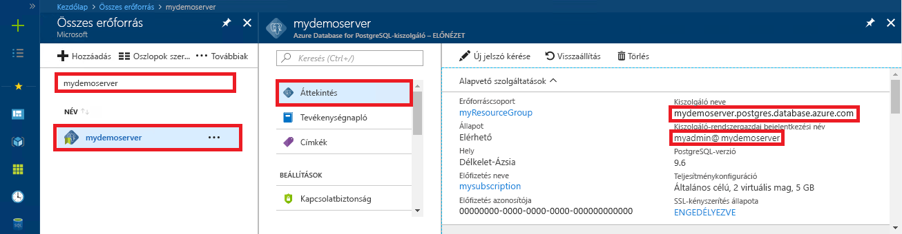

# <a name="azure-database-for-postgresql-use-python-to-connect-and-query-data"></a>A PostgreSQL-hez készült Azure Database: Csatlakozás és adatlekérdezés a Python használatával
Ez a rövid útmutató ismerteti, hogyan használható a [Python](https://python.org) a PostgreSQL-hez készült Azure-adatbázishoz való csatlakozáshoz. Azt is bemutatjuk, hogy az SQL-utasítások használatával hogyan kérdezhetők le, illeszthetők be, frissíthetők és törölhetők az adatbázisban található adatok macOS, Ubuntu Linux és Windows platformon. A jelen cikkben ismertetett lépések feltételezik, hogy Ön rendelkezik fejlesztési tapasztalatokkal a Python használatával kapcsolatosan, a PostgreSQL-hez készült Azure Database használatában pedig még járatlan.

## <a name="prerequisites"></a>Előfeltételek
A rövid útmutató az alábbi útmutatók valamelyikében létrehozott erőforrásokat használja kiindulópontként:
- [DB létrehozása – portál](quickstart-create-server-database-portal.md)
- [DB létrehozása – CLI](quickstart-create-server-database-azure-cli.md)

Emellett a következőkre van szükség:
- telepített [python](https://www.python.org/downloads/)
- telepített [pip](https://pip.pypa.io/en/stable/installing/) csomag (a pip már telepítve van, ha a [python.org](https://python.org) webhelyről letöltött Python 2 >=2.7.9 vagy Python 3 >=3.4 bináris fájlokat használ.

## <a name="install-the-python-connection-libraries-for-postgresql"></a>A PostgreSQL-hez készült Python-adatkapcsolattárak telepítése
Telepítse a [psycopg2](http://initd.org/psycopg/docs/install.html) csomagot, amely lehetővé teszi a csatlakozást és az adatbázis lekérdezését. A psycopg2 a [PyPI webhelyen érhető el](https://pypi.python.org/pypi/psycopg2/) [kerék](http://pythonwheels.com/) csomagok formájában a legelterjedtebb platformokhoz (Linux, OSX, Windows). Használjon pip-telepítést az összes függőséget magában foglaló modul bináris verziójának beszerzéséhez.

1. A számítógépen indítsa el a parancssori felületet:
    - Linuxon indítsa el a Bash felületet.
    - MacOS rendszeren indítsa el a Terminal eszközt.
    - Windows rendszeren indítsa el a parancssort a Start menüből.
2. Ellenőrizze, hogy a pip legfrissebb verzióját használja-e, az alábbihoz hasonló parancs futtatásával:
    ```cmd
    pip install -U pip
    ```

3. Futtassa az alábbi parancsot a psycopg2 csomag telepítéséhez:
    ```cmd
    pip install psycopg2
    ```

## <a name="get-connection-information"></a>Kapcsolatadatok lekérése
Kérje le a PostgreSQL-hez készült Azure-adatbázishoz való csatlakozáshoz szükséges kapcsolatadatokat. Szüksége lesz a teljes kiszolgálónévre és a bejelentkezési hitelesítő adatokra.

1. Jelentkezzen be az [Azure portálra](https://portal.azure.com/).
2. Az Azure Portal bal oldali menüjében kattintson a **Minden erőforrás** lehetőségre, és keressen rá a **mypgserver-20170401** kiszolgálóra (amelyet most hozott létre).
3. Kattintson a **mypgserver-20170401** kiszolgálónévre.
4. Válassza a kiszolgáló **Áttekintés** lapját, és jegyezze fel a **Kiszolgálónevet** és a **Kiszolgáló-rendszergazdai bejelentkezési nevet**.
 
5. Amennyiben elfelejtette a kiszolgálója bejelentkezési adatait, lépjen az **Áttekintés** oldalra, ahol kikeresheti a kiszolgáló-rendszergazda bejelentkezési nevét, valamint szükség esetén új jelszót kérhet.

## <a name="how-to-run-python-code"></a>Python-kód futtatása
Ez a témakör összesen négy kódmintát tartalmaz, amelyek mindegyike egy adott funkciót hajt végre. Az alábbi utasítások alapján szövegfájlt hozhat létre, kódblokkot szúrhat be, majd mentheti a fájlt későbbi futtatáshoz. Mindenképpen négy külön fájlt hozzon létre, mindegyik blokk számára egyet.

- Hozzon létre egy új fájlt a kedvenc szövegszerkesztőjével.
- Másolja és illessze be az alábbi szakaszokban található kódminták egyikét a szövegfájlba. Cserélje le a **gazdagép**, az **adatbázisnév**, a **felhasználó** és a **jelszó** paramétereit azokra az értékekre, amelyeket a kiszolgáló és az adatbázis létrehozásakor adott meg.
- Mentse a fájlt a .py kiterjesztéssel (például postgres.py) a projektmappába. Ha Windows operációs rendszert futtat, az UTF-8 kódolást válassza a fájl mentésekor. 
- Indítsa el a parancssort vagy a Bash felületet, és lépjen a projektmappába, például: `cd postgres`.
-  A kód futtatásához írja be a Python-parancsot, majd a fájlnevet, például: `Python postgres.py`.

> [!NOTE]
> A Python 3. verziójától kezdődően a `SyntaxError: Missing parentheses in call to 'print'` hiba jelenhet meg az alábbi kódblokkok futtatásakor. Ha ez történik, cserélje le a `print "string"` parancs minden hívását egy zárójelet használó függvényhívással, például a következővel: `print("string")`.

## <a name="connect-create-table-and-insert-data"></a>Csatlakozás, táblák létrehozása és adatok beszúrása
Az alábbi kód használatával csatlakozhat és töltheti be az adatokat az **INSERT** SQL-utasítással használt [psycopg2.connect](http://initd.org/psycopg/docs/connection.html) függvény segítségével. A [cursor.execute](http://initd.org/psycopg/docs/cursor.html#execute) függvény az SQL-lekérdezés PostgreSQL-adatbázison való végrehajtására szolgál. Cserélje le a gazdagép, az adatbázisnév, a felhasználó és a jelszó paramétereit azokra az értékekre, amelyeket a kiszolgáló és az adatbázis létrehozásakor adott meg.

```Python
import psycopg2

# Update connection string information obtained from the portal
host = "mypgserver-20170401.postgres.database.azure.com"
user = "mylogin@mypgserver-20170401"
dbname = "mypgsqldb"
password = "<server_admin_password>"
sslmode = "require"

# Construct connection string
conn_string = "host={0} user={1} dbname={2} password={3} sslmode={4}".format(host, user, dbname, password, sslmode)
conn = psycopg2.connect(conn_string) 
print "Connection established"

cursor = conn.cursor()

# Drop previous table of same name if one exists
cursor.execute("DROP TABLE IF EXISTS inventory;")
print "Finished dropping table (if existed)"

# Create table
cursor.execute("CREATE TABLE inventory (id serial PRIMARY KEY, name VARCHAR(50), quantity INTEGER);")
print "Finished creating table"

# Insert some data into table
cursor.execute("INSERT INTO inventory (name, quantity) VALUES (%s, %s);", ("banana", 150))
cursor.execute("INSERT INTO inventory (name, quantity) VALUES (%s, %s);", ("orange", 154))
cursor.execute("INSERT INTO inventory (name, quantity) VALUES (%s, %s);", ("apple", 100))
print "Inserted 3 rows of data"

# Cleanup
conn.commit()
cursor.close()
conn.close()
```

A kód sikeres futtatása után a kimenet a következőképpen néz ki:


## <a name="read-data"></a>Adatok olvasása
Az alábbi kód használatával végezheti el a beillesztett adatok olvasását a **SELECT** SQL-utasítással használt [cursor.execute](http://initd.org/psycopg/docs/cursor.html#execute) függvény segítségével. Ez a függvény lekérdezést fogad el, és olyan eredményt ad vissza, amely a [cursor.fetchall()](http://initd.org/psycopg/docs/cursor.html#cursor.fetchall) használatával ismételhető. Cserélje le a gazdagép, az adatbázisnév, a felhasználó és a jelszó paramétereit azokra az értékekre, amelyeket a kiszolgáló és az adatbázis létrehozásakor adott meg.

```Python
import psycopg2

# Update connection string information obtained from the portal
host = "mypgserver-20170401.postgres.database.azure.com"
user = "mylogin@mypgserver-20170401"
dbname = "mypgsqldb"
password = "<server_admin_password>"
sslmode = "require"

# Construct connection string
conn_string = "host={0} user={1} dbname={2} password={3} sslmode={4}".format(host, user, dbname, password, sslmode)
conn = psycopg2.connect(conn_string) 
print "Connection established"

cursor = conn.cursor()

# Fetch all rows from table
cursor.execute("SELECT * FROM inventory;")
rows = cursor.fetchall()

# Print all rows
for row in rows:
    print "Data row = (%s, %s, %s)" %(str(row[0]), str(row[1]), str(row[2]))

# Cleanup
conn.commit()
cursor.close()
conn.close()
```

## <a name="update-data"></a>Adatok frissítése
Az alábbi kód használatával végezheti el a korábban beillesztett leltári sor frissítését az **UPDATE** SQL-utasítással használt [cursor.execute](http://initd.org/psycopg/docs/cursor.html#execute) függvény segítségével. Cserélje le a gazdagép, az adatbázisnév, a felhasználó és a jelszó paramétereit azokra az értékekre, amelyeket a kiszolgáló és az adatbázis létrehozásakor adott meg.

```Python
import psycopg2

# Update connection string information obtained from the portal
host = "mypgserver-20170401.postgres.database.azure.com"
user = "mylogin@mypgserver-20170401"
dbname = "mypgsqldb"
password = "<server_admin_password>"
sslmode = "require"

# Construct connection string
conn_string = "host={0} user={1} dbname={2} password={3} sslmode={4}".format(host, user, dbname, password, sslmode)
conn = psycopg2.connect(conn_string) 
print "Connection established"

cursor = conn.cursor()

# Update a data row in the table
cursor.execute("UPDATE inventory SET quantity = %s WHERE name = %s;", (200, "banana"))
print "Updated 1 row of data"

# Cleanup
conn.commit()
cursor.close()
conn.close()
```

## <a name="delete-data"></a>Adat törlése
Az alábbi kód használatával végezheti el valamely korábban beillesztett leltári tétel törlését a **DELETE** SQL-utasítással használt [cursor.execute](http://initd.org/psycopg/docs/cursor.html#execute) függvény segítségével. Cserélje le a gazdagép, az adatbázisnév, a felhasználó és a jelszó paramétereit azokra az értékekre, amelyeket a kiszolgáló és az adatbázis létrehozásakor adott meg.

```Python
import psycopg2

# Update connection string information obtained from the portal
host = "mypgserver-20170401.postgres.database.azure.com"
user = "mylogin@mypgserver-20170401"
dbname = "mypgsqldb"
password = "<server_admin_password>"
sslmode = "require"

# Construct connection string
conn_string = "host={0} user={1} dbname={2} password={3} sslmode={4}".format(host, user, dbname, password, sslmode)
conn = psycopg2.connect(conn_string) 
print "Connection established"

cursor = conn.cursor()

# Delete data row from table
cursor.execute("DELETE FROM inventory WHERE name = %s;", ("orange",))
print "Deleted 1 row of data"

# Cleanup
conn.commit()
cursor.close()
conn.close()
```

## <a name="next-steps"></a>Következő lépések
> [!div class="nextstepaction"]
> [Adatbázis migrálása exportálással és importálással](./howto-migrate-using-export-and-import.md)

