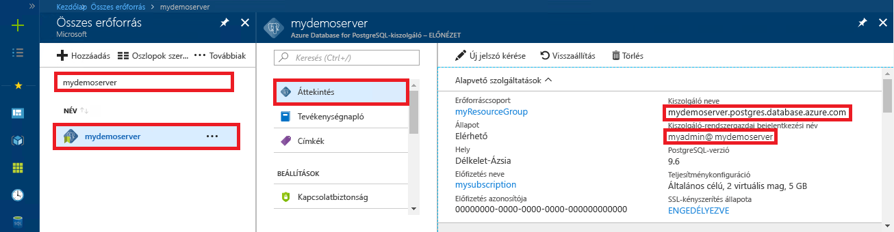

# <a name="azure-database-for-postgresql-use-ruby-to-connect-and-query-data"></a>A PostgreSQL-hez készült Azure Database: csatlakozás és adatlekérdezés a Ruby használatával
Ebben a gyors útmutatóban azt szemléltetjük, hogy miként lehet egy [Ruby](https://www.ruby-lang.org)-alkalmazás használatával csatlakozni a PostgreSQL-hez készült Azure Database-hez. Azt is bemutatja, hogyan lehet SQL-utasítások használatával adatokat lekérdezni, beszúrni, frissíteni és törölni az adatbázisban. A jelen cikkben ismertetett lépések feltételezik, hogy Ön rendelkezik fejlesztési tapasztalatokkal a Ruby használatával kapcsolatban, az Azure Database for PostgreSQL használatában pedig még járatlan.

## <a name="prerequisites"></a>Előfeltételek
A rövid útmutató az alábbi útmutatók valamelyikében létrehozott erőforrásokat használja kiindulópontként:
- [DB létrehozása – portál](quickstart-create-server-database-portal.md)
- [DB létrehozása – Azure CLI](quickstart-create-server-database-azure-cli.md)

## <a name="install-ruby"></a>A Ruby telepítése
Telepítse a Rubyt saját számítógépén. 

### <a name="windows"></a>Windows
- Töltse le, és telepítse a [Ruby](http://rubyinstaller.org/downloads/) legújabb verzióját.
- Az MSI telepítő befejező képernyőjén jelölje be a „Run 'ridk install' to install MSYS2 and development toolchain” (A ridk install parancs futtatása az MSYS2 és a fejlesztési eszközlánc telepítéséhez) jelölőnégyzetet. Kattintson a **Befejezés** gombra a következő telepítő elindításához.
- Ekkor elindul l aRubyInstaller2 for Windows telepítője. Az MSYS2-adattárfrissítés telepítéséhez nyomja le a 2 billentyűt. Miután befejeződik a telepítés, és visszatér a telepítő parancssorába, zárja be a parancssor ablakát.
- Nyisson meg egy új parancssort (cmd) a Start menüből.
- Ellenőrizze a Ruby-telepítés sikerességét a telepített verzió megtekintésével: `ruby -v`.
- Ellenőrizze a Gem-telepítés sikerességét a telepített verzió megtekintésével: `gem -v`.
- A következő parancs futtatásával készítse el a PostgreSQL-modult a Ruby-hoz a Gem használatával: `gem install pg`.

### <a name="macos"></a>MacOS
- A következő parancs futtatásával telepítse a Rubyt a Homebrew használatával: `brew install ruby`. A további telepítési lehetőségekről a Ruby [telepítési dokumentációjából](https://www.ruby-lang.org/en/documentation/installation/#homebrew) tájékozódhat
- Ellenőrizze a Ruby-telepítés sikerességét a telepített verzió megtekintésével: `ruby -v`.
- Ellenőrizze a Gem-telepítés sikerességét a telepített verzió megtekintésével: `gem -v`.
- A következő parancs futtatásával készítse el a PostgreSQL-modult a Ruby-hoz a Gem használatával: `gem install pg`.

### <a name="linux-ubuntu"></a>Linux (Ubuntu)
- A következő parancs futtatásával telepítse a Rubyt: `sudo apt-get install ruby-full`. A további telepítési lehetőségekről a Ruby [telepítési dokumentációjából](https://www.ruby-lang.org/en/documentation/installation/) tájékozódhat.
- Ellenőrizze a Ruby-telepítés sikerességét a telepített verzió megtekintésével: `ruby -v`.
- Telepítse a legújabb Gem-frissítéseket a következő parancs futtatásával: `sudo gem update --system`.
- Ellenőrizze a Gem-telepítés sikerességét a telepített verzió megtekintésével: `gem -v`.
- A következő parancs futtatásával telepítse a gcc, a make és az egyéb összeállítási eszközöket: `sudo apt-get install build-essential`.
- Telepítése a PostgreSQL-kódtárakat a `sudo apt-get install libpq-dev` parancs futtatásával.
- Hozza létre a Ruby pg modult a Gem használatával a `sudo gem install pg` parancs futtatásával.

## <a name="run-ruby-code"></a>Ruby-kód futtatása 
- Mentse a kódot egy szövegfájlba .rb kiterjesztéssel, és mentse a fájlt egy projektmappába (például: `C:\rubypostgres\read.rb` vagy `/home/username/rubypostgres/read.rb`)
- A kód futtatásához nyissa meg a parancssort vagy a bash rendszerhéjat. Lépjen a projektmappába a `cd rubypostgres` paranccsal, majd írja be a `ruby read.rb` parancsot az alkalmazás futtatásához.

## <a name="get-connection-information"></a>Kapcsolatadatok lekérése
Kérje le a PostgreSQL-hez készült Azure-adatbázishoz való csatlakozáshoz szükséges kapcsolatadatokat. Szüksége lesz a teljes kiszolgálónévre és a bejelentkezési hitelesítő adatokra.

1. Jelentkezzen be az [Azure portálra](https://portal.azure.com/).
2. Az Azure Portal bal oldali menüjében kattintson a **Minden erőforrás** lehetőségre, és keressen rá a létrehozott kiszolgálóra (például **mydemoserver**).
3. Kattintson a kiszolgálónévre.
4. A kiszolgáló **Áttekintés** paneléről jegyezze fel a **Kiszolgálónevet** és a **Kiszolgáló-rendszergazdai bejelentkezési nevet**. Ha elfelejti a jelszavát, ezen a panelen új jelszót is tud kérni.
 

## <a name="connect-and-create-a-table"></a>Csatlakozás és tábla létrehozása
A következő kód segítségével csatlakozzon, és hozzon létre egy táblát a **CREATE TABLE** SQL-utasítással, majd az **INSERT INTO** SQL-utasítással adjon hozzá sorokat a táblához.

A kód egy [PG::Connection](http://www.rubydoc.info/gems/pg/PG/Connection) objektumot használ a [new()](http://www.rubydoc.info/gems/pg/PG%2FConnection:initialize) konstruktorral a PostgreSQL-hez készült Azure Database-hez való kapcsolódáshoz. Ezután meghívja az [exec()](http://www.rubydoc.info/gems/pg/PG/Connection#exec-instance_method) metódust a DROP, CREATE TABLE és INSERT INTO parancsok futtatásához. A kód a [PG::Error](http://www.rubydoc.info/gems/pg/PG/Error) osztály használatával ellenőrzi a hibákat. Végül pedig a [close()](http://www.rubydoc.info/gems/pg/PG/Connection#lo_close-instance_method) metódus meghívásával bontja a kapcsolatot, mielőtt kilép.

Cserélje le a `host`, `database`, `user`, és `password` karakterláncokat a saját értékekre. 
```ruby
require 'pg'

begin
    # Initialize connection variables.
    host = String('mydemoserver.postgres.database.azure.com')
    database = String('postgres')
    user = String('mylogin@mydemoserver')
    password = String('<server_admin_password>')

    # Initialize connection object.
    connection = PG::Connection.new(:host => host, :user => user, :dbname => database, :port => '5432', :password => password)
    puts 'Successfully created connection to database'

    # Drop previous table of same name if one exists
    connection.exec('DROP TABLE IF EXISTS inventory;')
    puts 'Finished dropping table (if existed).'

    # Drop previous table of same name if one exists.
    connection.exec('CREATE TABLE inventory (id serial PRIMARY KEY, name VARCHAR(50), quantity INTEGER);')
    puts 'Finished creating table.'

    # Insert some data into table.
    connection.exec("INSERT INTO inventory VALUES(1, 'banana', 150)")
    connection.exec("INSERT INTO inventory VALUES(2, 'orange', 154)")
    connection.exec("INSERT INTO inventory VALUES(3, 'apple', 100)")
    puts 'Inserted 3 rows of data.'

rescue PG::Error => e
    puts e.message 
    
ensure
    connection.close if connection
end
```

## <a name="read-data"></a>Adatok olvasása
Az alábbi kód használatával csatlakozhat és végezheti el az adatok olvasását **SELECT** SQL-utasítás segítségével. 

A kód egy [PG::Connection](http://www.rubydoc.info/gems/pg/PG/Connection) objektumot használ a [new()](http://www.rubydoc.info/gems/pg/PG%2FConnection:initialize) konstruktorral a PostgreSQL-hez készült Azure Database-hez való kapcsolódáshoz. Ezután meghívja az [exec()](http://www.rubydoc.info/gems/pg/PG/Connection#exec-instance_method) metódust a SELECT parancs futtatásához, az eredményeket az eredményhalmazban megőrizve. Az eredményhalmaz gyűjtése többször is végrehajtódik a `resultSet.each do` ciklus használatával, megőrizve az aktuális sor értékeit a `row` változóban. A kód a [PG::Error](http://www.rubydoc.info/gems/pg/PG/Error) osztály használatával ellenőrzi a hibákat. Végül pedig a [close()](http://www.rubydoc.info/gems/pg/PG/Connection#lo_close-instance_method) metódus meghívásával bontja a kapcsolatot, mielőtt kilép.

Cserélje le a `host`, `database`, `user`, és `password` karakterláncokat a saját értékekre. 

```ruby
require 'pg'

begin
    # Initialize connection variables.
    host = String('mydemoserver.postgres.database.azure.com')
    database = String('postgres')
    user = String('mylogin@mydemoserver')
    password = String('<server_admin_password>')

    # Initialize connection object.
    connection = PG::Connection.new(:host => host, :user => user, :database => dbname, :port => '5432', :password => password)
    puts 'Successfully created connection to database.'

    resultSet = connection.exec('SELECT * from inventory;')
    resultSet.each do |row|
        puts 'Data row = (%s, %s, %s)' % [row['id'], row['name'], row['quantity']]
    end

rescue PG::Error => e
    puts e.message 
    
ensure
    connection.close if connection
end
```

## <a name="update-data"></a>Adatok frissítése
Az alábbi kód használatával csatlakozhat és végezheti el az adatok módosítását egy **UPDATE** SQL-utasítás segítségével.

A kód egy [PG::Connection](http://www.rubydoc.info/gems/pg/PG/Connection) objektumot használ a [new()](http://www.rubydoc.info/gems/pg/PG%2FConnection:initialize) konstruktorral a PostgreSQL-hez készült Azure Database-hez való kapcsolódáshoz. Ezután meghívja az [exec()](http://www.rubydoc.info/gems/pg/PG/Connection#exec-instance_method) metódust az UPDATE parancs futtatásához. A kód a [PG::Error](http://www.rubydoc.info/gems/pg/PG/Error) osztály használatával ellenőrzi a hibákat. Végül pedig a [close()](http://www.rubydoc.info/gems/pg/PG/Connection#lo_close-instance_method) metódus meghívásával bontja a kapcsolatot, mielőtt kilép.

Cserélje le a `host`, `database`, `user`, és `password` karakterláncokat a saját értékekre. 

```ruby
require 'pg'

begin
    # Initialize connection variables.
    host = String('mydemoserver.postgres.database.azure.com')
    database = String('postgres')
    user = String('mylogin@mydemoserver')
    password = String('<server_admin_password>')

    # Initialize connection object.
    connection = PG::Connection.new(:host => host, :user => user, :dbname => database, :port => '5432', :password => password)
    puts 'Successfully created connection to database.'

    # Modify some data in table.
    connection.exec('UPDATE inventory SET quantity = %d WHERE name = %s;' % [200, '\'banana\''])
    puts 'Updated 1 row of data.'

rescue PG::Error => e
    puts e.message 
    
ensure
    connection.close if connection
end
```


## <a name="delete-data"></a>Adat törlése
Az alábbi kód használatával csatlakozhat és végezheti el az adatok olvasását **DELETE** SQL-utasítás segítségével. 

A kód egy [PG::Connection](http://www.rubydoc.info/gems/pg/PG/Connection) objektumot használ a [new()](http://www.rubydoc.info/gems/pg/PG%2FConnection:initialize) konstruktorral a PostgreSQL-hez készült Azure Database-hez való kapcsolódáshoz. Ezután meghívja az [exec()](http://www.rubydoc.info/gems/pg/PG/Connection#exec-instance_method) metódust az UPDATE parancs futtatásához. A kód a [PG::Error](http://www.rubydoc.info/gems/pg/PG/Error) osztály használatával ellenőrzi a hibákat. Végül pedig a [close()](http://www.rubydoc.info/gems/pg/PG/Connection#lo_close-instance_method) metódus meghívásával bontja a kapcsolatot, mielőtt kilép.

Cserélje le a `host`, `database`, `user`, és `password` karakterláncokat a saját értékekre. 

```ruby
require 'pg'

begin
    # Initialize connection variables.
    host = String('mydemoserver.postgres.database.azure.com')
    database = String('postgres')
    user = String('mylogin@mydemoserver')
    password = String('<server_admin_password>')

    # Initialize connection object.
    connection = PG::Connection.new(:host => host, :user => user, :dbname => database, :port => '5432', :password => password)
    puts 'Successfully created connection to database.'

    # Modify some data in table.
    connection.exec('DELETE FROM inventory WHERE name = %s;' % ['\'orange\''])
    puts 'Deleted 1 row of data.'

rescue PG::Error => e
    puts e.message 
    
ensure
    connection.close if connection
end
```

## <a name="next-steps"></a>További lépések
> [!div class="nextstepaction"]
> [Adatbázis migrálása exportálással és importálással](./howto-migrate-using-export-and-import.md)
