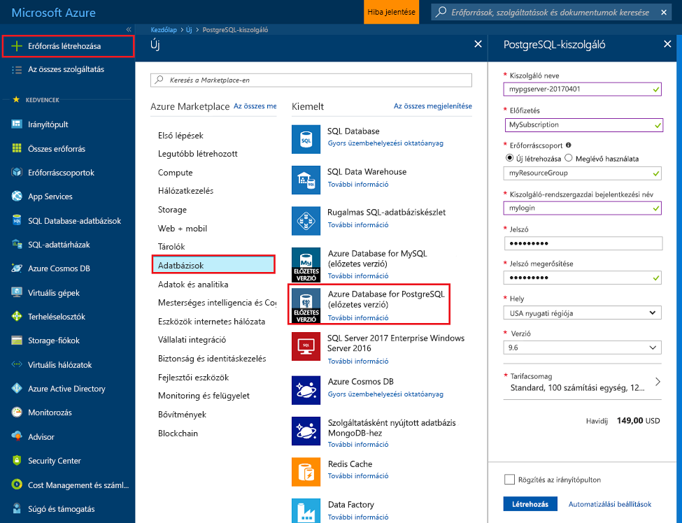
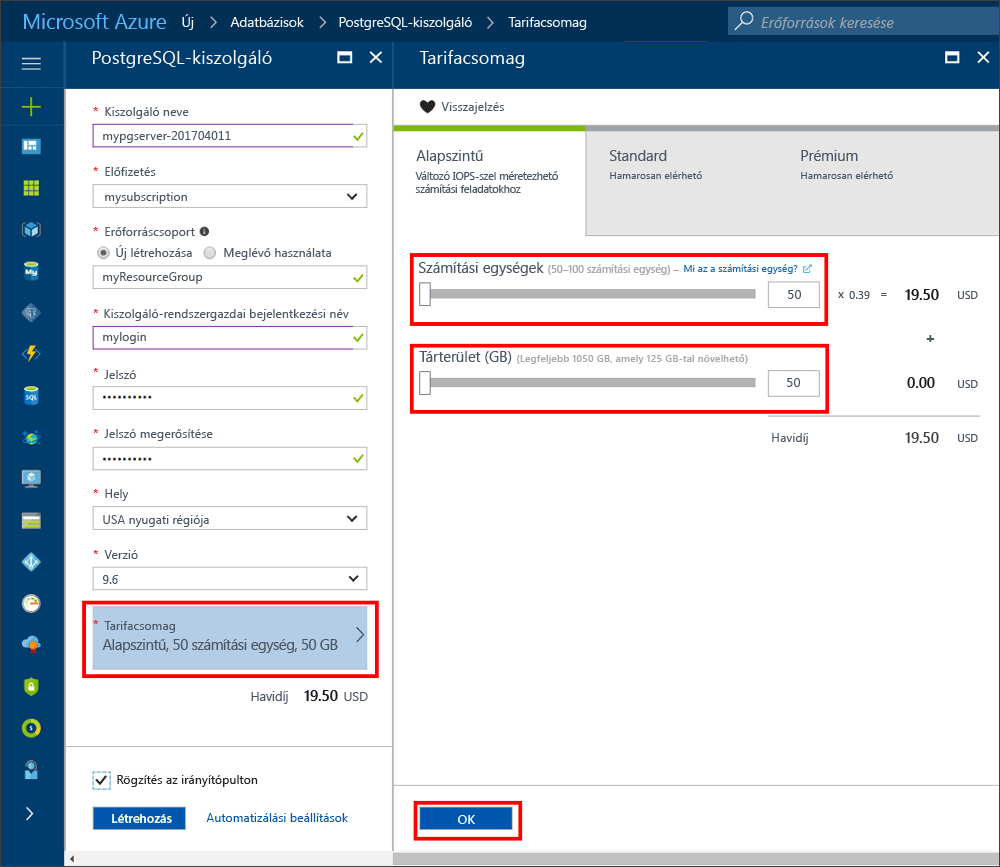
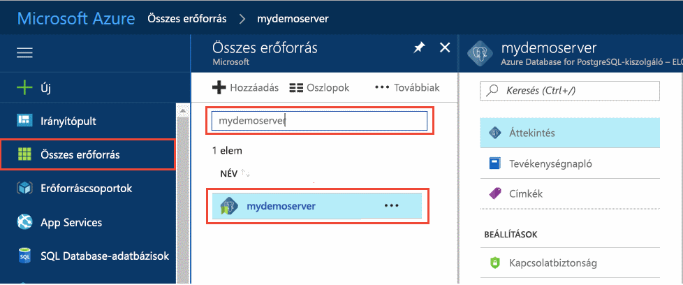
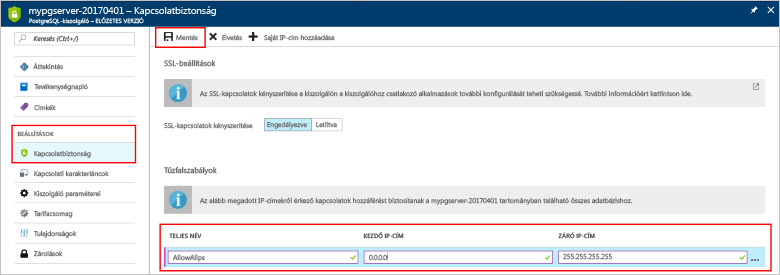
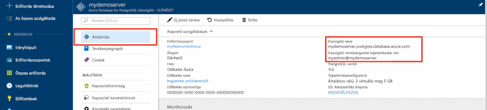
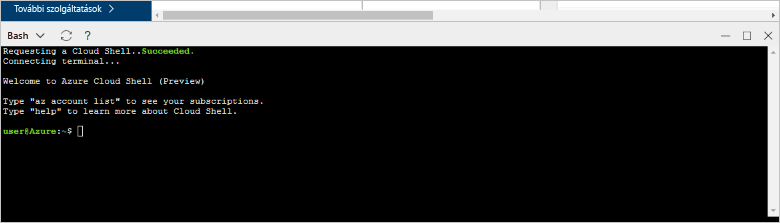
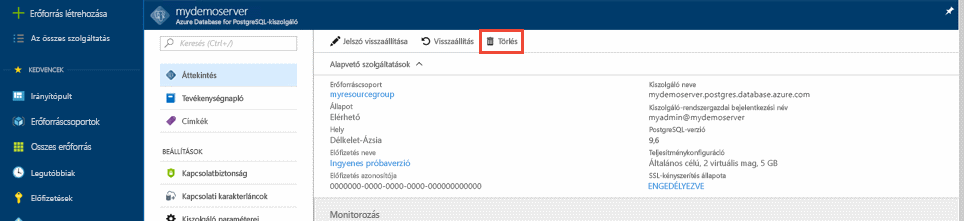

# <a name="create-an-azure-database-for-postgresql-server-in-the-azure-portal"></a>Egy PostgreSQL-kiszolgálóhoz tartozó Azure-adatbázis létrehozása az Azure-portálon

Azure PostgreSQL-adatbázishoz egy felügyelt szolgáltatás, amellyel futtatásához, kezelése és a felhőben magas rendelkezésre állású PostgreSQL-adatbázisok méretezése. A gyors üzembe helyezés bemutatja, hogyan hozzon létre egy PostgreSQL-kiszolgálóhoz tartozó Azure-adatbázis körülbelül öt perc alatt az Azure portál használatával.

Ha nem rendelkezik Azure-előfizetéssel, mindössze néhány perc alatt létrehozhat egy [ingyenes Azure-fiókot](https://azure.microsoft.com/free/) a virtuális gép létrehozásának megkezdése előtt.

## <a name="sign-in-to-the-azure-portal"></a>Jelentkezzen be az Azure Portalra
Nyissa meg a webböngészőt, és navigáljon a [portal](https://portal.azure.com/). Adja meg a hitelesítő adatait a Portalra való bejelentkezéshez. Az alapértelmezett nézet a szolgáltatási irányítópult.

## <a name="create-an-azure-database-for-postgresql-server"></a>Azure-adatbázis létrehozása PostgreSQL-kiszolgálóhoz

Az Azure-adatbázis PostgreSQL-kiszolgálóhoz [számítási és tárolási erőforrások](./concepts-compute-unit-and-storage.md) egy meghatározott készletével együtt jön létre. A kiszolgáló egy [Azure-erőforráscsoporton](../azure-resource-manager/resource-group-overview.md) belül jön létre.

Egy PostgreSQL-kiszolgálóhoz tartozó Azure-adatbázis létrehozásához tegye a következőket:
1. A portál bal felső sarkában válassza az **Új** (+) gombot.

2. Válassza ki **adatbázisok** > **Azure PostgreSQL-adatbázishoz**.

    

3. Töltse ki az új kiszolgáló adatainak űrlapját az alábbi információkkal az előző képen látható módon:

    Beállítás|Ajánlott érték|Leírás
    ---|---|---
    Kiszolgálónév |*mypgserver-20170401*|Egy egyedi nevet, amely azonosítja az Azure-adatbázis PostgreSQL-kiszolgáló. A tartománynév *postgres.database.azure.com* a kiszolgáló nevét, adja meg a rendszer hozzáfűzi. A kiszolgáló csak kisbetűket, számokat és a kötőjel (-) karaktert tartalmazhat. Legalább 3 és 63 karakter közötti hosszúságú kell tartalmaznia.
    Előfizetés|Az Ön előfizetése|Az Azure-előfizetés a kiszolgálóval használni kívánt. Ha több előfizetéssel rendelkezik, válassza ki az előfizetést, amelyben Ön díjon számlázzuk az erőforrás.
    Erőforráscsoport|*myresourcegroup*| Új erőforráscsoport-nevet vagy egy meglévő az előfizetésből.
    Kiszolgáló-rendszergazdai bejelentkezés |*mylogin*| A saját bejelentkezési fiókot használja a kiszolgálóhoz való csatlakozás. A rendszergazdai bejelentkezési név nem lehet **azure_superuser,** **azure_pg_admin,** **admin,** **rendszergazda,** **legfelső szintű vagy** **Vendég,** vagy **nyilvános.** És nem kezdődhet **pg_**.
    Jelszó |A választása szerint | Egy új jelszó a kiszolgálói rendszergazdai fiók számára. 8–128 karakter hosszúságú lehet. A jelszó az alábbiak közül hármat tartalmaznia kell: angol nagybetűk, angol ábécé kisbetűi, számok (0 – 9), és nem alfanumerikus karakterek (!, $, #, %, stb.).
    Hely|A felhasználók a legközelebb eső régiót| A felhasználók a legközelebb eső helyet.
    PostgreSQL-verzió|A legújabb verzióra| A legújabb verzióra, hacsak nem rendelkezik konkrét követelmények.
    Tarifacsomag | **Alapszintű**, **50 számítási egység**, **50 GB** | Az új adatbázis szolgáltatás- és teljesítményszintje. Válassza ki **tarifacsomag**. Ezután válassza ki a **alapvető** fülre. Válassza ki a bal oldali vége a **számítási egység** érhető el a legkisebb értéket úgy, hogy a gyors üzembe helyezés a csúszkát. A tarifacsomag kiválasztása mentéséhez válasszon **OK**. További információkért tekintse meg a következő képernyőképet. 
    Rögzítés az irányítópulton | Jelölőnégyzet | Az első irányítópult-oldalon a portál a kiszolgáló egyszerű követését teszi lehetővé.

    > [!IMPORTANT]
    > A kiszolgáló-rendszergazdai bejelentkezés és a jelszót, az itt megadott jelentkezzen be a kiszolgáló és az adatbázisok későbbi szakaszában a gyors üzembe helyezés szükségesek. Jegyezze meg vagy jegyezze fel ezt az információt későbbi használatra.

    

4. A kiszolgáló üzembe helyezéséhez válassza a **Létrehozás** lehetőséget. Az üzembe helyezés akár 20 percet is igénybe vehet.

5. Az eszköztáron válassza a **értesítések** szimbólum a telepítési folyamat figyelését.

    
   
  Alapértelmezés szerint egy **postgres** adatbázis létrehozása a kiszolgálón. A [postgres](https://www.postgresql.org/docs/9.6/static/app-initdb.html) egy alapértelmezett adatbázis, amely a felhasználók, segédprogramok vagy harmadik féltől származó alkalmazások használatra jelent. 

## <a name="configure-a-server-level-firewall-rule"></a>Kiszolgálószintű tűzfalszabály konfigurálása

Azure PostgreSQL-adatbázishoz egy tűzfal a kiszolgáló szintjén hoz létre. Megakadályozza, hogy külső alkalmazások és eszközök csatlakozzanak a kiszolgáló és az összes adatbázis a kiszolgálón, kivéve, ha létrehoz egy szabályt a tűzfalat a megadott IP-címek megnyitásához. 

1. Az üzembe helyezés végeztével keresse meg a kiszolgálót. Ha szükséges, használja a keresési funkciót. A bal oldali menüben válassza ki például **összes erőforrás**. Adja meg a kiszolgáló nevét, például a példában **mypgserver-20170401**, az újonnan létrehozott kiszolgáló kereséséhez. A keresési eredmények listájáról válassza ki a kiszolgáló nevét. Megnyílik a kiszolgáló **Áttekintés** oldala, amely további konfigurációs lehetőségeket biztosít.
 
    

2. A kiszolgáló lapján válassza a **Kapcsolatbiztonság** elemet.

    

3. Az a **tűzfal-szabályok** fejléc a a **szabály neve** oszlopból válassza ki a üres szövegmezőben a tűzfalszabály létrehozásának megkezdéséhez. 

    A gyors üzembe helyezés, a most hagyjon összes IP-címet az a kiszolgálóra. Töltse ki a szövegmezőben az egyes oszlopok a következő értékekkel:

    Szabály neve | Kezdő IP-cím | Záró IP-cím 
    ---|---|---
    AllowAllIps | 0.0.0.0 | 255.255.255.255

4. A **Kapcsolatbiztonság** lap felső eszköztárában kattintson a **Mentés** gombra. Várjon, amíg az értesítés jelenik meg, hogy a kapcsolat biztonsági frissítés sikeresen befejeződött a folytatás előtt.

    > [!NOTE]
    > A PostgreSQL-kiszolgálóhoz készült Azure-adatbázis kapcsolatai az 5432-es porton keresztül kommunikálnak. Ha megpróbál kapcsolódni a vállalati hálózaton belül, a hálózati tűzfal előfordulhat, hogy nem engedélyezett a port 5432 kimenő forgalmát. Ha igen, akkor a kiszolgáló nem csatlakozik, kivéve, ha az IT-részleg 5432 portot nyit meg.
    >

## <a name="get-the-connection-information"></a>Kapcsolatadatok lekérése

A PostgreSQL-kiszolgálóhoz tartozó Azure-adatbázis létrehozásakor az alapértelmezett adatbázis nevű **postgres** jön létre. Az adatbázis-kiszolgáló csatlakozni kell a teljes kiszolgáló nevét és a rendszergazdai bejelentkezési hitelesítő adatokat. Ezeket a rövid útmutatóban korábban már feljegyezhette. Ha nem, könnyedén megtalálhatja a kiszolgáló nevét és a bejelentkezési adatok a kiszolgáló **áttekintése** oldal a portálon.

Nyissa meg kiszolgáló **Áttekintés** lapját. Jegyezze fel a **kiszolgálónév** és a **kiszolgálói rendszergazda bejelentkezési név**. A kurzorral rámutat minden mező, és a példány szimbólum jelenik meg a szöveg jobb. Szükség esetén az értékek másolásához, jelölje ki a példány szimbólumot.

 

## <a name="connect-to-the-postgresql-database-by-using-psql-in-cloud-shell"></a>Csatlakozás a PostgreSQL-adatbázisból psql felhő rendszerhéj használatával

Számos különféle alkalmazással csatlakozhat a PostgreSQL-kiszolgálóhoz készült Azure-adatbázishoz. Először használjuk a psql parancssori segédprogramot a kiszolgálóhoz való csatlakozás bemutatásához. Segítségével egy webböngésző és az Azure felhőalapú rendszerhéj itt leírtak nem kell további szoftvereket telepíteniük. Ha a gépén helyileg telepítve van a psql segédprogram, onnan is csatlakozhat.

1. A felső navigációs ablaktáblán válassza ki a Terminálszolgáltatások szimbólum felhő rendszerhéj megnyitásához.

   

2. Felhő rendszerhéj megnyitása a böngészőben, ahová beírhatja a Bash rendszerhéjat parancsok.

   

3. A felhő rendszerhéj parancssorba írja be a psql parancssori kapcsolódás az Azure-adatbázis PostgreSQL-kiszolgáló-adatbázishoz.

    Egy PostgreSQL-kiszolgáló az Azure-adatbázishoz való kapcsolódáshoz a [psql](https://www.postgresql.org/docs/9.6/static/app-psql.html) segédprogram, használja a következő formátumot:
    ```bash
    psql --host=<yourserver> --port=<port> --username=<server admin login> --dbname=<database name>
    ```

    Például a következő parancs egy példakiszolgálóhoz csatlakozik:

    ```bash
    psql --host=mypgserver-20170401.postgres.database.azure.com --port=5432 --username=mylogin@mypgserver-20170401 --dbname=postgres
    ```

    psql paraméter |Ajánlott érték|Leírás
    ---|---|---
    --host | Kiszolgálónév | A kiszolgáló név-érték, amelyet korábban PostgreSQL-kiszolgáló az Azure-adatbázis létrehozásakor használt. A példa kiszolgáló látható **mypgserver-20170401.postgres.database.azure.com.** A teljesen minősített tartománynevét használja (**\*. postgres.database.azure.com**) a példában látható módon. Ha nem emlékszik a kiszolgáló nevére, a kapcsolati adatok lekéréséhez kövesse az előző szakasz lépéseit. 
    --port | 5432 | Az Azure-adatbázishoz PostgreSQL-kiszolgálóhoz való csatlakozáskor használandó portot. 
    --username | Server admin bejelentkezési név |A kiszolgáló rendszergazdai bejelentkezési felhasználónevének korábbi PostgreSQL-kiszolgáló az Azure-adatbázis létrehozásakor megadott. Ha nem emlékszik a felhasználónév, kövesse az előző szakaszban, a kapcsolat adatainak megszerzése. A formátum *username@servername*.
    --dbname | *postgres* | Alapértelmezés szerint a rendszer adatbázis neve, amely az első kapcsolat jött létre. Később a saját adatbázis létrehozása.

    A saját paraméterértékekkel a psql parancs futtatása után felkéri adja meg a kiszolgáló rendszergazdai jelszavát. Ez a jelszó nem azonos a kiszolgáló létrehozásakor megadott. 

    psql paraméter |Ajánlott érték|Leírás
    ---|---|---
    jelszó | A rendszergazdai jelszó | A beírt jelszó karakterek nem látható a bash megkötéseket. Miután beírta a karakterek, válassza ki a **Enter** kulcsot a hitelesítéshez és csatlakozáshoz.

    Miután csatlakozott, a psql segédprogram sql-parancsok írhatja postgres kérdés megjelenítése. A kezdeti kapcsolat kimenet figyelmeztetés jelenhet, mert a felhő rendszerhéj psql lehet, hogy az Azure-adatbázishoz a PostgreSQL-kiszolgáló verziója eltérő verzióval. 
    
    Példa psql kimenetre:
    ```bash
    psql (9.5.7, server 9.6.2)
    WARNING: psql major version 9.5, server major version 9.6.
        Some psql features might not work.
    SSL connection (protocol: TLSv1.2, cipher: ECDHE-RSA-AES256-SHA384, bits: 256, compression: off)
    Type "help" for help.
   
    postgres=> 
    ```

    > [!TIP]
    > Ha a tűzfal beállításai nem engedélyezik a felhő rendszerhéj IP-címét, a következő hiba történt:
    > 
    > "psql: súlyos hiba: pg_hba.conf bejegyzés állomás"138.91.195.82"felhasználó"mylogin", adatbázis-"postgres", a végzetes SSL: SSL-kapcsolatra szükség. Adja meg az SSL-beállításokat, és próbálja meg újra.
    > 
    > A hiba elhárításához győződjön meg arról, hogy a kiszolgáló konfigurációja megfelel az "Egy kiszolgálószintű tűzfalszabály konfigurálása" című szakaszát lépéseit.

4. Hozzon létre egy üres adatbázist a következő parancs beírásával a parancssorba:
    ```bash
    CREATE DATABASE mypgsqldb;
    ```
    A parancs eltarthat néhány percig. 

5. A parancssorból, hajtsa végre a következő parancsot kapcsolatok váltson át az újonnan létrehozott adatbázis **mypgsqldb**:
    ```bash
    \c mypgsqldb
    ```

6. Típus `\q`, majd válassza ki a **Enter** kulcs psql kilép. Amikor befejezte a felhő rendszerhéj bezárható.

Most, hogy csatlakozik ahhoz az Azure-adatbázishoz PostgreSQL-kiszolgáló, és létrehozott egy üres felhasználói adatbázisból. Folytassa a következő szakasz egy másik közös eszközt, pgAdmin használatával történő kapcsolódást.

## <a name="connect-to-the-postgresql-database-by-using-pgadmin"></a>PgAdmin használatával kapcsolódik a PostgreSQL-adatbázishoz

Csatlakozás az Azure PostgreSQL-kiszolgálóhoz a grafikus felhasználói Felülettel eszköz pgAdmin:
1. Indítsa el a pgAdmin alkalmazást az ügyfélszámítógépen. A pgAdmin telepítése a [pgAdmin webhely](http://www.pgadmin.org/).

2. Az irányítópult-oldalon a a **Gyorshivatkozások** szakaszban jelölje be a **új kiszolgáló hozzáadása** szimbólum.

3. Az a **- kiszolgáló létrehozása** párbeszédpanel a **általános** lapra, adja meg egy egyedi nevet a kiszolgáló, például **Azure PostgreSQL Server**.

    

4. Az a **- kiszolgáló létrehozása** párbeszédpanel a **kapcsolat** lapon megadott beállítások használatát, és válassza ki **mentése**.

   

    pgAdmin-paraméter |Ajánlott érték|Leírás
    ---|---|---
    Gazdagépnév/-cím | Kiszolgálónév | A kiszolgáló név-érték, amelyet korábban PostgreSQL-kiszolgáló az Azure-adatbázis létrehozásakor használt. A példa kiszolgáló **mypgserver-20170401.postgres.database.azure.com.** A teljesen minősített tartománynevét használja (**\*. postgres.database.azure.com**) a példában látható módon. Ha nem emlékszik a kiszolgáló nevére, a kapcsolati adatok lekéréséhez kövesse az előző szakasz lépéseit. 
    Port | 5432 | Az Azure-adatbázishoz PostgreSQL-kiszolgálóhoz való csatlakozáskor használandó portot. 
    Karbantartási adatbázis | *postgres* | Az alapértelmezett a rendszer adatbázis neve.
    Felhasználónév | Server admin bejelentkezési név | A kiszolgáló rendszergazdai bejelentkezési felhasználónevének korábbi PostgreSQL-kiszolgáló az Azure-adatbázis létrehozásakor megadott. Ha nem emlékszik a felhasználónévre, a kapcsolati adatok lekéréséhez kövesse az előző szakasz lépéseit. A formátum *username@servername*.
    Jelszó | A rendszergazdai jelszó | A jelszó úgy döntött, hogy a gyors üzembe helyezés során korábban küldje el a kiszolgáló létrehozásakor.
    Szerepkör | Hagyja üresen | Adjon meg egy szerepkör ezen a ponton szükség van. Hagyja üresen ezt a mezőt.
    SSL-mód | Szükséges | Alapértelmezés szerint minden Azure PostgreSQL-kiszolgáló SSL-titkosítással jönnek létre történt-e kapcsolva. Kapcsolja ki a SSL kényszerítése, lásd: [kényszerítése SSL](./concepts-ssl-connection-security.md).
    
5. Kattintson a **Mentés** gombra.

6. Az a **böngésző** a bal oldali ablaktáblán bontsa ki a **kiszolgálók** csomópont. Válassza ki például a kiszolgáló **Azure PostgreSQL Server**. Kattintson a csatlakozáshoz.

7. Bontsa ki a kiszolgáló-csomópontot, majd bontsa ki az abban található **Adatbázisok** csomópontot is. A lista tartalmazza a meglévő *postgres* adatbázis és minden új felhasználói adatbázis, mint például **mypgsqldb**, amely az előző szakaszban létrehozott. Figyelje meg, hogy létrehozhat egy kiszolgálón több adatbázis az Azure Database PostgreSQL.

8. Kattintson a jobb gombbal **adatbázisok**, válassza ki a **létrehozása** menüben, majd válassza ki **adatbázis**.

9. Írja be az Ön által választott, az adatbázis nevét a **adatbázis** mezőjét, többek között **mypgsqldb**, a példában látható módon.

10. Válassza ki a **tulajdonos** az adatbázis, a legördülő listából. Válassza ki a kiszolgáló rendszergazdai bejelentkezési nevet, például a példában **mylogin**.

11. Válassza ki **mentése** egy új, üres adatbázis létrehozásához.

12. Az a **böngésző** ablaktáblában tekintse meg az adatbázis létrehozott adatbázisok listája alatt a kiszolgáló nevét.

    


## <a name="clean-up-resources"></a>Az erőforrások eltávolítása
Törölheti is az erőforrásokat, amelyek a gyors üzembe helyezés, az alábbi két módszer egyikével létrehozott. Törölheti az [Azure-erőforráscsoportot](../azure-resource-manager/resource-group-overview.md), amely tartalmazza az erőforráscsoportban lévő összes erőforrást. Ha szeretne további erőforrásokat módosulna, csak az önálló kiszolgáló erőforrás törlése.

> [!TIP]
> Az ebben a gyűjteményben található többi rövid útmutató erre a rövid útmutatóra épül. Ha azt tervezi, hogy folytatja ezen rövid útmutatók használatát, akkor ne törölje az ebben a rövid útmutatóban létrehozott erőforrásokat. Ha nem kívánja folytatni, kövesse az alábbi lépéseket törli az erőforrást, amelyet a gyors üzembe helyezés, a portálon.

A teljes erőforráscsoport, beleértve az újonnan létrehozott kiszolgáló törlése:
1. Keresse meg az erőforráscsoport a portálon. A bal oldali menüben válassza ki a **erőforráscsoportok**. Válassza ki például a példában az erőforráscsoport neve **myresourcegroup**.

2. Az erőforráscsoport oldalán kattintson a **Törlés** parancsra. Írja be például a példában az erőforráscsoport nevét **myresourcegroup**, a törlés megerősítéséhez szövegmezőben. Válassza a **Törlés** elemet.

Csak az újonnan létrehozott kiszolgáló törlése:
1. Keresse meg a kiszolgáló a portálon, ha még nincs megnyitva. A bal oldali menüben válassza ki a **összes erőforrás**. Ezután keressen rá az Ön által létrehozott kiszolgálóra.

2. Az **Áttekintés** oldalon válassza a **Törlés** elemet.

    

3. Erősítse meg a törölni kívánt kiszolgáló nevét, és az érintett tartozó adatbázisok megtekintéséhez. A kiszolgáló nevét írják be a szövegmezőben, például a példában **mypgserver-20170401**. Válassza a **Törlés** elemet.

## <a name="next-steps"></a>Következő lépések
> [!div class="nextstepaction"]
> [Adatbázis migrálása exportálással és importálással](./howto-migrate-using-export-and-import.md)
