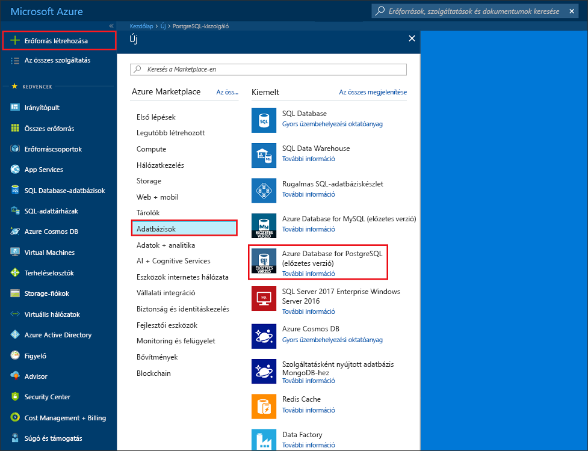
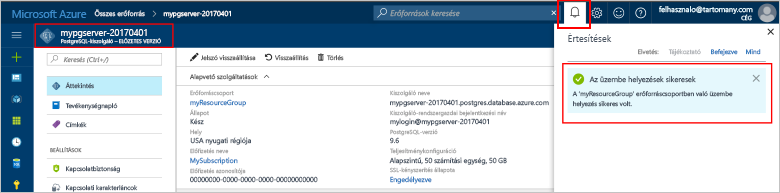
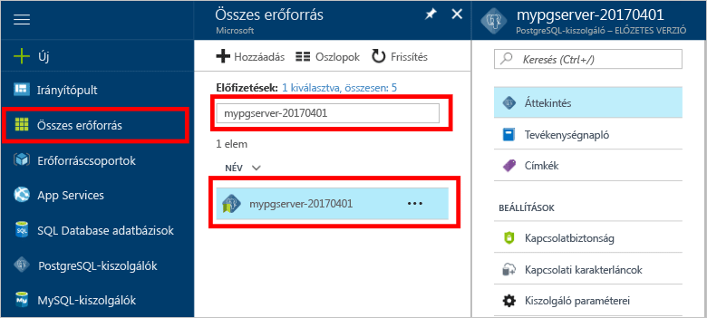
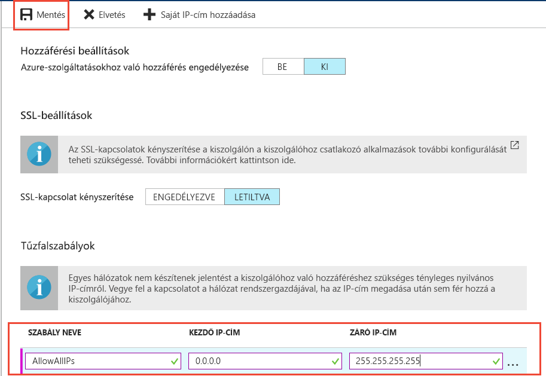

# <a name="design-your-first-azure-database-for-postgresql-using-the-azure-portal"></a>Az első Azure-adatbázis kialakítása a PostgreSQL az Azure portál használatával

A PostgreSQL-hez készült Azure Database felügyelt szolgáltatás, amely lehetővé teszi a magas rendelkezésre állású PostgreSQL-adatbázisok futtatását, kezelését és skálázását a felhőben. Az Azure portál használatával egyszerűen kezelheti a kiszolgálót, és egy adatbázis tervezése.

Ebben az oktatóanyagban, használja az Azure-portálon megtudhatja, hogyan:
> [!div class="checklist"]
> * Azure-adatbázis létrehozása PostgreSQL-hez
> * A kiszolgáló tűzfal konfigurálása
> * Használjon [ **psql** ](https://www.postgresql.org/docs/9.6/static/app-psql.html) segédprogramot az adatbázis létrehozása
> * Mintaadatok betöltése
> * Adatok lekérdezése
> * Adatok frissítése
> * Adatok visszaállítása

## <a name="prerequisites"></a>Előfeltételek
Ha nem rendelkezik Azure-előfizetéssel, első lépésként mindössze néhány perc alatt létrehozhat egy [ingyenes](https://azure.microsoft.com/free/) fiókot.

## <a name="log-in-to-the-azure-portal"></a>Jelentkezzen be az Azure portálra.
Jelentkezzen be az [Azure portálra](https://portal.azure.com).

## <a name="create-an-azure-database-for-postgresql"></a>Azure-adatbázis létrehozása PostgreSQL-hez

Az Azure-adatbázis PostgreSQL-kiszolgálóhoz [számítási és tárolási erőforrások](./concepts-compute-unit-and-storage.md) egy meghatározott készletével együtt jön létre. A kiszolgáló egy [Azure-erőforráscsoporton](../azure-resource-manager/resource-group-overview.md) belül jön létre.

Kövesse az alábbi lépéseket az Azure-adatbázis PostgreSQL-kiszolgálóhoz létrehozásához:
1.  Kattintson a **+ új** gomb az Azure portál bal felső sarkában található.
2.  Az **Új** panelen válassza az **Adatbázisok** lehetőséget, majd az **Adatbázisok** panelen válassza az **Azure-adatbázis PostgreSQL-kiszolgálóhoz** lehetőséget.
 

3.  Töltse ki az új kiszolgáló adatai űrlapot a következő információkkal az előző képen látható módon:
    - A kiszolgáló neve: **mypgserver-20170401** (a kiszolgáló neve leképez a DNS-névbe, ezért globálisan egyedinek kell lennie) 
    - Feliratkozás: Ha több előfizetéssel rendelkezik, válassza a megfelelő előfizetést, amelyen az erőforrás megtalálható vagy terhelve van.
    - Erőforráscsoport: **myresourcegroup**
    - Az Ön által választott kiszolgálói rendszergazdai bejelentkezési név és jelszó
    - Hely
    - PostgreSQL-verzió

  > [!IMPORTANT]
  > A kiszolgáló itt megadott rendszergazdai bejelentkezési nevét és jelszavát kell majd használnia a rövid útmutató későbbi szakaszaiban a kiszolgálóra és az adatbázisaira való bejelentkezéshez. Jegyezze meg vagy jegyezze fel ezt az információt későbbi használatra.

4.  Kattintson a **Tarifacsomag** parancsra az új adatbázis szolgáltatás- és teljesítményszintjének megadásához. Ehhez a rövid útmutatóhoz válassza az **Alapszintű** szolgáltatásszintet, **50 Számítási egységet**, és a szolgáltatási keretbe foglalt **50 GB** tárterületet.
 
5.  Kattintson az **OK** gombra.
6.  A kiszolgáló üzembe helyezéséhez kattintson a **Létrehozás** elemre. Az üzembe helyezés eltarthat néhány percig.

  > [!TIP]
  > A **Rögzítés az irányítópulton** lehetőséggel egyszerűen nyomon követheti az üzembe helyezést.

7.  Az eszköztáron kattintson az **Értesítések** parancsra az üzembe helyezési folyamat megfigyeléséhez.
 
   
  Alapértelmezés szerint a **postgres** adatbázis a kiszolgáló alatt jön létre. A [postgres](https://www.postgresql.org/docs/9.6/static/app-initdb.html) adatbázis egy alapértelmezett adatbázis, amelyet a felhasználók, segédprogramok és külső féltől származó alkalmazások általi használatra szántak. 

## <a name="configure-a-server-level-firewall-rule"></a>Kiszolgálószintű tűzfalszabály konfigurálása

Az Azure-adatbázis PostgreSQL-hez szolgáltatás a kiszolgáló szintjén hoz létre tűzfalat. Ez a tűzfal megakadályozza, hogy a külső alkalmazások és eszközök csatlakozzanak a kiszolgálóhoz vagy a kiszolgálón lévő adatbázisokhoz, kivéve, ha olyan tűzfalszabályt hoz létre, amely adott IP-címek számára megnyitja a tűzfalat. 

1.  Miután befejeződött a telepítés, kattintson az **Összes erőforrás** lehetőségre a bal oldali menüben, és írja be az újonnan létrehozott kiszolgáló nevét **mypgserver-20170401**. Kattintson a keresési eredményekben listázott kiszolgálónévre. Megnyílik a kiszolgáló **Áttekintés** oldala, amely további konfigurációs lehetőségeket biztosít.
 
 

2.  A kiszolgáló panelen válassza a **Kapcsolatbiztonság** elemet. 
3.  Kattintson a **Szabálynév** alatti szövegmezőbe, és adjon hozzá egy új tűzfalszabályt az IP-címtartomány összekapcsolhatóságának engedélyezéséhez. Ebben az oktatóanyagban most engedélyezése minden IP-címet írja be a **szabály neve = AllowAllIps**, **kezdő IP-= 0.0.0.0** és **záró IP-Címnél = 255.255.255.255** , majd **mentése** . Beállíthat egy olyan tűzfalszabályt, amely lefed egy IP-címtartományt, annak érdekében, hogy csatlakozni tudjon a saját hálózatából.
 
 

4.  Kattintson a **Mentés** gombra, majd kattintson az **X-re** a **Kapcsolatbiztonság** oldal bezárásához.

  > [!NOTE]
  > Azure PostgreSQL-kiszolgáló az 5432-es porton keresztül kommunikál. Ha vállalati hálózaton belülről próbál csatlakozni, elképzelhető, hogy a hálózati tűzfal nem engedélyezi a kimenő forgalmat az 5432-es porton keresztül. Ebben az esetben addig nem tud csatlakozni az Azure SQL Database-kiszolgálóhoz, amíg az informatikai részleg nem nyitja meg az 5432-es portot.
  >


## <a name="get-the-connection-information"></a>Kapcsolatadatok lekérése

Az Azure-adatbázis PostgreSQL-kiszolgálóhoz létrehozásakor, az alapértelmezett **postgres** adatbázis is létrejön. A kiszolgálóhoz való kapcsolódáshoz meg kell adnia a gazdagép adatait és a hozzáférési hitelesítő adatokat.

1. Az Azure Portal baloldali menüjében kattintson az **Összes erőforrás** lehetőségre, és keressen rá az újonnan létrehozott kiszolgálóra **mypgserver-20170401**.

  

3. Kattintson a **mypgserver-20170401** kiszolgálónévre.
4. Válassza ki a kiszolgáló **Áttekintés** oldalát. Jegyezze fel a **Kiszolgálónevet** és a **Kiszolgáló-rendszergazdai bejelentkezési nevet**.

 


## <a name="connect-to-postgresql-database-using-psql-in-cloud-shell"></a>Csatlakozás a PostgreSQL-adatbázishoz a psql használatával a Cloud Shell-ben

Használjuk a psql parancssori segédprogramot az Azure-adatbázis PostgreSQL-kiszolgálóhoz való kapcsolódáshoz. 
1. Indítsa el az Azure Cloud Shell-t a felső navigációs ablakban található terminálikonnal.

   

2. Az Azure Cloud Shell megnyílik a böngészőben, amely lehetővé teszi a bash-parancsok beírását.

   

3. A Cloud Shell parancssornál csatlakozzon az Azure-adatbázis PostgreSQL-kiszolgálóhoz a psql-parancsok használatával. A következő formátum segítségével kapcsolódhat egy [psql](https://www.postgresql.org/docs/9.6/static/app-psql.html) segédprogrammal rendelkező Azure-adatbázis PostgreSQL-kiszolgálóhoz:
   ```bash
   psql --host=<myserver> --port=<port> --username=<server admin login> --dbname=<database name>
   ```

   Például a következő parancs a **postgres** nevű alapértelmezett adatbázishoz kapcsolódik a PostgreSQL-kiszolgálón **mypgserver-20170401.postgres.database.azure.com** a hozzáférési hitelesítő adatok használatával. Adja meg a kiszolgáló-rendszergazdai jelszavát, amikor a rendszer kéri.

   ```bash
   psql --host=mypgserver-20170401.postgres.database.azure.com --port=5432 --username=mylogin@mypgserver-20170401 --dbname=postgres
   ```

## <a name="create-a-new-database"></a>Új adatbázis létrehozása
Miután csatlakozott a kiszolgálóhoz, hozzon létre egy üres adatbázist, amikor a rendszer kéri.
```bash
CREATE DATABASE mypgsqldb;
```

Amikor a rendszer kéri, hajtsa végre a következő parancsot, a kapcsolat átváltásához az újonnan létrehozott adatbázisra **mypgsqldb**.
```bash
\c mypgsqldb
```
## <a name="create-tables-in-the-database"></a>Hozzon létre táblák az adatbázisban
Most, hogy tudja, hogyan PostgreSQL az Azure-adatbázishoz való kapcsolódáshoz, azt is ismerteti, hogyan lehet néhány alapvető műveleteket elvégezni.

Először hogy hozzon létre egy táblát, és töltse be adatokkal. Hozzon létre egy táblát, amely nyomon követi a leltáradatokat.
```sql
CREATE TABLE inventory (
    id serial PRIMARY KEY, 
    name VARCHAR(50), 
    quantity INTEGER
);
```

Írja be a most látható az újonnan létrehozott tábla tabvles közül:
```sql
\dt
```

## <a name="load-data-into-the-tables"></a>Adatok betöltése a táblákba
Most, hogy a tábla, azt beilleszthet néhány adat azt. A parancssor megnyitása ablakban futtassa az alábbi lekérdezést, néhány sornyi adatot beszúrása
```sql
INSERT INTO inventory (id, name, quantity) VALUES (1, 'banana', 150); 
INSERT INTO inventory (id, name, quantity) VALUES (2, 'orange', 154);
```

Lehetősége van a mintaadatok a táblázatba a korábban létrehozott most két sorát.

## <a name="query-and-update-the-data-in-the-tables"></a>Lekérdezés, és frissítse a táblák adatait
A következő lekérdezés futtatásával adatok lekérését a adatbázistábla hajtható végre. 
```sql
SELECT * FROM inventory;
```

Is frissítheti az adatokat a táblában
```sql
UPDATE inventory SET quantity = 200 WHERE name = 'banana';
```

A sor ennek megfelelően frissül, az adatok.
```sql
SELECT * FROM inventory;
```

## <a name="restore-data-to-a-previous-point-in-time"></a>A visszaállítás egy korábbi időpontra időben
Képzelje el ezt a táblázatot véletlenül törölt. Ebben a helyzetben valami nem egyszerűen állíthat helyre. Azure-adatbázis PostgreSQL lehetővé teszi bármely-időpontban (a 7 napra (alapszintű), (általános) 35 nap utolsó működési) lépjen vissza, és állítsa vissza a-időpontban egy új kiszolgálóra. Az új kiszolgáló segítségével helyreállíthatja a törölt adatokat. Az alábbi lépéseket a a minta kiszolgáló pontra visszaállításához, mielőtt a tábla hozzá lett adva.

1.  Az Azure-adatbázisban a kiszolgáló PostgreSQL-lap, kattintson a **visszaállítása** az eszköztáron. A **visszaállítása** lap megnyitásakor.
  
2.  Töltse ki a **visszaállítása** a szükséges adatokat az űrlap:

  
  - **Visszaállítási pont**: Válasszon egy pont időponthoz kötött, amely akkor fordul elő, mielőtt a kiszolgáló megváltozott
  - **Célkiszolgáló**: Adjon meg egy új kiszolgálónevet a visszaállítani kívánt
  - **Hely**: a régió nem választhat, alapértelmezés szerint ugyanaz, mint a forráskiszolgálón
  - **A tarifacsomag**: Ez az érték nem módosítható, ha egy kiszolgáló visszaállítása. Ugyanaz, mint a forráskiszolgálón. 
3.  Kattintson a **OK** visszaállítása a kiszolgáló [állítsa vissza egy-időpontban](./howto-restore-server-portal.md) előtt a táblák törölve lett. Egy kiszolgáló helyreállítása egy másik pontra időben ismétlődő új kiszolgáló létrehozása a pont frissítésétől eredeti kiszolgálóként időben ad meg, feltéve, hogy a megőrzési időtartamon belül a [szolgáltatásréteg](./concepts-service-tiers.md).

## <a name="next-steps"></a>Következő lépések
Ebben az oktatóprogramban megismerte az Azure-portálon és egyéb segédprogramok használata:
> [!div class="checklist"]
> * Azure-adatbázis létrehozása PostgreSQL-hez
> * A kiszolgáló tűzfal konfigurálása
> * Használjon [ **psql** ](https://www.postgresql.org/docs/9.6/static/app-psql.html) segédprogramot az adatbázis létrehozása
> * Mintaadatok betöltése
> * Adatok lekérdezése
> * Adatok frissítése
> * Adatok visszaállítása

A következő megtudhatja, hogyan használhatja az Azure parancssori felület hasonló feladatokat hajthatnak végre, tekintse át az oktatóanyag: [az első Azure-adatbázis kialakítása a PostgreSQL Azure parancssori felület használatával](tutorial-design-database-using-azure-cli.md)
