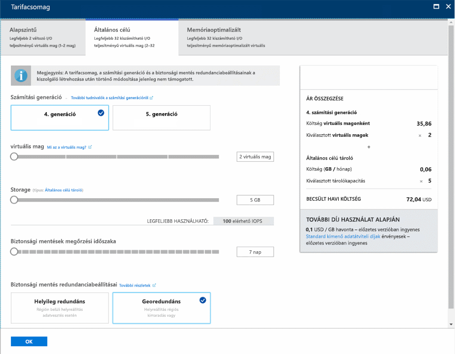

# <a name="tutorial-design-an-azure-database-for-postgresql---single-server-using-the-azure-portal"></a>Oktatóanyag: Azure Database for PostgreSQL – egyetlen kiszolgáló az Azure portal használatával tervezése

A PostgreSQL-hez készült Azure Database felügyelt szolgáltatás, amely lehetővé teszi a magas rendelkezésre állású PostgreSQL-adatbázisok futtatását, kezelését és skálázását a felhőben. Az Azure Portallal könnyedén kezelheti a kiszolgálót és tervezhet adatbázist.

Ebből az oktatóanyagból az Azure Portal használatával megtanulhatja a következőket:
> [!div class="checklist"]
> * Azure-adatbázis létrehozása PostgreSQL-kiszolgálóhoz
> * A kiszolgáló tűzfalának konfigurálása
> * Adatbázis létrehozása a [**psql**](https://www.postgresql.org/docs/9.6/static/app-psql.html) segédprogrammal
> * Mintaadatok betöltése
> * Adatok lekérdezése
> * Adatok frissítése
> * Adatok visszaállítása

## <a name="prerequisites"></a>Előfeltételek
Ha nem rendelkezik Azure-előfizetéssel, első lépésként mindössze néhány perc alatt létrehozhat egy [ingyenes](https://azure.microsoft.com/free/) fiókot.

## <a name="create-an-azure-database-for-postgresql"></a>Azure-adatbázis létrehozása PostgreSQL-hez

Az Azure-adatbázis PostgreSQL-kiszolgálóhoz [számítási és tárolási erőforrások](./concepts-compute-unit-and-storage.md) egy meghatározott készletével együtt jön létre. A kiszolgáló egy [Azure-erőforráscsoporton](../azure-resource-manager/resource-group-overview.md) belül jön létre.

Kövesse az alábbi lépéseket az Azure-adatbázis PostgreSQL-kiszolgálóhoz létrehozásához:
1. Kattintson az Azure Portal bal felső sarkában található **Erőforrás létrehozása** gombra.
2. Az **Új** panelen válassza az **Adatbázisok** lehetőséget, majd az **Adatbázisok** panelen válassza az **Azure-adatbázis PostgreSQL-kiszolgálóhoz** lehetőséget.
   

3. Válassza ki a **egykiszolgálós** telepítési lehetőséget.

   

4. Töltse ki a **alapjai** űrlapján az alábbi adatokat:

    

    Beállítás|Ajánlott érték|Leírás
    ---|---|---
    Előfizetés|Az Ön előfizetésének neve|A kiszolgálóhoz használni kívánt Azure-előfizetés. Ha több előfizetéssel rendelkezik, válassza ki azt az előfizetést, amely részeként fizet az erőforrásért.
    Erőforráscsoport|*myresourcegroup*| Egy új erőforráscsoport neve vagy egy meglévő az előfizetéséből.
    Kiszolgálónév |*mydemoserver*|Egy egyedi név, amely az Azure Database for PostgreSQL-kiszolgálót azonosítja. A rendszer hozzáfűzi a *postgres.database.azure.com* tartománynevet a megadott kiszolgálónévhez. A kiszolgáló neve csak kisbetűket, számokat és a kötőjel (-) karaktert tartalmazhatja. Legalább 3, és legfeljebb 63 karakterből állhat.
    Adatforrás | *Nincsenek* | Válassza ki *nincs* az új kiszolgáló létrehozása az alapoktól. (Ha egy meglévő Azure Database for PostgreSQL-kiszolgáló georedundáns biztonsági mentéséből hoz létre kiszolgálót, válassza a *Biztonsági mentés* lehetőséget).
    Rendszergazdai felhasználónév |*myadmin*| A kiszolgálóhoz való csatlakozáshoz használt bejelentkezési fiókja. A rendszergazdai bejelentkezési név nem lehet **azure_superuser**, **azure_pg_admin**, **admin**, **administrator**, **root**, **guest** és **public**. Nem kezdődhet a következővel: **pg_** .
    Jelszó |Az Ön jelszava| Egy új jelszó a kiszolgálói rendszergazdai fiók számára. A jelszó 8–128 karakterből állhat. A jelszónak tartalmaznia kell karaktereket a következő kategóriák közül legalább háromból: Angol nagybetűs betűket, angol kisbetűs karakterek, számjegyek (0 – 9) és nem alfanumerikus karakterek (!, $, #, %, stb.).
    Location egység|A felhasználókhoz legközelebb eső régió| A felhasználókhoz legközelebb eső hely.
    Version|A legújabb főverzió| A legújabb PostgreSQL-főverzió, hacsak nincsenek más konkrét követelmények.
    Számítás és tárolás | **Általános célú**, **5. generációs**, **2 virtuális mag**, **5 GB**, **7 nap**, **Georedundáns** | Az új kiszolgáló számítási, tárolási és biztonsági mentési konfigurációi. Válassza ki **kiszolgáló konfigurálása**. majd az **Általános célú** lapot. *Velikost haldy 5*, *4 virtuális magot kapnak*, *100 GB-os*, és *7 nap* az alapértelmezett értékei lesznek **számítási generáció**,  **virtuális mag**, **tárolási**, és **biztonsági mentések megőrzési időszaka**. Hagyhatja ezeket, vagy módosítsa a csúszkák. A kiszolgáló georedundáns tárhelyre való biztonsági mentésének engedélyezéséhez válassza a **Biztonsági másolat redundanciabeállításai** területen a **Georedundáns** lehetőséget. A tarifacsomag beállításának mentéséhez válassza az **OK** gombot. A következő képernyőkép ezeket a beállításokat tartalmazza.

   > [!NOTE]
   > Fontolja meg az alapszintű díjcsomag kis számítási és i/o-e megfelelő, a számítási feladatok számára. Vegye figyelembe, hogy a kiszolgálók, az alapszintű tarifacsomagban létrehozott később nem lehet az általános célú és memóriahasználatra optimalizált skálázhatók. Tekintse meg a [díjszabását ismertető lapon](https://azure.microsoft.com/pricing/details/postgresql/) további információt.
   > 

    

    > [!TIP]
    > A **auto-növekedés** engedélyezve van a kiszolgáló tárterület is nő, amikor Ön hamarosan eléri a lefoglalt korlátot, a számítási feladatok befolyásolása nélkül.

5. Válassza ki **tekintse át + létrehozása** , tekintse át a beállításokat. A kiszolgáló üzembe helyezéséhez válassza a **Létrehozás** lehetőséget. A művelet eltarthat néhány percig.

6. Az eszköztáron válassza az **Értesítések** ikont (csengő) az üzembehelyezési folyamat megfigyeléséhez. Az üzembe helyezés után kiválaszthatja a **Rögzítés az irányítópulton** lehetőséget, amellyel létrehoz egy csempét a kiszolgálóhoz az Azure Portal irányítópultján. A csempe a kiszolgáló **Áttekintés** oldalának közvetlen megnyitására szolgál. Az **Erőforrás megnyitása** lehetőség kiválasztásával megnyitja a kiszolgáló **Áttekintés** oldalát.

    
   
   Alapértelmezés szerint a **postgres** adatbázis a kiszolgáló alatt jön létre. A [postgres](https://www.postgresql.org/docs/9.6/static/app-initdb.html) adatbázis egy alapértelmezett adatbázis, amelyet a felhasználók, segédprogramok és külső féltől származó alkalmazások általi használatra szántak. (A másik alapértelmezett adatbázis az **azure_maintenance**. Az a feladata, hogy elkülönítse a felügyelt szolgáltatások folyamatait a felhasználói műveletektől. Ehhez az adatbázishoz nem lehet hozzáférni.)


## <a name="configure-a-server-level-firewall-rule"></a>Kiszolgálószintű tűzfalszabály konfigurálása

Az Azure Database for PostgreSQL szolgáltatás a kiszolgáló szintjén használja a tűzfalat. Alapértelmezés szerint ez a tűzfal megakadályozza, hogy a külső alkalmazások és eszközök csatlakozzanak a kiszolgálóhoz vagy a kiszolgálón lévő adatbázisokhoz, kivéve, ha olyan tűzfalszabályt hoz létre, amely megnyitja a tűzfalat egy adott IP-címtartomány számára. 

1. Miután befejeződött az üzembe helyezés, kattintson az **Összes erőforrás** elemre a bal oldali menüben, és írja be a **mydemoserver** nevet az újonnan létrehozott kiszolgáló megkereséséhez. Kattintson a keresési eredményekben listázott kiszolgálónévre. Megnyílik a kiszolgáló **Áttekintés** oldala, amely további konfigurációs lehetőségeket biztosít.

   

2. A kiszolgáló lapján válassza a **Kapcsolatbiztonság** elemet. 

3. Kattintson a **Szabálynév** alatti szövegmezőbe, és adjon hozzá egy új tűzfalszabályt az IP-címtartomány összekapcsolhatóságának engedélyezéséhez. Adja meg az IP-címtartományt. Kattintson a **Save** (Mentés) gombra.

   

4. Kattintson a **Mentés** gombra, majd kattintson az **X**-re a **Kapcsolatbiztonság** oldal bezárásához.

   > [!NOTE]
   > Azure PostgreSQL-kiszolgáló az 5432-es porton keresztül kommunikál. Ha vállalati hálózaton belülről próbál csatlakozni, elképzelhető, hogy a hálózati tűzfal nem engedélyezi a kimenő forgalmat az 5432-es porton keresztül. Ebben az esetben nem tud csatlakozni az Azure SQL-adatbáziskiszolgálóhoz, ha az informatikai részleg nem nyitja meg az 5432-es portot.
   >

## <a name="get-the-connection-information"></a>Kapcsolatadatok lekérése

Amikor létrehozta az Azure Database for PostgreSQL-kiszolgálót, az alapértelmezett **postgres** adatbázis is létrejött. A kiszolgálóhoz való kapcsolódáshoz meg kell adnia a gazdagép adatait és a hozzáférési hitelesítő adatokat.

1. Az Azure Portal bal oldali menüjében kattintson az **Összes erőforrás** elemre, és keressen rá az újonnan létrehozott kiszolgálóra.

   

2. Kattintson a **mydemoserver** kiszolgálónévre.

3. Válassza ki a kiszolgáló **Áttekintés** oldalát. Jegyezze fel a **Kiszolgálónevet** és a **Kiszolgáló-rendszergazdai bejelentkezési nevet**.

   


## <a name="connect-to-postgresql-database-using-psql-in-cloud-shell"></a>Csatlakozás a PostgreSQL-adatbázishoz a psql használatával a Cloud Shell-ben

Használjuk a [psql](https://www.postgresql.org/docs/9.6/static/app-psql.html) parancssori segédprogramot az Azure Database for PostgreSQL-kiszolgálóhoz való kapcsolódáshoz. 
1. Indítsa el az Azure Cloud Shell-t a felső navigációs ablakban található terminálikonnal.

   

2. Az Azure Cloud Shell megnyílik a böngészőben, amely lehetővé teszi a bash-parancsok beírását.

   

3. A Cloud Shell parancssornál csatlakozzon az Azure-adatbázis PostgreSQL-kiszolgálóhoz a psql-parancsok használatával. A következő formátum segítségével kapcsolódhat egy [psql](https://www.postgresql.org/docs/9.6/static/app-psql.html) segédprogrammal rendelkező Azure-adatbázis PostgreSQL-kiszolgálóhoz:
   ```bash
   psql --host=<myserver> --port=<port> --username=<server admin login> --dbname=<database name>
   ```

   Például a következő parancs a **postgres** nevű alapértelmezett adatbázishoz kapcsolódik a **mydemoserver.postgres.database.azure.com** PostgreSQL-kiszolgálón a hozzáférési hitelesítő adatok használatával. Adja meg a kiszolgáló-rendszergazdai jelszavát, amikor a rendszer kéri.

   ```bash
   psql --host=mydemoserver.postgres.database.azure.com --port=5432 --username=myadmin@mydemoserver --dbname=postgres
   ```

## <a name="create-a-new-database"></a>Új adatbázis létrehozása
Miután csatlakozott a kiszolgálóhoz, hozzon létre egy üres adatbázist, amikor a rendszer kéri.
```bash
CREATE DATABASE mypgsqldb;
```

Amikor a rendszer kéri, hajtsa végre a következő parancsot, a kapcsolat átváltásához az újonnan létrehozott adatbázisra **mypgsqldb**.
```bash
\c mypgsqldb
```
## <a name="create-tables-in-the-database"></a>Táblák létrehozása az adatbázisban
Most, hogy tudja, hogyan csatlakozhat az Azure Database for PostgreSQL szolgáltatáshoz, elvégezhet néhány alapvető feladatot:

Először hozzunk létre egy táblát, és töltsük fel adatokkal. Hozzunk létre egy táblát a leltáradatok nyomon követéséhez az alábbi SQL-kóddal:
```sql
CREATE TABLE inventory (
    id serial PRIMARY KEY, 
    name VARCHAR(50), 
    quantity INTEGER
);
```

Az újonnan létrehozott tábla a táblák listájában való megtekintéséhez írja be a következőt:
```sql
\dt
```

## <a name="load-data-into-the-tables"></a>Adatok betöltése a táblákba
Most, hogy már rendelkezünk egy táblával, szúrjunk be néhány adatot. A megnyitott parancssori ablakban futtassa a következő lekérdezést néhány adatsor beszúrásához.
```sql
INSERT INTO inventory (id, name, quantity) VALUES (1, 'banana', 150); 
INSERT INTO inventory (id, name, quantity) VALUES (2, 'orange', 154);
```

Most két mintaadatsorral rendelkezünk a korábban létrehozott készlettáblában.

## <a name="query-and-update-the-data-in-the-tables"></a>A táblákban lévő adatok lekérdezése és frissítése
Hajtsa végre a következő lekérdezést a készlet-adatbázistáblában lévő információk lekéréséhez. 
```sql
SELECT * FROM inventory;
```

A táblában lévő adatokat frissítheti is.
```sql
UPDATE inventory SET quantity = 200 WHERE name = 'banana';
```

A frissített értékeket az adatok lekérésekor tekintheti meg.
```sql
SELECT * FROM inventory;
```

## <a name="restore-data-to-a-previous-point-in-time"></a>Adatok visszaállítása egy korábbi időpontra
Tegyük fel, hogy véletlenül töröltünk egy fontos adatbázistáblát. Ebből a helyzetből nem lehet könnyen helyreállni. Az Azure Database for PostgreSQL segítségével bármely olyan időpontra vissza lehet térni, amelyen a kiszolgálóról biztonsági mentés készült (ez a biztonsági mentések megőrzési idejéhez megadott beállításoktól függ), és az adott időpontra jellemző állapotot vissza lehet állítani egy új kiszolgálóra. Az új kiszolgáló segítségével helyreállíthatja a törölt adatokat. Az alábbi lépések a készlettábla hozzáadása előtti időpontra állítják vissza a **mydemoserver** kiszolgálót.

1. A kiszolgálóhoz tartozó Azure Database for PostgreSQL **Áttekintés** lapján kattintson az eszköztár **Visszaállítás** elemére. Megnyílik a **Visszaállítás** oldal.

   

2. Töltse ki a **Visszaállítás** űrlapot a szükséges információkkal:

   

   - **Visszaállítási pont**: Válasszon egy pont kötött, amely a kiszolgáló módosítása előtti
   - **Célkiszolgáló**: Adja meg a visszaállítani kívánt új kiszolgáló nevét
   - **Hely**: Nem választhat ki a régiót, alapértelmezés szerint ugyanaz, mint a forráskiszolgálón
   - **A tarifacsomag**: Ez az érték nem módosítható, ha a kiszolgáló visszaállítása. Ugyanaz, mint a forráskiszolgálóé. 
3. Az **OK** gombra kattintva [visszaállíthatja a kiszolgálót a tábla törlése előtti időpontra](./howto-restore-server-portal.md). A kiszolgáló egy másik időpontra való visszaállítása létrehozza a kiszolgáló megadott időpontra vonatkozó duplikált új másolatát, amennyiben az adott pont a [tarifacsomag](./concepts-pricing-tiers.md) adatmegőrzési időszakán belül esik.

## <a name="next-steps"></a>További lépések
Ez az oktatóanyag bemutatta, hogyan végezheti el az alábbi műveleteket az Azure Portal és más segédprogramok használatával:
> [!div class="checklist"]
> * Azure-adatbázis létrehozása PostgreSQL-kiszolgálóhoz
> * A kiszolgáló tűzfalának konfigurálása
> * Adatbázis létrehozása a [**psql**](https://www.postgresql.org/docs/9.6/static/app-psql.html) segédprogrammal
> * Mintaadatok betöltése
> * Adatok lekérdezése
> * Adatok frissítése
> * Adatok visszaállítása

Ezután megtudhatja, hogyan végezhet el hasonló feladatokat az Azure CLI használatával, tekintse át az oktatóanyag: [Az első Azure Database for postgresql-hez az Azure CLI használatával tervezése](tutorial-design-database-using-azure-cli.md)
