# <a name="quickstart-create-a-aspnet-web-app-with-redis-cache"></a>Rövid útmutató: ASP.NET-webalkalmazás létrehozása a Redis Cache használatával

> [!div class="op_single_selector"]
> * [.NET](cache-dotnet-how-to-use-azure-redis-cache.md)
> * [ASP.NET](cache-web-app-howto.md)
> * [Node.js](cache-nodejs-get-started.md)
> * [Java](cache-java-get-started.md)
> * [Python](cache-python-get-started.md)
>

## <a name="introduction"></a>Bevezetés

Ez a rövid útmutató bemutatja, hogyan hozhat létre és helyezhet üzembe egy ASP.NET-webalkalmazást az Azure App Service szolgáltatásban a Visual Studio 2017 használatával. A mintaalkalmazás egy Azure Redis Cache-hez csatlakozik a gyorsítótár adatainak tárolásához és beolvasásához. A rövid útmutató befejezése után egy olyan futó, Azure-ban üzemeltetett webalkalmazással fog rendelkezni, amely adatokat olvas be és ír egy Azure Redis Cache-be.

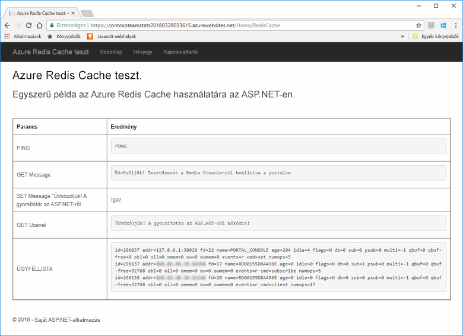

## <a name="prerequisites"></a>Előfeltételek

A rövid útmutató elvégzéséhez az alábbi előfeltételekkel kell rendelkeznie:

* Telepítse a [Visual Studio 2017](https://www.visualstudio.com/downloads/) szoftvert a következő számítási feladatokkal:
    * ASP.NET és webfejlesztés
    * Azure-fejlesztés

[!INCLUDE [quickstarts-free-trial-note](../../includes/quickstarts-free-trial-note.md)]

## <a name="create-the-visual-studio-project"></a>A Visual Studio-projekt létrehozása

Nyissa meg a Visual Studio alkalmazást, majd kattintson a **File** (File), **New** (Új), **Project** (Projekt) lehetőségre.

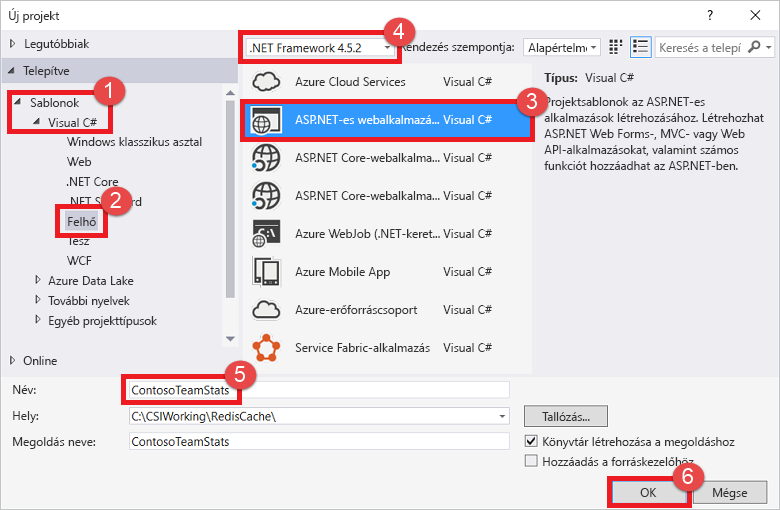

Az Új projekt párbeszédpanelen hajtsa végre az alábbi lépéseket:

1. Bontsa ki a **Visual C#** csomópontot a **Sablonok** listában
1. Válassza a **Felhő** lehetőséget
1. Kattintson az **ASP.NET-webalkalmazás** elemre
1. Győződjön meg arról, hogy a **.NET-keretrendszer 4.5.2-es** vagy újabb verziója van kiválasztva
1. Nevezze el a projektet a **Név** szövegmezőben. Ehhez a példához a **ContosoTeamStats** nevet használtuk
1. Kattintson az **OK** gombra.

Megjelenik egy Új ASP.NET-webalkalmazás képernyő:


A projekt típusaként válassza az **MVC** lehetőséget.

Ellenőrizze, hogy az **Authentication** (Hitelesítés) beállításai között a **No Authentication** (Nincs hitelesítés) van megadva. A Visual Studio verziójától függően az alapértelmezett beállítás más lehet. A beállítás módosításához kattintson a **Change Authentication** (Hitelesítés módosítása) gombra, és válassza a **No Authentication** (Nincs hitelesítés) értéket.

A projekt létrehozásához kattintson az **OK** gombra.

## <a name="create-a-cache"></a>Gyorsítótár létrehozása

A következő lépésben létrehozza az alkalmazás gyorsítótárát.

[!INCLUDE [redis-cache-create](../../includes/redis-cache-create.md)]

[!INCLUDE [redis-cache-access-keys](../../includes/redis-cache-access-keys.md)]

Hozzon létre egy *CacheSecrets.config* nevű fájlt a számítógépen, majd mentse egy olyan helyre, ahonnan a mintaalkalmazás forráskódja nem fogja beolvasni. Ebben a rövid útmutatóban a *CacheSecrets.config* fájl a következő helyen található: *C:\AppSecrets\CacheSecrets.config*.

Módosítsa a *CacheSecrets.config* fájlt, és adja hozzá az alábbi tartalmakat:

```xml
<appSettings>
    <add key="CacheConnection" value="<cache-name>.redis.cache.windows.net,abortConnect=false,ssl=true,password=<access-key>"/>
</appSettings>
```

A `<cache-name>` karakterláncot cserélje le a gyorsítótár gazdagépének nevére.

Az `<access-key>` karakterláncot cserélje le a gyorsítótár elsődleges kulcsára.

> [!TIP]
> A másodlagos elérési kulcs a kulcscsere során alternatív kulcsként szolgál, amíg Ön újragenerálja az elsődleges hozzáférési kulcsot.
>

Mentse a fájlt.

## <a name="update-the-mvc-application"></a>Az MVC alkalmazás frissítése

Ebben a szakaszban frissíti az alkalmazást, hogy támogasson egy új nézetet, amely egy Azure Redis Cache-en végrehajtott egyszerű tesztet fog megjeleníteni.

* [A web.config fájl frissítése egy gyorsítótárhoz tartozó alkalmazásbeállítással](#Update-the-webconfig-file-with-an-app-setting-for-the-cache)
* [Az alkalmazás konfigurálása a StackExchange.Redis ügyfél használatára](#configure-the-application-to-use-stackexchangeredis)
* [A HomeController és az elrendezés frissítése](#update-the-homecontroller-and-layout)
* [Új RedisCache nézet hozzáadása](#add-a-new-rediscache-view)

### <a name="update-the-webconfig-file-with-an-app-setting-for-the-cache"></a>A web.config fájl frissítése egy gyorsítótárhoz tartozó alkalmazásbeállítással

Az alkalmazás helyi futtatásakor a *CacheSecrets.config* információi az Azure Redis Cache-példányhoz történő kapcsolódáshoz lesznek felhasználva. Később ezt az alkalmazást fogja üzembe helyezni az Azure-ban. Ekkor konfigurálni fog egy alkalmazásbeállítást az Azure-ban, amelyet az alkalmazás a fájl helyett fog használni a gyorsítótár kapcsolati információinak lekéréséhez. Mivel a *CacheSecrets.config* nem települ az Azure-on az alkalmazással együtt, csak akkor fogja használni, amikor helyben teszteli az alkalmazást. Ezt az információt a lehető legbiztonságosabban kell tárolni, hogy mások ne férhessenek hozzá károkozási szándékkal a gyorsítótárazott adatokhoz.

A **Megoldáskezelőben** nyissa meg duplán a *web.config* fájlt dupla kattintással.

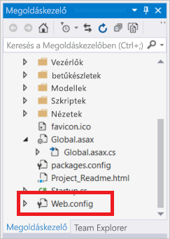

A *web.config* fájlban keresse meg az `<appSetting>` elemet, és adja hozzá az alábbi `file` attribútumot. Ha más fájlnevet vagy helyet használ, helyettesítse azokat a példában látható értékekkel.

* Előtte: `<appSettings>`
* Utána: ` <appSettings file="C:\AppSecrets\CacheSecrets.config">`

Az ASP.NET futtatási környezet a külső fájl tartalmát egyesíti az `<appSettings>` elem kódjával. Ha a megadott fájl nem található, a futtatási környezet figyelmen kívül hagyja a fájlattribútumot. A titkos kulcsok (a gyorsítótárhoz tartozó kapcsolati karakterláncok) nem képezik részét az alkalmazás forráskódjának. A webalkalmazás Azure-ban történő üzembe helyezésekor a *CacheSecrests.config* fájl nem lesz telepítve.

### <a name="configure-the-application-to-use-stackexchangeredis"></a>Az alkalmazás konfigurálása a StackExchange.Redis használatára

Ha konfigurálni kívánja az alkalmazást a Visual Studióhoz készült [StackExchange.Redis](https://github.com/StackExchange/StackExchange.Redis) NuGet-csomag használatára, kattintson az **Eszközök > NuGet-csomagkezelő > Csomagkezelő konzol** elemre.

Futtassa az alábbi parancsot a `Package Manager Console` ablakából:

```powershell
Install-Package StackExchange.Redis
```

A NuGet-csomag letölti és hozzáadja az ügyfélalkalmazás számára szükséges szerelvényhivatkozásokat az Azure Redis Cache a StackExchange.Redis gyorsítótárügyféllel történő eléréséhez. Ha inkább a `StackExchange.Redis` ügyfélkönyvtár erős elnevezésű verzióját kívánja használni, telepítse a `StackExchange.Redis.StrongName` csomagot.

### <a name="update-the-homecontroller-and-layout"></a>A HomeController és az elrendezés frissítése

A **Megoldáskezelőben** bontsa ki a **Vezérlők** mappát, majd nyissa meg a *HomeController.cs* fájlt.

Adja hozzá a következő két `using` utasítást a fájl elejéhez, hogy támogassa a gyorsítótárügyfelet és az alkalmazásbeállításokat.

```csharp
using System.Configuration;
using StackExchange.Redis;
```

Adja hozzá a következő metódust a `HomeController` osztályhoz, hogy támogasson egy új `RedisCache` műveletet, amely végrehajt néhány parancsot az új gyorsítótáron.

```csharp
    public ActionResult RedisCache()
    {
        ViewBag.Message = "A simple example with Azure Redis Cache on ASP.NET.";

        var lazyConnection = new Lazy<ConnectionMultiplexer>(() =>
        {
            string cacheConnection = ConfigurationManager.AppSettings["CacheConnection"].ToString();
            return ConnectionMultiplexer.Connect(cacheConnection);
        });

        // Connection refers to a property that returns a ConnectionMultiplexer
        // as shown in the previous example.
        IDatabase cache = lazyConnection.Value.GetDatabase();

        // Perform cache operations using the cache object...

        // Simple PING command
        ViewBag.command1 = "PING";
        ViewBag.command1Result = cache.Execute(ViewBag.command1).ToString();

        // Simple get and put of integral data types into the cache
        ViewBag.command2 = "GET Message";
        ViewBag.command2Result = cache.StringGet("Message").ToString();

        ViewBag.command3 = "SET Message \"Hello! The cache is working from ASP.NET!\"";
        ViewBag.command3Result = cache.StringSet("Message", "Hello! The cache is working from ASP.NET!").ToString();

        // Demostrate "SET Message" executed as expected...
        ViewBag.command4 = "GET Message";
        ViewBag.command4Result = cache.StringGet("Message").ToString();

        // Get the client list, useful to see if connection list is growing...
        ViewBag.command5 = "CLIENT LIST";
        ViewBag.command5Result = cache.Execute("CLIENT", "LIST").ToString().Replace(" id=", "\rid=");

        lazyConnection.Value.Dispose();

        return View();
    }
```

A **Megoldáskezelőben** bontsa ki a **Nézetek**>**Közös** mappát, és nyissa meg a *_Layout.cshtml* fájlt.

Cserélje le ezt:

```csharp
@Html.ActionLink("Application name", "Index", "Home", new { area = "" }, new { @class = "navbar-brand" })
```

A következővel:

```csharp
@Html.ActionLink("Azure Redis Cache Test", "RedisCache", "Home", new { area = "" }, new { @class = "navbar-brand" })
```

### <a name="add-a-new-rediscache-view"></a>Új RedisCache nézet hozzáadása

A **Megoldáskezelőben** bontsa ki a **Nézetek** mappát, majd kattintson a jobb gombbal a **Kezdőmappára**. Kattintson a **Hozzáadás** > **Nézet...** elemre.

A Nézet hozzáadása párbeszédpanelen adja meg a **RedisCache** nevet a Nézet neveként, majd kattintson a **Hozzáadás** gombra.

Cserélje le a *RedisCache.cshtml* fájlban lévő kódot az alábbira:

```csharp
@{
    ViewBag.Title = "Azure Redis Cache Test";
}

<h2>@ViewBag.Title.</h2>
<h3>@ViewBag.Message</h3>
<br /><br />
<table border="1" cellpadding="10">
    <tr>
        <th>Command</th>
        <th>Result</th>
    </tr>
    <tr>
        <td>@ViewBag.command1</td>
        <td><pre>@ViewBag.command1Result</pre></td>
    </tr>
    <tr>
        <td>@ViewBag.command2</td>
        <td><pre>@ViewBag.command2Result</pre></td>
    </tr>
    <tr>
        <td>@ViewBag.command3</td>
        <td><pre>@ViewBag.command3Result</pre></td>
    </tr>
    <tr>
        <td>@ViewBag.command4</td>
        <td><pre>@ViewBag.command4Result</pre></td>
    </tr>
    <tr>
        <td>@ViewBag.command5</td>
        <td><pre>@ViewBag.command5Result</pre></td>
    </tr>
</table>
```

## <a name="run-the-app-locally"></a>Az alkalmazás futtatása helyben

Alapértelmezés szerint a projekt úgy van konfigurálva, hogy helyben üzemeltesse az alkalmazást az [IIS Expressben](https://docs.microsoft.com/iis/extensions/introduction-to-iis-express/iis-express-overview) a teszteléshez és a hibakereséshez.

A Visual Studio menüjében kattintson a **Hibakeresés** > **Hibakeresés indítása** elemre az alkalmazás teszteléshez és hibakereséshez való létrehozásához és helyi elindításához.

A böngésző navigációs sávjában kattintson az **Azure Redis Cache tesztelése** elemre.

Az alábbi példában a `Message` kulcsot láthatja. A kulcsnak korábban gyorsítótárazott értéke volt, amely a portálon, a Redis Console használatával lett beállítva. Az alkalmazás frissítette ezt a gyorsítótárazott értéket. Az alkalmazás továbbá végrehajtotta a `PING` és a `CLIENT LIST` parancsot.

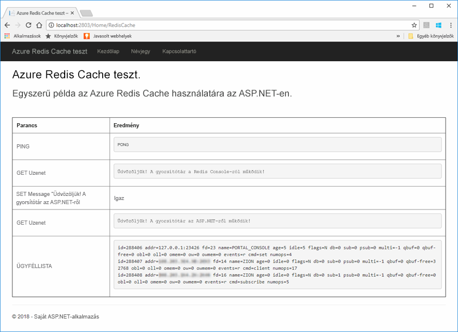

## <a name="publish-and-run-in-azure"></a>Közzététel és futtatás az Azure-ban

Az alkalmazás sikeres helyi tesztelése után az Azure-beli üzembe helyezés és a felhőben történő futtatás következik.

### <a name="publish-the-app-to-azure"></a>Az alkalmazás közzététele az Azure-ban

A Visual Studio Megoldáskezelőjében kattintson a jobb gombbal a projektcsomópontra, és válassza a **Közzététel** lehetőséget.

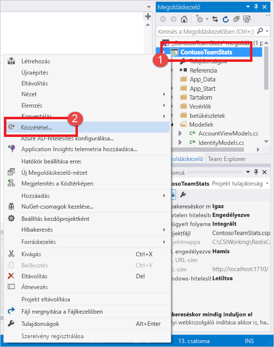

Kattintson a **Microsoft Azure App Service** elemre, válassza az **Új létrehozása** elemet, majd kattintson a **Közzététel** parancsra.

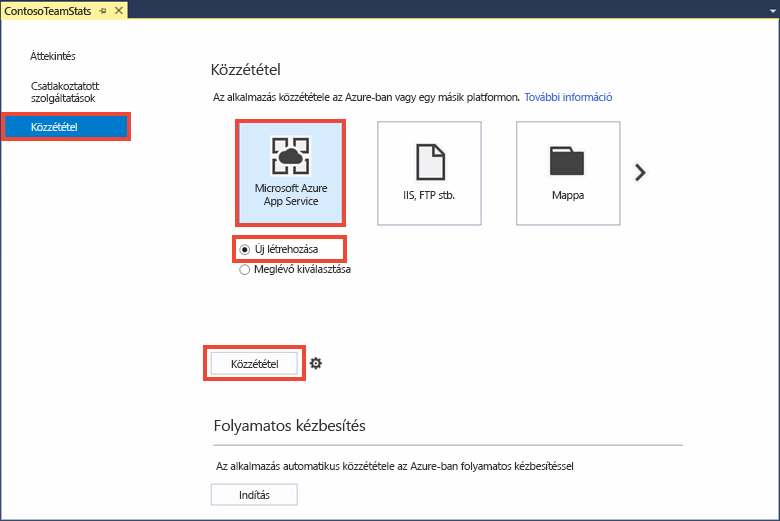

Az **App Service létrehozása** párbeszédpanelen hajtsa végre a következő módosításokat:

| Beállítás | Javasolt érték | Leírás |
| ------- | :---------------: | ----------- |
| **Alkalmazás neve** | Alapértelmezett használata | Az alkalmazásnév lesz az alkalmazás gazdagépneve, amikor üzembe helyezi az Azure-ban. Ha a név egyediségéhez ez szükséges, a rendszer időbélyeg-utótagot fűzhet hozzá. |
| **Előfizetés** | Azure-előfizetés kiválasztása | A kapcsolódó üzemeltetési költségek erre az előfizetésre lesznek felszámítva. Ha több Azure-előfizetéssel is rendelkezik, ellenőrizze, hogy a kívánt előfizetés van-e kiválasztva.|
| **Erőforráscsoport** | Használja ugyanazt az erőforráscsoportot, mint amelyben a gyorsítótárat létrehozta. Például: *TestResourceGroup*. | Az erőforráscsoport segítségével az összes erőforrást egy csoportként kezelheti. Később, amikor törölni kívánja az alkalmazást, elég csak a csoportot törölnie. |
| **App Service-csomag** | Kattintson az **Új** elemre, és hozzon létre egy *TestingPlan* nevű új App Service-csomagot. <br />Használja ugyanazt a **Helyet**, mint amelyet a gyorsítótár létrehozásakor használt. <br />A méretnél válassza az **Ingyenes** lehetőséget. | Az App Service-csomag meghatároz egy futtatáshoz használható számításierőforrás-készletet a webalkalmazás számára. |

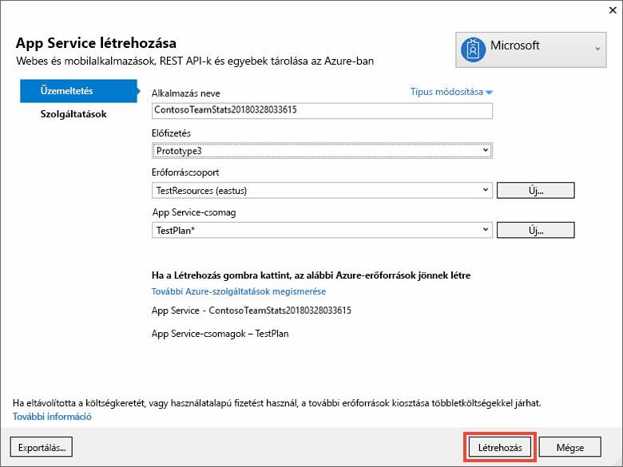

Az App Service üzemeltetési beállításainak konfigurálása után kattintson a **Létrehozás** elemre, hogy létrehozzon egy új App Service-t az alkalmazás számára.

Figyelje a Visual Studio **Kimenet** ablakát az Azure-ban való közzététel állapotáért. Amikor a közzététel sikeresen befejeződött, a rendszer naplózza az App Service URL-címét a lent látható módon:

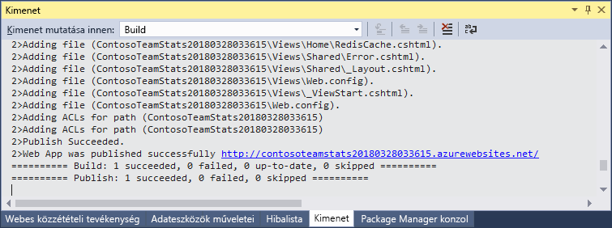

### <a name="add-the-app-setting-for-the-cache"></a>A gyorsítótárhoz tartozó alkalmazásbeállítás hozzáadása

Az új App Service közzététele után adjon hozzá egy új alkalmazásbeállítást. A rendszer ezt a beállítást fogja használni a gyorsítótár csatlakoztatási információinak tárolására. Gépelje be az alkalmazás nevét az Azure Portal tetején található keresősávba az imént létrehozott új App Service megkereséséhez.

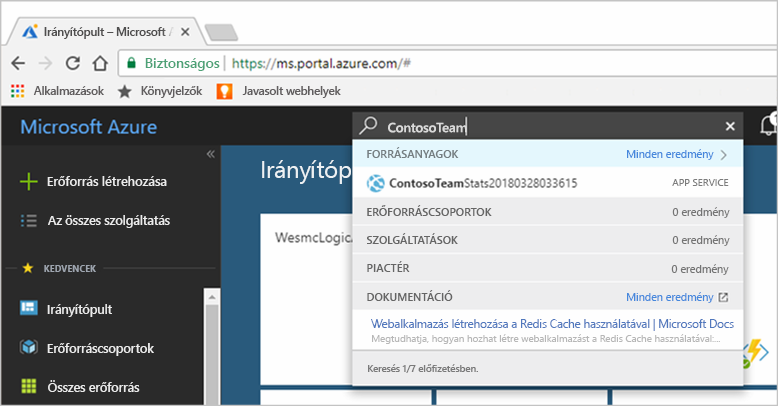

Adjon hozzá egy **CacheConnection** nevű új alkalmazásbeállítást, amelyet az alkalmazás a gyorsítótárhoz való csatlakozáshoz fog használni. Használja ugyanazt az értéket, mint amelyet a `CacheConnection` számára konfigurált a *CacheSecrets.config* fájlban. Az érték tartalmazza a gyorsítótár gazdagépének nevét és a hozzáférési kulcsot.

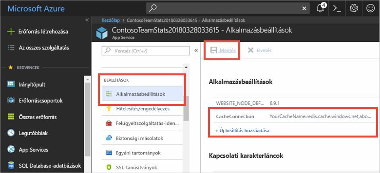

### <a name="run-the-app-in-azure"></a>Az alkalmazás futtatása az Azure-ban

A böngészőben nyissa meg az App Service URL-címét. Az URL-címet a közzétételi művelet eredményeiben láthatja, a Visual Studio Kimenet ablakában. Az Azure Portalon, a létrehozott App Service Áttekintés lapján is megtalálható.

A navigációs sávon kattintson az **Azure Redis Cache tesztelése** elemre a gyorsítótár-hozzáférés teszteléséhez.


## <a name="clean-up-resources"></a>Az erőforrások eltávolítása

Ha azt tervezi, hogy a következő oktatóanyaggal folytatja, megtarthatja és újból felhasználhatja az ebben a rövid útmutatóban létrehozott erőforrásokat.

Ha azonban befejezte az oktatóanyag mintaalkalmazásának használatát, a díjak elkerülése érdekében törölheti az ebben a rövid útmutatóban létrehozott Azure-erőforrásokat. 

> [!IMPORTANT]
> Az erőforráscsoport törlése nem vonható vissza; az erőforráscsoport és a benne foglalt erőforrások véglegesen törlődnek. Figyeljen arra, hogy ne töröljön véletlenül erőforráscsoportot vagy erőforrásokat. Ha a jelen minta üzemeltetését végző erőforrásokat egy meglévő, megtartani kívánt erőforrásokat tartalmazó erőforráscsoportban hozta létre, az erőforrásokat az erőforráscsoport törlése helyett külön-külön törölheti a megfelelő panelekről.
>

Jelentkezzen be az [Azure portálra](https://portal.azure.com), és kattintson az **Erőforráscsoportok** elemre.

A **Szűrés név alapján...** mezőbe írja be az erőforráscsoport nevét. Ebben a témakörben a *TestResources* nevű erőforráscsoportot használtuk. Az eredménylistában kattintson a **…** ikonra az erőforráscsoport mellett, majd kattintson az **Erőforráscsoport törlése** elemre.

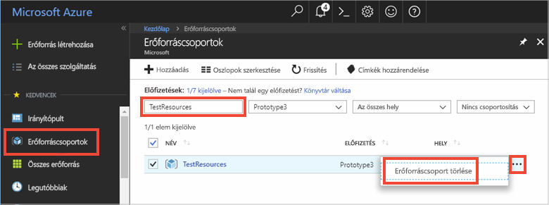

A rendszer az erőforráscsoport törlésének megerősítését fogja kérni. A megerősítéshez írja be az erőforráscsoport nevét, és kattintson a **Törlés** elemre.

A rendszer néhány pillanaton belül törli az erőforráscsoportot és a benne foglalt erőforrásokat.

## <a name="next-steps"></a>További lépések

A következő oktatóanyagban egy valósabb forgatókönyvben fogja használni az Azure Redis Cache-t, hogy javítsa egy alkalmazás teljesítményét. Frissíteni fogja az alkalmazást, hogy gyorsítótárazza egy ranglista eredményeit a gyorsítótár-feltöltési minta, az ASP.NET és egy adatbázis együttes használatával.

> [!div class="nextstepaction"]
> [Gyorsítótár-feltöltési ranglista létrehozása az ASP.NET-en](cache-web-app-cache-aside-leaderboard.md)
