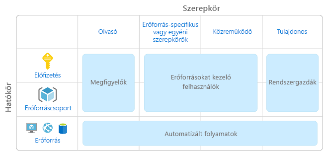
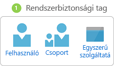
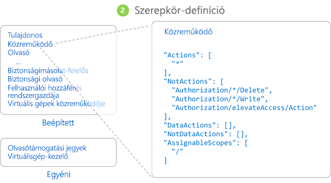
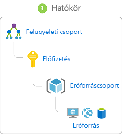

# Mi az a szerepköralapú hozzáférés-vezérlés (RBAC)?

A felhőbeli erőforrások hozzáférésének kezelése kritikus fontosságú a felhőt használó vállalatok számára. A szerepköralapú hozzáférés-vezérlés (RBAC) lehetővé teszi annak meghatározását, kik férhetnek hozzá az Azure-erőforrásokhoz, mire használhatják őket, és mely területekhez kapnak hozzáférést.

Az RBAC az [Azure Resource Managerre](../azure-resource-manager/resource-group-overview.md) épülő engedélyezési rendszer, amely részletes hozzáférés-kezelési lehetőségeket nyújt az Azure-beli erőforrásokhoz.

## Mire használhatom az RBAC-t?

Néhány példa arra, milyen lehetőségeket biztosít az RBAC:

- Az egyik felhasználó számára engedélyezheti az előfizetésben lévő virtuális gépek, a másik felhasználó számára pedig a virtuális hálózatok kezelését.
- Engedélyezheti egy adatbázis-rendszergazdai csoport számára az előfizetésben lévő SQL-adatbázisok kezelését.
- Engedélyezheti egy felhasználó számára az egy adott erőforráscsoportba tartozó összes erőforrás, például a virtuális gépek, a webhelyek és az alhálózatok kezelését.
- Engedélyezheti egy alkalmazás számára az egy adott erőforráscsoportba tartozó összes erőforrás elérését.

## Ajánlott eljárások az RBAC használatához

Az RBAC használata lehetővé teszi, hogy elkülönítse a kötelességeket a csapaton belül, valamint csak olyan mértékű hozzáférést biztosítson, amelyre a felhasználóknak a feladataik elvégzéséhez szüksége van. Ahelyett, hogy mindenki számára korlátlan engedélyeket adna az Azure-előfizetéshez vagy -erőforrásokhoz, az egyes műveletekhez hatókört adhat meg.

A hozzáférés-vezérlési stratégia megtervezésekor ajánlott eljárásként csak a munkájuk elvégzéséhez minimálisan szükséges jogosultságokat biztosítsa a felhasználók számára. A következő ábrán az RBAC használatának egy javasolt mintája látható.

## Az RBAC működése

A szerepköralapú hozzáférés-vezérlés keretében az erőforrások elérését szerepkör-hozzárendelések létrehozásával szabályozhatja. Ez egy alapvető fogalom – ez határozza meg az engedélyek kikényszerítését. A szerepkör-hozzárendelés három elemből áll: rendszerbiztonsági tagból, szerepkör-definícióból és hatókörből.

### Rendszerbiztonsági tag

A *rendszerbiztonsági tag* egy olyan objektum, amely egy, az Azure-erőforrásokhoz hozzáférést igénylő felhasználót, csoportot vagy szolgáltatásnevet jelöl.

- Felhasználó – Egy Azure Active Directory-profillal rendelkező személy. Más bérlőkön lévő felhasználókhoz is hozzárendelhet szerepköröket. A más vállalatok felhasználóira vonatkozó információkért lásd: [Azure Active Directory B2B](../active-directory/b2b/what-is-b2b.md).
- Csoport – Felhasználók az Azure Active Directoryban létrehozott csoportja. Ha egy csoporthoz rendel hozzá egy szerepkört, a csoportban lévő összes felhasználó rendelkezik majd az adott szerepkörrel. 
- Szolgáltatásnév – Alkalmazások vagy szolgáltatások által adott Azure-erőforrások elérésére használt biztonsági identitás. Úgy képzelhető el, mint egy alkalmazás *felhasználói identitása* (felhasználóneve és jelszava vagy tanúsítványa).

### Szerepkör-definíció

A *szerepkör-definíció* engedélyek gyűjteménye. Szokás egyszerűen csak *szerepkörnek* is nevezni. A szerepkör-definíció a végrehajtható műveletek listáját tartalmazza (például olvasás, írás és törlés). A szerepkör lehet magas szintű (például tulajdonos) vagy specifikus (például virtuálisgép-olvasó).

Az Azure számos [beépített szerepkört](built-in-roles.md) biztosít, amelyeket használhat. Az alábbiakban négy alapvető beépített szerepkört sorolunk fel. Az első három minden erőforrástípusra alkalmazható.

- [Tulajdonos](built-in-roles.md#owner) – teljes hozzáféréssel rendelkezik az összes erőforráshoz, beleértve a hozzáférés mások számára való delegálásának jogát is.
- [Közreműködő](built-in-roles.md#contributor) – bármilyen típusú Azure-erőforrást létrehozhat és kezelhet, hozzáférést azonban nem adhat mások számára.
- [Olvasó](built-in-roles.md#reader) – megtekintheti a meglévő Azure-erőforrásokat.
- [Felhasználói hozzáférés rendszergazdája](built-in-roles.md#user-access-administrator) – kezelheti a felhasználók Azure-erőforrásokhoz való hozzáférését.

A többi beépített szerepkör adott Azure-erőforrások kezelését teszi lehetővé. Például a [Virtuális gépek közreműködője](built-in-roles.md#virtual-machine-contributor) szerepkör virtuális gépek létrehozását és kezelését teszi lehetővé. Ha a beépített szerepkörök nem felelnek meg a cég vagy intézmény igényeinek, saját [egyéni szerepköröket](custom-roles.md) is létrehozhat.

Az Azure-ban bevezettünk különféle adatműveleteket (ezek jelenleg előzetes verzióban érhetők el), amelyek használatával az egyes objektumokban lévő adatokhoz biztosítható hozzáférés. Ha például egy felhasználó adatolvasási hozzáféréssel rendelkezik egy tárfiókhoz, akkor olvashatja az adott tárfiókban lévő blobokat vagy üzeneteket. További információt [a szerepkör-definíciókat ismertető](role-definitions.md) témakörben olvashat.

### Hatókör

A *hatókör* az a határ, ameddig a hozzáférés terjed. Szerepkörök hozzárendelésekor hatókör meghatározásával tovább korlátozhatja az engedélyezett műveletek körét. Ez hasznos lehet például, ha egy felhasználót [Webhelyek közreműködője](built-in-roles.md#website-contributor) szerepkörrel szeretne felruházni, de csak egyetlen erőforráscsoportra vonatkozóan.

Az Azure-ban a hatókörök több szinten határozhatók meg: a [felügyeleti csoport](../azure-resource-manager/management-groups-overview.md), az előfizetés, az erőforráscsoport vagy az erőforrás szintjén. A hatókörök szülő-gyermek (származtatott) kapcsolatokba vannak rendezve.

Amikor hozzáférést rendel egy szülő hatókörhöz, az engedélyeket azok származtatott hatókörei is öröklik. Például:

- Ha [tulajdonosi](built-in-roles.md#owner) szerepkört rendel egy, a felügyeleti csoport hatóköréhez tartozó felhasználóhoz, a felhasználó a felügyeleti csoportban lévő összes előfizetésben mindent felügyelhet.
- Ha az [Olvasó](built-in-roles.md#reader) szerepkört hozzárendeli egy csoporthoz az előfizetés hatókörében, a csoport tagjai az előfizetésben lévő összes erőforráscsoportot és erőforrást megtekinthetik.
- Ha a [Közreműködő](built-in-roles.md#contributor) szerepkört hozzárendeli egy alkalmazáshoz az erőforrás-csoport hatókörében, az alkalmazás bármilyen típusú erőforrást kezelhet majd az adott erőforráscsoportban, az előfizetésben lévő többi erőforráscsoportban azonban nem.

### Szerepkör-hozzárendelések

A *szerepkör-hozzárendelés* során egy szerepkör-definíciót rendelünk egy felhasználóhoz, csoporthoz vagy szolgáltatásnévhez egy adott hatókör mellett hozzáférés biztosítása érdekében. A hozzáférés szerepkör-hozzárendelés létrehozásával biztosítható, és a szerepkör-hozzárendelés törlésével vonható vissza.

Az alábbi ábrán egy példa látható szerepkör-hozzárendelésre. Ebben a példában a Marketing csoporthoz hozzárendeltük a [Közreműködő](built-in-roles.md#contributor) szerepkört a gyógyszer-értékesítési erőforráscsoportra vonatkozóan. Ez azt jelenti, hogy a Marketing csoportba tartozó felhasználók bármilyen Azure-erőforrást létrehozhatnak és kezelhetnek a gyógyszer-értékesítési erőforráscsoportban. A Marketing felhasználói a gyógyszer-értékesítési erőforráscsoporton kívüli erőforrásokhoz nem rendelkeznek hozzáféréssel, ha nem tagjai másik szerepkör-hozzárendelésnek is.

Szerepkör-hozzárendeléseket az Azure Portal, az Azure CLI, az Azure PowerShell, az Azure SDK-k vagy REST API-k használatával hozhat létre. Mindegyik előfizetésben legfeljebb 2000 szerepkör-hozzárendeléssel rendelkezhet. Szerepkör-hozzárendelések létrehozásához és eltávolításához `Microsoft.Authorization/roleAssignments/*` engedély szükséges. Ez a [Tulajdonos](built-in-roles.md#owner) vagy a [Felhasználói hozzáférés rendszergazdája](built-in-roles.md#user-access-administrator) szerepkörrel biztosítható.

## Megtagadás-hozzárendelések

Korábban az RBAC csak megengedő, megtagadás nélküli modell volt, de az RBAC jelenleg korlátozott módon támogatja a megtagadás-hozzárendeléseket. A szerepkör-hozzárendelésekhez hasonlóan a *megtagadás-hozzárendelések* megtagadási műveleteket kötnek egy felhasználóhoz, csoporthoz vagy szolgáltatásnévhez egy adott hatókör mellett a hozzáférés megtagadása érdekében. A szerepkör-hozzárendelések az *engedélyezett* műveleteket határozzák meg, míg a megtagadás-hozzárendelések a *nem engedélyezett* műveleteket. Vagyis a megtagadás-hozzárendelések akkor is meggátolják, hogy a felhasználók elvégezzék a megadott műveleteket, ha egy szerepkör-hozzárendelés hozzáférést nyújt azokhoz. A megtagadás-hozzárendelések elsőbbséget élveznek a szerepkör-hozzárendelésekkel szemben.

Jelenleg a megtagadás-hozzárendelések **csak olvashatók**, és csak az Azure állíthatja be azokat. Nem hozhat létre saját megtagadási hozzárendeléseket, azonban listázhatja a megtagadás-hozzárendeléseket, mert ezek hatással lehetnek a hatályos engedélyekre. A megtagadás-hozzárendelésekkel kapcsolatos információk lekéréséhez a `Microsoft.Authorization/denyAssignments/read` engedéllyel kell rendelkeznie, amelyet a legtöbb [beépített szerepkör](built-in-roles.md#owner) tartalmaz. További információkat a [megtagadás-hozzárendeléseket ismertető](deny-assignments.md) cikkben olvashat.

## Hogyan határozza meg az RBAC, hogy egy felhasználó rendelkezik-e hozzáféréssel egy erőforráshoz?

Az RBAC a következő főbb lépésekkel határozza meg, hogy Ön hozzáféréssel rendelkezik-e egy erőforráshoz a felügyeleti síkon. Ennek ismerete hozzáférési problémák elhárításakor lehet hasznos.

1. A felhasználó (vagy szolgáltatásnév) jogkivonatot szerez be az Azure Resource Managerhez.

    A jogkivonatban szerepelnek a felhasználó csoporttagságai (beleértve a tranzitív csoporttagságokat is).

1. A felhasználó REST API-hívást indít az Azure Resource Managerhez a csatolt jogkivonattal.

1. Az Azure Resource Manager lekéri az azon erőforrásra érvényes összes szerepkör-hozzárendelést és megtagadás-hozzárendelést, amelyen a művelet történik.

1. Az Azure Resource Manager leszűkíti a felhasználóra vagy a csoportjára érvényes szerepkör-hozzárendeléseket, és meghatározza, hogy a felhasználó milyen szerepkörökkel rendelkezik ehhez az erőforráshoz.

1. Az Azure Resource Manager meghatározza, hogy az API-hívásban lévő művelet szerepel-e a felhasználó ezen erőforrásra vonatkozó szerepköreiben.

1. Ha a felhasználó nem rendelkezik a megfelelő szerepkörrel a művelethez a kért hatókörön, a rendszer nem biztosít hozzáférést. Ha rendelkezik a megfelelő szerepkörrel az Azure Resource Manager ellenőrzi, hogy van-e érvényes megtagadás-hozzárendelés.

1. Ha van érvényes megtagadás-hozzárendelés, megtagadja a hozzáférést. Egyéb esetben hozzáférést biztosít.

## További lépések

- [Rövid útmutató: Hozzáférés biztosítása egy felhasználó számára az RBAC és az Azure Portal használatával](quickstart-assign-role-user-portal.md)
- [Hozzáférés kezelése az RBAC és az Azure Portal használatával](role-assignments-portal.md)
- [A különböző Azure-beli szerepkörök ismertetése](rbac-and-directory-admin-roles.md)
- [A nagyvállalati felhőmegoldások bevezetése: Erőforráshozzáférés-kezelés az Azure-ban](/azure/architecture/cloud-adoption/getting-started/azure-resource-access)
