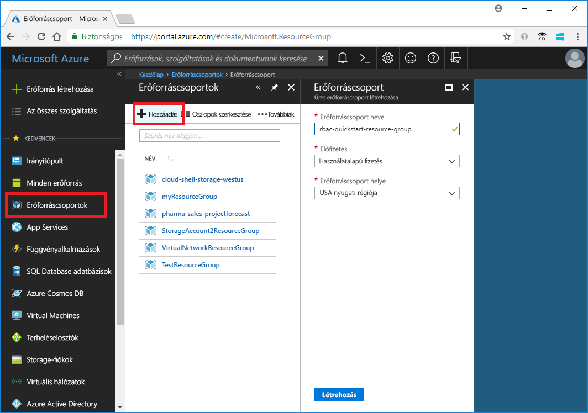
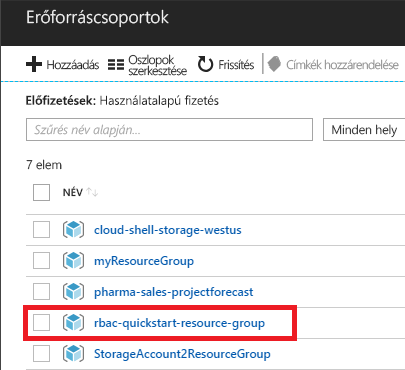
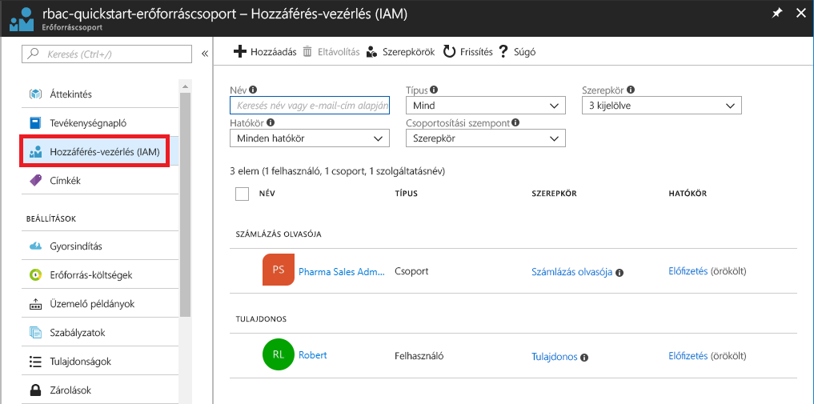
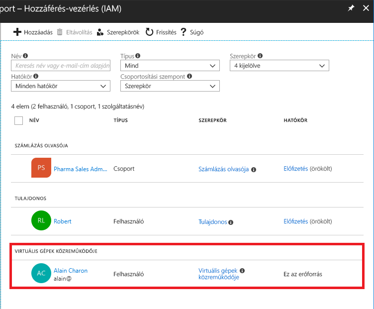
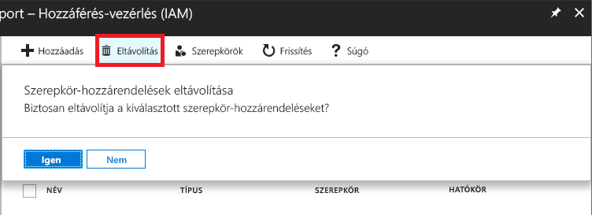
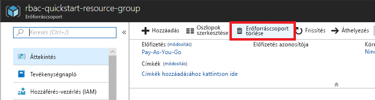

# Oktatóanyag: Hozzáférést egy felhasználó RBAC és az Azure portal használatával

A [szerepköralapú hozzáférés-vezérlés (RBAC)](overview.md) az erőforrásokhoz való hozzáférés kezelésének a módja az Azure-ban. Ebben az oktatóanyagban egy erőforráscsoportba tartozó virtuális gépek létrehozása és kezelése egy felhasználó hozzáférést ad.

Eben az oktatóanyagban az alábbiakkal fog megismerkedni:

> [!div class="checklist"]
> * Hozzáférés engedélyezése egy felhasználó egy erőforrás-csoport hatóköre:
> * Hozzáférés eltávolítása

Ha nem rendelkezik Azure-előfizetéssel, mindössze néhány perc alatt létrehozhat egy [ingyenes fiókot](https://azure.microsoft.com/free/?WT.mc_id=A261C142F) a virtuális gép létrehozásának megkezdése előtt.

## Bejelentkezés az Azure-ba

Jelentkezzen be az Azure Portalra a http://portal.azure.com webhelyen.

## Hozzon létre egy erőforráscsoportot

1. A navigációs listában válassza az **Erőforráscsoportok** lehetőséget.

1. Az **Erőforráscsoport** panel megnyitásához válassza a **Hozzáadás** elemet.

   

1. A **erőforráscsoport-név**, adja meg **rbac-resource-group**.

1. Válasszon egy előfizetést és a egy helyet.

1. Az erőforráscsoport létrehozásához válassza a **Létrehozás** lehetőséget.

1. Az erőforráscsoportok listájának frissítéséhez válassza a **Frissítés** lehetőséget.

   Az új erőforráscsoport az erőforráscsoportok listájában jelenik meg.

   

## Hozzáférés biztosítása

Az RBAC-ben a hozzáférés biztosítása egy szerepkör-hozzárendelés létrehozásával történik.

1. Listájában **erőforráscsoportok**, válassza ki az új **rbac-resource-group** erőforráscsoportot.

1. Válassza a **Hozzáférés-vezérlés (IAM)** elemet.

1. Válassza ki a **szerepkör-hozzárendelések** fülre, és tekintse meg a szerepkör-hozzárendelések listáját.

   

1. Válasszon **szerepkör-hozzárendelés hozzáadása** a hozzáadása szerepkör-hozzárendelés panel megnyitásához.

   Ha nem rendelkezik engedélyekkel szerepkörök hozzárendeléséhez, a Hozzáadás szerepkör-hozzárendelés beállítás letiltásra kerül.

   

1. A **Szerepkör** legördülő listájában válassza a **Virtuális gépek közreműködője** szerepkört.

1. A **Kiválasztás** listában válassza ki saját magát vagy egy másik felhasználót.

1. Kattintson a **Mentés** gombra a szerepkör-hozzárendelés létrehozásához.

   Néhány pillanat múlva a felhasználó társítva van a virtuális gépek Közreműködője szerepkör az rbac-resource-group erőforrás csoport hatókörben.

   

## Hozzáférés eltávolítása

Az RBAC-ben hozzáférés eltávolításához egy szerepkör-hozzárendelést kell eltávolítania.

1. Szerepkör-hozzárendelések listájában adja hozzá a felhasználót a virtuális gépek Közreműködője szerepkör melletti jelölőnégyzet bejelölésekor.

1. Válassza az **Eltávolítás** lehetőséget.

   

1. A megjelenő, a szerepkör-hozzárendelés eltávolításáról szóló üzenetben válassza az **Igen** lehetőséget.

## A fölöslegessé vált elemek eltávolítása

1. A navigációs listában válassza az **Erőforráscsoportok** lehetőséget.

1. Válasszon **rbac-resource-group** , nyissa meg az erőforráscsoportot.

1. Az erőforráscsoport törléséhez válassza az **Erőforráscsoport törlése** lehetőséget.

   

1. Az a **Opravdu chcete odstranit** panelen írja be az erőforráscsoport neve: **rbac-resource-group**.

1. Az erőforráscsoport törléséhez válassza a **Törlés** lehetőséget.

## További lépések

> [!div class="nextstepaction"]
> [Oktatóanyag: Hozzáférés biztosítása egy felhasználó számára az RBAC és a PowerShell használatával](tutorial-role-assignments-user-powershell.md)

