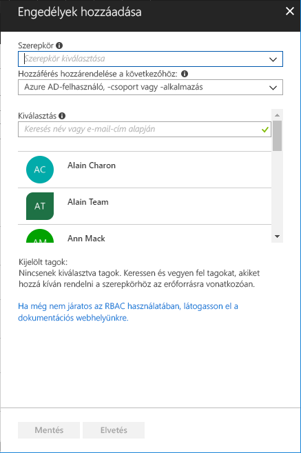

# Rövid útmutató: Hozzáférés biztosítása egy felhasználó számára az RBAC és az Azure Portal használatával

A szerepköralapú hozzáférés-vezérlés (RBAC) az erőforrásokhoz való hozzáférés kezelésének a módja az Azure-ban. Ennek a rövid útmutatónak a követésével hozzáférést engedélyezhet a felhasználó számára virtuális gépek létrehozásához és kezeléséhez egy erőforráscsoportban.

Ha nem rendelkezik Azure-előfizetéssel, mindössze néhány perc alatt létrehozhat egy [ingyenes fiókot](https://azure.microsoft.com/free/?WT.mc_id=A261C142F) a virtuális gép létrehozásának megkezdése előtt.

## Bejelentkezés az Azure-ba

Jelentkezzen be az Azure Portalra a http://portal.azure.com webhelyen.

## Hozzon létre egy erőforráscsoportot

1. A navigációs listában válassza az **Erőforráscsoportok** lehetőséget.

1. Az **Erőforráscsoport** panel megnyitásához válassza a **Hozzáadás** elemet.

   

1. Az **Erőforráscsoport neve** mezőben adja meg az **rbac-quickstart-resource-group** értéket.

1. Válasszon egy előfizetést és a egy helyet.

1. Az erőforráscsoport létrehozásához válassza a **Létrehozás** lehetőséget.

1. Az erőforráscsoportok listájának frissítéséhez válassza a **Frissítés** lehetőséget.

   Az új erőforráscsoport az erőforráscsoportok listájában jelenik meg.

   

## Hozzáférés biztosítása

Az RBAC-ben a hozzáférés biztosítása egy szerepkör-hozzárendelés létrehozásával történik.

1. Az **Erőforráscsoportok** listájában válassza az új **rbac-quickstart-resource-group** erőforráscsoportot.

1. Válassza a **Hozzáférés-vezérlés (IAM)** lehetőséget a szerepkör-hozzárendelések aktuális listájának megtekintéséhez.

   

1. Kattintson a **Hozzáadás** elemre az **Engedélyek hozzáadása** panel megnyitásához.

   Ha nem rendelkezik a szerepkörök hozzárendeléséhez szükséges engedéllyel, a **Hozzáadás** lehetőség nem jelenik meg.

   

1. A **Szerepkör** legördülő listájában válassza a **Virtuális gépek közreműködője** szerepkört.

1. A **Kiválasztás** listában válassza ki saját magát vagy egy másik felhasználót.

1. Kattintson a **Mentés** gombra a szerepkör-hozzárendelés létrehozásához.

   Néhány pillanat múlva a felhasználóhoz társítva lesz a virtuális gépek közreműködője szerepkör az rbac-quickstart-resource-group erőforráscsoport-hatókörben.

   

## Hozzáférés eltávolítása

Az RBAC-ben hozzáférés eltávolításához egy szerepkör-hozzárendelést kell eltávolítania.

1. A szerepkör-hozzárendelések listájában jelölje be a virtuális gép közreműködő szerepkörrel rendelkező felhasználó melletti jelölőnégyzetet.

1. Válassza az **Eltávolítás** lehetőséget.

   

1. A megjelenő, a szerepkör-hozzárendelés eltávolításáról szóló üzenetben válassza az **Igen** lehetőséget.

## A fölöslegessé vált elemek eltávolítása

1. A navigációs listában válassza az **Erőforráscsoportok** lehetőséget.

1. Az erőforráscsoport megnyitásához válassza az **rbac-quickstart-resource-group** lehetőséget.

1. Az erőforráscsoport törléséhez válassza az **Erőforráscsoport törlése** lehetőséget.

   

1. Az **Elvégzi a törlést** panelen írja be az erőforráscsoport nevét: **rbac-quickstart-resource-group**.

1. Az erőforráscsoport törléséhez válassza a **Törlés** lehetőséget.

## További lépések

> [!div class="nextstepaction"]
> [Oktatóanyag: Hozzáférés biztosítása egy felhasználó számára az RBAC és a PowerShell használatával](tutorial-role-assignments-user-powershell.md)

