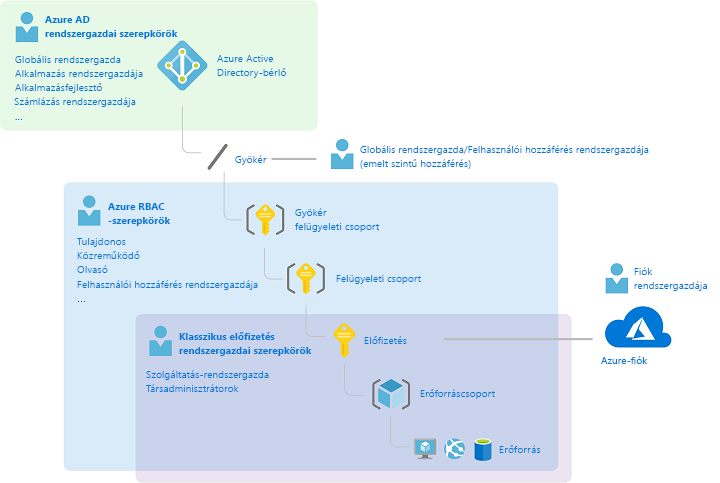
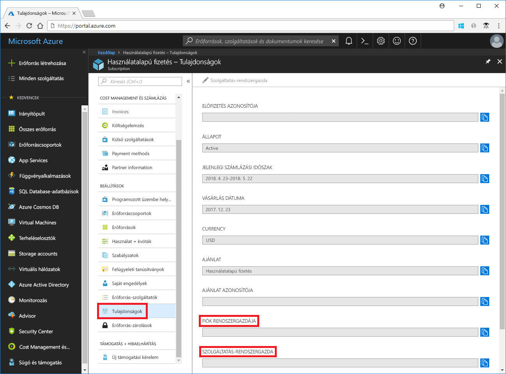
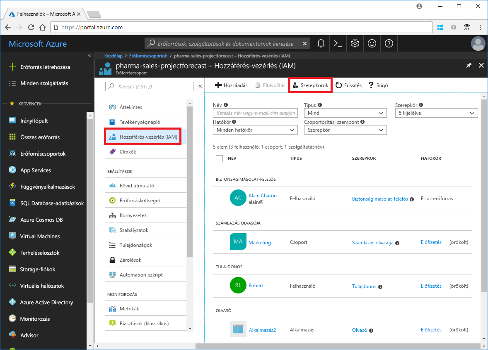
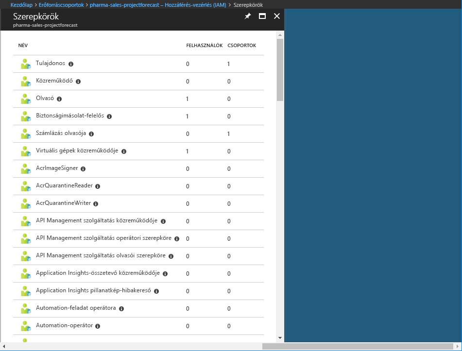
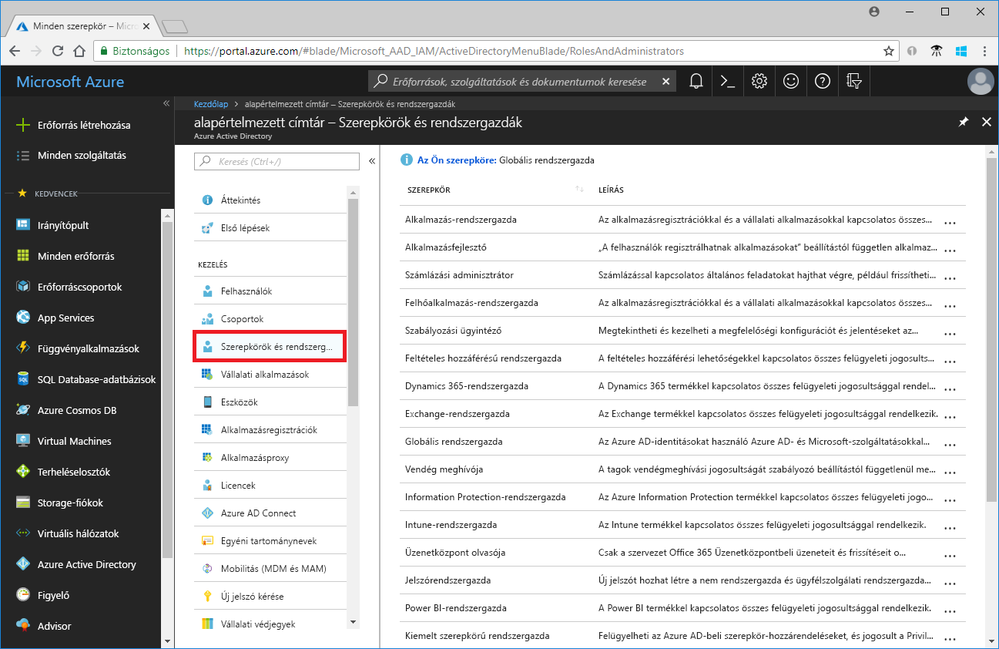
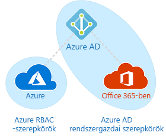

# A hagyományos előfizetés-rendszergazdai szerepkörök, az Azure RBAC-szerepkörök, és az Azure AD-rendszergazdai szerepkörök összehasonlítása

Ha még csak ismerkedik az Azure-ral, a különféle Azure-beli szerepkörök működése kissé összetettnek tűnhet. Ez a cikk segítséget nyújt az alábbi szerepkörök áttekintéséhez, és ahhoz, hogy mikor érdemes használni őket:
- A hagyományos előfizetés-rendszergazdai szerepkörök
- Azure szerepkör-alapú hozzáférésvezérlési (RBAC-) szerepkörök
- Azure Active Directory- (Azure AD-) rendszergazdai szerepkörök

## Hogyan kapcsolódnak egymáshoz a szerepkörök?

Az Azure szerepköreinek megismeréséhez érdemes tudni azok előzményeit is. Az Azure első megjelenésekor az erőforrásokhoz való hozzáférés kezeléséhez mindössze három rendszergazdai szerepkör állt rendelkezésre: a fiókadminisztrátor, a szolgáltatás-rendszergazda és a társadminisztrátor. Az Azure-erőforrásokhoz készült szerepköralapú hozzáférés-vezérlés (RBAC) később került be a funkciók közé. Az Azure RBAC egy viszonylag új engedélyezési rendszer, amely részletes hozzáférés-kezelési lehetőségeket nyújt az Azure-erőforrásokhoz. Az RBAC számos beépített szerepkört tartalmaz, különböző hatókörökben rendelhető hozzá, és saját egyéni szerepkörök létrehozását is lehetővé teszi. Az Azure AD-ben az erőforrások (pl. felhasználók, csoportok és tartományok) kezeléséhez többféle Azure AD-rendszergazdai szerepkör is rendelkezésre áll.

Az alábbi ábra a hagyományos előfizetés-rendszergazdai szerepkörök, az Azure RBAC-szerepkörök és az Azure AD-rendszergazdai szerepkörök közötti kapcsolatok áttekintését mutatja be.

## A hagyományos előfizetés-rendszergazdai szerepkörök

Az Azure három hagyományos előfizetés-rendszergazdai szerepköre a fiókadminisztrátor, a szolgáltatás-rendszergazda és a társadminisztrátor. A hagyományos előfizetés-rendszergazdák teljes körű hozzáféréssel rendelkeznek az Azure-előfizetéshez. Az Azure Portal, Azure Resource Manager API-k és a klasszikus üzemi modell segítségével végzik az erőforrások felügyeletét. Az Azure-beli regisztrációhoz használt fiók lesz automatikusan a fiókadminisztrátor és a szolgáltatás-rendszergazda. Ezután további társadminisztrátorok is hozzáadhatók. A szolgáltatás-rendszergazda és a társadminisztrátor ugyanolyan szintű hozzáféréssel rendelkeznek az előfizetés hatókörében, mint a Tulajdonos szerepkörrel (Azure RBAC szerepkör) rendelkező felhasználók. Az alábbi tábla a három hagyományos előfizetés-rendszergazdai szerepkör közötti különbségeket ismerteti.

| Hagyományos előfizetés-adminisztrátor | Korlát | Engedélyek | Megjegyzések |
| --- | --- | --- | --- |
| Fiókadminisztrátor | Azure-fiókonként 1 | <ul><li>Hozzáfér az [Azure Fiókközponthoz](https://account.azure.com/Subscriptions).</li><li>Az összes előfizetést egyetlen fiókból kezelheti.</li><li>Új előfizetéseket hozhat létre.</li><li>Megszüntetheti az előfizetéseket.</li><li>Módosíthatja az előfizetés számlázási lehetőségeit.</li><li>Megváltoztathatja a szolgáltatás-rendszergazdát.</li></ul> | Elméleti szinten az előfizetés számlázási tulajdonosa.|
| Szolgáltatás-rendszergazda | Azure-előfizetésenként 1 | <ul><li>Kezelheti a szolgáltatásokat az [Azure Portalon](https://portal.azure.com).</li><li>Felhasználókat rendelhet hozzá a társadminisztrátor szerepkörhöz.</li></ul> | Alapértelmezés szerint új előfizetések esetén a fiókadminisztrátor a szolgáltatás-rendszergazda is egyben. A szolgáltatás-rendszergazda ugyanolyan szintű hozzáféréssel rendelkezik az előfizetés hatókörében, mint a Tulajdonos szerepkörrel rendelkező felhasználók. |
| Társadminisztrátor | Előfizetésenként 200 | <ul><li>Ugyanazokkal a hozzáférési jogosultságokkal rendelkezik, mint a szolgáltatás-rendszergazda, de nem módosíthatja az előfizetések és az Azure-címtárak közötti társítást.</li><li>Felhasználókat rendelhet hozzá a társadminisztrátori szerepkörhöz, de nem változathatja meg a szolgáltatás-rendszergazda személyét.</li></ul> | A társadminisztrátor ugyanolyan szintű hozzáféréssel rendelkezik az előfizetés hatókörében, mint a Tulajdonos szerepkörrel rendelkező felhasználók. |

Az Azure Portalon az előfizetés tulajdonságainak megtekintésével ellenőrizhető, hogy kihez van hozzárendelve a fiókadminisztrátori és a szolgáltatás-rendszergazdai szerepkör.

Előfizetés-rendszergazdák hozzáadásával vagy módosításával kapcsolatos tudnivalókért olvassa el az Azure számlázási dokumentáció [Azure-előfizetés-rendszergazdák hozzáadásával és módosításával](../billing/billing-add-change-azure-subscription-administrator.md) kapcsolatos szakaszát.

### Azure-fiók és Azure-előfizetések

Egy Azure-fiók egy számlázási kapcsolatot jelent. Az Azure-fiók egy felhasználói identitásból, egy vagy több Azure-előfizetésből és az azokhoz kapcsolódó Azure-erőforrásokból áll. A fiókot létrehozó személy lesz a fiókon belül létrehozott összes előfizetés fiókadminisztrátora. Ez a személy egyben az előfizetés alapértelmezett szolgáltatás-rendszergazdája is lesz.

Az Azure-előfizetés segít az Azure-erőforrásokhoz való hozzáférés rendezésében. Ezenfelül az előfizetés révén azt is megszabhatja, hogy hogyan szeretne jelentést készíteni az erőforrások használatáról, hogy hogyan számlázzák ki azt Önnek, illetve, hogy hogyan szeretne fizetni érte. Az egyes előfizetésekhez eltérő számlázási és fizetési beállítások tartozhatnak, így irodánként, részlegenként, projektenként stb. különböző előfizetéseket és csomagokat használhat. Minden szolgáltatás egy előfizetéshez tartozik, programozott műveletekhez pedig szükség lehet az előfizetés-azonosítóra.

A fiókok és az előfizetések kezelése az [Azure Fiókközpontban](https://account.azure.com/Subscriptions) történik.
## Azure RBAC-szerepkörök

Az Azure RBAC az [Azure Resource Managerre](../azure-resource-manager/resource-group-overview.md) épülő engedélyezési rendszer, amely részletes hozzáférés-kezelési lehetőségeket nyújt például a számítási és a tárolási Azure-erőforrásokhoz. Az Azure RBAC több mint 60 beépített szerepkört tartalmaz. Négy alapvető RBAC-szerepkör létezik. Az első három minden erőforrástípusra vonatkozik:

| Azure RBAC-szerepkör | Engedélyek | Megjegyzések |
| --- | --- | --- |
| [Tulajdonos](built-in-roles.md#owner) | <ul><li>Teljes hozzáféréssel rendelkezik az összes erőforráshoz.</li><li>Hozzáférést delegálhat mások számára.</li></ul> | A szolgáltatás-rendszergazda és társadminisztrátor Tulajdonos szerepkört kap az előfizetés hatókörében. Minden erőforrástípusra alkalmazható. |
| [Közreműködő](built-in-roles.md#contributor) | <ul><li>Bármilyen típusú Azure-erőforrást létrehozhat és kezelhet.</li><li>Nem adhat hozzáférést mások számára.</li></ul> | Minden erőforrástípusra alkalmazható. |
| [Olvasó](built-in-roles.md#reader) | <ul><li>Megtekintheti az Azure-erőforrásokat.</li></ul> | Minden erőforrástípusra alkalmazható. |
| [Felhasználói hozzáférés rendszergazdája](built-in-roles.md#user-access-administrator) | <ul><li>Kezelheti az Azure-erőforrásokhoz való felhasználói hozzáférést.</li></ul> |  |

A többi beépített szerepkör adott Azure-erőforrások kezelését teszi lehetővé. Például a [Virtuális gépek közreműködője](built-in-roles.md#virtual-machine-contributor) szerepkör virtuális gépek létrehozását és kezelését teszi lehetővé. A beépített szerepkörök listája a [Beépített szerepkörök](built-in-roles.md) című szakaszban található.

Az RBAC-t csak az Azure Portal és az Azure Resource Manager API-k támogatják. Azok a felhasználók, csoportok és alkalmazások, amelyekhez RBAC-szerepkör van hozzárendelve, nem használhatják a [klasszikus Azure üzemi modell API-jait](../azure-resource-manager/resource-manager-deployment-model.md).

Az Azure Portalon az RBAC-t használó szerepkör-hozzárendelések a **Hozzáférés-vezérlés (IAM)** panelen jelennek meg. Ez a panel a portálon több helyen is megtalálható, például az előfizetésekben, az erőforráscsoportokban és különböző erőforrásokban.

Amikor a **Szerepkörök** beállításra kattint, megjelenik a beépített és egyéni szerepkörök listája.

## az Azure AD-rendszergazdai szerepkörök összehasonlítása

Az Azure AD-rendszergazdai szerepkörök az egy címtárban található Azure AD-erőforrások kezelésére szolgálnak, például felhasználók létrehozása vagy szerkesztése, rendszergazdai szerepkörök hozzárendelése másokhoz, felhasználói jelszavak visszaállítása, felhasználói licencek kezelése vagy tartományok kezelése. Az alábbi tábla a fontosabb Azure AD-rendszergazdai szerepkörök közül ismertet néhányat.

| Azure AD-rendszergazdai szerepkör | Engedélyek | Megjegyzések |
| --- | --- | --- |
| [Globális rendszergazda](../active-directory/users-groups-roles/directory-assign-admin-roles.md#company-administrator) | <ul><li>Kezeli az Azure Active Directory összes rendszergazdai funkciójához való hozzáférést, valamint az Azure Active Directoryban összevont szolgáltatásokat.</li><li>Rendszergazdai szerepköröket rendelhet másokhoz.</li><li>Bármely felhasználó és az összes többi rendszergazda jelszavát visszaállíthatja.</li></ul> | Az Azure Active Directory-bérlőre regisztráló személy lesz a globális rendszergazda. |
| [Felhasználói rendszergazda](../active-directory/users-groups-roles/directory-assign-admin-roles.md#user-account-administrator) | <ul><li>A felhasználók és csoportok minden összetevőjét létrehozhatja és kezelheti.</li><li>Támogatási jegyek kezelése</li><li>Monitorozhatja a szolgáltatás állapotát.</li><li>Módosíthatja a felhasználók, az ügyfélszolgálati rendszergazdák és egyéb felhasználói rendszergazdák jelszavát.</li></ul> |  |
| [Számlázási rendszergazda](../active-directory/users-groups-roles/directory-assign-admin-roles.md#billing-administrator) | <ul><li>Vásárlásokat hajthat végre.</li><li>Előfizetések kezelése</li><li>Támogatási jegyek kezelése</li><li>Monitorozhatja a szolgáltatás állapotát.</li></ul> |  |

Az Azure AD-rendszergazdai szerepkörök teljes listája a [Rendszergazdai szerepkörök hozzárendelése az Azure Active Directoryban](/azure/active-directory/active-directory-assign-admin-roles-azure-portal) című szakaszban található.

Az Azure Portalon az Azure AD-rendszergazdai szerepkörök listája a **Szerepkörök és adminisztrátorok** panelen található.

## Az Azure RBAC-szerepkörök és az Azure AD-rendszergazdai szerepkörök közötti különbségek

Magas szinten az Azure RBAC-szerepkörök szabályozzák az Azure-erőforrások kezelésére vonatkozó engedélyeket, az Azure AD-rendszergazdai szerepkörök pedig az Azure Active Directory-erőforrások kezelésének engedélyeit. A következő táblázat a fontosabb különbségeket ismerteti.

| Azure RBAC-szerepkörök | az Azure AD-rendszergazdai szerepkörök összehasonlítása |
| --- | --- |
| Azure-erőforrásokhoz való hozzáférés kezelése | Az Azure Active Directory-erőforrásokhoz való hozzáférést kezelik. |
| Támogatják az egyéni szerepköröket. | Saját szerepkörök nem hozhatók létre. |
| A hatókör több szinten adható meg (kezelési csoport, előfizetés, erőforráscsoport, erőforrás). | A hatókör a bérlő szintje. |
| A szerepkörre vonatkozó információk az Azure Portalon, az Azure CLI-ben, az Azure PowerShellben, az Azure Resource Manager-sablonokban vagy a REST API-n érhetők el. | A szerepkörre vonatkozó információk az Azure felügyeleti portálon, az Office 365 felügyeleti portálon, a Microsoft Graphban, és az Azure AD PowerShellben érhetők el. |

### Van átfedés az Azure RBAC-szerepkörök és az Azure AD-rendszergazdai szerepkörök között?

Alapértelmezés szerint az Azure RBAC-szerepkörök és az Azure AD-rendszergazdai szerepkörök nem terjednek ki a teljes Azure-ra és az Azure AD-re. Ha azonban egy globális rendszergazda az Azure Portalon **A globális rendszergazda kezelheti az Azure-előfizetéseket és a felügyeleti csoportokat** kapcsolóra kattintva emeli a hozzáférési szintet, a globális rendszergazda megkapja a [Felhasználói hozzáférés rendszergazdája](built-in-roles.md#user-access-administrator) szerepkört (RBAC-szerepkör) egy adott bérlő összes előfizetésében. A felhasználói hozzáférés rendszergazdája szerepkörrel a felhasználó hozzáférést biztosíthat mások számára Azure-erőforrásokhoz. Ez a kapcsoló az előfizetésekhez való hozzáférés visszanyeréséhez lehet hasznos. További információk: [Hozzáférési szint emelése Azure AD-rendszergazdaként](elevate-access-global-admin.md).

Számos Azure AD-rendszergazdai szerepkör terjed ki az Azure AD-re és a Microsoft Office 365-re, például a globális rendszergazda, valamint a felhasználói rendszergazdai szerepkörök. Ha például Ön a globális rendszergazda szerepkör tagja, akkor globális rendszergazdai képességekkel rendelkezik az Azure AD-ben és Office 365-ben, például módosításokat végezhet a Microsoft Exchange-ben és a Microsoft SharePointon. Alapértelmezés szerint azonban a globális rendszergazda nem rendelkezik hozzáféréssel az Azure-erőforrásokhoz.

## További lépések

- [Mi az a szerepköralapú hozzáférés-vezérlés (RBAC)?](overview.md)
- [Rendszergazdai szerepkörök hozzárendelése az Azure Active Directoryban](/azure/active-directory/active-directory-assign-admin-roles-azure-portal)
- [Azure-előfizetés-rendszergazdák hozzáadása vagy módosítása](/azure/billing/billing-add-change-azure-subscription-administrator)
