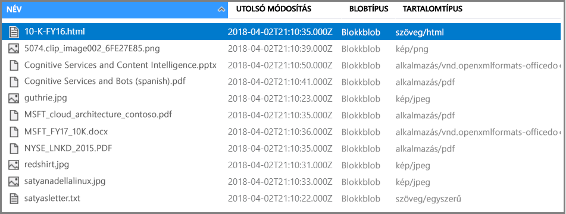
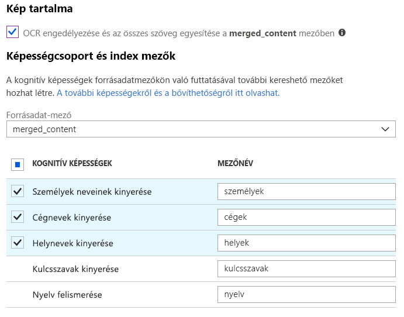
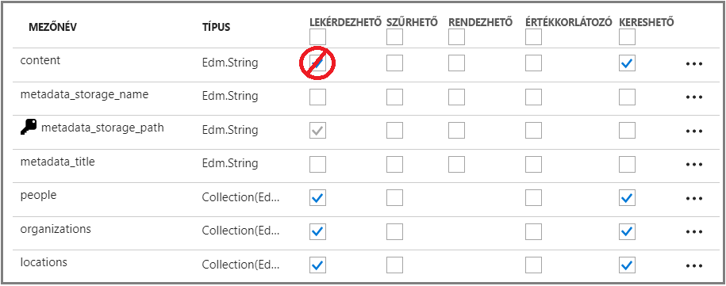
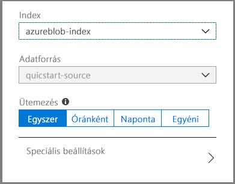
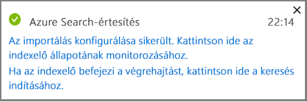
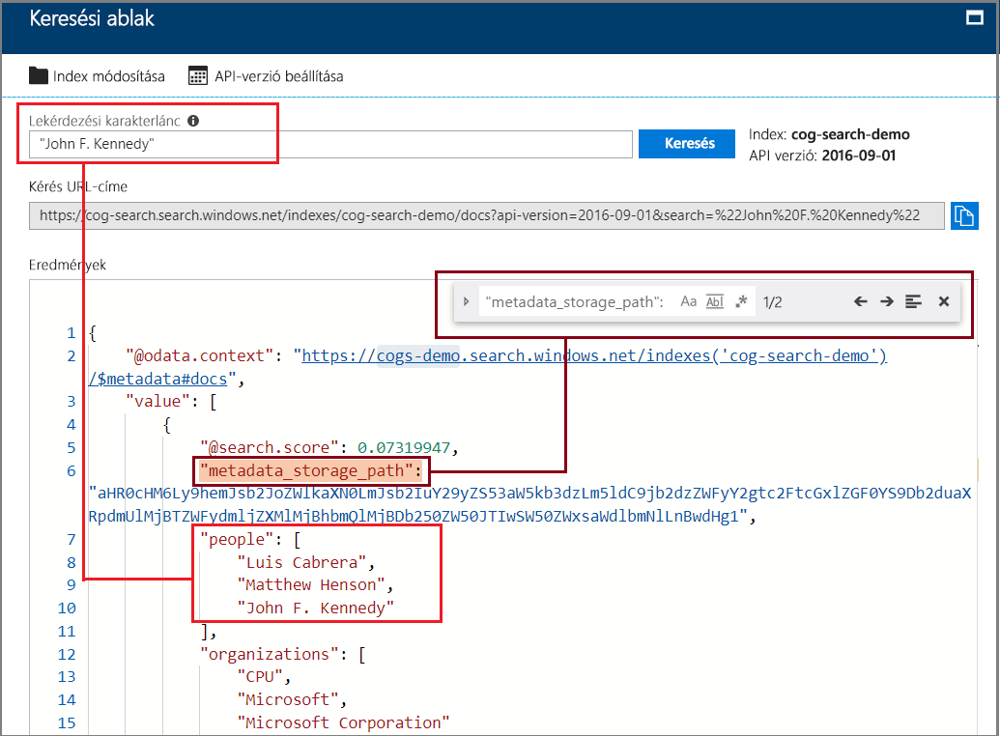

# Rövid útmutató: Kognitív keresési folyamat létrehozása képességek és mintaadatok használatával

A kognitív keresés (előzetes verzió) adatkinyerési, természetes nyelvi feldolgozási (NLP) és képfeldolgozási képességekkel bővíti az Azure Search indexelőfolyamatát, ezáltal javítja a nem kereshető vagy strukturálatlan tartalmak kereshetőségét. Az entitásfelismeréshez vagy a képelemzéshez hasonló képességek által létrehozott információk bekerülnek az Azure Search szolgáltatás egyik indexébe.

Ebben a rövid útmutatóban a kód megírása előtt kipróbálja a bővítési folyamatot az [Azure Portalon](https://portal.azure.com):

* Kezdje az Azure Blob Storage mintaadataival
* Konfigurálja az [Adatok importálása varázslót](search-import-data-portal.md) indexeléshez és bővítéshez 
* Futtassa a varázslót (egy entitásképesség észleli a személyeket, a tartózkodási helyet és a szervezeteket)
* Használja a [keresési ablakot](search-explorer.md) a bővített adatok lekérdezéséhez.

##  Támogatott régiók

A kognitív keresést a következő régiókban létrehozott Azure Search-szolgáltatásban próbálhatja ki:

* USA nyugati középső régiója
* USA déli középső régiója
* USA keleti régiója
* USA 2. keleti régiója
* USA nyugati régiója, 2.
* Közép-Kanada
* Nyugat-Európa
* Az Egyesült Királyság déli régiója
* Észak-Európa
* Dél-Brazília
* Délkelet-Ázsia
* Közép-India
* Kelet-Ausztrália

Ha nem rendelkezik Azure-előfizetéssel, mindössze néhány perc alatt létrehozhat egy [ingyenes fiókot](https://azure.microsoft.com/free/?WT.mc_id=A261C142F) a virtuális gép létrehozásának megkezdése előtt.

> [!NOTE]
> A kognitív keresés nyilvános előzetes verzióban érhető el. A képességcsoport, a képkinyerés és a normalizálás jelenleg ingyenesen érhető el. Ezeknek a funkcióknak a díjszabását a későbbiekben jelentjük be. 

## Előfeltételek

[A kognitív keresés bemutatása](cognitive-search-concept-intro.md) ismerteti a bővítés architektúráját és összetevőit. 

Ebben a forgatókönyvben kizárólag Azure-szolgáltatásokat használunk. A szükséges szolgáltatások létrehozása az előkészületek részét képezi.

+ A forrásadatokat egy Azure Blob Storage biztosítja.
+ Az Azure Search kezeli az adatbetöltést és az indexelést, a kognitív keresési bővítést, valamint a teljes szöveges keresési lekérdezéseket.

### Az Azure Search beállítása

Első lépésként regisztráljon az Azure Search szolgáltatásra. 

1. Nyissa meg az [Azure Portalt](https://portal.azure.com), és jelentkezzen be Azure-fiókjával.

1. Kattintson az **Erőforrás létrehozása** gombra, keresse meg az Azure Search szolgáltatást, majd kattintson a **Létrehozás** gombra. Ha első alkalommal próbálkozik keresési szolgáltatás beállításával, és segítségre van szüksége, tekintse meg az [Azure Search szolgáltatás a portálon történő létrehozását](search-create-service-portal.md) ismertető szakaszt.

  

1. Az Erőforráscsoport résznél hozzon létre egy erőforráscsoportot a rövid útmutató során létrehozott erőforrások tárolására. Ezáltal könnyebb lesz az erőforrások eltávolítása, miután a rövid útmutató végére ért.

1. A helyen, válasszon egyet az a [támogatott régiók](#supported-regions) Cognitive search.

1. A Tarifacsomagra vonatkozóan az oktatóanyagok és rövid útmutatók elvégzéséhez létrehozhat egy **ingyenes** szolgáltatást. A saját adatok mélyrehatóbb vizsgálatához hozzon létre egy **Alapszintű** vagy **Standard** [fizetős szolgáltatást](https://azure.microsoft.com/pricing/details/search/). 

  Az ingyenes szolgáltatás legfeljebb 3 indexet és 2 perc indexelést tartalmazhat, 16 MB-os maximális blobmérettel, amely nem elegendő a kognitív keresés funkcióinak teljes körű használatához. A különböző csomagok korlátozásait a [szolgáltatási korlátozásokat](search-limits-quotas-capacity.md) ismertető részben tekintheti meg.

  
  
  > [!NOTE]
  > A kognitív keresés nyilvános előzetes verzióban érhető el. A képességcsoportok végrehajtása jelenleg minden csomagban elérhető, az ingyenes csomagot is beleértve. Ennek a funkciónak a díjszabását a későbbiekben jelentjük be.

1. A szolgáltatási információk gyors eléréséhez rögzítse a szolgáltatást az irányítópulton.

  

### Az Azure Blob szolgáltatás beállítása és a mintaadatok betöltése

A bővítési folyamat az [Azure Search indexelői](search-indexer-overview.md) által támogatott Azure-adatforrásokból hívja le az adatokat. Ebben a gyakorlatban a blobtárolót használjuk több tartalomtípus bemutatásához.

1. [Töltsön le mintaadatokat](https://1drv.ms/f/s!As7Oy81M_gVPa-LCb5lC_3hbS-4), amelyek különböző típusú fájlok kis készletéből állnak. 

1. Regisztráljon az Azure Blob Storage-ra, hozzon létre egy tárfiókot, jelentkezzen be a Storage Explorerbe, és hozzon létre egy tárolót. Részletes útmutatást az [Azure Storage Explorer rövid útmutatójában](../storage/blobs/storage-quickstart-blobs-storage-explorer.md) talál.

1. A mintafájlok az Azure Storage Explorerrel való feltöltéséhez a létrehozott tárolóban kattintson a **Feltöltés** gombra.

  

## A bővítési folyamat létrehozása

Lépjen vissza az Azure Search szolgáltatás Irányítópult lapjára, és kattintson a parancssávon található **Adatok importálása** elemre, ahol négy lépésben beállíthatja a bővítést.

### 1. lépés: Adatforrás létrehozása

A **Csatlakozás az adatokhoz** > **Azure Blob Storage** menüpontban válassza ki a létrehozott fiókot és tárolót. Adjon nevet az adatforrásnak, a többi beállításnál pedig használja az alapértelmezett értékeket. 

   

Az adatforrás létrehozásához kattintson az **OK** gombra.

Az **adatimportálási** varázsló használatának egyik előnye, hogy az az index létrehozására is képes. Az adatforrás létrehozásával egyidejűleg a varázsló egy indexsémát is létrehoz. Az index létrehozása eltarthat néhány másodpercig.

### 2. lépés: Kognitív képességek hozzáadása

Ezután adja hozzá a bővítési lépéseket az indexelési folyamathoz. A portál előre meghatározott kognitív képességeket biztosít a kép- és szövegelemzéshez. A portálon egy képességcsoport egyetlen forrásmezőn végez műveleteket. Ez kis célnak tűnhet, de az Azure-blobok esetében a blobdokumentum (például egy Word-dokumentum vagy egy PowerPoint-bemutató) legnagyobb részét a `content` mező tartalmazza. Ez a mező tehát nem ideális bemenet, mert egy blob összes tartalma szerepel benne.

Előfordulnak olyan esetek, amikor ki szeretné nyerni a szöveges tartalmat olyan fájlokból, amelyek főleg beolvasott képekből állnak. Ilyenek például a lapolvasók által létrehozott PDF-fájlok. Az Azure Search automatikusan ki tudja nyerni a dokumentum beágyazott képeinek tartalmát. Ehhez jelölje be az **OCR engedélyezése és az összes szöveg egyesítése a merged_content mezőben** elem melletti jelölőnégyzetet. Ez a művelet automatikusan létre fog hozni egy `merged_content` mezőt, amely tartalmazza a dokumentumból kinyert szöveget, valamint a dokumentum beágyazott képeinek szöveges alakját. Ha megadja ezt a beállítást, a `Source data field` értéke `merged_content` lesz.

A **Kognitív képességek hozzáadása** résznél válasszon ki olyan képességeket, amelyek a természetes nyelvek feldolgozását végzik. Ebben a rövid útmutatóban válassza az entitások felismerése lehetőséget a személyekhez, szervezetekhez és helyekhez.

Kattintson az **OK** gombra a definíció elfogadásához.
   
  

A természetes nyelvi feldolgozási képességek a mintaadatkészletbeli szöveges tartalmakon végeznek műveleteket. Mivel egyetlen képfeldolgozási lehetőséget sem választottunk ki, a mintaadatkészletben szereplő JPEG-fájlok ebben a rövid útmutatóban nem lesznek feldolgozva. 

### 3. lépés: Az index konfigurálása

Emlékszik még az adatforrással együtt létrehozott indexre? Ebben a lépésben megtekintheti az index sémáját, és a beállítások felülvizsgálatára is lehetősége lesz. 

Ebben a rövid útmutatóban a varázsló észszerű alapértelmezett beállításokat határoz meg: 

+ Minden egyes indexnek rendelkeznie kell egy névvel. Az adatforrástípus esetében az alapértelmezett név az *azureblob-index*.

+ Minden dokumentumnak rendelkeznie kell egy kulccsal. A varázsló egy egyedi értékekkel rendelkező mezőt választ ki. Ebben a rövid útmutatóban a kulcs a *metadata_storage_path*.

+ Minden mezőgyűjteménynek rendelkeznie kell az értékeket leíró adatokat tartalmazó mezőkkel, és minden mezőnek rendelkeznie kell olyan indexattribútumokkal, amelyek leírják a mező keresési forgatókönyvbeli szerepét. 

Mivel megadott egy képességcsoportot, a varázsló feltételezi, hogy a forrásadatmezőt és a kimeneti mezőket a képességekkel szeretné létrehozni. Ezért a portál indexmezőket ad a `content`, `people`, `organizations` és `locations` mezőhöz. Figyelje meg, hogy a varázsló az említett mezők esetében automatikusan engedélyezi a Lekérdezhető és Kereshető attribútumot.

Az **Index testreszabása** résznél tekintse át a mezők attribútumait, hogy láthassa, a rendszer hogyan használja azokat egy indexben. A Kereshető attribútum azt jelzi, hogy a mező kereshető. A Lekérdezhető attribútum azt jelzi, hogy visszaadható az eredményekben. 

Fontolja meg a Lekérdezhető attribútum törlését a `content` mezőből. A blobokban ez a mező több ezer sort is kitölthet, amely a **Keresési ablakhoz** hasonló eszközökkel nehezen olvasható.

Kattintson az **OK** gombra az index definíciójának elfogadásához.

  

> [!NOTE]
> A nem használt mezőket az áttekinthetőség kedvéért levágtuk. A portálon ugyanez a lista több mezővel jelenik meg.

### 4. lépés: Az indexelő konfigurálása

Az indexelő az indexelési folyamatot irányító magas szintű erőforrás. Ez az erőforrás határozza meg az adatforrás nevét, az indexet és a végrehajtás gyakoriságát. Az **Adatok importálása** varázsló mindig egy indexelőt eredményez, amely ismétlődő jelleggel futtatható.

Az **Indexelő** lapon nevezze el az indexelőt, és az azonnali futtatáshoz használja az alapértelmezett „egyszeri futtatás” lehetőséget. 

  

Az adatok importálásához, bővítéséhez és indexeléséhez kattintson az **OK** gombra.

  

Az indexelés és a bővítés sok időt vehet igénybe, ezért a funkció kipróbálásához kisebb adatkészletek használatát javasoljuk. Az indexelés állapotát az Azure Portal Értesítések területén követheti figyelemmel. 

## Lekérdezés a Keresési ablakban

Miután az index létrejött, lekérdezéseket küldhet be, amelyek dokumentumokat adnak vissza az indexből. A portálon használja a **Keresési ablakot** a lekérdezések futtatásához és az eredmények megtekintéséhez. 

1. A keresési szolgáltatás Irányítópult lapján kattintson a parancssávon található **Keresési ablak** elemre.

1. A létrehozott index kiválasztásához kattintson az **Index módosítása** lehetőségre az oldal tetején.

1. Adjon meg egy keresési karakterláncot az index lekérdezéséhez, például: „John F. Kennedy”.

A rendszer JSON-formátumban adja vissza az eredményeket, amely különösen az Azure-blobokból származó nagyméretű dokumentumok esetén részletes és nehezen olvasható lehet. 

Ha az eredményeket nem lehet egyszerűen áttekinteni, a CTRL-F billentyűkombinációval kereshet a dokumentumokban. Jelen lekérdezés esetén a JSON-ban a „John F. Kennedy” kifejezésre keresve jelenítheti meg a kifejezés előfordulásait. 

A CTRL-F billentyűkombináció abban is segítségére lehet, hogy meghatározza az egy adott eredményhalmazban szereplő dokumentumok számát. Az Azure-blobok esetében a portál a „metadata_storage_path” kulcsot választja, mert annak minden értéke egyedi a dokumentumban. A CTRL-F billentyűkombinációval keressen a „metadata_storage_path” kifejezésre, amely visszaadja a dokumentumok számát. Jelen lekérdezés esetében két dokumentum tartalmazza a „John F. Kennedy” kifejezést.

  

## Legfontosabb ismeretek

Az első bővített indexelési gyakorlat végére ért. Ennek a rövid útmutatónak a célja az volt, hogy bemutassa a legfontosabb alapelveket, és végigvezesse a varázsló lépésein, hogy saját adatait felhasználva gyorsan elkészíthesse egy kognitív keresési megoldás prototípusát.

Az általunk közvetíteni kívánt legfontosabb alapelvek egyike az Azure-adatforrásoktól való függőség. A kognitív keresési bővítés az indexelőkhöz kötődik, az indexelők pedig Azure- és forrásspecifikusak. Bár ez a rövid útmutató az Azure Blob Storage-ot használja, más Azure-adatforrások használata is lehetséges. További információkért lásd az [indexelők az Azure Search szolgáltatásban történő használatának](search-indexer-overview.md) ismertetését.

Egy másik fontos alapelv szerint a képességek a bemeneti mezőkön végeznek műveleteket. A portálon minden képességhez egyetlen forrásmezőt kell választania. A kódban a bemenetek lehetnek más mezők, vagy egy felsőbb rétegbeli képesség kimenetei.

 Egy képesség bemenetei egy index kimeneti mezőjéhez vannak rendelve. Belsőleg a portál [jegyzeteket](cognitive-search-concept-annotations-syntax.md) állít be és definiál egy [képességcsoportot](cognitive-search-defining-skillset.md), amellyel megalapozza a műveletek sorrendjét és az általános folyamatot. Ezeket a lépéseket a rendszer elrejti a portálon, ám az alapelvek ismerete fontos, amikor hozzálát a kód írásához.

Végezetül megtanulta, hogy az eredmények az index lekérdezésével tekinthetők meg. Végeredményben az Azure Search egy kereshető indexet biztosít, amelynek lekérdezését az [egyszerű](https://docs.microsoft.com/rest/api/searchservice/simple-query-syntax-in-azure-search) vagy a [teljes lekérdezési szintaxis](https://docs.microsoft.com/rest/api/searchservice/lucene-query-syntax-in-azure-search) használatával végezheti el. A bővített mezőket tartalmazó index ugyanúgy működik, akár az összes többi. Ha standard vagy [egyéni elemzőket](search-analyzers.md), [pontozási profilokat](https://docs.microsoft.com/rest/api/searchservice/add-scoring-profiles-to-a-search-index), [szinonimákat](search-synonyms.md), [jellemzőalapú szűrőket](search-filters-facets.md), földrajzihely-alapú keresést vagy egyéb Azure Search-szolgáltatásokat szeretne használni, természetesen azt is megteheti.

## Az erőforrások eltávolítása

Ha befejezte a szolgáltatással való ismerkedést, a fölöslegessé vált elemek eltávolítása leggyorsabban az Azure Search és az Azure Blob szolgáltatást tartalmazó erőforráscsoport törlésével végezhető el.  

Feltéve, hogy mindkét szolgáltatást ugyanabban a csoportban helyezte üzembe, törölje az erőforráscsoportot, amellyel véglegesen eltávolíthatja annak teljes tartalmát, a gyakorlat során létrehozott összes szolgáltatást és tárolt tartalmat is beleértve. A portálon az erőforráscsoport neve az egyes szolgáltatások Áttekintés lapján szerepel.

## További lépések

Az indexeléssel és a bővítéssel tovább kísérletezhet, ha a varázslót más képességekkel és forrás-adatmezőkkel ismételten futtatja. A lépések megismétléséhez törölje az indexelőt, majd hozza létre újra az indexelőt más választott beállításokkal.

+ Az **Áttekintés** > **Indexelők** résznél válassza ki a létrehozott indexet, majd kattintson a **Törlés** lehetőségre.

+ Az **Áttekintés** résznél kattintson duplán az **Indexelők** csempére. Keresse meg a létrehozott indexelőt, és törölje azt.

Vagy a létrehozott mintaadatokat és szolgáltatásokat újból felhasználva a következő oktatóanyagból megtanulhatja, hogyan végezheti el ugyanazokat a feladatokat programozott módon. 

> [!div class="nextstepaction"]
> [Oktatóanyag: A kognitív keresést alkalmazó REST API-k megismerése](cognitive-search-tutorial-blob.md)
