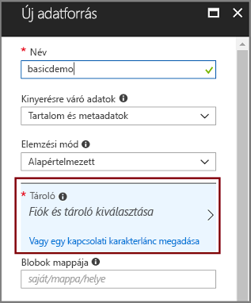

# Gyors útmutató: Folyamat létrehozása a kognitív keresés használatával képességeit, és mintaadatok

A kognitív keresés (előzetes verzió) adatkinyerési, természetes nyelvi feldolgozási (NLP) és képfeldolgozási képességekkel bővíti az Azure Search indexelőfolyamatát, ezáltal javítja a nem kereshető vagy strukturálatlan tartalmak kereshetőségét. 

A kognitív keresés folyamat integrálható [Cognitive Services-erőforrások](https://azure.microsoft.com/services/cognitive-services/) – például [OCR](cognitive-search-skill-ocr.md), [nyelvfelismerés](cognitive-search-skill-language-detection.md), [entitások felismerése](cognitive-search-skill-entity-recognition.md)– egy indexelő folyamatba. Az AI-algoritmusokat, Cognitive Services segítségével keresse meg a mintákat, szolgáltatások és jellemzői forrásadatok visszaadni struktúrák és a szöveges tartalom használható teljes szöveges keresési megoldások Azure Search alapján.

Ebben a rövid útmutatóban a felderítési bővítést az első folyamat létrehozása a [az Azure portal](https://portal.azure.com) egy egyetlen sor kód írása előtt:

> [!div class="checklist"]
> * Kezdje az Azure Blob Storage mintaadataival
> * Konfigurálja a [ **adatimportálás** ](search-import-data-portal.md) varázsló az indexelés kognitív és Adatbővítés 
> * Futtassa a varázslót (egy entitásképesség észleli a személyeket, a tartózkodási helyet és a szervezeteket)
> * Használat [ **keresési ablak** ](search-explorer.md) a bővített adatok lekérdezése

##  Támogatott régiók

A kognitív keresést a következő régiókban létrehozott Azure Search-szolgáltatásban próbálhatja ki:

* USA nyugati középső régiója
* USA déli középső régiója
* USA keleti régiója
* USA 2. keleti régiója
* USA nyugati régiója, 2.
* Közép-Kanada
* Nyugat-Európa
* Az Egyesült Királyság déli régiója
* Észak-Európa
* Dél-Brazília
* Délkelet-Ázsia
* Közép-India
* Kelet-Ausztrália

Ha nem rendelkezik Azure-előfizetéssel, mindössze néhány perc alatt létrehozhat egy [ingyenes fiókot](https://azure.microsoft.com/free/?WT.mc_id=A261C142F) a virtuális gép létrehozásának megkezdése előtt.

> [!NOTE]
> December 21, 2018-as, lesz egy Cognitive Services-erőforrás társítása egy Azure Search-képességek alkalmazási lehetőségét. Ez lehetővé teszi indexmezők végrehajtási díjszabási elindításához. Ezen a napon is megkezdjük a dokumentumfeltörést fázis részeként a lemezkép kinyerési díjszabási. A szövegek dokumentumokból való kinyerése továbbra is ingyenesen használható.
>
> A végrehajtás beépített képességek díjat számítunk fel a meglévő [használatalapú-as-, a Cognitive Services nyissa meg az árat](https://azure.microsoft.com/pricing/details/cognitive-services/) . Kép kinyerési díjszabás az előzetes verziók díjszabása díjat számítunk fel, és a leírt a [díjszabását ismertető oldalt az Azure Search](https://go.microsoft.com/fwlink/?linkid=2042400). További [információ](cognitive-search-attach-cognitive-services.md).

## Előfeltételek

[A kognitív keresés bemutatása](cognitive-search-concept-intro.md) ismerteti a bővítés architektúráját és összetevőit. 

Ebben a forgatókönyvben kizárólag Azure-szolgáltatásokat használunk. A szükséges szolgáltatások létrehozása az előkészületek részét képezi.

+ [Az Azure Blob storage](https://azure.microsoft.com/services/storage/blobs/) biztosít a forrásadatok
+ [A cognitive Services](https://azure.microsoft.com/services/cognitive-services/) biztosít az AI (hozhat létre ezen erőforrások beágyazott, a folyamat megadása esetén)
+ [Az Azure Search](https://azure.microsoft.com/services/search/) a képi elemekben gazdag indexelési folyamat és a egy gazdag szabad formátumú szöveges keresés biztosít az egyéni alkalmazások használata

### Az Azure Search beállítása

Első lépésként regisztráljon az Azure Search szolgáltatásra. 

1. Nyissa meg az [Azure Portalt](https://portal.azure.com), és jelentkezzen be Azure-fiókjával.

1. Kattintson az **Erőforrás létrehozása** gombra, keresse meg az Azure Search szolgáltatást, majd kattintson a **Létrehozás** gombra. Ha első alkalommal próbálkozik keresési szolgáltatás beállításával, és segítségre van szüksége, tekintse meg az [Azure Search szolgáltatás a portálon történő létrehozását](search-create-service-portal.md) ismertető szakaszt.

  

1. Az erőforráscsoport területen hozzon létre egy új ebben a rövid útmutatóban létrehozott összes erőforrást tartalmazó erőforráscsoport. Ezáltal könnyebb lesz az erőforrások eltávolítása, miután a rövid útmutató végére ért.

1. A helyen, válasszon egyet az a [támogatott régiók](#supported-regions) cognitive search.

1. A Tarifacsomagra vonatkozóan az oktatóanyagok és rövid útmutatók elvégzéséhez létrehozhat egy **ingyenes** szolgáltatást. A saját adatok mélyrehatóbb vizsgálatához hozzon létre egy **Alapszintű** vagy **Standard** [fizetős szolgáltatást](https://azure.microsoft.com/pricing/details/search/). 

  Az ingyenes szolgáltatás legfeljebb 3 indexet és 2 perc indexelést tartalmazhat, 16 MB-os maximális blobmérettel, amely nem elegendő a kognitív keresés funkcióinak teljes körű használatához. A különböző csomagok korlátozásait a [szolgáltatási korlátozásokat](search-limits-quotas-capacity.md) ismertető részben tekintheti meg.

  

  > [!NOTE]
  > A kognitív keresés nyilvános előzetes verzióban érhető el. A képességcsoportok végrehajtása jelenleg minden csomagban elérhető, az ingyenes csomagot is beleértve. Fogja tudni elvégezni a végrehajtott információbeolvasás korlátozott számú fizetős Cognitive Services-erőforrás társítása nélkül. További [információ](cognitive-search-attach-cognitive-services.md).

1. A szolgáltatási információk gyors eléréséhez rögzítse a szolgáltatást az irányítópulton.

  

### Az Azure Blob szolgáltatás beállítása és a mintaadatok betöltése

A bővítési folyamat az [Azure Search indexelői](search-indexer-overview.md) által támogatott Azure-adatforrásokból hívja le az adatokat. Vegye figyelembe, hogy az Azure Table Storage a kognitív keresés nem támogatott. Ebben a gyakorlatban a blobtárolót használjuk több tartalomtípus bemutatásához.

1. [Töltsön le mintaadatokat](https://1drv.ms/f/s!As7Oy81M_gVPa-LCb5lC_3hbS-4), amelyek különböző típusú fájlok kis készletéből állnak. 

1. Iratkozzon fel az Azure Blob storage, hozzon létre egy tárfiókot, nyissa meg a Blob szolgáltatás oldalt, és hozzon létre egy tárolót. 

1. A tárolóban, állítsa a nyilvános hozzáférés szintet **tároló (névtelen olvasási hozzáférés tárolók és blobok)**. További információkért lásd: ["Tároló létrehozása" szakaszban](../storage/blobs/storage-unstructured-search.md#create-a-container) a a *strukturálatlan adatok keresése* oktatóanyag.

1. Kattintson a létrehozott tárolót, **feltöltése** az előző lépésben letöltött minta fájlok feltöltéséhez.

  

## A bővítési folyamat létrehozása

Térjen vissza az Azure Search szolgáltatás irányítópult-oldalon, és kattintson a **adatimportálás** négy lépésben cognitive Adatbővítés beállításához a parancssávon.

  

### 1. lépés: Adatforrás létrehozása

A **csatlakozás az adatokhoz**, válassza a **Azure Blob storage**, válassza ki a fiókot és a létrehozott tárolóba. Adjon nevet az adatforrásnak, a többi beállításnál pedig használja az alapértelmezett értékeket. 

  

Folytassa a következő lapra.

  

### 2. lépés: Kognitív képességek hozzáadása

Ezután adja hozzá a bővítési lépéseket az indexelési folyamathoz. Ha nem rendelkezik a Cognitive Services-erőforrás, akkor regisztráljon olyan díjmentes verziója, amely felkínálja 20 tranzakció naponta. A mintaadatok 14 fájlok áll, így a napi lefoglalt feladatpercek többnyire használható a varázsló futtatása után.

1. Bontsa ki a **csatolása a Cognitive Services** a Cognitive Services API-k resourcing beállításainak megtekintéséhez. Ez az oktatóanyag az alkalmazásában, használhatja a **ingyenes** erőforrás.

  

2. Bontsa ki a **hozzáadása végrehajtott Információbeolvasás** , és válassza ki, amelyek hajtanak végre természetes nyelvi feldolgozási képességek. Ebben a rövid útmutatóban válassza az entitások felismerése lehetőséget a személyekhez, szervezetekhez és helyekhez.

  

  A portál biztosít beépített tudását a OCR feldolgozási és szöveg elemzése. A portálon egy képességcsoport egyetlen forrásmezőn végez műveleteket. Ez kis célnak tűnhet, de az Azure-blobok esetében a blobdokumentum (például egy Word-dokumentum vagy egy PowerPoint-bemutató) legnagyobb részét a `content` mező tartalmazza. Ez a mező tehát nem ideális bemenet, mert egy blob összes tartalma szerepel benne.

3. Folytassa a következő lapra.

  

> [!NOTE]
> A természetes nyelvi feldolgozási képességek a mintaadatkészletbeli szöveges tartalmakon végeznek műveleteket. Mivel nem kiválasztjuk a OCR-beállítást, a minta adatkészletben JPEG, PNG és fájlok ebben a rövid útmutatóban nem dolgozható fel. 

### 3. lépés: Az index konfigurálása

A varázsló általában tudja kikövetkeztetni egy alapértelmezett indexet. Ebben a lépésben megtekintheti a létrehozott indexet sémát és potenciálisan a beállítások módosításához. Alább az alapértelmezett index létrejön a bemutató Blob adatkészletében.

Ebben a rövid útmutatóban a varázsló észszerű alapértelmezett beállításokat határoz meg: 

+ Alapértelmezés szerint ez *azureblob-index* az adatforrás típusa alapján. 

+ Alapértelmezett mezők az eredeti forrás adatmező alapulnak (`content`), továbbá a táblakimeneti mezők (`people`, `organizations`, és `locations`) a cognitive folyamat által létrehozott. Alapértelmezett adattípusok vannak következtetni a metaadatokat és az adat-mintavételezés.

+ Alapértelmezett kulcs *metadata_storage_path* (ezt a mezőt tartalmaz egyedi értékeket).

+ Alapértelmezett attribútumok **lekérhető** és **kereshető** ezekben a mezőkben. **Kereshető** azt jelzi, hogy a mező kereshető. **Lekérhető** azt jelenti, hogy az eredmények adhatók vissza azt. A varázsló feltételezi, hogy azt szeretné, hogy ezek a mezők lekérhetőként és kereshetőként lennie, mert egy indexmezők létrehozta őket.

  

Nézze meg a strikethrough és kérdőjel a a **lekérhető** attribútum által a `content` mező. A szöveges adatokat használó blob dokumentumok a `content` mező tartalmazza a potenciálisan futó több ezer sorok, a fájlok tömeges. Ha a fájl tartalmának átadni az Ügyfélkód van szüksége, ellenőrizze, hogy **lekérhető** kiválasztott marad. Ellenkező esetben fontolja meg ennek az attribútumnak törlésével a `content` Ha kivont elemek (`people`, `organizations`, és `locations`) elegendőek a célokra.

Egy mező jelölés **lekérhető** nem jelenti azt, hogy a mező *kell* a keresési eredmények között szerepelnie. A keresési eredmények összeállítás pontosan szabályozhatja a **$select** lekérdezési paraméter megadása a szerepeltetendő mezőket. A szöveges adatokat használó mezők, például `content`, a **$select** paraméter értéke a megoldás számára biztosít az alkalmazás, ügyfél-kódot, hogy Mindeközben az emberi felhasználók kezelhető keresési eredmények hozzáfér minden olyan információt kell -n keresztül a **lekérhető** attribútum.
  
Folytassa a következő lapra.

  

### 4. lépés: Az indexelő konfigurálása

Az indexelő az indexelési folyamatot irányító magas szintű erőforrás. Meghatározza az adatforrás nevét, egy célindex és a végrehajtás gyakoriságát. Az **Adatok importálása** varázsló mindig egy indexelőt eredményez, amely ismétlődő jelleggel futtatható.

Az a **indexelő** lapon fogadja el az alapértelmezett nevet, és használja a **egyszeri futtatás** azonnal futtatni a beállítással ütemezheti. 

  

Kattintson a **küldés** hozhat létre, és egyszerre is futtathatja az indexelőt.

## A figyelő indexelése

Adatbővítés lépéseket, mint a szokásos szöveges indexelő hosszabb időt vesz igénybe. A varázsló kell nyissa meg az indexelő listát az Áttekintés lapon, hogy nyomon tudja. Önkiszolgáló navigációs sávján keresse az Áttekintés lapon, majd kattintson **indexelők**.

A figyelmeztetés akkor jelenik meg, mert JPG és PNG-fájlok olyan fájlok, kép, és hogy nincs megadva ez a folyamat az optikai Karakterfelismerés szakértelem. Csonkolási értesítéseket is találhat. Az Azure Search korlátozza a kinyerés az ingyenes szinten 32000 karakter hosszúságú lehet.

  

Az indexelés és a bővítés sok időt vehet igénybe, ezért a funkció kipróbálásához kisebb adatkészletek használatát javasoljuk. 

## Lekérdezés a Keresési ablakban

Miután az index létrejött, lekérdezéseket küldhet be, amelyek dokumentumokat adnak vissza az indexből. A portálon használja a **Keresési ablakot** a lekérdezések futtatásához és az eredmények megtekintéséhez. 

1. A keresési szolgáltatás Irányítópult lapján kattintson a parancssávon található **Keresési ablak** elemre.

1. A létrehozott index kiválasztásához kattintson az **Index módosítása** lehetőségre az oldal tetején.

1. Adja meg a keresési karakterláncot az index lekérdezése például `search=Microsoft&searchFields=organizations`.

A rendszer JSON-formátumban adja vissza az eredményeket, amely különösen az Azure-blobokból származó nagyméretű dokumentumok esetén részletes és nehezen olvasható lehet. Ha az eredményeket nem lehet egyszerűen áttekinteni, a CTRL-F billentyűkombinációval kereshet a dokumentumokban. Ehhez a lekérdezéshez adott feltételek belül a JSON sikerült keresési. 

A CTRL-F billentyűkombináció abban is segítségére lehet, hogy meghatározza az egy adott eredményhalmazban szereplő dokumentumok számát. Az Azure-blobok esetében a portál a „metadata_storage_path” kulcsot választja, mert annak minden értéke egyedi a dokumentumban. A CTRL-F billentyűkombinációval keressen a „metadata_storage_path” kifejezésre, amely visszaadja a dokumentumok számát. 

  

## Legfontosabb ismeretek

Ön teljesítette az első cognitive bővített indexelés gyakorlat. Ennek a rövid útmutatónak a célja az volt, hogy bemutassa a legfontosabb alapelveket, és végigvezesse a varázsló lépésein, hogy saját adatait felhasználva gyorsan elkészíthesse egy kognitív keresési megoldás prototípusát.

Az általunk közvetíteni kívánt legfontosabb alapelvek egyike az Azure-adatforrásoktól való függőség. A kognitív keresési bővítés az indexelőkhöz kötődik, az indexelők pedig Azure- és forrásspecifikusak. Bár ez a rövid útmutató az Azure Blob Storage-ot használja, más Azure-adatforrások használata is lehetséges. További információkért lásd az [indexelők az Azure Search szolgáltatásban történő használatának](search-indexer-overview.md) ismertetését.

Egy másik fontos alapelv szerint a képességek a bemeneti mezőkön végeznek műveleteket. A portálon minden képességhez egyetlen forrásmezőt kell választania. A kódban a bemenetek lehetnek más mezők, vagy egy felsőbb rétegbeli képesség kimenetei.

 Egy képesség bemenetei egy index kimeneti mezőjéhez vannak rendelve. Belsőleg a portál [jegyzeteket](cognitive-search-concept-annotations-syntax.md) állít be és definiál egy [képességcsoportot](cognitive-search-defining-skillset.md), amellyel megalapozza a műveletek sorrendjét és az általános folyamatot. Ezeket a lépéseket a rendszer elrejti a portálon, ám az alapelvek ismerete fontos, amikor hozzálát a kód írásához.

Végezetül megtanulta, hogy az eredmények az index lekérdezésével tekinthetők meg. Végeredményben az Azure Search egy kereshető indexet biztosít, amelynek lekérdezését az [egyszerű](https://docs.microsoft.com/rest/api/searchservice/simple-query-syntax-in-azure-search) vagy a [teljes lekérdezési szintaxis](https://docs.microsoft.com/rest/api/searchservice/lucene-query-syntax-in-azure-search) használatával végezheti el. A bővített mezőket tartalmazó index ugyanúgy működik, akár az összes többi. Ha standard vagy [egyéni elemzőket](search-analyzers.md), [pontozási profilokat](https://docs.microsoft.com/rest/api/searchservice/add-scoring-profiles-to-a-search-index), [szinonimákat](search-synonyms.md), [jellemzőalapú szűrőket](search-filters-facets.md), földrajzihely-alapú keresést vagy egyéb Azure Search-szolgáltatásokat szeretne használni, természetesen azt is megteheti.

## Az erőforrások eltávolítása

Ha befejezte a szolgáltatással való ismerkedést, a fölöslegessé vált elemek eltávolítása leggyorsabban az Azure Search és az Azure Blob szolgáltatást tartalmazó erőforráscsoport törlésével végezhető el.  

Feltéve, hogy mindkét szolgáltatást ugyanabban a csoportban helyezte üzembe, törölje az erőforráscsoportot, amellyel véglegesen eltávolíthatja annak teljes tartalmát, a gyakorlat során létrehozott összes szolgáltatást és tárolt tartalmat is beleértve. A portálon az erőforráscsoport neve az egyes szolgáltatások Áttekintés lapján szerepel.

## További lépések

Attól függően, hogy Ön által üzembe helyezett Cognitive Services-erőforrás kísérletezhet az indexelés és a felderítési bővítést lefuttatnia a varázslót a különböző képességek és a forrás adatmezőket. A lépések megismétléséhez törölje az indexelőt, majd hozza létre újra az indexelőt más választott beállításokkal.

+ Az **Áttekintés** > **Indexelők** résznél válassza ki a létrehozott indexet, majd kattintson a **Törlés** lehetőségre.

+ Az **Áttekintés** résznél kattintson duplán az **Indexelők** csempére. Keresse meg a létrehozott indexelőt, és törölje azt.

Vagy a létrehozott mintaadatokat és szolgáltatásokat újból felhasználva a következő oktatóanyagból megtanulhatja, hogyan végezheti el ugyanazokat a feladatokat programozott módon. 

> [!div class="nextstepaction"]
> [Oktatóanyag: Ismerje meg, a kognitív keresés REST API-k](cognitive-search-tutorial-blob.md)
