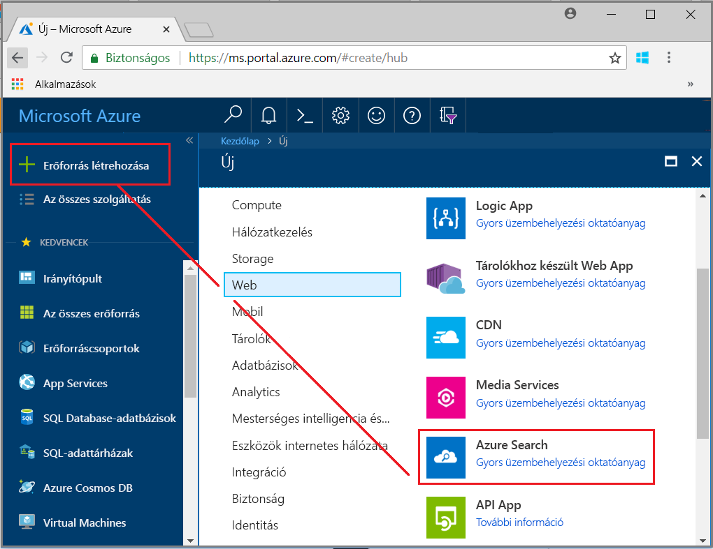
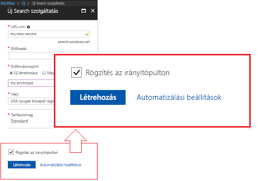
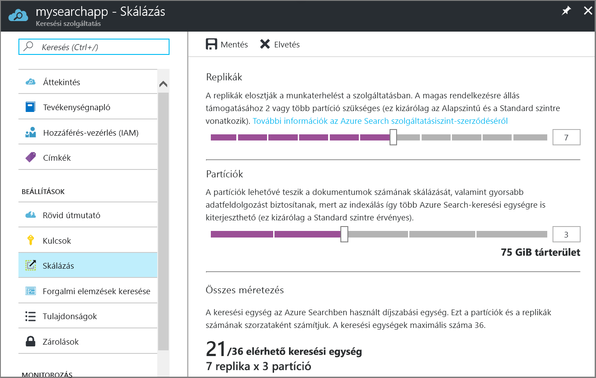

# Azure Search szolgáltatás létrehozása a portálon

Az Azure Search egy olyan önálló erőforrás, az egyéni alkalmazások keresési funkciókat beépülő modul segítségével. Azure Search egyszerűen integrálható más Azure-szolgáltatásokat, bár használhatja önmagában, alkalmazások hálózati kiszolgálókon, vagy más felhőplatformon futó szoftvert.

Ebből a cikkből megtudhatja, hogyan hozhat létre egy Azure Search-erőforrást a [az Azure portal](https://portal.azure.com/).

Szívesebben használja a PowerShellt? Használja az Azure Resource Manager [szolgáltatássablonját](https://azure.microsoft.com/resources/templates/101-azure-search-create/). Segítség az első lépések: [Azure Search kezelése a PowerShell-lel](search-manage-powershell.md).

## Feliratkozás (ingyenes vagy fizetős)

[Nyisson meg egy ingyenes Azure-fiókot](https://azure.microsoft.com/pricing/free-trial/?WT.mc_id=A261C142F), és fordítsa az ingyenes krediteket a fizetős Azure-szolgáltatások kipróbálására. A kreditek felhasználása után megtarthatja a fiókot, és továbbra is használhatja az olyan ingyenes Azure-szolgáltatásokat, mint a Websites. A bankkártyáját semmilyen költség nem terheli, hacsak Ön kifejezetten nem módosítja beállításait ennek engedélyezéséhez.

Választhatja az [MSDN-előfizetői értékelemek aktiválását](https://azure.microsoft.com/pricing/member-offers/msdn-benefits-details/?WT.mc_id=A261C142F) is. MSDN-előfizetéssel havonta kap fizetős Azure-szolgáltatásokra fordítható krediteket. 

## Az Azure Search megkeresése

1. Jelentkezzen be az [Azure Portalra](https://portal.azure.com/).
2. Kattintson a plusz jelre ("+ erőforrás létrehozása") a bal felső sarokban.
3. A Keresősáv használatával keresse meg az "Azure Search", vagy navigáljon arra az erőforrásra **webes** > **Azure Search**.

## A szolgáltatás és az URL-végpont elnevezése

A szolgáltatás neve része annak az URL-végpontnak, amelyre az API-hívások hivatkoznak: `https://your-service-name.search.windows.net`. Adja meg a szolgáltatás nevét az **URL** mezőben.

Például, ha azt szeretné, hogy a végpont `https://my-app-name-01.search.windows.net`, adjon meg `my-app-name-01`.

A szolgáltatásnévre vonatkozó követelmények:

* Egyedinek kell lennie a search.windows.net névtérben
* Hossza 2 és 60 karakter között lehet
* Kisbetűkből, számjegyekből vagy kötőjelekből ("-") állhat
* Kerülje a kötőjel ("-") használatát az első 2 és az utolsó karakterben
* Sehol sem tartalmazhat két egymást követő kötőjelet ("--")

## Előfizetés kiválasztása

Ha egynél több előfizetéssel rendelkezik, akkor olyat válasszon, amelyhez adat- vagy fájltárolási szolgáltatások is tartoznak. Az Azure Search is a kapcsolatok automatikus észleléssel Azure Table és a Blob storage, SQL Database és Azure Cosmos DB-n keresztül az indexelés [ *indexelők*](search-indexer-overview.md), de csak a szolgáltatások ugyanabban az előfizetésben.

## Erőforráscsoport kiválasztása

Az erőforráscsoport együtt használt Azure-szolgáltatások és -erőforrások gyűjteménye. Ha az Azure Search szolgáltatást például egy SQL-adatbázis indexelésére használja, akkor mindkét szolgáltatásnak ugyanabban az erőforráscsoportban kell lennie.

Ha nem kombinálásával erőforrást rendezhet egy csoportba, vagy ha meglévő erőforráscsoportok ki vannak töltve az erőforrások nem kapcsolódó megoldásokban használt hozzon létre egy új erőforráscsoportot, és az Azure Search-erőforrást az.

> [!TIP]
> Egy erőforráscsoport törlésekor a benne lévő szolgáltatások is törölve lesznek. Több szolgáltatást igénybe vevő prototípus-projektek végén könnyebb mindent törölni, ha az összeset egy erőforráscsoportban helyezi el.

## Üzemeltetési hely kiválasztása

Az Azure Search mint Azure-szolgáltatás világszerte sok adatközpontban üzemeltethető. [Árak eltérőek lehetnek](https://azure.microsoft.com/pricing/details/search/) földrajzi hely szerint.

Ha meg vannak az Azure-ban található tartalom indexelése szolgáltatást (Azure storage, Azure Cosmos DB, Azure SQL Database), az Azure Search szolgáltatás létrehozása az adatok sávszélesség díjak elkerülése érdekében ugyanabban a régióban. Nem számítunk fel díjat a kimenő ugyanabban a régióban szolgáltatások esetén.

## Tarifacsomag (SKU) kiválasztása

[Az Azure Search jelenleg többféle tarifacsomagban is kapható érhető el](https://azure.microsoft.com/pricing/details/search/): Ingyenes, alapszintű vagy Standard. Mindegyik szintet saját [kapacitás és korlátozások](search-limits-quotas-capacity.md) jellemzik. Útmutatást talál a [Tarifacsomag vagy SKU kiválasztása](search-sku-tier.md) című cikkben.

Az Ügyfelek éles számítási feladatokhoz általában a Standard tarifacsomagot, kezdésként pedig az Ingyenes szolgáltatást választják.

A szolgáltatás létrehozása után már nem lehet tarifacsomagot váltani. Ha később magasabb vagy alacsonyabb csomagra kíván áttérni, akkor újra létre kell hoznia a szolgáltatást.

## A szolgáltatás létrehozása

Ne felejtse el rögzíteni a szolgáltatást az irányítópulton, így a bejelentkezés után könnyen elérheti.

## Egy kulcsot és -végpont URL-cím beszerzése

Néhány kivételtől eltekintve az új szolgáltatás használatához, hogy megadta az URL-végpontot és a egy engedélyezési api-kulcsát. Rövid útmutatók, oktatóanyagok, mint például [Ismerkedés az Azure Search REST API-k (Postman)](search-fiddler.md) és [a .NET használatával az Azure Search használata](search-howto-dotnet-sdk.md), minták és egyéni kód minden olyan végpont szükséges, és futtathatók az adott erőforrás kulcsát.

1. Áttekintés oldalát keresse meg és másolja az URL-végpontot, az oldal jobb oldalán.

   

2. A bal oldali navigációs panelen válassza ki **kulcsok** , majd másolja az adminisztrációs kulcsok (azok egyenértékű) egyikét. Felügyeleti api-kulcsok létrehozása, frissítéséről és törléséről a szolgáltatás objektumok szükségesek.

   

Egy végpont és a kulcs nem szükségesek a feladat portálalapú. A portál már csatolva az Azure Search-erőforráshoz rendszergazdai jogosultságokkal. Portál oktatóanyagot, kezdje [oktatóanyag: Importálás index és az Azure Search lekérdezési](search-get-started-portal.md).

## A szolgáltatás méretezése

Egy szolgáltatás létrehozása több percet is igénybe vehet (a csomagtól függően 15 percet vagy többet is). A szolgáltatást annak üzembe helyezése után igényei szerint méretezheti. Mivel az Azure Search szolgáltatáshoz a Standard csomagot választotta, a szolgáltatás kétféleképpen, replikák és partíciók szintjén méretezhető. Ha az alapszintű csomagot választotta volna, akkor csak replikákat adhatna hozzá. Ingyenes szolgáltatás üzembe helyezése esetén a méretezés nem elérhető.

A ***partíciókkal*** a szolgáltatás több dokumentum tárolására és keresésére alkalmas.

A ***replikákkal*** a szolgáltatás több keresési kérelem kiszolgálására alkalmas.

Az erőforrások hozzáadása növeli a havi költségeket. A [díjkalkulátor](https://azure.microsoft.com/pricing/calculator/) segíthet áttekinteni az erőforrások hozzáadásának számlázási vonatkozásait. Vegye figyelembe, hogy az erőforrások mennyisége a terheléshez igazítható. Például növelheti az erőforrások mennyiségét egy teljes körű első index létrehozásához, majd később csökkentheti azt a növekményes indexeléshez jobban megfelelő szintre.

> [!Important]
> A szolgáltatásnak [csak olvasható SLA esetén 2, írási/olvasási SLA esetén 3 replikával](https://azure.microsoft.com/support/legal/sla/search/v1_0/) kell rendelkeznie.

1. Nyissa meg a keresési szolgáltatás oldalát az Azure Portalon.
2. A bal oldali navigációs panelen válassza a **Beállítások** > **Méretezés** lehetőséget.
3. A csúszka segítségével bármelyik típusú erőforrásokat hozzáadhatja.

> [!Note]
> Minden csomagban más [korlátozások](search-limits-quotas-capacity.md) érvényesek az egy szolgáltatásban megengedett keresési egységekre (replikák × partíciók = összes keresési egység).

## Mikor érdemes hozzáadni egy második szolgáltatást?

A legtöbb ügyfél a következő réteg megadása csak egy szolgáltatást használ a [az erőforrások helyes egyensúlyát](search-sku-tier.md). Egy szolgáltatásban több index is fenntartható [a választott csomag korlátozásainak megfelelő számban](search-capacity-planning.md), ha elkülönülnek egymástól. Az Azure Search szolgáltatásban a kérelmek csak egy indexre irányulhatnak. Így kisebb esély van adatok véletlen vagy szándékos lekérésére az egyazon szolgáltatáshoz tartozó más indexekből.

Bár az ügyfelek többsége csak egy szolgáltatást használ, szükség lehet a szolgáltatás redundanciájára, ha az üzemeltetési körülmények között az alábbiak szerepelnek:

* Vészhelyreállítás (adatközpont-kimaradás). Kimaradás esetén az Azure Search nem biztosít azonnali feladatátvételt. Javaslatokat és útmutatást a [Szolgáltatásfelügyeletről](search-manage.md) szóló cikkben talál.
* A több-bérlős modellezés vizsgálatával megállapította, hogy az optimális kialakítás további szolgáltatásokat is tartalmaz. További információ: [Tervezés több bérlő esetén](search-modeling-multitenant-saas-applications.md).
* Ha globálisan üzembe helyezett alkalmazás esetén minimalizálni kívánja az alkalmazás belső forgalmának késését, akkor az Azure Search több példányára is szükség lehet különböző régiókban.

> [!NOTE]
> Az Azure Search szolgáltatásban az indexelés és a lekérdezés munkaterhelése nem választható szét, tehát sohasem fog több szolgáltatást létrehozni a külön munkaterhelésekhez. Az indexek lekérdezése mindig abban a szolgáltatásban történik, amelyben létre lettek hozva (nem lehet egy indexet egy szolgáltatásban létrehozni és egy másikba átmásolni).

A magas rendelkezésre álláshoz nincs szükség második szolgáltatásra. A lekérdezések magas rendelkezésre állása úgy érhető el, hogy egyazon szolgáltatáson belül 2 vagy több replikát használ. A replikák frissítése egymást követően történik, tehát legalább egy mindig működni fog a szolgáltatásfrissítés végrehajtása közben. A hasznos üzemidőről a [szolgáltatói szerződések](https://azure.microsoft.com/support/legal/sla/search/v1_0/) oldalán tájékozódhat bővebben.

## További lépések

Üzembe helyezés az Azure Search szolgáltatást, után továbbra is az első index létrehozása a portálon.

> [!div class="nextstepaction"]
> [Oktatóanyag: Adatok importálása, Tárgymutató és lekérdezések futtatását a portálon](search-get-started-portal.md)
