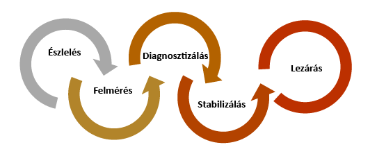
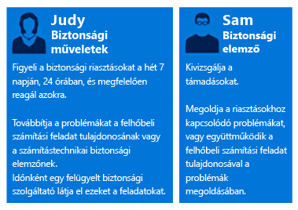
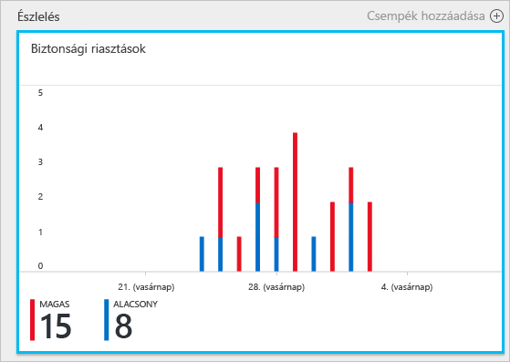
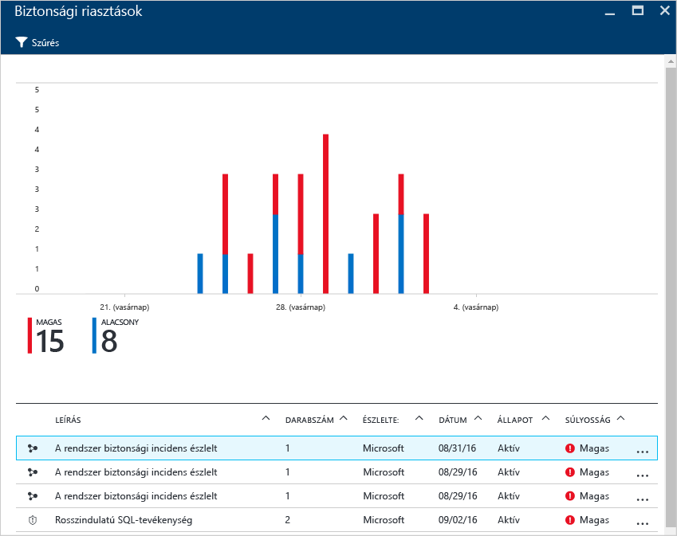
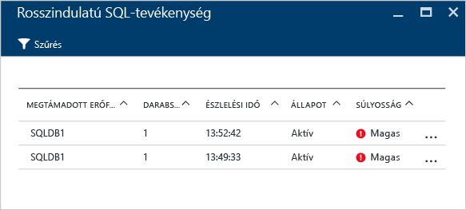
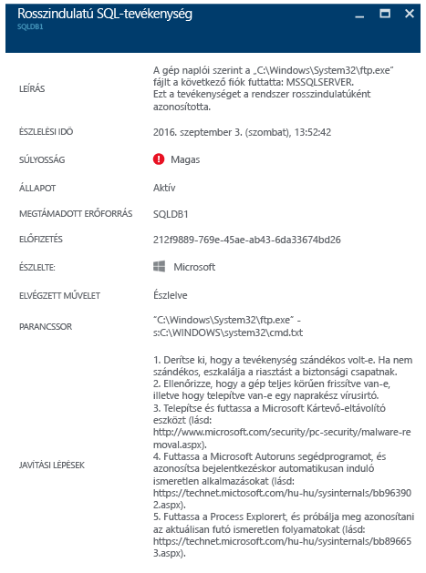

# Az Azure Security Center használata incidensmegoldásra
Sok szervezet csak akkor tanulja meg, hogyan reagáljon a biztonsági incidensekre, miután támadás érte. A költségek és a károk csökkentése érdekében fontos, hogy már a támadások bekövetkezte előtt létezzen egy incidensmegoldási terv. Az Azure Security Center az incidensmegoldás több szakaszában is alkalmazható.

## Incidensmegoldás-tervezés
A működőképes terv három fő jellemzővel rendelkezik: képes védelmet nyújtani, észlelni a fenyegetéseket, és válasszal szolgálni azokra. A védelem az incidensek megelőzését, az észlelés a fenyegetések korai azonosítását, a válasz pedig a támadó kizárását és a rendszerek visszaállítását jelenti a betörések hatásainak enyhítése érdekében.

Ebben a cikkben a biztonsági incidensmegoldás a [Microsoft Azure Security Response a felhőben](https://gallery.technet.microsoft.com/Azure-Security-Response-in-dd18c678) című cikkben ismertetett szakaszait vesszük alapul, az alábbi ábrán látottak szerint:

A Security Center az észlelési, felmérési és diagnosztikai szakaszokban lesz a segítségére. Íme néhány példa, hogyan állítható szolgálatba a Security Center a három kezdeti incidensmegoldási szakaszban:

* **Észlelés**: az eseményvizsgálatok első jelzéseinek áttekintése.
  * Példa: a Security Center irányítópultja által kiadott magas szintű biztonsági riasztás kezdeti ellenőrzésének áttekintése.
* **Felmérés**: az első vizsgálat végrehajtása a gyanús tevékenységgel kapcsolatos további információk összegyűjtéséhez.
  * Példa: további információk beszerzése a biztonsági riasztásról.
* **Diagnosztika**: technikai vizsgálat lefolytatása, és az elkülönítési, elhárítási és áthidaló stratégiák azonosítása.
  * Példa: kövesse a Security Center által az adott biztonsági riasztáshoz leírt hibaelhárítási lépéseket.

Az alábbi forgatókönyv bemutatja, hogyan használható a Security Center a biztonsági incidensek észlelési, felmérési és diagnosztikai/válasz szakaszaiban. A Security Centerben egy [biztonsági incidens](security-center-incident.md) az adott erőforráshoz tartozó összes olyan riasztás együttese, amelyek egy [támadási folyamatba](https://blogs.technet.microsoft.com/office365security/addressing-your-cxos-top-five-cloud-security-concerns/) illeszthetők. Ezek az incidensek megjelennek a [Biztonsági riasztások](security-center-managing-and-responding-alerts.md) csempén és panelen is. Az incidensek megnyitásakor megjelenik a kapcsolódó riasztások listája, amelyből további információkat kaphat az egyes riasztásokról. A Security Center emellett különálló biztonsági riasztásokat is megjelenít, amelyek segítségével nyomon követhetők a gyanús tevékenységek.

## Forgatókönyv
A Contoso vállalat nemrégiben áttelepítette egyes helyszíni erőforrásait az Azure-ba, beleértve egyes virtuális gépeken alapuló üzleti számítási feladatait és SQL-adatbázisait. A Contoso fő számítógépes biztonsági incidensmegoldó csapata, a Core Computer Security Incident Response Team (CSIRT) jelenleg nem tudja kivizsgálni a biztonsági problémákat, mivel a biztonsági intelligencia nem képezi jelenlegi incidensmegoldási eszközparkjuk szerves részét. Az integráció hiánya az észlelési szakasz során (túl sok téves riasztás), valamint a felmérési és a diagnosztikai szakaszok során is problémát jelent. Az áttelepítés részeként úgy döntöttek, hogy a probléma megoldásához igénybe veszik a Security Center segítségét.

Az áttelepítés első szakasza azzal ért véget, hogy az összes erőforrást üzembe helyezték, és a Security Center összes biztonsági ajánlását feldolgozták. A Contoso CSIRT a számítógépes biztonsági incidensek kezelésének központi eleme. A csapatot olyan személyek alkotják, akik biztonsági incidensek kezelésével foglalkoznak. A csapat tagjainak feladatai egyértelműen meg vannak határozva annak érdekében, hogy ne maradjon lefedetlen felelősségi terület.

A forgatókönyv szempontjából a Contoso CSIRT csapatának alábbi két tagjára fogunk összpontosítani:

Judit biztonsági üzemeltetéssel foglalkozik. Feladatköre:

* A biztonsági fenyegetések non-stop figyelése és megoldása.
* A problémák továbbítása szükség szerint a felhőbeli számítási feladat tulajdonosának vagy a biztonsági elemzőnek.

Sándor biztonsági elemző, és feladatai a következők:

* A támadások kivizsgálása.
* A riasztások javítása.
* A számítási feladatok tulajdonosaival együttműködve a megoldások meghatározása és kivitelezése.

Amint látható, Judit és Sándor feladatai eltérőek, azonban együtt kell működniük a Security Center adatainak megosztásában.

## Javasolt megoldás
Mivel Judit és Sándor különböző szerepkörökkel rendelkezik, a Security Center eltérő felületeit használják majd a napi feladataikhoz szükséges adatok kinyeréséhez. Judit a **Biztonsági riasztásokat** használja majd napi figyelési tevékenysége során.

Judit a Biztonsági riasztásokat az észlelési és a felmérési szakaszban használja majd. Miután Judit végzett a kezdeti vizsgálattal, az ügyet továbbíthatja Sándornak, amennyiben további vizsgálat szükséges. Ezen a ponton Sándor felhasználja a Security Center által biztosított adatokat, néha más adatforrásokkal együtt, majd rátér a diagnosztikai szakaszra.

## A megoldás megvalósítása
Az alábbiakban bemutatjuk, hogyan használhatja az Azure Security Centert az incidensmegoldási forgatókönyvhöz, ezért követjük Judit lépéseit az észlelési és felmérési szakaszokban, majd megtekintjük, hogyan diagnosztizálja Sándor a problémát.

### Az észlelési és a felmérési incidensmegoldási szakaszok
Judit bejelentkezett az Azure Portalra, és a Security Center konzolján dolgozik. Napi figyelési tevékenységei részeként a magas prioritású biztonsági riasztásokat újabban az alábbi lépések végrehajtásával végzi:

1. A **Biztonsági riasztások** csempén a **Biztonsági riasztások** panelre lép.
    

   > [!NOTE]
   > Ebben a forgatókönyvben Judit elvégez egy vizsgálatot a rosszindulatú SQL-tevékenységi riasztás alapján, ahogy az az előző ábrán is látható.
   >
   >
2. A **rosszindulatú SQL-tevékenységhez** kapcsolódó riasztásra kattint, és áttekinti a megtámadott erőforrásokat a **rosszindulatú SQL-tevékenység** panelén: 

    Ezen a panelen Judit jegyzeteket készít a megtámadott erőforrásokkal, a támadások számával és az észlelés időpontjával kapcsolatban.
3. Kattintson a **megtámadott erőforrásra**, hogy további információkat szerezzen a támadásról.

Miután elolvasta a leírást, Judit meg van győződve arról, hogy ez nem hamis riasztás, és hogy az esetet továbbítania kell Sándornak.

### Az incidensmegoldás diagnosztizálási szakasza
Sándor megkapja Judittól az esetet, és elkezdi átnézni a Security Center által javasolt hibaelhárítási lépéseket.

### További források
Az incidensmegoldási csapat is hasznát veheti a [Security Center Power BI](security-center-powerbi.md) azon képességét, hogy láthatják a különböző típusú jelentéseket. Ezek a jelentések a további vizsgálat során segíthetnek nekik a javaslatok és a biztonsági riasztások megjelenítésében, elemzésében és szűrésében. Azok a vállalatok, amelyek a vizsgálat folyamata során saját biztonságadat- és eseménykezelő (SIEM) megoldást használnak, [integrálhatják a Security Centert a saját megoldásukba](security-center-integrating-alerts-with-log-integration.md). Az [Azure naplóintegráló eszközével](https://blogs.msdn.microsoft.com/azuresecurity/2016/07/21/microsoft-azure-log-integration-preview/) az Azure auditnaplói és a virtuális gép biztonság eseményei is integrálhatók. Egy támadás kivizsgálásához ezt az információt a Security Center által nyújtott információval együtt használhatja.

## Összegzés
A csapat összeállítása még az incidens előtt fontos lépés a szervezet számára, és pozitívan tudja befolyásolni az incidensek kezelését. Ha a szervezet rendelkezik a megfelelő eszközökkel az erőforrások figyeléséhez, ez segítheti a csapatot abban, hogy megfelelő lépéseket tegyen a biztonsági incidensek elhárítása érdekében. A Security Center [észlelési funkciói](security-center-detection-capabilities.md) segíthetnek az informatikai részlegnek a biztonsági incidensekre való gyors válaszadásban és a biztonsági problémák elhárításában.
