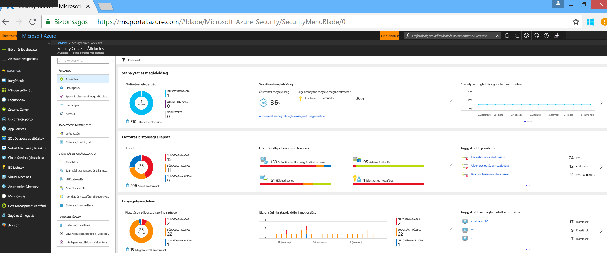
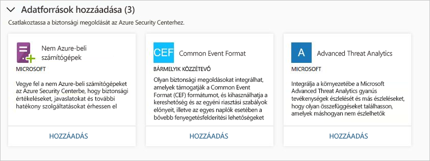
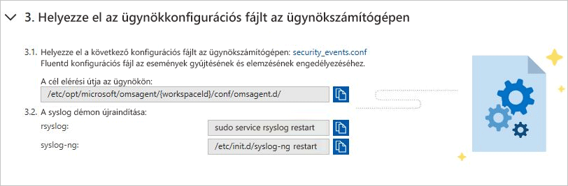
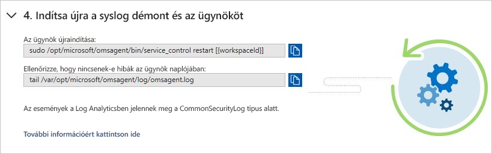
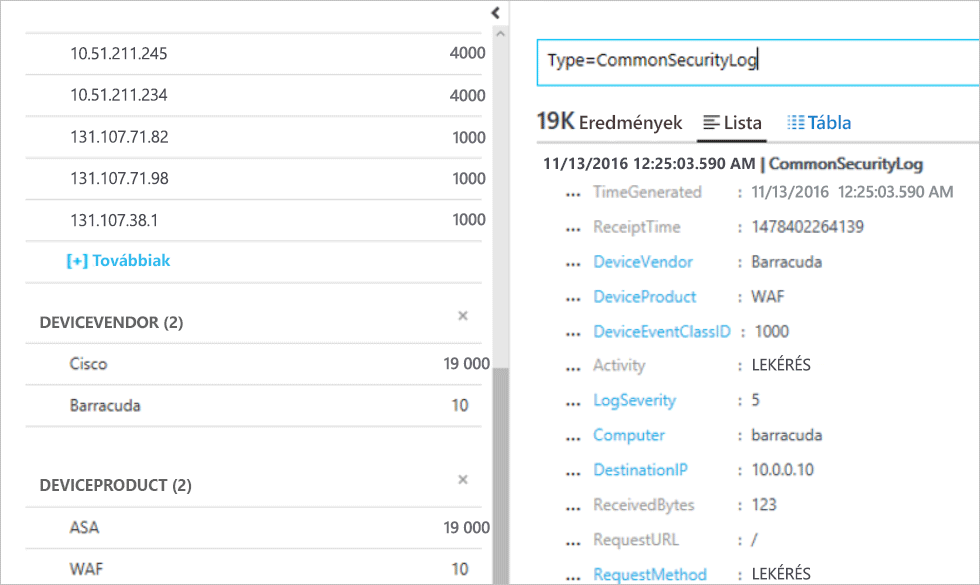

# Biztonsági megoldások integrálása az Azure Security Centerbe
Ez a dokumentum az Azure Security Centerhez már csatlakoztatott biztonsági megoldások kezelésében és újak hozzáadásában segít.

## Integrált Azure biztonsági megoldások
A Security Center használatával egyszerűen engedélyezhet integrált biztonsági megoldásokat az Azure-ban. Az előnyök:

- **Egyszerűsített üzembe helyezési**: A Security Center kínál az integrált partneri megoldások fejlett jogosultságkiosztási. A kártevőirtó, sebezhetőségfelmérő és hasonló megoldások esetében a Security Center képes biztosítani a szükséges ügynököt a virtuális gépeken, a tűzfalberendezések esetében pedig elintézi a szükséges hálózati konfigurációs feladatok nagy részét.
- **Integrált észlelések**: A partnermegoldásoktól érkező biztonsági eseményeket a rendszer automatikusan összegyűjti, összesíti és megjeleníti a Security Center riasztásainak és incidenseinek részeként. Ezek az események más forrásoktól érkező észlelésekhez is kapcsolódnak, ami fejlett fenyegetésészlelési képességeket biztosít.
- **Egyesített állapotmonitorozás és -kezelés**: Az integrált állapotesemények lehetővé teszik az összes partnermegoldás gyors monitorozását. Az alapszintű felügyeletből könnyen elérhető a speciális beállítás a partnermegoldás használatával.

Jelenleg a következő integrált biztonsági megoldások érhetők el:

- Webalkalmazás-tűzfal ([Barracuda](https://www.barracuda.com/products/webapplicationfirewall), [F5](https://support.f5.com/kb/en-us/products/big-ip_asm/manuals/product/bigip-ve-web-application-firewall-microsoft-azure-12-0-0.html), [Imperva](https://www.imperva.com/Products/WebApplicationFirewall-WAF), [Fortinet](https://www.fortinet.com/products.html) és [Azure Application Gateway](https://azure.microsoft.com/blog/azure-web-application-firewall-waf-generally-available/))
- Új generációs tűzfalmegoldások ([Check Point](https://www.checkpoint.com/products/vsec-microsoft-azure/), [Barracuda](https://campus.barracuda.com/product/nextgenfirewallf/article/NGF/AzureDeployment/), [Fortinet](http://docs.fortinet.com/d/fortigate-fortios-handbook-the-complete-guide-to-fortios-5.2), [Cisco](http://www.cisco.com/c/en/us/td/docs/security/firepower/quick_start/azure/ftdv-azure-qsg.html) és [Palo Alto Networks](https://www.paloaltonetworks.com/products))
- Biztonságirés-felmérés ([Qualys](https://www.qualys.com/public-clouds/microsoft-azure/) és [Rapid7](https://www.rapid7.com/products/insightvm/))

> [!NOTE]
> A Security Center nem telepíti a Microsoft Monitoring Agentet a partner virtuális berendezésekre, mert a legtöbb biztonsági megoldásokkal foglalkozó forgalmazó tiltja a külső ügynökök futtatását a saját berendezésein.
>
>

## A biztonsági megoldások integrálása
A Security Centerből üzembe helyezett Azure biztonsági megoldások automatikusan csatlakoztatva vannak. Csatlakoztathat egyéb biztonsági adatforrásokat is, köztük a következőket:

- Azure AD Identity Protection
- Helyszínen vagy más felhőkben futó számítógépek
- A Common Event Format (CEF) formátumot támogató biztonsági megoldások
- Microsoft Advanced Threat Analytics

## Integrált Azure biztonsági megoldások és egyéb adatforrások kezelése

1. Jelentkezzen be az [Azure Portalra](https://azure.microsoft.com/features/azure-portal/).

2. A **Microsoft Azure menüben** válassza a **Security Center** elemet. Megnyílik a **Security Center – Áttekintés** képernyő.

3. A Security Center menüjében válassza a **Biztonsági megoldások** elemet.

  

A **Biztonsági megoldások** területen megtekintheti az Azure integrált biztonsági megoldásainak állapotinformációit, valamint alapszintű felügyeleti feladatokat hajthat végre. Emellett egyéb típusú biztonsági adatforrásokat is csatlakoztathat, például Common Event Format (CEF) formátumú Azure Active Directory Identity Protection-riasztásokat és tűzfalnaplókat.

### Csatlakoztatott megoldások

A **Csatlakoztatott megoldások** szakasz a Security Centerhez jelenleg csatlakozó biztonsági megoldásokat, valamint az egyes megoldások állapotával kapcsolatos adatokat tartalmazza.  

Egy partneri megoldás állapota lehet:

* Kifogástalan (zöld) – nincs az állapottal kapcsolatos probléma.
* Nem megfelelő (piros) – azonnali figyelmet igénylő állapottal kapcsolatos probléma.
* Állapotbeli problémák (narancs) – a megoldás már le van állítva állapotára.
* Nem jelentett (szürke) – a megoldás még nem jelentett semmit, mégis megoldás állapota lehet nem jelentett, ha azt a nemrégiben csatlakoztatott és még telepítés, vagy nem egészségügyi érhetők el adatok.

> [!NOTE]
> Állapotadatok nem érhető el, ha a Security Center a dátum és idő az utolsó esemény jelzi, hogy a megoldás e jelentést vagy sem fogadott jeleníti meg. Ha nem egészségügyi érhetők el adatok és riasztások az elmúlt 14 napon belül érkezik, a Security Center azt jelzi, hogy a megoldás nem megfelelőnek vagy nem jelentéskészítési.
>
>

2. Válassza ki **NÉZET** további információért és a beállítások, amely tartalmazza:

  - **Megoldáskonzol**. Megnyílik a kezelést biztosít a megoldáshoz.
  - **Virtuális Géphez csatolni**. Az alkalmazások összekapcsolása panel megnyílik. Itt erőforrásokat kapcsolhat hozzá a partnermegoldáshoz.
  - **Megoldás törlése**.
  - **Konfigurálása**.

   

### Felderített megoldások

A Security Center automatikusan felderíti az Azure-ban futó, azonban a Security Centerhez nem csatlakoztatott biztonsági megoldásokat, és azokat a **Felderített megoldások** szakaszban jeleníti meg. Ez az Azure-beli megoldásokat, például az [Azure AD Identity Protectiont](https://docs.microsoft.com/azure/active-directory/active-directory-identityprotection), valamint a partnermegoldásokat is tartalmazza.

> [!NOTE]
> A Felderített megoldások funkcióhoz a Standard szintű Security Centerre az előfizetés szintjén van szükség. A Security tarifacsomagjaival kapcsolatos további információért lásd a [díjszabást](security-center-pricing.md).
>
>

Az egyes megoldások alatt a **CSATLAKOZTATÁS** gombra kattintva integrálhatja azokat a Security Centerbe, és értesülhet a biztonsági riasztásokról.

A Security Center az előfizetésben üzembe helyezett azon megoldásokat is felderíti, amelyek képesek Common Event Format (CEF) formátumú naplókat továbbítani. Ismerje meg, hogyan [csatlakoztathat CEF-naplókat használó biztonsági megoldásokat](quick-security-solutions.md) a Security Centerhez.

### Adatforrások hozzáadása

Az **Adatforrások hozzáadása** szakasz sorolja fel az egyéb csatlakoztatható adatforrásokat. Az ezekből a forrásokból származó adatok hozzáadásával kapcsolatos utasításokért kattintson a **HOZZÁADÁS** gombra.

### Külső megoldások csatlakoztatása

A biztonsági adatok a számítógépekről történő begyűjtés mellett számos egyéb biztonsági megoldás használatával is integrálhatók, beleértve a Common Event Format (CEF) formátumot támogató megoldásokat is. A CEF egy iparági szabványnak számító, a Syslog-üzenetekre épülő formátum, amelyet számos, biztonsági megoldásokkal foglalkozó forgalmazó használ az események integrációjának biztosításához a különböző platformok között.

Ez a rövid útmutató a következőket mutatja be:
- Biztonsági megoldás csatlakoztatása a Security Centerhez CEF-naplók használatával
- A kapcsolat ellenőrzése a biztonsági megoldással

#### Előfeltételek
A Security Center használatához Microsoft Azure-előfizetéssel kell rendelkeznie. Ha nem rendelkezik előfizetéssel, regisztrálhat egy [ingyenes fiókkal](https://azure.microsoft.com/free/).

A rövid útmutató lépéseinek végrehajtásához a Security Center Standard tarifacsomagjával kell rendelkeznie. Megpróbálhatja Security Center Standard költségek nélkül. [Az Azure-előfizetés a Security Center Standard verziójába való felvételével](security-center-get-started.md) foglalkozó rövid útmutató végigvezeti azokon a lépéseken, amelyekkel frissíthet a Standard verzióra. További részletekért tekintse át az [árképzést ismertető oldalt](https://azure.microsoft.com/pricing/details/security-center/).

Emellett szükség van egy [Linux rendszerű számítógépre is](https://docs.microsoft.com/azure/log-analytics/log-analytics-agent-linux), amelyen a Syslog szolgáltatás már csatlakoztatva van a Security Centerhez.

#### Megoldás csatlakoztatása CEF használatával

1. Jelentkezzen be az [Azure Portalra](https://azure.microsoft.com/features/azure-portal/).
2. A **Microsoft Azure** menüben válassza a **Security Center** elemet. Megnyílik a **Security Center – Áttekintés** képernyő.

      

3. A Security Center főmenüjében válassza a **Biztonsági megoldások** elemet.
4. A Biztonsági megoldások oldal **Adatforrások hozzáadása (3)** részének **Common Event Format** lehetőségénél kattintson a **Hozzáadás** elemre.

    

5. A Common Event Format-naplók oldalán bontsa ki a második lépést: **Syslog-továbbítás konfigurálása a szükséges naplóknak a 25226-os UDP-port ügynökéhez történő küldése érdekében**, majd Linux számítógépén kövesse az alábbi utasításokat:

    

6. Bontsa ki a harmadik lépést: **Az ügynökkonfigurációs fájl elhelyezése az ügynökszámítógépen**, majd Linux számítógépén kövesse az alábbi utasításokat:

    

7. Bontsa ki a negyedik lépést: **A syslog démon és az ügynök újraindítása**, majd Linux számítógépén kövesse az alábbi utasításokat:

    

#### A kapcsolat ellenőrzése

Mielőtt továbbhaladna az alábbi lépésekhez, meg kell várnia, amíg a Syslog jelenteni kezd a Security Centernek. A környezet méretétől függően ez eltarthat némi ideig.

1.  A bal oldali panelen, a Security Center irányítópultján kattintson a **Keresés** elemre.
2.  Válassza ki a munkaterületet, amelyhez a Syslog (Linux számítógép) csatlakozik.
3.  Írja be a *CommonSecurityLog* kifejezést, majd kattintson a **Keresés** gombra.

Az alábbi példa bemutatja az eredmény az alábbi lépéseket: 

#### Az erőforrások eltávolítása
A gyűjtemény részét képező többi rövid útmutató és oktatóanyag erre a rövid útmutatóra épül. Ha azt tervezi, hogy az ezt követő rövid útmutatókkal és oktatóanyagokkal dolgozik tovább, továbbra is a Standard szintet futtassa, és hagyja engedélyezve az automatikus kiépítést. Ha nem folytatja a munkát, vagy vissza szeretne térni az Ingyenes szintre:

1. Térjen vissza a Security Center főmenüjébe, és válassza a **Biztonsági szabályzat** elemet.
2. Válassza ki az előfizetést vagy a szabályzatot, amelyet vissza szeretne állítani Ingyenes állapotba. Megnyílik a **Biztonsági szabályzat** képernyő.
3. A **SZABÁLYZAT ÖSSZETEVŐI** alatt válassza a **Tarifacsomag** lehetőséget.
4. Válassza az **Ingyenes** lehetőséget az előfizetés Standard szintről Ingyenes szintre való módosításához.
5. Kattintson a **Mentés** gombra.

Ha le szeretné tiltani az automatikus kiépítést:

1. Térjen vissza a Security Center főmenüjébe, és válassza a **Biztonsági szabályzat** elemet.
2. Válassza ki azt az előfizetést, amelynél le szeretné tiltani az automatikus kiépítést.
3. Az automatikus kiépítés letiltásához a **Biztonsági szabályzat – Adatgyűjtés** területen válassza a **Ki** lehetőséget az **Előkészítés** elemnél.
4. Kattintson a **Mentés** gombra.

>[!NOTE]
> Az automatikus kiépítés letiltása nem távolítja el a Microsoft Monitoring Agentet azon Azure-beli virtuális gépekről, ahol az ügynök üzembe lett helyezve. Az automatikus kiépítés letiltása korlátozza az erőforrások biztonsági monitorozását.
>

## Adatok exportálása siem-mel

Az Azure Security Center által feldolgozott események az Azure-ban közzétett [tevékenységnapló](../monitoring-and-diagnostics/monitoring-overview-activity-logs.md), a napló egyik Azure monitoron keresztül elérhető típusokat. Az Azure Monitor egy konszolidált folyamatot a figyelési adatokat egy SIEM-eszközével történő útválasztáshoz kínál. Ez történik, a streamelési adatokat egy eseményközpontba, ahol azt is majd le kell kérnie egy partner eszközt.

A függőleges vonal használja a [egyetlen folyamat Azure Monitoring](../azure-monitor/platform/stream-monitoring-data-event-hubs.md) hozzáférés a monitorozási adatok lekérése az Azure-környezet számára. Ez lehetővé teszi, hogy könnyedén létrehozhasson siem-EK és figyelési eszközök az adatok felhasználásához.

A következő szakaszok ismertetik, hogyan konfigurálható egy eseményközpontba is streamelhetők adatokat. A lépések feltételezik, hogy már rendelkezik az Azure Security Center az Azure-előfizetéshez konfigurált.

Áttekintés

### Mi az az Azure biztonsági adatok siem-be közzétett?

Ebben a verzióban elérhetővé tesszük a [biztonsági riasztásokat.](../security-center/security-center-managing-and-responding-alerts.md) A jövőbeli kiadásokban az adatkészlet, a biztonsági javaslatok azt fogja bővítését.

### A folyamat beállítása

#### Eseményközpont létrehozása

Mielőtt elkezdené, kell [Event Hubs-névtér létrehozása](../event-hubs/event-hubs-create.md). A névtér és Eseményközpont az összes monitorozási adatot célját.

#### Az Event hubs Azure tevékenységnapló Stream

Tekintse meg a következő cikkben [tevékenységnapló streamelése az Event hubs szolgáltatásba](../azure-monitor/platform/activity-logs-stream-event-hubs.md)

#### Partneri SIEM-összekötő telepítése 

A figyelési adatok útválasztást egy eseményközpontba, és az Azure Monitor lehetővé teszi könnyen integrálhatja a partneri SIEM és figyelési eszközöket.

Tekintse meg a következő hivatkozásra kattintva megtekintheti [támogatott siem-ektől](../azure-monitor/platform/stream-monitoring-data-event-hubs.md#what-can-i-do-with-the-monitoring-data-being-sent-to-my-event-hub)

### Például az adatok lekérdezése 

Íme néhány Splunk lekérdezések, amelyek segítségével kérje le a riasztási adatokat:

| **Lekérdezés leírása** | **Lekérdezés** |
|----|----|
| Minden riasztás| index=main Microsoft.Security/locations/alerts|
| Műveletek száma összefoglalója neve szerint| index = fő forrás típusa = "amal: biztonsági" \| tábla operationName \| statisztikák szerint operationName száma|
| Riasztások adatainak beolvasása: Idő, neve, állam, ID és az előfizetés | index = fő Microsoft.Security/locations/alerts \| tábla \_idő, properties.eventName, állam, properties.operationId, am_subscriptionId |

## További lépések

Ebben a cikkben megismerkedett a partnermegoldások Security Centerrel való integrálásával. A Security Centerrel kapcsolatos további információkért olvassa el a következő cikkeket:

* [A Microsoft Advanced Threat Analytics csatlakoztatása az Azure Security Centerhez](security-center-ata-integration.md)
* [Az Azure Active Directory Identity Protection csatlakoztatása az Azure Security Centerhez](security-center-aadip-integration.md)
* [Biztonsági állapot monitorozása a Security Centerben](security-center-monitoring.md). Az Azure-erőforrások állapotának figyelését ismertető útmutató.
* [Partnermegoldások monitorozása a Security Centerrel](security-center-partner-solutions.md). A partnermegoldások állapotának figyelését ismertető útmutató.
* [Azure Security Center – gyakori kérdések](security-center-faq.md) Választ találhat a Security Center használatával kapcsolatos gyakori kérdésekre.
* [Azure Security blog](https://blogs.msdn.com/b/azuresecurity/). Blogbejegyzések az Azure biztonsági és megfelelőségi funkcióiról.
