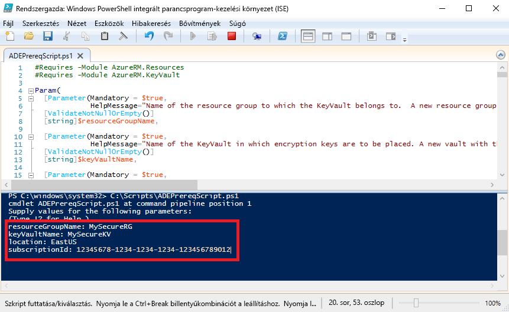

# <a name="quickstart-encrypt-a-windows-iaas-vm-with-azure-powershell"></a>Gyors útmutató: Az Azure PowerShell használatával Windows IaaS virtuális gép titkosítása

Az Azure Disk Encryption segítségével titkosíthatja Windows és Linux rendszerű IaaS virtuális gépeit. A megoldás integrálva van az Azure Key Vaulttal, így vezérelheti és felügyelheti a lemeztitkosítási kulcsokat és titkos kulcsokat. Az Azure Disk Encryption használatával gondoskodhat róla, hogy inaktív virtuális gépei biztonságban legyenek az iparági szabványoknak megfelelő titkosítási technológia használatával. Ebben a rövid útmutatóban egy Windows Server 2016-alapú virtuális gépet fog létrehozni, majd titkosítani fogja az operációsrendszer-lemezt.

Ha nem rendelkezik Azure-előfizetéssel, mindössze néhány perc alatt létrehozhat egy [ingyenes fiókot](https://azure.microsoft.com/free/?WT.mc_id=A261C142F) a virtuális gép létrehozásának megkezdése előtt.

## <a name="prerequisites"></a>Előfeltételek

[!INCLUDE [updated-for-az](../../includes/updated-for-az.md)]

- Windows PowerShell integrált parancsprogram-kezelési környezet (ISE)
- Telepítse vagy frissítse a [az Azure PowerShell-modul legújabb verziója](/powershell/azure/install-az-ps)
    - A modul Az verziójára kell lennie a 1.0.0 vagy újabb verziója. Használat `Get-Module Az -ListAvailable | Select-Object -Property Name,Version,Path` a verzió ellenőrzéséhez.
- Az [Azure Disk Encryption előfeltétel-konfigurációs szkript](https://raw.githubusercontent.com/Azure/azure-powershell/master/src/Compute/Compute/Extension/AzureDiskEncryption/Scripts/AzureDiskEncryptionPreRequisiteSetup.ps1) egy példánya.
    - Ha már rendelkezik a szkripttel, töltsön le egy új példányt, mivel az a közelmúltban módosult. 
    - A teljes szöveg kijelöléséhez nyomja le a **CTRL-A** billentyűkombinációt, majd a kijelölt szöveg másolásához a Jegyzettömbbe nyomja le a **CTRL-C** kombinációt.
    - Mentse a fájlt **ADEPrereqScript.ps1** néven


## <a name="sign-in-to-azure"></a>Bejelentkezés az Azure-ba

1. Kattintson a jobb gombbal a **Windows PowerShell ISE** elemre, majd válassza a **Futtatás rendszergazdaként** lehetőséget.
1. Az a **rendszergazda: Windows PowerShell ISE-ben** ablakban kattintson a **nézet** majd **parancsfájl ablaktábla megjelenítése**.
1. Írja a következő parancsmagot a szkriptpanelbe: 

     ```azurepowershell
      Connect-AzAccount
     ```

1. Kattintson a zöld nyílra a **szkript futtatásához**, vagy használja az F5 billentyűt. 
2. Az interaktív bejelentkezés használatával csatlakozzon az Azure-fiókjához.
3. Másolja a következő PowerShell-szkript futtatásához lekérdezett **előfizetés-azonosítót**. 

## <a name="bkmk_PrereqScript"></a> Az Azure Disk Encryption előfeltétel-konfigurációs szkript futtatása
 Az **ADEPrereqScript.ps1** létrehoz egy erőforráscsoportot, egy kulcstartót és beállítja a kulcstartó hozzáférési szabályzatát. A szkript ezen kívül egy erőforrászárat is készít a kulcstartón, hogy megelőzhesse a véletlen törlést.  

1. Az a **rendszergazda: Windows PowerShell ISE-ben** ablakban kattintson **fájl** majd **nyílt**. Keresse meg az **ADEPrereqScript.ps1** fájlt, és kattintson rá duplán. A szkript a szkriptpanelen nyílik meg.
2. Kattintson a zöld nyílra a **szkript futtatásához**, vagy a futtatásához használja az F5 billentyűt. 
3. Adja meg az új **erőforráscsoport** és **kulcstartó** nevét. Ehhez a rövid útmutatóhoz ne használjon egy már meglévő erőforráscsoportot vagy kulcstartót, mert az erőforráscsoportot később törölni fogjuk. 
4. Írja be a helyet, ahol létre szeretné hozni az erőforrásokat, például **EastUS**. A helyek listáját a következővel érheti el: `Get-AzLocation`.
5. Írja be az **előfizetés azonosítóját**. Az előfizetés-azonosítóját a következővel érheti el: `Get-AzSubscription`.  
6. Kattintson a zöld nyílra a **szkript futtatásához**. 
7. Másolja a következő lekért értékeket: **DiskEncryptionKeyVaultUrl** és **DiskEncryptionKeyVaultId**, mert később szükség lesz rájuk.




## <a name="create-a-virtual-machine"></a>Virtuális gép létrehozása 
Létre kell hoznia egy virtuális gépet, hogy titkosíthassa a lemezét. A használt szkript egy 8 GB RAM-mal rendelkező Windows Server 2016-alapú virtuális gépet és egy 30 GB méretű operációs rendszer-lemezt hoz létre. 

1. Másolja be a parancsfájlt a **rendszergazda: Windows PowerShell ISE-ben** parancsfájl panelen és az első három változók módosításához. Az erőforráscsoportnak és a helynek ugyanannak kell lennie, mint amit az [előfeltétel-konfigurációs szkripthez](#bkmk_PrereqScript) használt.  

   ```azurepowershell
    # Variables for common values
    $resourceGroup = "MySecureRG"
    $location = "EastUS"
    $vmName = "MySecureVM"
    
    # Create user object
    $cred = Get-Credential -Message "Enter a username and password for the virtual machine."
    
    # Create a resource group
    #New-AzResourceGroup -Name $resourceGroup -Location $location
    
    # Create a subnet configuration
    $subnetConfig = New-AzVirtualNetworkSubnetConfig -Name mySubnet -AddressPrefix 192.168.1.0/24
    
    # Create a virtual network
    $vnet = New-AzVirtualNetwork -ResourceGroupName $resourceGroup -Location $location `
      -Name MYvNET -AddressPrefix 192.168.0.0/16 -Subnet $subnetConfig
    
    # Create a public IP address and specify a DNS name
    $pip = New-AzPublicIpAddress -ResourceGroupName $resourceGroup -Location $location `
      -Name "mypublicdns$(Get-Random)" -AllocationMethod Static -IdleTimeoutInMinutes 4
    
    # Create an inbound network security group rule for port 3389
    $nsgRuleRDP = New-AzNetworkSecurityRuleConfig -Name myNetworkSecurityGroupRuleRDP  -Protocol Tcp `
      -Direction Inbound -Priority 1000 -SourceAddressPrefix * -SourcePortRange * -DestinationAddressPrefix * `
      -DestinationPortRange 3389 -Access Allow
    
    # Create a network security group
    $nsg = New-AzNetworkSecurityGroup -ResourceGroupName $resourceGroup -Location $location `
      -Name myNetworkSecurityGroup -SecurityRules $nsgRuleRDP
    
    # Create a virtual network card and associate with public IP address and NSG
    $nic = New-AzNetworkInterface -Name myNic -ResourceGroupName $resourceGroup -Location $location `
      -SubnetId $vnet.Subnets[0].Id -PublicIpAddressId $pip.Id -NetworkSecurityGroupId $nsg.Id
    
    # Create a virtual machine configuration
    $vmConfig = New-AzVMConfig -VMName $vmName -VMSize Standard_D2_v3 | `
    Set-AzVMOperatingSystem -Windows -ComputerName $vmName -Credential $cred | `
    Set-AzVMSourceImage -PublisherName MicrosoftWindowsServer -Offer WindowsServer -Skus 2016-Datacenter-smalldisk -Version latest | `
    Add-AzVMNetworkInterface -Id $nic.Id
    
    # Create a virtual machine
    New-AzVM -ResourceGroupName $resourceGroup -Location $location -VM $vmConfig
   ```

2. Kattintson a zöld nyílra a **szkript futtatásához** és a virtuális gép létrehozásához.  


## <a name="encrypt-the-disk-of-the-vm"></a>A virtuális gép lemezének titkosítása
Most, hogy létrehozta és key vault és a egy virtuális gép konfigurálva, hogy titkosítsa a lemezt a a **Set-AzVmDiskEncryptionExtension** parancsmagot. 
 
1. Futtassa a következő parancsmagot a virtuális gép lemezének titkosításához:

    ```azurepowershell
     Set-AzVmDiskEncryptionExtension -ResourceGroupName "MySecureRG" -VMName "MySecureVM" `
     -DiskEncryptionKeyVaultId "<Returned by the prerequisites script>" -DiskEncryptionKeyVaultUrl "<Returned by the prerequisites script>"
     ```


1. A titkosítás végeztével a következő parancsmaggal ellenőrizheti, hogy a lemez valóban titkosítva van-e: 

     ```azurepowershell
     Get-AzVmDiskEncryptionStatus -ResourceGroupName "MySecureRG" -VMName "MySecureVM"
     ```
    
    
## <a name="clean-up-resources"></a>Az erőforrások eltávolítása
 Az **ADEPrereqScript.ps1** erőforrászárat hoz létre a kulcstartón. A jelen rövid útmutató által használt erőforrások törléséhez először el kell távolítania az erőforrászárat, majd törölnie az erőforráscsoportot. 

1. Távolítsa el az erőforrászárat a kulcstartóról

     ```azurepowershell
     $LockId =(Get-AzResourceLock -ResourceGroupName "MySecureRG" -ResourceName "MySecureVault" -ResourceType "Microsoft.KeyVault/vaults").LockID 
     Remove-AzResourceLock -LockID $LockId
      ```
    
2. Távolítsa el az erőforráscsoportot. Ezzel a csoportban található összes erőforrást törli. 
     ```azurepowershell
      Remove-AzResourceGroup -Name "MySecureRG"
      ```

## <a name="next-steps"></a>További lépések
Folytassa a következő cikkel, ha többet szeretne megtudni az Azure Disk Encryption előfeltétel-konfigurációs szkriptjeiről az IaaS virtuális gépek esetében.

> [!div class="nextstepaction"]
> [Azure Disk Encryption előfeltételei](azure-security-disk-encryption-prerequisites.md)
