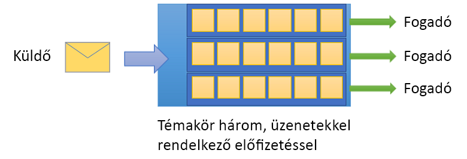

# Mi az Azure Service Bus?

A Microsoft Azure Service Bus egy teljes mértékben felügyelt vállalati integrációs üzenetközvetítő. A Service Bust leggyakrabban az alkalmazások és szolgáltatások egymástól való elkülönítésére használják, továbbá az aszinkron adat- és állapotátvitel biztonságos platformjaként is alkalmazható. Az adatok különböző alkalmazások és szolgáltatások közötti átvitele az *üzenetek* segítségével történik. Az üzenet egy bináris formátum, amely kizárólag JSON-t, XML-t vagy szöveget tartalmazhat. 

Néhány gyakori üzenetküldési forgatókönyv:

* Üzenetküldés: üzleti adatok átvitele, például értékesítési és vásárlási megrendelés, naplók vagy leltármozgások.
* Alkalmazások szétválasztása: alkalmazások és szolgáltatások méretezésének és megbízhatóságának növelése (az ügyfélnek és a szolgáltatásnak nem kell egyidejűleg online lennie).
* Témakörök és előfizetések: 1:*n* kapcsolatok lehetővé tétele a közzétevők és előfizetők között.
* Üzenet-munkamenetek: üzenetrendezést vagy üzenetek halasztását igénylő munkafolyamatok kivitelezése.

## Névterek

A névtér egy hatókörkezelési tároló az üzenetkezelés összes összetevője számára. Egyetlen névtér több üzenetsort és témakört tartalmazhat, és a névterek gyakran alkalmazástárolókként is szolgálnak.

## Üzenetsorok

Az üzenetek az *üzenetsorokba* érkeznek be, és onnan küldi ki őket a rendszer. Az üzenetsorok segítségével addig tárolhatja az üzeneteket, amíg a fogadó alkalmazás elérhetővé nem válik a fogadásra és feldolgozásra.

Az üzenetsorokban található üzeneteket a rendszer a beérkezéskor rendezi és időbélyeggel látja el. Az üzenet elfogadása után azt a rendszer egy redundáns tárolóban helyezi biztonságba. Az üzenetek kézbesítése *lekérési* módban történik, amely kérés esetén kézbesíti az üzeneteket.

## Témakörök

Az üzenetek küldéséhez és fogadásához *témaköröket* is használhat. Amíg egy üzenetsort gyakran használnak közvetlen kommunikációra, addig a témakörök hasznosak a közzétételi/előfizetési forgatókönyvekben.

A témaköröknek több független előfizetése is lehet. Egy adott témakör előfizetője az adott témakörben küldött összes üzenetről kaphat másolatot. Az előfizetések tartós használatra készült névvel ellátott entitások, amelyek adott esetben lejárhatnak vagy automatikusan törlődhetnek.

Bizonyos esetekben nem célszerű az, ha az egyes előfizetések az adott témakörben beérkező összes üzenetet megkapják. Ilyen esetben [szabályokat és a szűrőket](topic-filters.md) használhat arra, hogy választható [műveleteket](topic-filters.md#actions) kiváltó feltételeket határozzon meg, szűrjön bizonyos üzenetekre, valamint beállítsa és módosítsa az üzenetek tulajdonságait.

## Speciális funkciók

A Service Bus olyan speciális funkciókkal is rendelkezik, amelyek segítségével jóval összetettebb üzenetküldési problémákat is megoldhat. A következő szakaszok ezeket a funkciókat ismertetik:

### Üzenet-munkamenetek

Az érkezési sorrend alapján (FIFO) törtnő feldolgozás garantálásához a Service Busban munkameneteket használhat. Az [üzenet-munkamenetek](message-sessions.md) lehetővé teszik a nem kötött kapcsolódó üzenetsorozatok együttes és rendezett kezelését. 

### Automatikus továbbítás

Az [automatikus-továbbítás](service-bus-auto-forwarding.md) funkció lehetővé teszi önnek egy üzenetsor vagy előfizetés hozzákapcsolását egy szintén ugyanazon névtér részét képező másik üzenetsorhoz vagy témakörhöz. Ha az automatikus-továbbítás engedélyezve van, a Service Bus automatikusan törli azon üzeneteket, amelyek az első üzenetsorba vagy előfizetésbe (forrás) kerülnek, és áthelyezi őket a második üzenetsorba vagy témakörbe (cél).

### Kézbesíthetetlen levelek

A Service Bus támogatja a [kézbesíthetetlen levelek várólistáját](service-bus-dead-letter-queues.md) (DLQ), hogy az egyetlen fogadóhoz sem továbbított vagy feldolgozhatatlan üzenetek tárolása is meg legyen oldva. Ezután eltávolíthatja az üzeneteket a kézbesíthetetlen levelek várólistájáról, és megvizsgálhatja azokat.

### Ütemezett kézbesítés

Az üzeneteket [késleltetett feldolgozásra](message-sequencing.md#scheduled-messages) is beadhatja az üzenetsorba vagy témakörbe például azért, hogy egy ütemezett feladattal az üzenetek elérhetővé váljanak egy másik rendszer általi feldolgozásra egy bizonyos időpontban.

### Üzenetek halasztása

Amikor egy üzenetsor vagy előfizetés ügyfele olyan üzenetet kap, amelyet hajlandó feldolgozni, azonban a feldolgozás az aktuális alkalmazáson belüli különleges körülményekből adódóan nem lehetséges, az entitásnak lehetősége van az [üzenet lekérésének késleltetésére](message-deferral.md). Az üzenet az üzenetsorban vagy előfizetésben marad, de a rendszer félreteszi azt.

### Kötegelés

Az [ügyféloldali kötegelés](service-bus-performance-improvements.md#client-side-batching) lehetővé teszi egy üzenetsor vagy témakör ügyfél számára egy üzenet elküldésének adott ideig történő késleltetését. Ha az ügyfél további üzeneteket küld ezen időszakon belül, a rendszer egyetlen kötegben továbbítja ezen üzeneteket. 

### Tranzakciók

Egy [tranzakció](service-bus-transactions.md) két vagy több műveletet kapcsol össze egyetlen végrehajtási hatókörbe. A Service Bus támogatja az egyetlen üzenetküldő entitásra (üzenetsor, témakör, előfizetés) irányuló csoportosítási műveleteket egy tranzakció hatáskörén belül.

### Szűrés és műveletek

Az előfizetők meghatározhatják, hogy mely üzeneteket szeretnék megkapni egy témakörön belül. Ezen üzenetek egy vagy több [névvel ellátott előfizetési szabály](topic-filters.md) formájában adhatók meg. Az előfizetés megfelelő szabályfeltételenként létrehoz egy üzenetmásolatot, amelyek azután megfelelő szabályonként más és más jelöléssel láthatók el.

### Automatikus törlés tétlenség esetén

Az [Automatikus törlés tétlenség esetén](/dotnet/api/microsoft.servicebus.messaging.queuedescription.autodeleteonidle) lehetővé teszi, hogy meghatározzon egy tétlenségi időtartamot, amelyet követően az üzenetsor automatikus törlődik. A minimális érték 5 perc.

### Duplikálás észlelése

Ha olyan hiba lép fel, amely következtében az ügyfélnek kétségei támadnak egy küldési művelet eredményéről, a [duplikálásészlelés](duplicate-detection.md) eloszlatja ezen kétségeket azáltal, hogy a feladó újra elküldheti ugyanazt az üzenetet, az üzenetsor vagy a témakör pedig törli az arról készített másolatokat.

### SAS, RBAC és MSI

A Service Bus támogatja az olyan biztonsági protokollokat, mint a [közös hozzáférésű jogosultságkód](service-bus-sas.md) (SAS), a [szerepköralapú hozzáférés-vezérlés](service-bus-role-based-access-control.md) (RBAC) és a [felügyelt szolgáltatásidentitás](service-bus-managed-service-identity.md) (MSI).

### Geo-vészhelyreállítás

Az Azure-régiók vagy adatközpontok leállása esetében a [Geo-vészhelyreállítás](service-bus-geo-dr.md) lehetővé teszi az adatfeldolgozási művelet folytatását egy másik régióban vagy adatközpontban.

### Biztonság

A Service Bus támogatja a szabványos [AMQP 1.0](service-bus-amqp-overview.md) és [HTTP/REST](/rest/api/servicebus/) protokollokat.

## Ügyfélkódtárak

A Service Bus támogatja a [.NET](https://github.com/Azure/azure-service-bus-dotnet/tree/master), [Java](https://github.com/Azure/azure-service-bus-java/tree/master) és [JMS](https://github.com/Azure/azure-service-bus/tree/master/samples/Java/qpid-jms-client) ügyfélkódtárakat.

## Integráció

A Service Bus teljes mértékben integrálható a következő Azure-szolgáltatásokkal:

- [Event Grid](https://azure.microsoft.com/services/event-grid/) 
- [Logic Apps](https://azure.microsoft.com/services/logic-apps/) 
- [Functions](https://azure.microsoft.com/services/functions/) 
- [Dynamics 365](https://dynamics.microsoft.com)
- [Stream Analytics](https://azure.microsoft.com/services/stream-analytics/)
 
## További lépések

A Service Bus-üzenetküldéssel való megismerkedéshez tekintse meg a következő cikkeket:

* [Azure üzenetküldő szolgáltatásainak összehasonlítása](../event-grid/compare-messaging-services.md?toc=%2fazure%2fservice-bus-messaging%2ftoc.json&bc=%2fazure%2fservice-bus-messaging%2fbreadcrumb%2ftoc.json)
* További tudnivalók az Azure Service Bus [Standard és Prémium](https://azure.microsoft.com/pricing/details/service-bus/) szintjeiről és azok díjszabásáról
* [Az Azure Service Bus Prémium szintű csomag teljesítménye és késése](https://blogs.msdn.microsoft.com/servicebus/2016/07/18/premium-messaging-how-fast-is-it/)
* Próbálja ki a [.NET-hez](service-bus-quickstart-powershell.md), [Javához](service-bus-quickstart-powershell.md) vagy [JMS-hez](service-bus-quickstart-powershell.md) készült gyors útmutatókat
