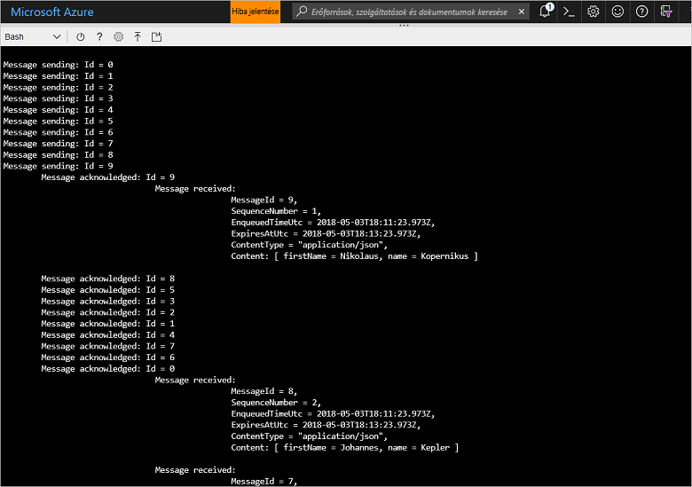

# <a name="quickstart-send-and-receive-messages-using-azure-cli-and-java"></a>Rövid útmutató: Üzenetek küldése és fogadása az Azure CLI és a Java használatával

A Microsoft Azure Service Bus egy vállalati integrációs üzenetközvetítő, amely biztonságos üzenetküldést és megbízható szolgáltatást nyújt. Egy jellemző Service Bus-forgatókönyv általában két vagy több alkalmazás, szolgáltatás vagy folyamat egymástól való szétválasztását (az alkalmazásoknak nem kell egyidejűleg online állapotban lenniük), az állapot- vagy adatváltozások továbbítását, valamint az alkalmazások közötti üzenetküldést foglalja magában. 

Például egy kereskedelmi vállalat elküldheti az értékesítési pontokra vonatkozó adatait egy háttérrendszernek vagy egy regionális terjesztőközpontnak feltöltés vagy leltárfrissítés céljából. Ebben az esetben az ügyfélalkalmazás üzeneteket küld és fogad egy Service Bus-üzenetsorból:


Ez a rövid útmutató azt ismerteti, hogyan küldhet és fogadhat üzeneteket a Service Busszal az Azure CLI és a Service Bus Java-kódtár használatával. Ha további technikai részletekre kíváncsi, olvassa el a mintakód fő elemeihez tartozó [magyarázatot](#understand-the-sample-code).

Ha nem rendelkezik Azure-előfizetéssel, első lépésként létrehozhat egy [ingyenes fiókot][].

[!INCLUDE [cloud-shell-try-it.md](../../includes/cloud-shell-try-it.md)]

## <a name="log-in-to-azure"></a>Jelentkezzen be az Azure-ba

Az Azure Portal jobb felső sarkában található menüben kattintson a Cloud Shell gombra, majd a **Környezet kiválasztása** legördülő menüben válassza a **Bash** lehetőséget. 

## <a name="use-cli-to-create-resources"></a>A parancssori felület használata erőforrások létrehozásához

A Cloud Shellben a Bash parancssorból indítsa el az alábbi parancsokat a Service Bus-erőforrások kiépítéséhez. Ne felejtse el lecserélni az összes helyőrzőt a megfelelő értékre:

```azurecli-interactive
# Create a resource group
az group create --name myResourceGroup --location eastus

# Create a Service Bus messaging namespace with a unique name
namespaceName=myNameSpace$RANDOM
az servicebus namespace create \
   --resource-group myResourceGroup \
   --name $namespaceName \
   --location eastus

# Create a Service Bus queue
az servicebus queue create --resource-group myResourceGroup \
   --namespace-name $namespaceName \
   --name myQueue

# Get the connection string for the namespace
connectionString=$(az servicebus namespace authorization-rule keys list \
   --resource-group myResourceGroup \
   --namespace-name  $namespaceName \
   --name RootManageSharedAccessKey \
   --query primaryConnectionString --output tsv)
```

Az utolsó parancs futtatása után másolja ki és illessze be a kapcsolati sztringet és a kiválasztott üzenetsor nevét egy átmeneti helyre, például a Jegyzettömbbe. A következő lépésben szüksége lesz ezekre.

## <a name="send-and-receive-messages"></a>Üzenetek küldése és fogadása

Miután létrehozta a névteret és az üzenetsort, valamint beszerezte a szükséges hitelesítő adatokat, készen áll az üzenetek küldésére és fogadására. A kódot [ebben a GitHub-mintamappában](https://github.com/Azure/azure-service-bus/tree/master/samples/Java/quickstarts-and-tutorials/quickstart-java/src/main/java/samples/quickstart/SendAndReceiveMessages.java) vizsgálhatja meg.

1. Győződjön meg róla, hogy a Cloud Shell nyitva van, és a Bash-parancssort jeleníti meg.

2. Klónozza a [Service Bus GitHub-adattárát](https://github.com/Azure/azure-service-bus/) a következő paranccsal:

   ```bash
   git clone https://github.com/Azure/azure-service-bus.git
   ```

2. Módosítsa az aktuális könyvtárat a mintamappára, útvonal-elválasztóként pedig használjon perjelet:

   ```bash
   cd azure-service-bus/samples/Java/quickstarts-and-tutorials/quickstart-java 
   ```

3. Az alkalmazás létrehozásához adja ki az alábbi parancsot:
   
   ```bash
   mvn clean package -DskipTests
   ```

4. A program futtatásához adja ki az alábbi parancsot. Amíg nem indítja újra a Bash-felületet, a kapcsolati sztringet tartalmazó változó értékét a rendszer automatikusan kicseréli:

   ```bash
   java -jar ./target/samples.quickstart-1.0.0-jar-with-dependencies.jar -c $connectionString -q myQueue
   ```

6. Figyelje meg 10 üzenet küldését az üzenetsorban. Vegye figyelembe, hogy az üzenetek sorba rendezése nem garantált, de az adattartalommal együtt láthatja az elküldött, majd nyugtázott és fogadott üzeneteket:

   

## <a name="clean-up-resources"></a>Az erőforrások eltávolítása

Az alábbi paranccsal eltávolítható az erőforráscsoport, a névtér és az összes kapcsolódó erőforrás:

```azurecli-interactive
az group delete --resource-group myResourceGroup
```

## <a name="understand-the-sample-code"></a>A mintakód értelmezése

Ez a szakasz a mintakód fő szakaszaival kapcsolatos további részleteket ismerteti. A GitHub-adattárban található kódot megkeresheti [itt](https://github.com/Azure/azure-service-bus/blob/master/samples/Java/quickstarts-and-tutorials/quickstart-java/src/main/java/samples/quickstart/SendAndReceiveMessages.java).

### <a name="get-connection-string-and-queue"></a>A kapcsolati sztring és az üzenetsor lekérése

A kód először két sztringváltozót jelöl ki, amelyeket aztán a program argumentumként továbbít a parancssorba:

```java
String ConnectionString = null;
String QueueName = null;
```

Ezeket az értékeket a rendszer paraméterként adja hozzá, és a `runApp()` metódusban osztja ki őket:

```java
public static void main(String[] args) {
    SendAndReceiveMessages app = new SendAndReceiveMessages();
    try {
        app.runApp(args);
        app.run();
    } catch (Exception e) {
        System.out.printf("%s", e.toString());
    }
    System.exit(0);
}

public void runApp(String[] args) {
    try {
        // parse connection string from command line             
        Options options = new Options();
        options.addOption(new Option("c", true, "Connection string"));
        options.addOption(new Option("q", true, "Queue Name"));
        CommandLineParser clp = new DefaultParser();
        CommandLine cl = clp.parse(options, args);
        if (cl.getOptionValue("c") != null && cl.getOptionValue("q") != null) {
            ConnectionString = cl.getOptionValue("c");
            QueueName =  cl.getOptionValue("q");
        }
        else
        {
            HelpFormatter formatter = new HelpFormatter();
            formatter.printHelp("run jar with", "", options, "", true);
        }

    } catch (Exception e) {
        System.out.printf("%s", e.toString());
    }
}
```

### <a name="create-queue-clients-to-send-and-receive"></a>Üzenetsor-ügyfelek létrehozása a küldéshez és fogadáshoz

A `run()` metódus az üzenetek küldéséhez és fogadásához üzenetsorügyfél-példányokat hoz létre, amelyeket a kapcsolati sztringből és az üzenetsor nevéből állít össze. Ez a kód két üzenetsorügyfelet hoz lére, egyet a küldéshez és egyet a fogadáshoz:

```java
public void run() throws Exception {
// Create a QueueClient instance for receiving using the connection string builder
// We set the receive mode to "PeekLock", meaning the message is delivered
// under a lock and must be acknowledged ("completed") to be removed from the queue
QueueClient receiveClient = new QueueClient(new ConnectionStringBuilder(ConnectionString, QueueName), ReceiveMode.PEEKLOCK);
this.registerReceiver(receiveClient);

// Create a QueueClient instance for sending and then asynchronously send messages.
QueueClient sendClient = new QueueClient(new ConnectionStringBuilder(ConnectionString, QueueName), ReceiveMode.PEEKLOCK);
```

A `run()` metódus ezután elindítja az aszinkron üzenetküldési műveletet, és amint a művelet befejeződött, bezárja a küldőt:

```java
this.sendMessagesAsync(sendClient).thenRunAsync(() -> sendClient.closeAsync());
``` 

### <a name="construct-and-send-messages"></a>Üzenetek létrehozása és küldése

A `sendMessagesAsync()` metódus egy 10 üzenetből álló készletet hoz létre, és aszinkron módon elküldi őket az üzenetsorügyféllel:

```java
CompletableFuture<Void> sendMessagesAsync(QueueClient sendClient) {
List<HashMap<String, String>> data =
        GSON.fromJson(
                "[" +
                        "{'name' = 'Einstein', 'firstName' = 'Albert'}," +
                        "{'name' = 'Heisenberg', 'firstName' = 'Werner'}," +
                        "{'name' = 'Curie', 'firstName' = 'Marie'}," +
                        "{'name' = 'Hawking', 'firstName' = 'Steven'}," +
                        "{'name' = 'Newton', 'firstName' = 'Isaac'}," +
                        "{'name' = 'Bohr', 'firstName' = 'Niels'}," +
                        "{'name' = 'Faraday', 'firstName' = 'Michael'}," +
                        "{'name' = 'Galilei', 'firstName' = 'Galileo'}," +
                        "{'name' = 'Kepler', 'firstName' = 'Johannes'}," +
                        "{'name' = 'Kopernikus', 'firstName' = 'Nikolaus'}" +
                        "]",
                new TypeToken<List<HashMap<String, String>>>() {}.getType());

List<CompletableFuture> tasks = new ArrayList<>();
for (int i = 0; i < data.size(); i++) {
    final String messageId = Integer.toString(i);
    Message message = new Message(GSON.toJson(data.get(i), Map.class).getBytes(UTF_8));
    message.setContentType("application/json");
    message.setLabel("Scientist");
    message.setMessageId(messageId);
    message.setTimeToLive(Duration.ofMinutes(2));
    System.out.printf("\nMessage sending: Id = %s", message.getMessageId());
    tasks.add(
            sendClient.sendAsync(message).thenRunAsync(() -> {
                System.out.printf("\n\tMessage acknowledged: Id = %s", message.getMessageId());
            }));
}
return CompletableFuture.allOf(tasks.toArray(new CompletableFuture<?>[tasks.size()]));
```

### <a name="receive-messages"></a>Üzenetek fogadása

A `registerReceiver()` metódus regisztrálja a `RegisterMessageHandler` visszahívását, és megad néhány üzenetkezelői beállítást:

```java
void registerReceiver(QueueClient queueClient) throws Exception {
    // register the RegisterMessageHandler callback
    queueClient.registerMessageHandler(new IMessageHandler() {
                           // callback invoked when the message handler loop has obtained a message
                           public CompletableFuture<Void> onMessageAsync(IMessage message) {
                               // receives message is passed to callback
                               if (message.getLabel() != null &&
                                       message.getContentType() != null &&
                                       message.getLabel().contentEquals("Scientist") &&
                                       message.getContentType().contentEquals("application/json")) {
                                    byte[] body = message.getBody();
                                   Map scientist = GSON.fromJson(new String(body, UTF_8), Map.class);

                                   System.out.printf(
                                           "\n\t\t\t\tMessage received: \n\t\t\t\t\t\tMessageId = %s, \n\t\t\t\t\t\tSequenceNumber = %s, \n\t\t\t\t\t\tEnqueuedTimeUtc = %s," +
                                                   "\n\t\t\t\t\t\tExpiresAtUtc = %s, \n\t\t\t\t\t\tContentType = \"%s\",  \n\t\t\t\t\t\tContent: [ firstName = %s, name = %s ]\n",
                                           message.getMessageId(),
                                           message.getSequenceNumber(),
                                           message.getEnqueuedTimeUtc(),
                                           message.getExpiresAtUtc(),
                                           message.getContentType(),
                                           scientist != null ? scientist.get("firstName") : "",
                                           scientist != null ? scientist.get("name") : "");
                               }
                               return CompletableFuture.completedFuture(null);
                           }

                           // callback invoked when the message handler has an exception to report
                           public void notifyException(Throwable throwable, ExceptionPhase exceptionPhase) {
                               System.out.printf(exceptionPhase + "-" + throwable.getMessage());
                           }
                       },
    // 1 concurrent call, messages are auto-completed, auto-renew duration
    new MessageHandlerOptions(1, true, Duration.ofMinutes(1)));

}
```

## <a name="next-steps"></a>További lépések

Ebben a cikkben egy Service Bus-névteret és az üzenetsorba történő üzenetküldéshez és -fogadáshoz szükséges egyéb erőforrásokat hozott létre. Ha többet szeretne megtudni az üzenetfogadásra és -küldésre szolgáló kódok írásáról, lépjen tovább a Service Busról szóló oktatóanyagra:

> [!div class="nextstepaction"]
> [Leltár frissítése a parancssori felület és a Java használatával](./service-bus-tutorial-topics-subscriptions-cli.md)

[ingyenes fiókot]: https://azure.microsoft.com/free/?ref=microsoft.com&utm_source=microsoft.com&utm_medium=docs&utm_campaign=visualstudio
[fully qualified domain name]: https://wikipedia.org/wiki/Fully_qualified_domain_name
[Install Azure CLI 2.0]: /cli/azure/install-azure-cli
[az group create]: /cli/azure/group#az_group_create