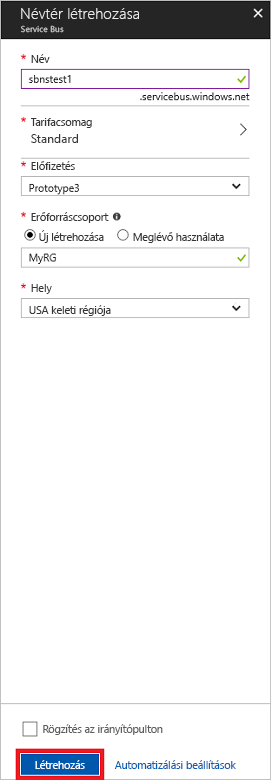

# <a name="quickstart-use-azure-portal-to-create-a-service-bus-queue"></a>Gyors útmutató: A Service Bus-üzenetsor létrehozása az Azure portal használatával
A Microsoft Azure Service Bus egy vállalati integrációs üzenetközvetítő, amely biztonságos üzenetküldést és teljes mértékben megbízható szolgáltatást nyújt. Egy jellemző Service Bus-forgatókönyv általában két vagy több alkalmazás, szolgáltatás vagy folyamat egymástól való szétválasztását, továbbá az állapot- vagy adatváltozások továbbítását foglalja magában. Ilyen esetekben előfordulhat, hogy több kötegelt feladatokat kell üzemeznie más alkalmazásokban vagy szolgáltatásokban, vagy pedig ki kell váltani a megrendelések teljesítését. Például egy kereskedelmi vállalat elküldheti az értékesítési pontokra vonatkozó adatait egy háttérrendszernek vagy egy regionális terjesztőközpontnak feltöltés vagy leltárfrissítés céljából. Ebben a forgatókönyvben az ügyfélalkalmazás üzeneteket küld és fogad egy Service Bus-üzenetsorból.  


Ebből a rövid útmutatóból megismerheti, hogyan használhatja az [Azure Portalt][Azure portal] egy Service Bus-üzenetsorral való üzenetváltásra egy üzenetküldési névtér és egy azon belüli üzenetsor létrehozásával, valamint az adott névsor hitelesítő adatainak lekérésével. Az eljárás ezután bemutatja, hogyan küldhet és fogadhat üzeneteket az üzenetsorból a [.NET Standard-kódtárral](https://www.nuget.org/packages/Microsoft.Azure.ServiceBus).

Ha nem rendelkezik Azure-előfizetéssel, első lépésként létrehozhat egy [ingyenes fiókot][].

## <a name="prerequisites"></a>Előfeltételek

Az oktatóanyag elvégzéséhez győződjön meg arról, hogy telepítette a következőket:

- [Visual Studio 2017 3-as frissítés (verziószám: 15.3, 26730.01)](https://www.visualstudio.com/vs) vagy újabb.
- [NET Core SDK](https://www.microsoft.com/net/download/windows), 2.0-s vagy újabb verzió.

## <a name="log-on-to-the-azure-portal"></a>Bejelentkezés az Azure Portalra

Először nyissa meg az [Azure Portalt][Azure portal], és jelentkezzen be Azure-előfizetésével. Az első lépés egy **Üzenetkezelés** típusú Service Bus-névtér létrehozása.

## <a name="create-a-service-bus-namespace"></a>Service Bus-névtér létrehozása

A Service Bus üzenetküldési névtere egyedi hatókörkezelési tárolót biztosít, amelyre a [teljes tartománynevével][] lehet hivatkozni, és ebben a tárolóban egy vagy több üzenetsort, témakört és előfizetést is létrehozhat. Az alábbi példa egy Service Bus-üzenetküldési névteret hoz létre egy új vagy meglévő [erőforráscsoportban](/azure/azure-resource-manager/resource-group-portal):

1. A portál bal oldali navigációs paneljén kattintson a **+ Erőforrás létrehozása**, a **Vállalati integráció**, majd a **Service Bus** elemre.
2. A **Névtér létrehozása** párbeszédpanelen adja meg a névtér nevét. A rendszer azonnal ellenőrzi, hogy a név elérhető-e.
3. Miután meggyőződött arról, hogy a névtér neve elérhető, válassza ki a tarifacsomagot (Standard vagy Prémium).
4. Az **Előfizetés** mezőben válassza ki azt az Azure-előfizetést, amelyben a névteret létre kívánja hozni.
5. Az **Erőforráscsoport** mezőben válasszon ki egy meglévő erőforráscsoportot, amelynek a névtér a része lesz, vagy hozzon létre egy újat.      
6. A **Hely** mezőben válassza ki azt az országot vagy régiót, amelyben a névtér üzemeltetve lesz.
7. Kattintson a **Create** (Létrehozás) gombra. A rendszer ekkor létrehozza és engedélyezi a névteret. Előfordulhat, hogy néhány percet várnia kell, amíg a rendszer kiosztja az erőforrásokat a fiókja számára.



### <a name="obtain-the-management-credentials"></a>A felügyeleti hitelesítő adatok beszerzése

Egy új névtér létrehozásával automatikusan létrejön egy kezdeti közös hozzáférésű jogosultságkódra (SAS) vonatkozó szabály egy elsődleges és egy másodlagos kulcsból álló kulcspárral, amelyek mindegyike teljes hozzáférést biztosít a névtér minden területéhez. A kezdeti szabály másolásához kövesse az alábbi lépéseket: 

1.  Kattintson az **Összes erőforrás** elemre, majd az újonnan létrehozott névtér nevére.
2. A névtér ablakában kattintson a **Megosztott elérési házirendek** elemre.
3. A **Megosztott elérési házirendek** képernyőn kattintson a **RootManageSharedAccessKey** elemre.
4. Az a **házirend: RootManageSharedAccessKey** ablakban kattintson a **másolási** megjelenítő gombra **elsődleges kapcsolati karakterlánc**, hogy másolja a kapcsolati karakterláncot a vágólapra későbbi használatra. Illessze be ezt az értéket a Jegyzettömbbe vagy egy másik ideiglenes helyre. 

    ![connection-string][connection-string]
5. A későbbi használat érdekében ismételje meg az előző lépést, és másolja ki és illessze be az **Elsődleges kulcs** értékét egy ideiglenes helyre.

## <a name="create-a-queue"></a>Üzenetsor létrehozása

Adja meg a névteret, amelyben létre kívánja hozni a Service Bus-üzenetsort. Az alábbi példa bemutatja, hogyan hozhat létre üzenetsort a portálon:

1. A portál bal oldali navigációs panelén kattintson a **Service Bus** elemre (ha nem lát **Service Bus** elemet, kattintson a **További szolgáltatások** lehetőségre).
2. Kattintson a névtérre, amelyben az üzenetsort létre kívánja hozni.
3. A névtér ablakban kattintson az **Üzenetsorok** lehetőségre, majd a **Üzenetsorok** ablakban kattintson a **+ Üzenetsor** lehetőségre.
4. Adjon meg egy nevet az üzenetsor **Név** mezőjében, a többi érték alapértelmezését pedig ne módosítsa.
5. Az ablak alján kattintson a **Létrehozás** elemre.
6. Jegyezze fel az üzenetsor nevét.

## <a name="send-and-receive-messages"></a>Üzenetek küldése és fogadása

Miután kiépítette a névteret és az üzenetsort, valamint beszerezte a szükséges hitelesítő adatokat, készen áll az üzenetek küldésére és fogadására. A kódot [ebben a GitHub-mintamappában](https://github.com/Azure/azure-service-bus/tree/master/samples/Java/azure-servicebus/TopicFilters) vizsgálhatja meg.

A kód futtatásához tegye a következőt:

1. Klónozza a [Service Bus GitHub-adattárát](https://github.com/Azure/azure-service-bus/) a következő paranccsal:

   ```shell
   git clone https://github.com/Azure/azure-service-bus.git
   ```

3. Lépjen a következő mintamappához: `azure-service-bus\samples\DotNet\GettingStarted\BasicSendReceiveQuickStart\BasicSendReceiveQuickStart`.

4. Másolja be [A felügyeleti hitelesítő adatok beszerzése](#obtain-the-management-credentials) című szakaszban beszerzett kapcsolati sztringet és üzenetsor-nevet.

5.  Írja be a parancssorba a következő parancsot:

   ```shell
   dotnet build
   ```

6.  Navigáljon a `bin\Debug\netcoreapp2.0` mappához.

7.  Írja be a következő parancsot a program futtatásához. Ne felejtse el kicserélni a `myConnectionString` kifejezést az előzőleg beszerzett értékre, a `myQueueName` kifejezést pedig az imént létrehozott üzenetsor nevére:

   ```shell
   dotnet BasicSendReceiveQuickStart.dll -ConnectionString "myConnectionString" -QueueName "myQueueName"
   ``` 

8. Figyeljen meg 10 üzenetet, amelyeket a rendszer elküld az üzenetsornak, majd onnan fogadja őket:

   

## <a name="clean-up-resources"></a>Az erőforrások eltávolítása

A portálon eltávolíthatja az erőforráscsoportot, a névteret és az üzenetsort.

## <a name="understand-the-sample-code"></a>A mintakód értelmezése

Ez a szakasz a mintakód működésének további részleteit ismerteti. 

### <a name="get-connection-string-and-queue"></a>A kapcsolati sztring és az üzenetsor lekérése

A rendszer parancssori argumentumként adja át a kapcsolati sztringet és az üzenetsor nevét a `Main()` metódusnak. A `Main()` metódus két sztringváltozót jelöl ki az értékek tárolásához:

```csharp
static void Main(string[] args)
{
    string ServiceBusConnectionString = "";
    string QueueName = "";

    for (int i = 0; i < args.Length; i++)
    {
        var p = new Program();
        if (args[i] == "-ConnectionString")
        {
            Console.WriteLine($"ConnectionString: {args[i+1]}");
            ServiceBusConnectionString = args[i + 1]; 
        }
        else if(args[i] == "-QueueName")
        {
            Console.WriteLine($"QueueName: {args[i+1]}");
            QueueName = args[i + 1];
        }                
    }

    if (ServiceBusConnectionString != "" && QueueName != "")
        MainAsync(ServiceBusConnectionString, QueueName).GetAwaiter().GetResult();
    else
    {
        Console.WriteLine("Specify -Connectionstring and -QueueName to execute the example.");
        Console.ReadKey();
    }                            
}
```
 
A `Main()` metódus ezután elindítja a `MainAsync()` aszinkron üzenethurkot.

### <a name="message-loop"></a>Üzenethurok

A MainAsync() metódus a parancssori argumentumokkal létrehoz egy üzenetsorügyfelet, meghív egy `RegisterOnMessageHandlerAndReceiveMessages()` nevű fogadó üzenetkezelőt, és elküldi az üzenetek készletét:

```csharp
static async Task MainAsync(string ServiceBusConnectionString, string QueueName)
{
    const int numberOfMessages = 10;
    queueClient = new QueueClient(ServiceBusConnectionString, QueueName);

    Console.WriteLine("======================================================");
    Console.WriteLine("Press any key to exit after receiving all the messages.");
    Console.WriteLine("======================================================");

    // Register QueueClient's MessageHandler and receive messages in a loop
    RegisterOnMessageHandlerAndReceiveMessages();

    // Send Messages
    await SendMessagesAsync(numberOfMessages);

    Console.ReadKey();

    await queueClient.CloseAsync();
}
```

A `RegisterOnMessageHandlerAndReceiveMessages()` metódus egyszerűen megad néhány üzenetkezelő-beállítást, majd meghívja az üzenetsorügyfél `RegisterMessageHandler()` metódusát, amely elindítja a fogadást:

```csharp
static void RegisterOnMessageHandlerAndReceiveMessages()
{
    // Configure the MessageHandler Options in terms of exception handling, number of concurrent messages to deliver etc.
    var messageHandlerOptions = new MessageHandlerOptions(ExceptionReceivedHandler)
    {
        // Maximum number of Concurrent calls to the callback `ProcessMessagesAsync`, set to 1 for simplicity.
        // Set it according to how many messages the application wants to process in parallel.
        MaxConcurrentCalls = 1,

        // Indicates whether MessagePump should automatically complete the messages after returning from User Callback.
        // False below indicates the Complete will be handled by the User Callback as in `ProcessMessagesAsync` below.
        AutoComplete = false
    };

    // Register the function that will process messages
    queueClient.RegisterMessageHandler(ProcessMessagesAsync, messageHandlerOptions);
} 
```

### <a name="send-messages"></a>Üzenetek küldése

Az üzenetlétrehozási és -küldési műveletek a `SendMessagesAsync()` metódusban mennek végbe:

```csharp
static async Task SendMessagesAsync(int numberOfMessagesToSend)
{
    try
    {
        for (var i = 0; i < numberOfMessagesToSend; i++)
        {
            // Create a new message to send to the queue
            string messageBody = $"Message {i}";
            var message = new Message(Encoding.UTF8.GetBytes(messageBody));

            // Write the body of the message to the console
            Console.WriteLine($"Sending message: {messageBody}");

            // Send the message to the queue
            await queueClient.SendAsync(message);
        }
    }
    catch (Exception exception)
    {
        Console.WriteLine($"{DateTime.Now} :: Exception: {exception.Message}");
    }
}
```

### <a name="process-messages"></a>Üzenetek feldolgozása

A `ProcessMessagesAsync()` metódus nyugtázza, feldolgozza és befejezi az üzenetek fogadását:

```csharp
static async Task ProcessMessagesAsync(Message message, CancellationToken token)
{
    // Process the message
    Console.WriteLine($"Received message: SequenceNumber:{message.SystemProperties.SequenceNumber} Body:{Encoding.UTF8.GetString(message.Body)}");

    // Complete the message so that it is not received again.
    await queueClient.CompleteAsync(message.SystemProperties.LockToken);
}
```

## <a name="next-steps"></a>További lépések

Ebben a cikkben egy Service Bus-névteret és az üzenetsorba történő üzenetküldéshez és -fogadáshoz szükséges egyéb erőforrásokat hozott létre. Ha többet szeretne megtudni az üzenetfogadásra és -küldésre szolgáló kódok írásáról, lépjen tovább a Service Busról szóló oktatóanyagra:

> [!div class="nextstepaction"]
> [Leltár frissítése az Azure Portal használatával](./service-bus-tutorial-topics-subscriptions-portal.md)


[ingyenes fiókot]: https://azure.microsoft.com/free/?ref=microsoft.com&utm_source=microsoft.com&utm_medium=docs&utm_campaign=visualstudio
[teljes tartománynevével]: https://wikipedia.org/wiki/Fully_qualified_domain_name
[Azure portal]: https://portal.azure.com/

[connection-string]: ./media/service-bus-quickstart-portal/connection-string.png
[service-bus-flow]: ./media/service-bus-quickstart-portal/service-bus-flow.png
