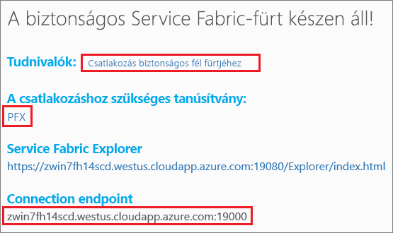

# <a name="quickstart-deploy-a-service-fabric-windows-container-application-on-azure"></a>Gyors útmutató: Windows-alapú Service Fabric-tároló üzembe helyezése az Azure-on
Az Azure Service Fabric egy elosztott rendszerplatform, amely skálázható és megbízható mikroszolgáltatások és tárolók üzembe helyezésére és kezelésére szolgál. 

A meglévő alkalmazások Service Fabric-fürtökön lévő Windows-tárolókban való futtatásához nem szükséges módosítania az alkalmazást. Ez a rövid útmutató bemutatja, hogyan helyezheti üzembe a Docker-tárolók előre összeállított rendszerképeit egy Service Fabric-alkalmazásban. Ha elkészült, rendelkezni fog egy futó Windows Server 2016 Nano Server- és IIS-tárolóval. Ez a rövid útmutató a Windows-tárolók üzembe helyezését mutatja be. A Linux-tárolók üzembe helyezését lásd [ebben a rövid útmutatóban](service-fabric-quickstart-containers-linux.md).

![Az IIS alapértelmezett webhelye][iis-default]

Ennek a rövid útmutatónak a segítségével megtanulhatja az alábbiakat:

* Docker-rendszerképtároló becsomagolása
* A kommunikáció konfigurálása
* Service Fabric-alkalmazás felépítése és becsomagolása
* A tárolóalkalmazás üzembe helyezése az Azure-on

## <a name="prerequisites"></a>Előfeltételek
* Azure-előfizetés (létrehozhat egy [ingyenes fiókot](https://azure.microsoft.com/free/?WT.mc_id=A261C142F)).
* Egy fejlesztői számítógép, amelyen a következők futnak:
  * Visual Studio 2015 vagy Visual Studio 2017.
  * [Service Fabric SDK és -eszközök](service-fabric-get-started.md).

## <a name="package-a-docker-image-container-with-visual-studio"></a>Docker-rendszerképtároló becsomagolása a Visual Studióval
A Service Fabric SDK és -eszközök egy szolgáltatássablont biztosítanak, amelynek segítségével a tároló üzembe helyezhető egy Service Fabric-fürtben.

Indítsa el a Visual Studiót „rendszergazdaként”.  Válassza a **File** (Fájl) > **New** (Új) > **Project** (Projekt) lehetőséget.

Válassza a **Service Fabric application** (Service Fabric-alkalmazás) lehetőséget, nevezze el „MyFirstContainer” néven, és kattintson az **OK** gombra.

A **Hosted Containers and Applications** (Üzemeltetett tárolók és alkalmazások) sablonokból válassza a **Container** (Tároló) elemet.

A **Rendszerkép neve** mezőbe írja be a „microsoft/iis:nanoserver” karaktersort, amely a [Windows Server Nano Server- és IIS-alaprendszerképet](https://hub.docker.com/r/microsoft/iis/) jelöli. 

Konfigurálja úgy a tárolóport–gazdagépport leképezést, hogy a szolgáltatáshoz a 80-as porton beérkező kérések a tárolón a 80-as portra legyenek leképezve.  Állítsa a **Tárolóport** beállítást 80, a **Gazdaport** beállítást pedig szintén 80 értékre.  

Nevezze el a szolgáltatást „MyContainerService” néven, majd kattintson az **OK** gombra.

![Új szolgáltatás párbeszédpanel][new-service]

## <a name="create-a-cluster"></a>Fürt létrehozása
Az alkalmazás Azure-fürtön történő üzembe helyezése érdekében csatlakozhat egy nyilvános fürthöz. A nyilvános fürtök ingyenes, korlátozott időtartamú Azure Service Fabric-fürtök, amelyek futtatását a Service Fabric csapata végzi, és amelyeken bárki üzembe helyezhet alkalmazásokat, és megismerkedhet a platform használatával.  A fürt egy önaláírt tanúsítványt használ a csomópontok közötti, valamint a kliens és a csomópont közötti biztonsághoz. A nyilvános fürtök támogatják a tárolókat. Ha úgy dönt, hogy saját fürtöt állít be és azt használja, akkor a fürtnek a tárolókat támogató termékváltozaton kell futnia (például tárolókkal rendelkező Windows Server 2016 Datacenteren).

Jelentkezzen be, és [csatlakozzon egy Windows-fürthöz](http://aka.ms/tryservicefabric). A **PFX** hivatkozásra kattintva töltse le a PFX-tanúsítványt a számítógépre. Kattintson a **Csatlakozás biztonságos fél fürtjéhez** nevű hivatkozásra, és másolja a tanúsítvány jelszavát. A tanúsítványra, a tanúsítvány jelszavára és a **Kapcsolati végpont** értékére a következő lépésekben szükség lesz.



> [!Note]
> Óránként korlátozott számú nyilvános fürt érhető el. Ha a nyilvános fürtre való regisztráláskor hiba lép fel, várjon egy ideig, mielőtt újrapróbálkozna, vagy kövesse a [.NET-alkalmazás üzembe helyezése](https://docs.microsoft.com/azure/service-fabric/service-fabric-tutorial-deploy-app-to-party-cluster#deploy-the-sample-application) oktatóanyagban szereplő lépéseket, amellyel létrehozhat egy Service Fabric-fürtöt az Azure-előfizetésben, és üzembe helyezheti rajta az alkalmazást. A Visual Studióval létrehozott fürt támogatja a tárolók használatát. Miután üzembe helyezte és ellenőrizte az alkalmazást a fürtön, továbbléphet a rövid útmutató [Példa teljes Service Fabric-alkalmazásra és szolgáltatásjegyzékre](#complete-example-service-fabric-application-and-service-manifests) című részéhez. 
>

Egy Windows-számítógépen telepítse a PFX-et a *CurrentUser\My* tanúsítványtárolóba.

```powershell
PS C:\mycertificates> Import-PfxCertificate -FilePath .\party-cluster-873689604-client-cert.pfx -CertStoreLocation Cert:\CurrentUser\My -Password (ConvertTo-SecureString 873689604 -AsPlainText -Force)


  PSParentPath: Microsoft.PowerShell.Security\Certificate::CurrentUser\My

Thumbprint                                Subject
----------                                -------
3B138D84C077C292579BA35E4410634E164075CD  CN=zwin7fh14scd.westus.cloudapp.azure.com
``` 

## <a name="deploy-the-application-to-azure-using-visual-studio"></a>Alkalmazás üzembe helyezése az Azure-ban a Visual Studio használatával
Az alkalmazást a létrehozása után telepítheti a fürtben, közvetlenül a Visual Studióból.

A Solution Explorerben (Megoldáskezelőben) kattintson a jobb gombbal a **MyFirstContainer** elemre, majd kattintson a **Publish** (Közzététel) parancsra. Ekkor megjelenik a Publish (Közzététel) párbeszédpanel.

Másolja be a **Kapcsolati végpont** értékét a nyilvános fürt lapjáról a **Connection Endpoint** (Kapcsolati végpont) mezőbe. Például: `zwin7fh14scd.westus.cloudapp.azure.com:19000`. 

Kattintson a **Publish** (Közzététel) gombra.

A fürtben szereplő minden alkalmazásnak egyedi névvel kell rendelkeznie.  A nyilvános fürtök azonban nyilvános és megosztott környezetek, így ütközés léphet fel egy meglévő alkalmazással.  Névütközés esetén nevezze át a Visual Studio-projektet, és végezze el újra az üzembe helyezést.

Nyisson meg egy böngészőt, majd navigáljon a nyilvános fürt lapján megadott **kapcsolati végponthoz**. Azt is megteheti, hogy beilleszti előre a `http://` sémaazonosítót, vagy hozzáfűzheti a `:80` portot az URL-címhez. Például: http://zwin7fh14scd.westus.cloudapp.azure.com:80. Ekkor az IIS alapértelmezett webhelyének kell megjelennie: ![Az IIS alapértelmezett webhelye][iis-default]

## <a name="next-steps"></a>További lépések
Ennek a rövid útmutatónak a segítségével megtanulta a következőket:

* Docker-rendszerképtároló becsomagolása
* A kommunikáció konfigurálása
* Service Fabric-alkalmazás felépítése és becsomagolása
* A tárolóalkalmazás üzembe helyezése az Azure-on

Ha bővebb információra van szüksége a Windows-tárolók Service Fabricben való használatával kapcsolatban, lépjen tovább a Windows-tárolóalkalmazásokról szóló oktatóanyagra.

> [!div class="nextstepaction"]
> [Tárolóalkalmazás létrehozása Windowshoz](./service-fabric-host-app-in-a-container.md)

[iis-default]: ./media/service-fabric-quickstart-containers/iis-default.png
[publish-dialog]: ./media/service-fabric-quickstart-containers/publish-dialog.png
[new-service]: ./media/service-fabric-quickstart-containers/NewService.png
