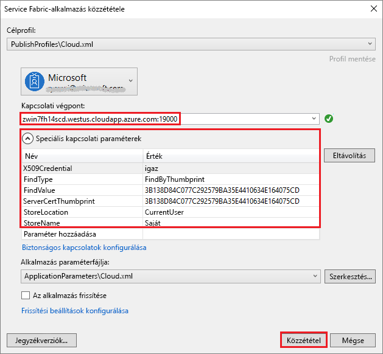

# <a name="quickstart-deploy-windows-containers-to-service-fabric"></a>Gyors útmutató: Windows-tárolók üzembe helyezése a Service Fabric

Az Azure Service Fabric egy elosztott rendszerplatform, amely skálázható és megbízható mikroszolgáltatások és tárolók üzembe helyezésére és kezelésére szolgál.

A meglévő alkalmazások Service Fabric-fürtökön lévő Windows-tárolókban való futtatásához nem szükséges módosítania az alkalmazást. Ez a rövid útmutató bemutatja, hogyan helyezheti üzembe a Docker-tárolók előre összeállított rendszerképeit egy Service Fabric-alkalmazásban. Ha elkészült, rendelkezni fog egy futó Windows Server 2016 Nano Server- és IIS-tárolóval. Ez a rövid útmutató a Windows-tárolók üzembe helyezését mutatja be. A Linux-tárolók üzembe helyezését lásd [ebben a rövid útmutatóban](service-fabric-quickstart-containers-linux.md).

![Az IIS alapértelmezett webhelye][iis-default]

Ennek a rövid útmutatónak a segítségével megtanulhatja az alábbiakat:

* Docker-rendszerképtároló becsomagolása
* A kommunikáció konfigurálása
* Service Fabric-alkalmazás felépítése és becsomagolása
* A tárolóalkalmazás üzembe helyezése az Azure-on

## <a name="prerequisites"></a>Előfeltételek

* Azure-előfizetés (létrehozhat egy [ingyenes fiókot](https://azure.microsoft.com/free/?WT.mc_id=A261C142F)).
* Egy fejlesztői számítógép, amelyen a következők futnak:
  * Visual Studio 2015 vagy Visual Studio 2017.
  * [Service Fabric SDK és -eszközök](service-fabric-get-started.md).

## <a name="package-a-docker-image-container-with-visual-studio"></a>Docker-rendszerképtároló becsomagolása a Visual Studióval

A Service Fabric SDK és -eszközök egy szolgáltatássablont biztosítanak, amelynek segítségével a tároló üzembe helyezhető egy Service Fabric-fürtben.

Indítsa el a Visual Studiót „rendszergazdaként”.  Válassza a **File** (Fájl) > **New** (Új) > **Project** (Projekt) lehetőséget.

Válassza a **Service Fabric application** (Service Fabric-alkalmazás) lehetőséget, nevezze el „MyFirstContainer” néven, és kattintson az **OK** gombra.

A **Hosted Containers and Applications** (Üzemeltetett tárolók és alkalmazások) sablonokból válassza a **Container** (Tároló) elemet.

A **Rendszerkép neve** mezőbe írja be a „microsoft/iis:nanoserver” karaktersort, amely a [Windows Server Nano Server- és IIS-alaprendszerképet](https://hub.docker.com/r/microsoft/iis/) jelöli.

Konfigurálja úgy a tárolóport–gazdagépport leképezést, hogy a szolgáltatáshoz a 80-as porton beérkező kérések a tárolón a 80-as portra legyenek leképezve.  Állítsa a **Tárolóport** beállítást 80, a **Gazdaport** beállítást pedig szintén 80 értékre.  

Nevezze el a szolgáltatást „MyContainerService” néven, majd kattintson az **OK** gombra.

![Új szolgáltatás párbeszédpanel][new-service]

## <a name="specify-the-os-build-for-your-container-image"></a>Az operációs rendszer buildjének megadása a tárolórendszerképhez

Előfordulhat, hogy a Windows Server egy bizonyos verziójával épített tárolók a Windows Server egy más verzióját futtató gazdagépen nem működnek. Például a Windows Server 1709-cel létrehozott tárolók nem működnek a Windows Server 2016-os verzióját futtató gazdagépeken. További tudnivalókat a [Windows Server tároló operációs rendszerének és a gazdagép operációs rendszerének kompatibilitását ismertető cikket](service-fabric-get-started-containers.md#windows-server-container-os-and-host-os-compatibility). 

A Service Fabric-futtatókörnyezet 6.1-es vagy újabb verziójával több operációsrendszer-képet is megadhat tárolónként, és mindegyik rendszerképet megcímkézheti azon operációs rendszer buildverziójával, amelybe az üzembe helyezése történik. Így meggyőződhet arról, hogy az alkalmazása különböző verziójú Windows operációs rendszereket futtató gazdagépeken is működik. További tudnivalókat a [specifikus tárolórendszerképek operációs rendszer buildje alapján végzett megadását ismertető cikkben talál](service-fabric-get-started-containers.md#specify-os-build-specific-container-images). 

A Microsoft különböző rendszerképeket tesz közzé a Windows Server különböző verzióira épülő IIS-verziókhoz. Ahhoz, hogy a Service Fabric biztosan azon Windows Server verziójával kompatibilis tárolót telepítsen, amely azon fürtcsomópontokon fut ahová az alkalmazását is telepíti, az *ApplicationManifest.xml* fájlhoz adja hozzá a következő sorokat. A Windows Server 2016 buildverziója 14393, a 1709-es verzió buildverziója 16299.

```xml
    <ContainerHostPolicies CodePackageRef="Code"> 
      <ImageOverrides> 
        ...
          <Image Name="microsoft/iis:nanoserverDefault" /> 
          <Image Name= "microsoft/iis:nanoserver" Os="14393" /> 
          <Image Name="microsoft/iis:windowsservercore-1709" Os="16299" /> 
      </ImageOverrides> 
    </ContainerHostPolicies> 
```

A szolgáltatásjegyzék továbbra is csak egy rendszerképet ad meg a nanoserverhez, `microsoft/iis:nanoserver`.

A a *ApplicationManifest.xml* fájl, módosítsa **PasswordEncrypted** való **hamis**. A nyilvános tárolórendszerképet a Docker hubon, az, hogy kapcsolja ki a titkosítás, mert üres jelszóval titkosított hoz létre egy összeállítási hiba van a fiókkal és jelszóval üresek.

```xml
<RepositoryCredentials AccountName="" Password="" PasswordEncrypted="false" />
```

## <a name="create-a-cluster"></a>Fürt létrehozása

Az alábbi parancsprogram létrehoz egy öt csomópontot számláló X.509 tanúsítvánnyal biztosított Service Fabric-fürtön. A parancs létrehoz egy önaláírt tanúsítványt, és feltölti azt egy új kulcstartóba. A rendszer emellett a tanúsítványt egy helyi könyvtárba is átmásolja. Ezt a szkriptet az a fürtök létrehozásával kapcsolatos többet is megtudhat [Service Fabric-fürt létrehozása](scripts/service-fabric-powershell-create-secure-cluster-cert.md).

Ha szükséges, telepítse az Azure Powershellt utasításait a [Azure PowerShell útmutatójának](/powershell/azure/overview).

A PowerShellben futtassa a következő parancsfájl futtatása előtt `Connect-AzureRmAccount` kapcsolat létrehozása az Azure-ral.

Másolja a vágólapra, és nyissa meg a következő parancsfájl **Windows PowerShell ISE-ben**.  Az üres Untitled1.ps1 ablakban illessze be a tartalmát. Majd adjon meg értékeket a változókat a parancsfájl: `subscriptionId`, `certpwd`, `certfolder`, `adminuser`, `adminpwd`stb.  A megadott könyvtár `certfolder` a parancsfájl futtatása előtt léteznie kell.

[!code-powershell[main](../../powershell_scripts/service-fabric/create-secure-cluster/create-secure-cluster.ps1 "Create a Service Fabric cluster")]

Miután az értékeket a változók, nyomja le az ENTER **F5** a parancsfájl futtatásához.

Miután a szkript futtatása, és létrehozza a fürtöt, keresse meg a `ClusterEndpoint` a kimenetben. Példa:

```PowerShell
...
ClusterEndpoint : https://southcentralus.servicefabric.azure.com/runtime/clusters/b76e757d-0b97-4037-a184-9046a7c818c0
```

### <a name="install-the-certificate-for-the-cluster"></a>Telepítse a tanúsítványt a fürt

Most telepítjük a PFX *CurrentUser\My* tanúsítványtárolójába. A PFX-fájlt a megadott könyvtárban lesz a `certfolder` környezeti változót a fenti PowerShell-parancsfájlt.

Váltson arra a könyvtárra, és futtassa a következő PowerShell-parancsot, és cserélje le a PFX-fájl nevét a `certfolder` könyvtárat és a megadott jelszó a `certpwd` változó. Ebben a példában az aktuális könyvtár a megadott könyvtár értéke a `certfolder` változót a PowerShell-parancsfájlt. Itt a `Import-PfxCertificate` parancs fut:

```powershell
PS C:\mycertificates> Import-PfxCertificate -FilePath .\mysfclustergroup20190130193456.pfx -CertStoreLocation Cert:\CurrentUser\My -Password (ConvertTo-SecureString Password#1234 -AsPlainText -Force)
```

A parancs visszaadja az ujjlenyomat:

```powershell
  ...
  PSParentPath: Microsoft.PowerShell.Security\Certificate::CurrentUser\My

Thumbprint                                Subject
----------                                -------
0AC30A2FA770BEF566226CFCF75A6515D73FC686  CN=mysfcluster.SouthCentralUS.cloudapp.azure.com
```

Ne felejtse el a következő lépés az ujjlenyomat értékét.

## <a name="deploy-the-application-to-azure-using-visual-studio"></a>Alkalmazás üzembe helyezése az Azure-ban a Visual Studio használatával

Az alkalmazást a létrehozása után telepítheti a fürtben, közvetlenül a Visual Studióból.

A Solution Explorerben (Megoldáskezelőben) kattintson a jobb gombbal a **MyFirstContainer** elemre, majd kattintson a **Publish** (Közzététel) parancsra. Ekkor megjelenik a Publish (Közzététel) párbeszédpanel.

Másolja a tartalom következő **CN =** futtatásakor a PowerShell-ablakban a `Import-PfxCertificate` fenti parancsot, és vegye fel a portot `19000` rá. Például: `mysfcluster.SouthCentralUS.cloudapp.azure.com:19000`. Másolja be azt a **kapcsolati végpont** mező. Ne felejtse el ezt az értéket, mivel egy későbbi lépésben szükség lesz rá.

Kattintson az **Advanced Connection Parameters** (Speciális kapcsolati paraméterek) elemre, és ellenőrizze a kapcsolati paraméterek információit.  *FindValue* és *ServerCertThumbprint* értékeknek egyezniük kell futtatásakor telepített tanúsítvány ujjlenyomatával `Import-PfxCertificate` az előző lépésben.



Kattintson a **Publish** (Közzététel) gombra.

A fürtben szereplő minden alkalmazásnak egyedi névvel kell rendelkeznie. Névütközés esetén nevezze át a Visual Studio-projektet, és végezze el újra az üzembe helyezést.

Nyisson meg egy böngészőt, és keresse meg a címet, amely mindössze a **kapcsolati végpont** mezőt az előző lépésben. Azt is megteheti, hogy beilleszti előre a `http://` sémaazonosítót, vagy hozzáfűzheti a `:80` portot az URL-címhez. Ha például a http:\//mysfcluster.SouthCentralUS.cloudapp.azure.com:80.

 Az IIS alapértelmezett webhelye kell megjelennie: ![IIS alapértelmezett webhelye][iis-default]

## <a name="clean-up"></a>A fölöslegessé vált elemek eltávolítása

Továbbra is költségekkel a fürt fut-e. Érdemes lehet [törölni a fürtöt](service-fabric-cluster-delete.md).

## <a name="next-steps"></a>További lépések

Ennek a rövid útmutatónak a segítségével megtanulta a következőket:

* Docker-rendszerképtároló becsomagolása
* A kommunikáció konfigurálása
* Service Fabric-alkalmazás felépítése és becsomagolása
* A tárolóalkalmazás üzembe helyezése az Azure-on

Ha bővebb információra van szüksége a Windows-tárolók Service Fabricben való használatával kapcsolatban, lépjen tovább a Windows-tárolóalkalmazásokról szóló oktatóanyagra.

> [!div class="nextstepaction"]
> [Tárolóalkalmazás létrehozása Windowshoz](./service-fabric-host-app-in-a-container.md)

[iis-default]: ./media/service-fabric-quickstart-containers/iis-default.png
[publish-dialog]: ./media/service-fabric-quickstart-containers/publish-dialog.png
[new-service]: ./media/service-fabric-quickstart-containers/NewService.png
