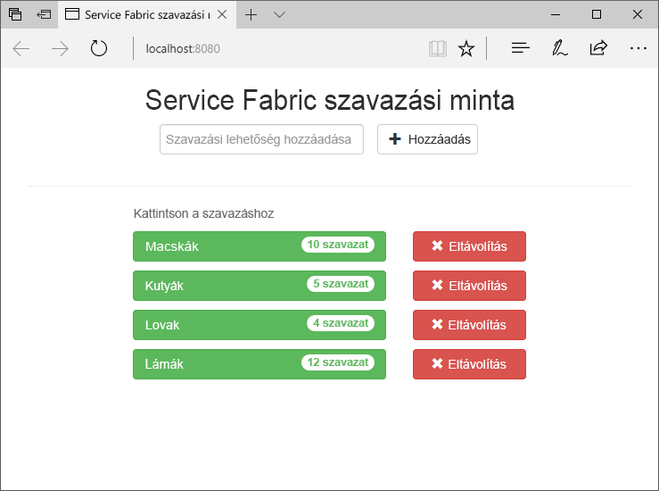
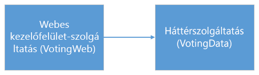
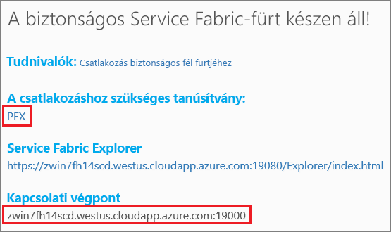
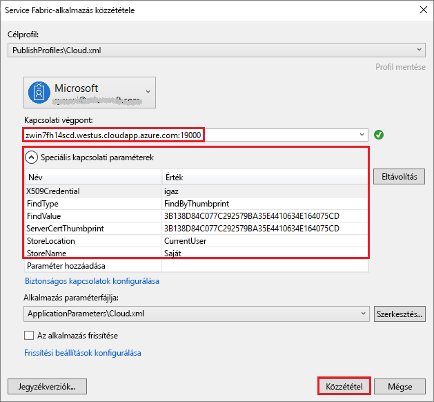
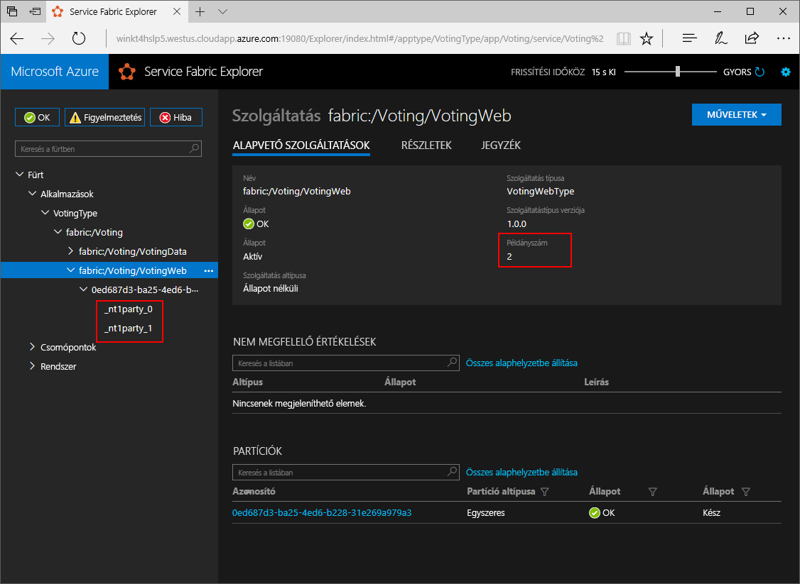
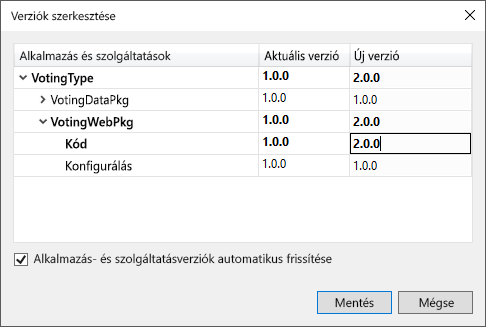
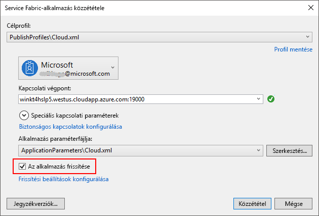
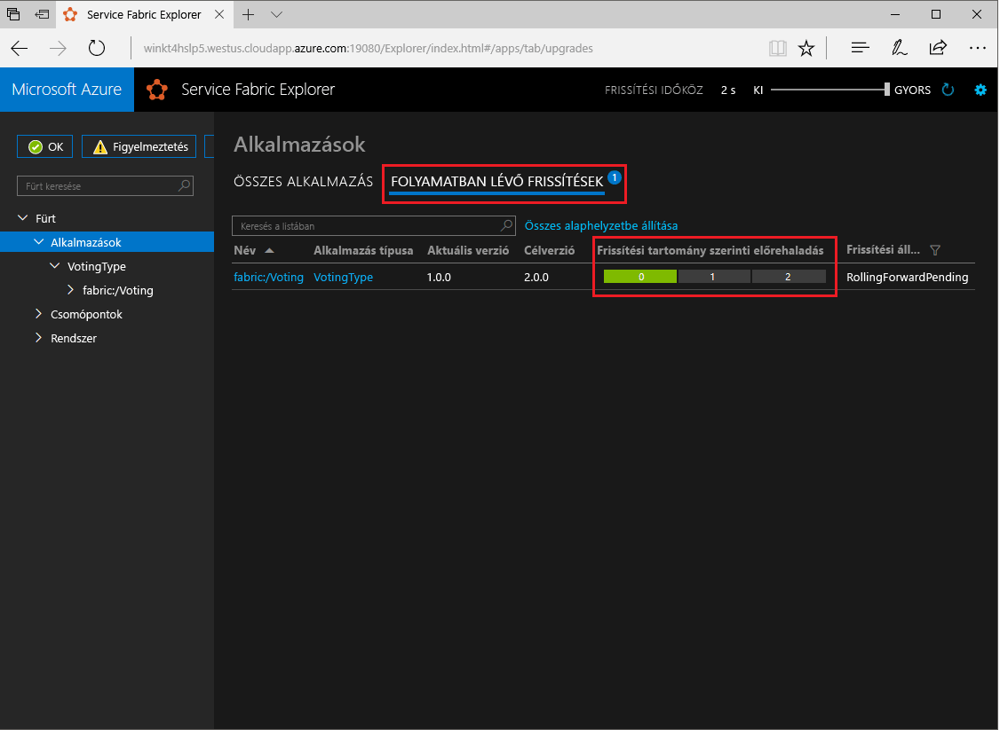

# <a name="quickstart-deploy-a-net-reliable-services-application-to-service-fabric"></a>Rövid útmutató: .NET Reliable Services-alkalmazás üzembe helyezése a Service Fabricben

Az Azure Service Fabric egy elosztott rendszerplatform, amely skálázható és megbízható mikroszolgáltatások és tárolók üzembe helyezésére és kezelésére szolgál.

Ez a rövid útmutató bemutatja, hogyan helyezheti üzembe első .NET-alkalmazását a Service Fabricben. Az útmutató elvégzése után rendelkezni fog egy ASP.NET Core webes kezelőfelületes szavazóalkalmazással, amely egy, a fürtben található állapotalapú háttérszolgáltatásba menti a szavazati adatokat.



Az alkalmazás használatával a következőkkel ismerkedhet meg:

* Alkalmazás létrehozása a .NET és a Service Fabric használatával
* Az ASP.NET Core használata webes kezelőfelületként
* Alkalmazásadatok tárolása állapotalapú szolgáltatásban
* Alkalmazás helyi hibakeresése
* Az alkalmazás üzembe helyezése egy Azure-fürtön
* Az alkalmazás horizontális felskálázása több csomópontra
* Alkalmazás frissítése működés közben

## <a name="prerequisites"></a>Előfeltételek

A gyorsútmutató elvégzéséhez:

1. [Telepítse a Visual Studio 2017-et](https://www.visualstudio.com/) az **Azure-fejlesztési**, valamint az **ASP.NET- és webfejlesztési** számítási feladatokkal.
2. [A Git telepítése](https://git-scm.com/)
3. [Telepítse a Microsoft Azure Service Fabric SDK-t](https://www.microsoft.com/web/handlers/webpi.ashx?command=getinstallerredirect&appid=MicrosoftAzure-ServiceFabric-CoreSDK)
4. Futtassa a következő parancsot, amellyel engedélyezheti a Visual Studio üzembe helyezését a helyi Service Fabric-fürtön:
    ```powershell
    Set-ExecutionPolicy -ExecutionPolicy Unrestricted -Force -Scope CurrentUser
    ```

>[!NOTE]
> A jelen rövid útmutatóban szereplő mintaalkalmazás olyan funkciókat használ, amelyek Windows 7 rendszeren nem érhetők el.
>

## <a name="download-the-sample"></a>A minta letöltése

Egy parancssori ablakban futtassa a következő parancsot a mintaalkalmazás-adattár helyi számítógépre történő klónozásához.

```git
git clone https://github.com/Azure-Samples/service-fabric-dotnet-quickstart
```

## <a name="run-the-application-locally"></a>Az alkalmazás helyi futtatása

A Start menüben kattintson a jobb gombbal a Visual Studio ikonra, majd válassza a **Futtatás rendszergazdaként** lehetőséget. Ha csatlakoztatni szeretné a hibakeresőt a szolgáltatásaihoz, rendszergazdaként kell futtatnia a Visual Studiót.

Nyissa meg a **Voting.sln** Visual Studio-megoldást a klónozott adattárból.

Alapértelmezés szerint a szavazóalkalmazás a 8080-as port figyelésére van beállítva.  Az alkalmazásport a */VotingWeb/PackageRoot/ServiceManifest.xml* fájlban van beállítva.  Az alkalmazásport a **Végpont** elem **Port** attribútumának átírásával módosítható.  Az alkalmazás helyi üzembe helyezéséhez és futtatásához az alkalmazásportnak a számítógépen megnyitva és elérhető állapotban kell lennie.  Ha megváltoztatja az alkalmazásportot, a „8080”-at az egész cikkben helyettesítse be az új alkalmazásport értékével.

Az alkalmazás üzembe helyezéséhez nyomja le az **F5** billentyűt.

> [!NOTE]
> Az alkalmazás első üzembe helyezésekor a Visual Studio létrehoz egy helyi hibakeresési fürtöt. Ez a művelet eltarthat egy ideig. A fürt létrehozási állapota a Visual Studio kimeneti ablakában jelenik meg.  A kimenetben a következő üzenet jelenik meg: „The application URL is not set or is not an HTTP/HTTPS URL so the browser will not be opened to the application” (Az alkalmazás URL-címe nincs megadva, vagy nem HTTP/HTTPS URL-cím, ezért a böngésző nem fog megnyílni az alkalmazáshoz).  Ez az üzenet nem utal hibára, csak arra, hogy a böngésző nem fog automatikusan elindulni.

Ha az üzembe helyezés kész, nyisson meg egy böngészőablakot, és látogasson el a következő oldalra: `http://localhost:8080` – ez az alkalmazás webes kezelőfelülete.


Most hozzáadhat szavazási lehetőségeket az alkalmazáshoz, és megkezdheti a szavazatok gyűjtését. Az alkalmazás különálló adatbázis nélkül futtatja és tárolja az összes adatot a Service Fabric-fürtben.

## <a name="walk-through-the-voting-sample-application"></a>A mintául szolgáló szavazóalkalmazás bemutatása

A szavazóalkalmazás két szolgáltatásból áll:

* Webes kezelőfelületi szolgáltatás (VotingWeb) – Olyan ASP.NET Core webes kezelőfelületi szolgáltatás, amely kiszolgálja a weboldalt, és webes API-kat biztosít a háttérszolgáltatással folytatott kommunikációhoz.
* Háttérszolgáltatás (VotingData) – Olyan ASP.NET Core webszolgáltatás, amely egy API-t biztosít a szavazási eredmények tárolásához egy megbízható, lemezen őrzött szótárban.



Amikor szavazatot adnak le az alkalmazásban, az alábbi eseményekre kerül sor:

1. A JavaScript HTTP PUT kérelemként elküldi a szavazati kérést a webes API-nak a webes kezelőfelületi szolgáltatásban.

2. A webes kezelőfelületi szolgáltatás egy proxy segítségével megkeresi és továbbítja a HTTP PUT kérelmet a háttérszolgáltatásnak.

3. A háttérszolgáltatás fogadja a bejövő kérelmet, és egy megbízható szótárban tárolja a frissített eredményt, amelyet a fürt több csomópontjára is replikál, és egy lemezen őriz. Az alkalmazás összes adata a fürtön tárolódik, így nincs szükség adatbázisra.

## <a name="debug-in-visual-studio"></a>Hibakeresés a Visual Studióban

Az alkalmazásnak megfelelően kellene futnia, de a hibakeresővel megtekintheti, hogyan működnek az alkalmazás fő részei. Az alkalmazás Visual Studióban történő hibakeresése során egy helyi Service Fabric fejlesztési fürtöt használ. Arra is lehetősége van, hogy a hibakeresési folyamatot a saját forgatókönyvéhez igazítsa. Ebben az alkalmazásban az adatokat a háttérszolgáltatás tárolja egy megbízható szótárban. A Visual Studio alapértelmezés szerint a hibakereső leállításakor eltávolítja az alkalmazást. Az alkalmazás eltávolításával a háttérszolgáltatásban tárolt adatok is el lesznek távolítva. Ha szeretné megtartani az adatokat a hibakeresési munkamenetek között, akkor módosítania kell az **Application Debug Mode** (Alkalmazás hibakeresési módja) tulajdonságot a **Voting** (Szavazás) projektben a Visual Studióban.

Ha szeretné megtekinteni, hogy mi történik a kódban, hajtsa végre a következő lépéseket:

1. Nyissa meg a **/VotingWeb/Controllers/VotesController.cs** fájlt, és állítson be egy töréspontot a webes API **Put** metódusában (69. sor). A fájlt megkeresheti a Visual Studio Megoldáskezelőjében.

2. Nyissa meg a **/VotingData/Controllers/VoteDataController.cs** fájlt, és állítson be egy töréspontot a webes API **Put** metódusában (54. sor).

3. Térjen vissza a böngészőhöz, és kattintson egy szavazási lehetőségre vagy adjon meg egy újat. Az első töréspont a webes kezelőfelület API-vezérlőjében jelentkezik.
    * A böngészőben futó JavaScript ekkor küld kérelmet a webes kezelőfelületi szolgáltatás API-vezérlőjének.

    

    * Elsőként hozza létre a ReverseProxyra mutató URL-címet a háttérszolgáltatás számára **(1)**.
    * Ezután küldje el a HTTP PUT kérelmet a ReverseProxyhoz **(2)**.
    * Végül küldje vissza a választ a háttérszolgáltatásból az ügyfélhez **(3)**.

4. A folytatáshoz nyomja le az **F5** billentyűt.
    - Ha a böngésző kéri adjon olvasási és végrehajtási engedélyeket a ServiceFabricAllowedUsers csoportnak a hibakeresési módban.
    - Ezzel elérte a háttérszolgáltatás töréspontját.

    

    * A metódus első sorában **(1)** a `StateManager` egy `counts` nevű megbízható szótárat kér le vagy ad meg.
    * A megbízható szótárakban tárolt értékekkel folytatott mindennemű interakcióhoz tranzakcióra van szükség, amelyet ez a using utasítás **(2)** hoz létre.
    * A tranzakcióban frissítse a szavazási lehetőséghez tartozó kulcs értékét, majd véglegesítse a műveletet **(3)**. Ha a véglegesítési metódus visszatért, az adatok frissülnek a szótárban, és a fürt egyéb csomópontjaira is replikálódnak. Az adatok ettől fogva biztonságosan tárolódnak a fürtön, és a háttérszolgáltatás feladatait más csomópontok is átvehetik, míg az adatok továbbra is elérhetők maradnak.
5. A folytatáshoz nyomja le az **F5** billentyűt.

A hibakeresési munkamenet leállításához nyomja le a **Shift+F5** billentyűkombinációt.

## <a name="deploy-the-application-to-azure"></a>Az alkalmazás központi telepítése az Azure-ban

Ha az alkalmazást üzembe szeretné helyezni az Azure-ban, szüksége lesz egy azt futtató Service Fabric-fürtre.

### <a name="join-a-party-cluster"></a>Csatlakozás nyilvános fürthöz

A nyilvános fürtök ingyenes, korlátozott időtartamú Azure Service Fabric-fürtök, amelyek futtatását a Service Fabric csapata végzi, és amelyeken bárki üzembe helyezhet alkalmazásokat, és megismerkedhet a platform használatával. A fürt egy önaláírt tanúsítványt használ a csomópontok közötti, valamint a kliens és a csomópont közötti biztonsághoz.

Jelentkezzen be, és [csatlakozzon egy Windows-fürthöz](https://aka.ms/tryservicefabric). A **PFX** hivatkozásra kattintva töltse le a PFX-tanúsítványt a számítógépre. Kattintson a **Csatlakozás biztonságos fél fürtjéhez** nevű hivatkozásra, és másolja a tanúsítvány jelszavát. A tanúsítványra, a tanúsítvány jelszavára és a **Kapcsolati végpont** értékére a következő lépésekben szükség lesz.



> [!Note]
> Óránként korlátozott számú nyilvános fürt érhető el. Ha a nyilvános fürtre való regisztráláskor hiba lép fel, várjon egy ideig, mielőtt újrapróbálkozna, vagy kövesse a [.NET-alkalmazás üzembe helyezése](https://docs.microsoft.com/azure/service-fabric/service-fabric-tutorial-deploy-app-to-party-cluster#deploy-the-sample-application) oktatóanyagban szereplő lépéseket, amellyel létrehozhat egy Service Fabric-fürtöt az Azure-előfizetésben, és üzembe helyezheti rajta az alkalmazást. Ha még nem rendelkezik Azure-előfizetéssel, létrehozhat egy [ingyenes fiókot](https://azure.microsoft.com/free/?WT.mc_id=A261C142F). Miután üzembe helyezte és ellenőrizte az alkalmazást a fürtön, továbbléphet az oktatóanyag [Alkalmazások és szolgáltatások méretezése a fürtökben](#scale-applications-and-services-in-a-cluster) című részéhez.
>

Egy Windows rendszerű gépen telepítse a PFX-et a *CurrentUser\My* tanúsítványtárolóba.

```powershell
PS C:\mycertificates> Import-PfxCertificate -FilePath .\party-cluster-873689604-client-cert.pfx -CertStoreLocation Cert:\CurrentUser\My -Password (ConvertTo-SecureString 873689604 -AsPlainText -Force)


   PSParentPath: Microsoft.PowerShell.Security\Certificate::CurrentUser\My

Thumbprint                                Subject
----------                                -------
3B138D84C077C292579BA35E4410634E164075CD  CN=zwin7fh14scd.westus.cloudapp.azure.com
```

Jegyezze meg az ujjlenyomatot a következő lépésekhez.

> [!Note]
> Alapértelmezés szerint a webes kezelőfelületi szolgáltatás a konfigurációja szerint a 8080-as porton figyeli a bejövő forgalmat. A 8080-as port a nyilvános fürtön nyitva van.  Ha meg kell változtatnia az alkalmazásportot, olyat válasszon, amely nyitva van a nyilvános fürtön.
>

### <a name="deploy-the-application-using-visual-studio"></a>Az alkalmazás üzembe helyezése a Visual Studio használatával

Az alkalmazást a létrehozása után telepítheti a fürtben, közvetlenül a Visual Studióból.

1. A Megoldáskezelőben kattintson a jobb gombbal a **Voting** (Szavazás) elemre, majd válassza a **Publish** (Közzététel) lehetőséget. Ekkor megjelenik a Publish (Közzététel) párbeszédpanel.

2. Másolja be a **Kapcsolati végpont** értékét a nyilvános fürt lapjáról a **Connection Endpoint** (Kapcsolati végpont) mezőbe. Például: `zwin7fh14scd.westus.cloudapp.azure.com:19000`. Kattintson az **Advanced Connection Parameters** (Speciális kapcsolati paraméterek) lehetőségre, és ellenőrizze, hogy a *FindValue* és *ServerCertThumbprint* értékeknek egyeznek-e az egyik előző lépésben telepített tanúsítvány ujjlenyomatával.

    

    A fürtben szereplő minden alkalmazásnak egyedi névvel kell rendelkeznie.  A nyilvános fürtök azonban nyilvános és megosztott környezetek, így ütközés léphet fel egy meglévő alkalmazással.  Névütközés esetén nevezze át a Visual Studio-projektet, és végezze el újra az üzembe helyezést.

3. Kattintson a **Publish** (Közzététel) gombra.

4. Ahhoz, hogy eljusson az alkalmazáshoz a fürtön, nyisson meg egy böngészőt, és gépelje be a fürt címét, majd a végéhez adja hozzá a „:8080” kifejezést, például: `http://zwin7fh14scd.westus.cloudapp.azure.com:8080`. Ezután megjelenik a fürtön futó alkalmazás az Azure-ban.

    

## <a name="scale-applications-and-services-in-a-cluster"></a>Alkalmazások és szolgáltatások méretezése a fürtökben

A Service Fabric-szolgáltatások egy adott fürtben könnyedén méretezhetők, hogy igazodjanak a szolgáltatások terhelésének változásaihoz. A szolgáltatások méretezése a fürtben futó példányok számának módosításával történik. A szolgáltatások méretezésének többféle módja is van: használhat szkripteket, vagy a PowerShell, illetve a Service Fabric parancssori felület (sfctl) parancsait. Ebben a példában a Service Fabric Explorert használjuk.

A Service Fabric Explorer az összes Service Fabric-fürtben fut. Eléréséhez egy böngészőben navigáljon az adott fürt HTTP-kezelési portjára (19080), például: `http://zwin7fh14scd.westus.cloudapp.azure.com:19080`.

Előfordulhat, hogy a böngésző nem megbízhatóként jelzi a helyet. Ennek oka az, hogy a tanúsítvány önaláírt. Ezt akár figyelmen kívül is hagyhatja, és tovább léphet.
1. Amikor a böngésző arra kéri, válassza ki a telepített tanúsítványt a csatlakozáshoz. A listából az elérni kívánt nyilvános fürthöz tartozó tanúsítványt kell kiválasztani. Például: win243uja6w62r.westus.cloudapp.azure.com.
2. Ha a böngésző kéri, adjon hozzáférést a CryptoAPI titkos kulcsának erre a munkamenetre.

A webes előtér-szolgáltatás méretezéséhez hajtsa végre a következő lépéseket:

1. Nyissa meg a Service Fabric Explorert a fürtben – például: `http://zwin7fh14scd.westus.cloudapp.azure.com:19080`.

2. A fanézetben bontsa ki az **Applications**->**VotingType**->**fabric:/Voting** elemet. Kattintson a három pontra a fanézetben a **fabric:/Voting/VotingWeb** csomópont mellett, és válassza a **Scale Service** (Szolgáltatás méretezése) lehetőséget.

    

    Most már méretezheti a webes előtér-szolgáltatás példányainak számát.

3. Módosítsa a számot **2**-re, és kattintson a **Szolgáltatás méretezése** gombra.
4. Kattintson a **fabric:/Voting/VotingWeb** csomópontra a fanézetben, és bontsa ki a partíciós csomópontot (egy GUID jelöli).

    

    Némi késéssel láthatja, hogy a szolgáltatás két példánnyal rendelkezik.  A fanézetben megtekintheti, hogy a példányok melyik csomópontokon futnak.

Ezzel az egyszerű felügyeleti eljárással megdupláztuk a kezelőfelületi szolgáltatás számára a felhasználói terhelések feldolgozásához rendelkezésre álló erőforrások mennyiségét. Fontos megérteni, hogy nincs szükség több példányra ahhoz, hogy a szolgáltatás megbízhatóan fusson. Ha egy szolgáltatás meghibásodik, a Service Fabric gondoskodik róla, hogy egy új szolgáltatáspéldány kezdjen futni a fürtben.

## <a name="perform-a-rolling-application-upgrade"></a>Alkalmazás frissítése működés közben

Ha új frissítéseket telepít az alkalmazásban, a Service Fabric biztonságosan elvégzi a frissítést. A működés közbeni frissítésnek köszönhetően állásidő nélkül végezhet frissítéseket, és hiba esetén a rendszer automatikusan visszaállítást kezdeményez.

Az alkalmazás frissítéséhez tegye a következőket:

1. Nyissa meg a **/VotingWeb/Views/Home/Index.cshtml** fájlt a Visual Studióban.
2. Módosítsa az oldal fejlécét szöveg hozzáadásával vagy a meglévő szöveg frissítésével. Módosítsa például a fejlécet a következőre: „Service Fabric Voting Sample v2”.
3. Mentse a fájlt.
4. A Megoldáskezelőben kattintson a jobb gombbal a **Voting** (Szavazás) elemre, majd válassza a **Publish** (Közzététel) lehetőséget. Ekkor megjelenik a Publish (Közzététel) párbeszédpanel.
5. Kattintson a **Manifest Version** (Jegyzékverzió) gombra a szolgáltatás és az alkalmazás verziójának módosításához.
6. Módosítsa a **Code** (Kód) elemet a **VotingWebPkg** résznél például „2.0.0”-ra, majd kattintson a **Save** (Mentés) gombra.

    
7. A **Publish Service Fabric Application** (Service Fabric-alkalmazás közzététele) párbeszédpanelen jelölje be az Upgrade the Application (Alkalmazás frissítése) jelölőnégyzetet, majd kattintson a **Publish** (Közzététel) parancsra.

    

    Frissítés közben az alkalmazás továbbra is használható. Mivel a fürtön a szolgáltatás két példánya fut, a kérelmek egy része már az alkalmazás frissített verziójával találkozik, míg mások továbbra is a régebbivel.

8. Nyissa meg a böngészőt, és keresse meg a fürt címét az 19080-as porton, például: `http://zwin7fh14scd.westus.cloudapp.azure.com:19080`.
9. Kattintson az **Alkalmazások** csomópontra a fanézetben, majd a jobb oldali ablaktáblán található **Folyamatban lévő frissítések** elemre. Ekkor láthatja, hogy a frissítés hogyan lépked végig a fürt frissítési tartományain, miközben továbblépés előtt minden tartomány állapotát ellenőrzi. A frissítési tartomány zöld színnel jelenik meg a folyamatjelzőn, ha a tartomány állapota ellenőrizve lett.
    

    A Service Fabric a biztonságos frissítés érdekében a fürt minden egyes csomópontjának frissítése után két percet várakozik. A teljes frissítés körülbelül nyolc percet vesz igénybe.

## <a name="next-steps"></a>További lépések

Ennek a rövid útmutatónak a segítségével megtanulta a következőket:

* Alkalmazás létrehozása a .NET és a Service Fabric használatával
* Az ASP.NET Core használata webes kezelőfelületként
* Alkalmazásadatok tárolása állapotalapú szolgáltatásban
* Alkalmazás helyi hibakeresése
* Az alkalmazás üzembe helyezése egy Azure-fürtön
* Az alkalmazás horizontális felskálázása több csomópontra
* Alkalmazás frissítése működés közben

A Service Fabrickel és a .NET-tel kapcsolatos további tudnivalókért tekintse át a következő oktatóanyagot:
> [!div class="nextstepaction"]
> [.NET alkalmazás a Service Fabric szolgáltatásban](service-fabric-tutorial-create-dotnet-app.md)
