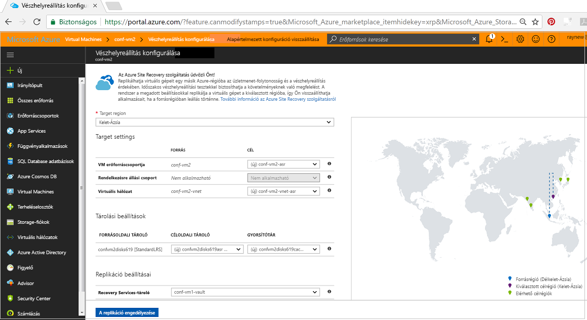
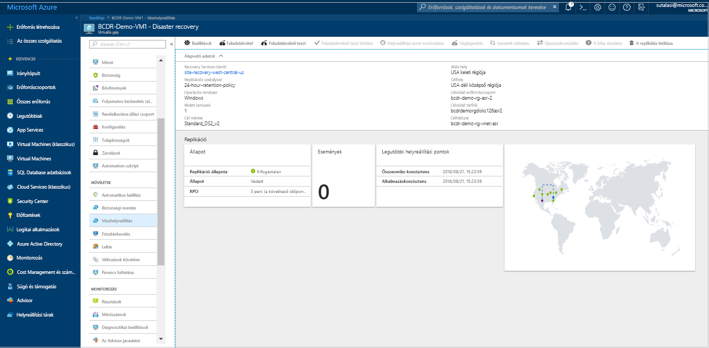
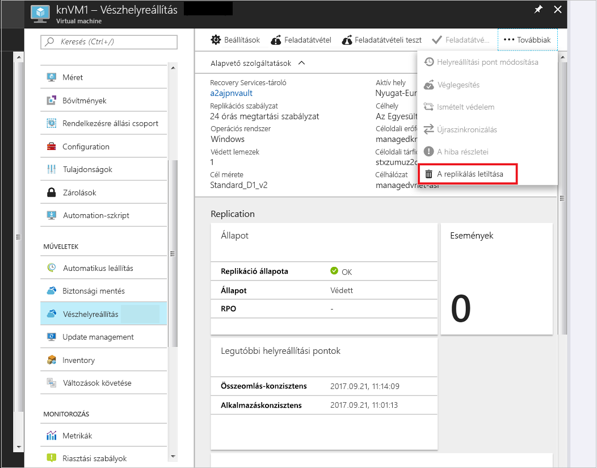

# Azure-beli virtuális gép replikálása másik Azure-régióba

Az [Azure Site Recovery](site-recovery-overview.md) szolgáltatás működőképes állapotban tartja az üzleti alkalmazásokat a tervezett és nem tervezett leállások idején, így segít a vállalatoknak az üzletmenet-folytonossági és vészhelyreállítási (BCDR) stratégia megvalósításában. A Site Recovery felügyeli és koordinálja a helyszíni gépek és az Azure-beli virtuális gépek vészhelyreállítását, beleértve a replikálást, a feladatátvételt és a helyreállítást.

Ez a rövid útmutató egy Azure-beli virtuális gép másik Azure-régióba való replikálását ismerteti. 

Ha nem rendelkezik Azure-előfizetéssel, mindössze néhány perc alatt létrehozhat egy [ingyenes fiókot](https://azure.microsoft.com/free/?WT.mc_id=A261C142F) a virtuális gép létrehozásának megkezdése előtt.

## Jelentkezzen be az Azure-ba

Jelentkezzen be az Azure Portalra a http://portal.azure.com címen.

## Azure-beli virtuális gép replikálásának engedélyezése

1. Az Azure Portal területén kattintson a **Virtuális gépek** elemre, és válassza ki a replikálni kívánt virtuális gépet.

2. A **Beállítások** területen kattintson a **Vészhelyreállítás** elemre.
3. A **Vészhelyreállítás konfigurálása** > **Célrégió** részben válassza ki a célrégiót, amelybe a replikálást végezni kívánja.
4. A jelen rövid útmutató esetében fogadja el a többi alapértelmezett beállítást.
5. Kattintson a **Replikáció engedélyezése** lehetőségre. Ekkor elindul a virtuális gép replikálásának engedélyezési feladata.

    

## A beállítások ellenőrzése

A replikálási feladat befejeződése után ellenőrizheti a replikálás állapotát, módosíthatja a replikációs beállításokat, és tesztelheti az üzemelő példányt.

1. A Virtuális gép menüben kattintson a **Vészhelyreállítás** elemre.
2. Ellenőrizheti a replikálás állapotát, a létrehozott helyreállítási pontokat és a forrás és cél régiókat a térképen.

   

## Az erőforrások eltávolítása

Az elsődleges régióban lévő virtuális gép replikálása leáll, ha letiltja a gép esetében a replikálást:

- A forrás replikálási beállításai automatikusan törlődnek.
- Emellett leáll a virtuális gép Site Recovery-számlázása is.

Állítsa le a replikálást a következő módon:

1. Válassza ki a virtuális gépet.
2. A **Vészhelyreállítás** területen kattintson a **Továbbiak** elemre.
3. Kattintson a **Replikálás letiltása** lehetőségre.

   

## További lépések

Ebben a rövid útmutatóban egy virtuális gépet replikált egy másodlagos régióba.

> [!div class="nextstepaction"]
> [Azure-beli virtuális gépek vészhelyreállításának konfigurálása](azure-to-azure-tutorial-enable-replication.md)
