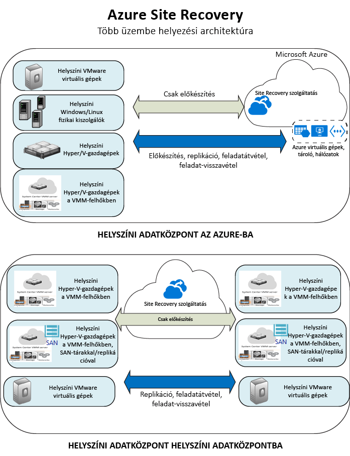

# Mi a Site Recovery?
Üdvözli az Azure Site Recovery szolgáltatás! Ebben a cikkben a Site Recovery rövid áttekintését olvashatja el.

Szervezetének szüksége van egy üzletmenet-folytonossági és vészhelyreállítási (BCDR) stratégiára, amely meghatározza, hogy hogyan tudnak az alkalmazások és az adatok biztonságban és üzemben maradni a tervezett és nem tervezett leállások során, illetve hogy miként lehet a lehető leggyorsabban visszaállni a normál működésre.

A Site Recovery a helyszíni virtuális gépek és fizikai kiszolgálók replikálásával segít az üzletmenet-folytonossági és vészhelyreállítási (BCDR) stratégia kidolgozásában. Kiszolgálókat és virtuális gépeket replikálhat elsődleges helyszíni adatközpontjából a felhőbe (Azure) vagy egy másodlagos adatközpontba.

Ha az elsődleges helyen valamilyen okból kimaradás lép fel, a rendszer átadja a feladatokat a másodlagos helynek, így a számítási feladatok elérhetők maradnak, és nem állnak le. Ha az elsődleges helyen helyreáll a normál működés, a rendszer visszaadja a feladatokat.

## Site Recovery az Azure Portalon
Az Azure két különböző [üzemi modellel](../resource-manager-deployment-model.md) rendelkezik az erőforrások létrehozásához és használatához: Az Azure Resource Manager-modellel és a klasszikus szolgáltatáskezelési modellel. Az Azure-ban két különböző portál érhető el. A [klasszikus Azure portál](https://manage.windowsazure.com/) és az [Azure Portal](https://portal.azure.com).

* A Site Recovery a klasszikus portálon és az Azure Portalon egyaránt üzembe helyezhető.
* A klasszikus Azure portálon a Site Recovery a klasszikus szolgáltatáskezelési modellel támogatható.
* Az Azure Portal a klasszikus modellen és a Resource Manageren alapuló üzemelő példányokat is támogatja.

A cikk információi a klasszikus és az Azure Portalon üzemelő példányokra egyaránt vonatkoznak. Az esetleges különbségeket jeleztük.

## Miért érdemes üzembe helyezni a Site Recoveryt?
A Site Recovery a következőkkel segítheti a vállalatát:

* **A üzletmenet-folytonosság és vészhelyreállítás leegyszerűsítése** – Egyetlen helyről végezheti több számítási feladat replikálását, feladatátvételét és helyreállítását az Azure Portalon. A Site Recovery koordinálja a replikációt és a feladatátvételt, de az alkalmazás adataihoz nem fér hozzá.
* **Rugalmas replikáció biztosítása** – A támogatott Hyper-V-alapú virtuális gépeken, a VMware-alapú virtuális gépeken és a Windows-/Linux-alapú fizikai kiszolgálókon futó bármilyen számítási feladatot replikálhat.
* **Másodlagos adatközpont kiküszöbölése** – A számítási feladatokat egy másodlagos helyszín helyett az Azure-ba replikálhatja. Ezáltal kiküszöbölhetők a másodlagos adatközpontok fenntartásával járó bonyodalmak és költségek. A replikált adatokat az Azure Storage tárolja, és az ezzel járó rugalmasságot is biztosítja. Feladatátvétel esetén a rendszer Azure-beli virtuális gépeket hoz létre a replikált adatokkal.
* **Egyszerű replikációs teszt végrehajtása** – Egyszerűen futtathat feladatátvételi teszteket a vészhelyreállítási próbák támogatására anélkül, hogy ez hatással lenne az éles környezetekre.
* **Feladatátvétel és helyreállítás** – Nulla adatvesztéssel járó tervezett feladatátvételeket is futtathat várt leállások esetére, illetve (a replikáció gyakoriságától függően) minimális adatvesztéssel járó nem tervezett feladatátvételeket a váratlan vészhelyzetek esetére. Amint az elsődleges hely megint elérhetővé válik, visszaadhatja a feladatokat.
* **Többszörös VM-feladatátvétel** – Beállíthat szkripteket és Azure Automation-runbookokat tartalmazó helyreállítási terveket. A helyreállítási tervekkel modellezheti és testre szabhatja a több virtuális gépen futó többszintű alkalmazások feladatátvételét és helyreállítását.
* **Integrálás a meglévő BCDR-technológiákkal** – A Site Recovery integrálható más BCDR-technológiákkal. A Site Recovery segítségével megvédheti például a vállalati számítási feladatok SQL Server-háttérrendszerét, ideértve az SQL Server AlwaysOn natív támogatását is a rendelkezésre állási csoportok feladatátvételének kezelésében.

## Miket replikálhatok?
Itt található egy összefoglaló arról, hogy mit replikálhat a Site Recovery használatával.

| **REPLIKÁLÁS** | **REPLIKÁLÁS CÉLHELYE** |
| --- | --- |
| Helyszíni VMware virtuális gépek |[Azure](site-recovery-vmware-to-azure-classic.md)   [Másodlagos hely](site-recovery-vmware-to-vmware.md) |
| VMM-felhőkben felügyelt helyszíni Hyper-V virtuális gépek |[Azure](site-recovery-vmm-to-azure.md)   [Másodlagos hely](site-recovery-vmm-to-vmm.md) |
| VMM-felhőkben felügyelt helyszíni Hyper-V virtuális gépek SAN-tárral |[Másodlagos hely](site-recovery-vmm-san.md) |
| Helyszíni Hyper-V virtuális gépek VMM nélkül |[Azure](site-recovery-hyper-v-site-to-azure.md) |
| Helyszíni fizikai Windows-/Linux-kiszolgálók |[Azure](site-recovery-vmware-to-azure-classic.md)   [Másodlagos hely](site-recovery-vmware-to-vmware.md) |

## Hogy védi a Site Recovery a számítási feladatokat?
A Site Recovery alkalmazásbarát replikációt biztosít, így a számítási feladatok és az alkalmazások konzisztens módon futhatnak tovább leállások esetén is.

* **Alkalmazáskonzisztens pillanatképek** – A gépek alkalmazáskonzisztens pillanatképek használatával végzik a replikálást az egy- vagy többszintű alkalmazások esetében. Az alkalmazáskonzisztens pillanatképek a lemez adatai mellett a memóriában lévő összes adatot és az összes folyamatban lévő tranzakciót is rögzítik.
* **Közel szinkron replikáció** – A Site Recovery által biztosított replikáció gyakorisága Hyper-V esetén akár 30 másodperc is lehet, VMware esetén pedig folyamatos lehet a replikáció.
* **Rugalmas helyreállítási tervek** – Külső szkripteket és manuális műveleteket tartalmazó helyreállítási terveket hozhat létre és szabhat testre. Az Azure Automation-forgatókönyvekkel való integráció segítségével egész alkalmazáscsoportokat állíthat helyre egyetlen kattintással.
* **Integráció az SQL Server AlwaysOn szolgáltatással** – Helyreállítási tervekkel kezelheti a rendelkezésre állási csoportok feladatátvételét.
* **Automatizálási könyvtár** – Az Azure Automation-könyvtár gazdag, éles használatra kész és alkalmazásspecifikus parancsfájlokat tartalmazó automatizálási könyvtár, amely letölthető, és beépíthető a Site Recovery szolgáltatásba.
* **Egyszerű hálózatkezelés** – A Site Recovery és az Azure fejlett hálózatkezelési funkciói leegyszerűsítik az alkalmazáshálózati követelményeket, ideértve az IP-címek lefoglalását, a terheléselosztók konfigurálását, valamint az Azure Traffic Manager integrációját, ami hatékony hálózatváltást garantál.

## Következő lépések
* További információk: [Milyen számítási feladatokat tud védeni a Site Recovery?](site-recovery-workload.md)
* További információk a Site Recovery architektúrájáról: [Hogyan működik a Site Recovery?](site-recovery-components.md)

<!--HONumber=Nov16_HO2-->

