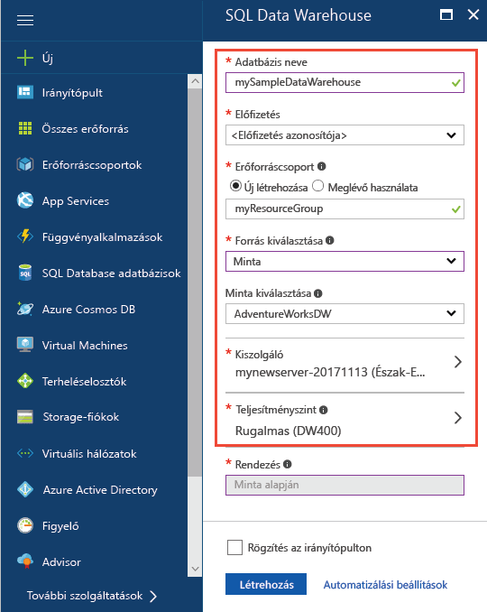
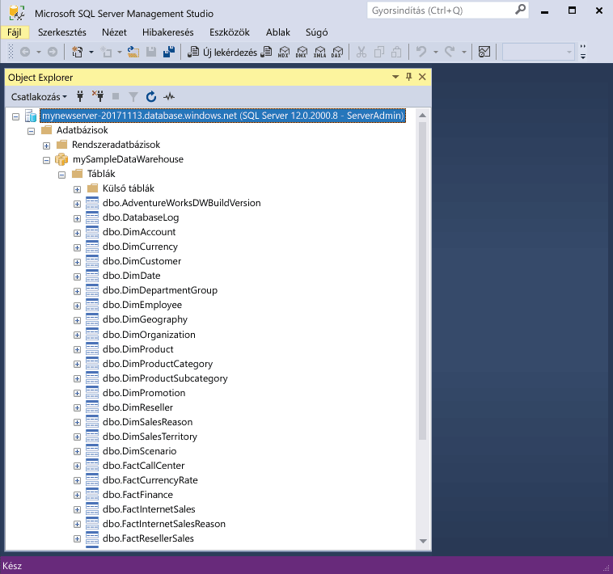
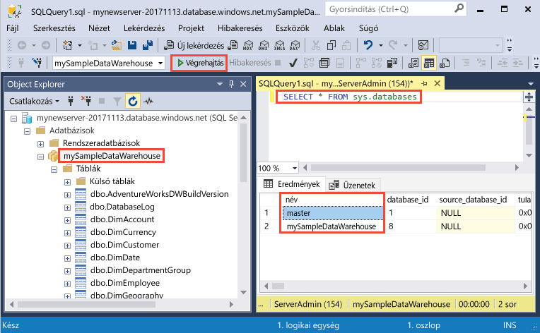

# <a name="quickstart-create-and-query-an-azure-sql-data-warehouse-in-the-azure-portal"></a>Rövid útmutató: Azure SQL Data Warehouse létrehozása és lekérdezése az Azure Portalon

Azure SQL Data Warehouse gyors létrehozása és lekérdezése az Azure Portal használatával.

Ha nem rendelkezik Azure-előfizetéssel, első lépésként mindössze néhány perc alatt létrehozhat egy [ingyenes](https://azure.microsoft.com/free/) fiókot.

> [!NOTE]
> A SQL Data Warehouse létrehozása egy új számlázható szolgáltatás létrejöttét eredményezheti.  További információ: [SQL Data Warehouse díjszabása](https://azure.microsoft.com/pricing/details/sql-data-warehouse/).
>
>

## <a name="before-you-begin"></a>Előkészületek

Töltse le és telepítse az [SQL Server Management Studio](/sql/ssms/download-sql-server-management-studio-ssms) (SSMS) legújabb verzióját.

## <a name="sign-in-to-the-azure-portal"></a>Jelentkezzen be az Azure Portalra

Jelentkezzen be az [Azure Portalra](https://portal.azure.com/).

## <a name="create-a-data-warehouse"></a>Adattárház létrehozása

Az Azure SQL Data Warehouse [számítási erőforrások](memory-and-concurrency-limits.md) egy meghatározott készletével együtt jön létre. Az adatbázis egy [Azure-erőforráscsoporton](../azure-resource-manager/resource-group-overview.md) belül egy [Azure SQL logikai kiszolgálón](../sql-database/sql-database-servers-databases.md#what-is-an-azure-sql-logical-server) jön létre. 

Az alábbi lépéseket követve létrehozhat egy SQL-adattárházat az AdventureWorksDW mintaadatok tárolásához. 

1. Kattintson az Azure Portal bal felső sarkában található **Erőforrás létrehozása** gombra.

2. Az **Új** oldalon válassza az **Adatbázisok** elemet, majd az **Új** oldal **Kiemelt** területén válassza az **SQL Data Warehouse** lehetőséget.

    

3. Adja meg az alábbi adatokat a SQL Data Warehouse-űrlapon:   

    | Beállítás | Ajánlott érték | Leírás | 
    | ------- | --------------- | ----------- | 
    | **Adatbázis neve** | mySampleDataWarehouse | Az érvényes adatbázisnevekkel kapcsolatban lásd az [adatbázis-azonosítókat](/sql/relational-databases/databases/database-identifiers) ismertető cikket. Megjegyzés: Az adattárház az adatbázisok egy típusa.| 
    | **Előfizetés** | Az Ön előfizetése  | Az előfizetései részleteivel kapcsolatban lásd az [előfizetéseket](https://account.windowsazure.com/Subscriptions) ismertető cikket. |
    | **Erőforráscsoport** | myResourceGroup | Az érvényes erőforráscsoport-nevekkel kapcsolatban lásd az [elnevezési szabályokat és korlátozásokat](https://docs.microsoft.com/azure/architecture/best-practices/naming-conventions) ismertető cikket. |
    | **Forrás kiválasztása** | Sample | Megköveteli egy mintaadatbázis betöltését. Megjegyzés: Az adattárház az adatbázisok egy típusa. |
    | **Minta kiválasztása** | AdventureWorksDW | Megköveteli az AdventureWorksDW mintaadatbázis betöltését.  |

    

4. Kattintson a **Kiszolgáló** lehetőségre új kiszolgáló létrehozásához és konfigurálásához az új adatbázis számára. Adja meg az alábbi adatokat az **Új kiszolgálóűrlapon**: 

    | Beállítás | Ajánlott érték | Leírás | 
    | ------------ | ------------------ | ------------------------------------------------- | 
    | **Kiszolgálónév** | Bármely globálisan egyedi név | Az érvényes kiszolgálónevekkel kapcsolatban lásd az [elnevezési szabályokat és korlátozásokat](https://docs.microsoft.com/azure/architecture/best-practices/naming-conventions) ismertető cikket. | 
    | **Kiszolgálói rendszergazdai bejelentkezés** | Bármely érvényes név | Az érvényes bejelentkezési nevekkel kapcsolatban lásd az [adatbázis-azonosítókat](https://docs.microsoft.com/sql/relational-databases/databases/database-identifiers) ismertető cikket.|
    | **Jelszó** | Bármely érvényes jelszó | A jelszónak legalább nyolc karakter hosszúságúnak kell lennie, és tartalmaznia kell karaktereket a következő kategóriák közül legalább háromból: nagybetűs karakterek, kisbetűs karakterek, számjegyek és nem alfanumerikus karakterek. |
    | **Hely** | Bármely érvényes hely | A régiókkal kapcsolatos információkért lásd [az Azure régióit](https://azure.microsoft.com/regions/) ismertető cikket. |

    

5. Kattintson a **Kiválasztás** gombra.

6. Kattintson a **Teljesítményszint** elemre, és adja meg az adattárház teljesítménykonfigurációját.

7. A jelen oktatóanyag esetében válassza a **Rugalmasságra optimalizált** teljesítményszintet. A csúszka alapértelmezés szerint a **DW400** értéken áll.  Csúsztassa fel és le, hogy kipróbálja a működését a gyakorlatban. 

    

8. Kattintson az **Alkalmaz** gombra.

9. Most, hogy kitöltötte az SQL Database űrlapját, kattintson a **Létrehozás** gombra az adatbázis létrehozásához. Az üzembe helyezés eltarthat néhány percig. 

    

10. Az eszköztáron kattintson az **Értesítések** parancsra az üzembe helyezési folyamat megfigyeléséhez.
    
     

## <a name="create-a-server-level-firewall-rule"></a>Kiszolgálószintű tűzfalszabály létrehozása

Az SQL Data Warehouse szolgáltatás egy tűzfalat hoz létre a kiszolgáló szintjén, amely megakadályozza, hogy a külső alkalmazások és eszközök csatlakozzanak a kiszolgálóhoz vagy a kiszolgálón lévő adatbázisokhoz. A csatlakozás engedélyezéséhez hozzáadhat tűzfalszabályokat, amelyek adott IP-címekkel engedélyezik a kapcsolódást.  A következő lépéseket követve hozzon létre egy [kiszolgálószintű tűzfalszabályt](../sql-database/sql-database-firewall-configure.md) az ügyfél IP-címéhez. 

> [!NOTE]
> Az SQL Data Warehouse az 1433-as portot használja a kommunikációhoz. Ha vállalati hálózaton belülről próbál csatlakozni, elképzelhető, hogy a hálózati tűzfal nem engedélyezi a kimenő forgalmat az 1433-as porton keresztül. Ebben az esetben nem tud csatlakozni az Azure SQL Database-kiszolgálóhoz, ha az informatikai részleg nem nyitja meg az 1433-as portot.
>

1. Az üzembe helyezés befejezése után kattintson az **SQL-adatbázisok** elemre a bal oldali menüben, majd kattintson a **mySampleDatabase** adatbázisra az **SQL-adatbázisok** lapon. Megnyílik az adatbázis áttekintőoldala, amelyen látható a teljes kiszolgálónév (például: **mynewserver-20171113.database.windows.net**), valamint a további konfigurálható beállítások. 

2. Másolja le ezt a teljes kiszolgálónevet, mert a későbbi rövid útmutatók során szüksége lesz rá a kiszolgálóhoz és az adatbázisokhoz való csatlakozáshoz. A kiszolgáló beállításainak megnyitásához kattintson a kiszolgálónévre.

    

3. A kiszolgáló beállításainak megnyitásához 
4. kattintson a kiszolgálónévre.

    

5. Kattintson a **Tűzfalbeállítások megjelenítése** elemre. Megnyílik az SQL Database kiszolgálóhoz tartozó **Tűzfalbeállítások** oldal. 

    

4. Az aktuális IP-címét az eszköztár **Ügyfél IP-címének hozzáadása** elemére kattintva veheti fel egy új tűzfalszabályba. A tűzfalszabály az 1433-as portot egy egyedi IP-cím vagy egy IP-címtartomány számára nyithatja meg.

5. Kattintson a **Save** (Mentés) gombra. A rendszer létrehoz egy kiszolgálószintű tűzfalszabályt az aktuális IP-címhez, és megnyitja az 1433-as portot a logikai kiszolgálón.

6. Kattintson az **OK** gombra, majd zárja be a **Tűzfalbeállítások** lapot.

Mostantól csatlakozhat az SQL-kiszolgálóhoz és annak adattárházaihoz erről az IP-címről. A csatlakozás az SQL Server Management Studio vagy más, választott eszköz használatával lehetséges. A csatlakozáskor használja a korábban létrehozott ServerAdmin-fiókot.  

> [!IMPORTANT]
> Alapértelmezés szerint az összes Azure-szolgáltatás számára engedélyezett a hozzáférés az SQL Database tűzfalán keresztül. A tűzfal az összes Azure-szolgáltatásra vonatkozó letiltásához kattintson ezen az oldalon a **KI** gombra, majd a **Mentés** parancsra.

## <a name="get-the-fully-qualified-server-name"></a>A teljes kiszolgálónév lekérése

Kérje le az SQL-kiszolgáló teljes kiszolgálónevét az Azure Portalon. Később ezt a teljes nevet fogja majd használni a kiszolgálóhoz való kapcsolódás során.

1. Jelentkezzen be az [Azure Portalra](https://portal.azure.com/).
2. Válassza az **SQL-adatbázisok** elemet a bal oldali menüben, majd kattintson az új adatbázisra az **SQL-adatbázisok** oldalon. 
3. Az Azure Portalon az adatbázishoz tartozó lap **Alapvető erőforrások** ablaktábláján keresse meg, majd másolja ki a **Kiszolgáló nevét**. Ebben a példában a teljes név a következő: mynewserver-20171113.database.windows.net. 

      

## <a name="connect-to-the-server-as-server-admin"></a>Csatlakozás a kiszolgálóhoz kiszolgáló-rendszergazdaként

Ebben a részben az [SQL Server Management Studio](/sql/ssms/download-sql-server-management-studio-ssms.md) használatával építjük fel a kapcsolatot az Azure SQL-kiszolgálóval.

1. Nyissa meg az SQL Server Management Studiót.

2. A **Connect to Server** (Kapcsolódás a kiszolgálóhoz) párbeszédpanelen adja meg a következő adatokat:

   | Beállítás       | Ajánlott érték | Leírás | 
   | ------------ | ------------------ | ------------------------------------------------- | 
   | Kiszolgáló típusa | Adatbázismotor | Kötelezően megadandó érték |
   | Kiszolgálónév | A teljes kiszolgálónév | Például: **mynewserver-20171113.database.windows.net**. |
   | Hitelesítés | SQL Server-hitelesítés | Ebben az oktatóanyagban az SQL-hitelesítésen kívül más hitelesítéstípus nincs konfigurálva. |
   | Bejelentkezés | A kiszolgálói rendszergazdai fiók | Ez az a fiók, amely a kiszolgáló létrehozásakor lett megadva. |
   | Jelszó | A kiszolgálói rendszergazdai fiók jelszava | Ezt a jelszót adta meg a kiszolgáló létrehozásakor. |

    

4. Kattintson a **Connect** (Csatlakozás) gombra. Megnyílik az Object Explorer ablak az SSMS-ben. 

5. Az Object Explorerben bontsa ki a **Databases** (Adatbázisok) elemet. Ezután bontsa ki a **mySampleDatabase** csomópontot az új adatbázisban található objektumok megtekintéséhez.

     

## <a name="run-some-queries"></a>Néhány lekérdezés futtatása

Az SQL Data Warehouse a T-SQL nyelvet használja lekérdezési nyelvként. A lekérdezésablakok megnyitásához és a T-SQL-lekérdezések futtatásához végezze el az alábbi lépéseket:

1. Kattintson a jobb gombbal a **mySampleDataWarehouse** elemre, majd válassza az **Új lekérdezés** elemet.  Megnyílik egy új lekérdezési ablak.
2. A lekérdezésablakban írja be a következő parancsot az adatbázisok listájának megjelenítéséhez.

    ```sql
    SELECT * FROM sys.databases
    ```

3. Kattintson az **Execute** (Végrehajtás) parancsra.  A lekérdezés eredménye két adatbázist mutat: a **master** és a **mySampleDataWarehouse** adatbázist.

    

4. Hogy lássunk néhány adatot is, a következő parancs használatával tekintsük meg, hány Adams vezetéknevű, három gyermeket nevelő ügyfél létezik. A lekérdezés hat ügyfelet listáz ki. 

    ```sql
    SELECT LastName, FirstName FROM dbo.dimCustomer
    WHERE LastName = 'Adams' AND NumberChildrenAtHome = 3;
    ```

    

## <a name="clean-up-resources"></a>Az erőforrások eltávolítása

Az adattárházegységek és az adattárházban tárolt adatok díjkötelesek. Ezek a számítási és tárolási erőforrások elkülönítve lesznek kiszámlázva. 

- Ha szeretné az adatokat megtartani a tárolóban, a számítási erőforrásokat szüneteltetheti, amíg nem használja az adattárházat. A számítási erőforrások szüneteltetésével csak a tárolásért kell fizetnie. Ha ismét kész használni az adatokat, visszaállíthatja a számítási kapacitásokat.
- Ha szeretné megelőzni a jövőbeli kiadásokat, az adattárházat törölheti is. 

Kövesse az alábbi lépéseket a fölöslegessé vált erőforrások eltávolítására.

1. Jelentkezzen be az [Azure Portalra](https://portal.azure.com), és kattintson az adattárházra.

    

1. A számítási erőforrások szüneteltetéshez kattintson a **Szüneteltetés** gombra. Ha az adattárház szüneteltetve van, az **Indítás** gomb látható.  A számítási erőforrások újraindításához kattintson az **Indítás** gombra.

2. Ha el szeretné távolítani az adattárházat, hogy a számítási és tárolási erőforrásokért se kelljen fizetnie, kattintson a **Törlés** parancsra.

3. A korábban létrehozott SQL-kiszolgáló eltávolításához kattintson az előző képen látható **mynewserver-20171113.database.windows.net** elemre, majd a **Törlés** parancsra.  A törléssel bánjon óvatosan, mivel a kiszolgálóval együtt a hozzá rendelt összes adatbázis is törölve lesz.

4. Az erőforráscsoport törléséhez kattintson a **myResourceGroup** elemre, majd az **Erőforráscsoport törlése** parancsra.


## <a name="next-steps"></a>További lépések
Az eddigiekben létrehozott egy adattárházat, hozzá egy tűzfalszabályt, csatlakozott hozzá, és futtatott néhány lekérdezést. Ha bővebb információra van szüksége az Azure SQL Data Warehouse-zal kapcsolatban, folytassa az adatok betöltésével foglalkozó oktatóanyaggal.
> [!div class="nextstepaction"]
>[Adatok betöltése az SQL Data Warehouse-okba](load-data-from-azure-blob-storage-using-polybase.md)