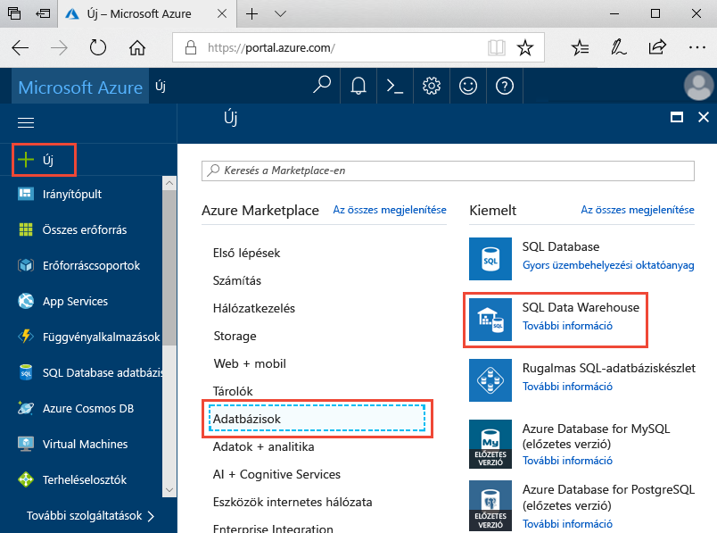
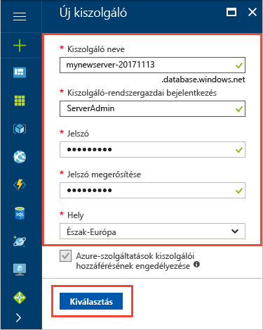
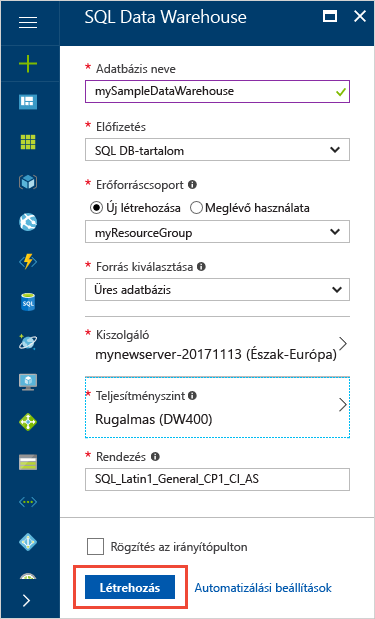
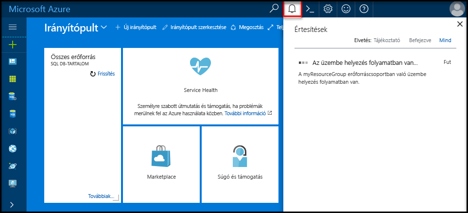
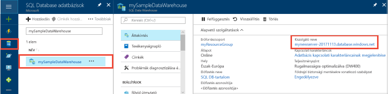
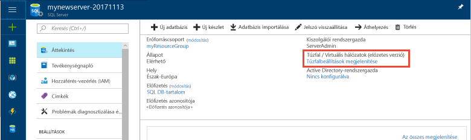
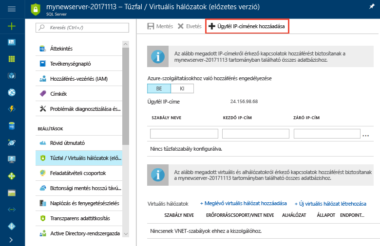
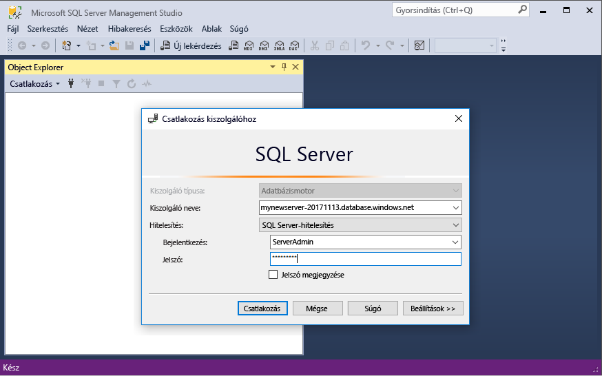
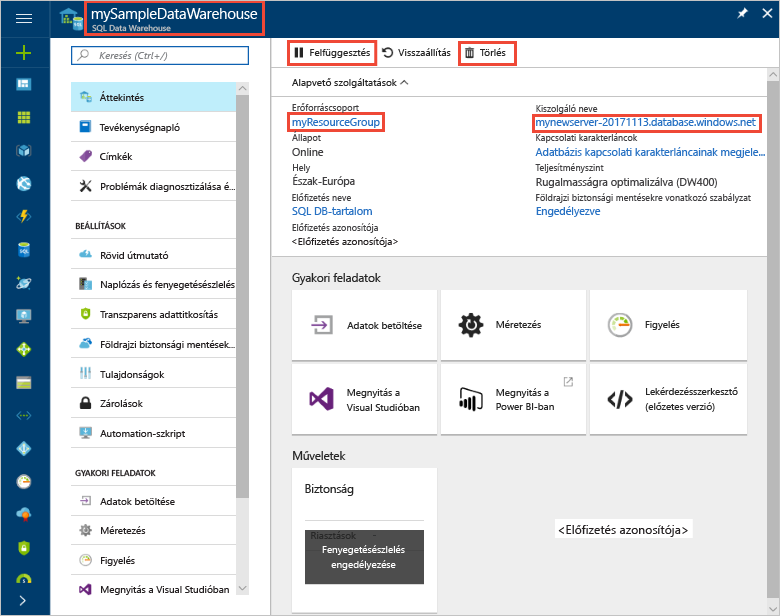

# <a name="tutorial-use-polybase-to-load-data-from-azure-blob-storage-to-azure-sql-data-warehouse"></a>Oktatóanyag: Adatok betöltése az Azure Blob Storage-ból az Azure SQL Data Warehouse-ba a PolyBase használatával.

A PolyBase az adatok SQL Data Warehouse-ba történő beolvasásához használt standard betöltési technológia. Ebben az oktatóanyagban a PolyBase használatával New York-i taxik adatait töltheti be az Azure Blob Storage-ból az Azure SQL Data Warehouse-ba. Az oktatóanyag az [Azure Portalt](https://portal.azure.com) és az [SQL Server Management Studiót](/sql/ssms/download-sql-server-management-studio-ssms.md) (SSMS) használja a következőkhöz: 

> [!div class="checklist"]
> * Adattárház létrehozása az Azure Portalon
> * Kiszolgálószintű tűzfalszabály létrehozása az Azure Portalon
> * Csatlakozás az adattárházhoz az SSMS használatával
> * Adatok betöltésére kijelölt felhasználó létrehozása
> * Külső táblák létrehozása az Azure Blob Storage-ban található adatokhoz
> * Adatok betöltése az adattárházba a CTAS T-SQL-utasítás használatával
> * Az adatok állapotának megtekintése betöltés közben
> * Statisztikák készítése az újonnan betöltött adatokról

Ha nem rendelkezik Azure-előfizetéssel, [hozzon létre egy ingyenes fiókot](https://azure.microsoft.com/free/) a feladatok megkezdése előtt.

## <a name="before-you-begin"></a>Előkészületek

Az oktatóanyag megkezdése előtt töltse le és telepítse az [SQL Server Management Studio](/sql/ssms/download-sql-server-management-studio-ssms.md) (SSMS) legújabb verzióját.


## <a name="log-in-to-the-azure-portal"></a>Bejelentkezés az Azure Portalra

Jelentkezzen be az [Azure portálra](https://portal.azure.com/).

## <a name="create-a-blank-sql-data-warehouse"></a>Üres SQL-adattárház létrehozása

Az Azure SQL Data Warehouse [számítási erőforrások](performance-tiers.md) egy meghatározott készletével együtt jön létre. Az adatbázis egy [Azure-erőforráscsoporton](../azure-resource-manager/resource-group-overview.md) belül egy [Azure SQL logikai kiszolgálón](../sql-database/sql-database-features.md) jön létre. 

Kövesse az alábbi lépéseket egy üres SQL-adattárház létrehozásához. 

1. Kattintson az Azure Portal bal felső sarkában található **Erőforrás létrehozása** gombra.

2. Az **Új** oldalon válassza az **Adatbázisok** elemet, majd az **Új** oldal **Kiemelt** területén válassza az **SQL Data Warehouse** lehetőséget.

    

3. Adja meg az alábbi adatokat a SQL Data Warehouse-űrlapon:   

   | Beállítás | Ajánlott érték | Leírás | 
   | ------- | --------------- | ----------- | 
   | **Adatbázis neve** | mySampleDataWarehouse | Az érvényes adatbázisnevekkel kapcsolatban lásd az [adatbázis-azonosítókat](/sql/relational-databases/databases/database-identifiers) ismertető cikket. | 
   | **Előfizetés** | Az Ön előfizetése  | Az előfizetései részleteivel kapcsolatban lásd az [előfizetéseket](https://account.windowsazure.com/Subscriptions) ismertető cikket. |
   | **Erőforráscsoport** | myResourceGroup | Az érvényes erőforráscsoport-nevekkel kapcsolatban lásd az [elnevezési szabályokat és korlátozásokat](https://docs.microsoft.com/azure/architecture/best-practices/naming-conventions) ismertető cikket. |
   | **Forrás kiválasztása** | Üres adatbázis | Megköveteli egy üres adatbázis létrehozását. Megjegyzés: Az adattárház az adatbázisok egy típusa.|

    

4. Kattintson a **Kiszolgáló** lehetőségre új kiszolgáló létrehozásához és konfigurálásához az új adatbázis számára. Adja meg az alábbi adatokat az **Új kiszolgálóűrlapon**: 

    | Beállítás | Ajánlott érték | Leírás | 
    | ------- | --------------- | ----------- |
    | **Kiszolgálónév** | Bármely globálisan egyedi név | Az érvényes kiszolgálónevekkel kapcsolatban lásd az [elnevezési szabályokat és korlátozásokat](https://docs.microsoft.com/azure/architecture/best-practices/naming-conventions) ismertető cikket. | 
    | **Kiszolgálói rendszergazdai bejelentkezés** | Bármely érvényes név | Az érvényes bejelentkezési nevekkel kapcsolatban lásd az [adatbázis-azonosítókat](https://docs.microsoft.com/sql/relational-databases/databases/database-identifiers) ismertető cikket.|
    | **Jelszó** | Bármely érvényes jelszó | A jelszónak legalább nyolc karakter hosszúságúnak kell lennie, és tartalmaznia kell karaktereket a következő kategóriák közül legalább háromból: nagybetűs karakterek, kisbetűs karakterek, számjegyek és nem alfanumerikus karakterek. |
    | **Hely** | Bármely érvényes hely | A régiókkal kapcsolatos információkért lásd [az Azure régióit](https://azure.microsoft.com/regions/) ismertető cikket. |

    

5. Kattintson a **Kiválasztás** gombra.

6. Kattintson a **Teljesítményszint** elemre az adattárházegységek számának, valamint annak meghatározásához, hogy az adattárház rugalmasságra vagy számítási feladatokra legyen optimalizálva. 

7. A jelen oktatóanyag esetében válassza a **Rugalmasságra optimalizált** szolgáltatásszintet. A csúszka alapértelmezés szerint a **DW400** értéken áll.  Csúsztassa fel és le, hogy kipróbálja a működését a gyakorlatban. 

    

8. Kattintson az **Alkalmaz** gombra.
9. Az SQL Data Warehouse lapon válasszon **rendezést** az üres adatbázishoz. A jelen oktatóanyag esetében használja az alapértelmezett értéket. A rendezésekkel kapcsolatos további információkért lásd: [Rendezések](/sql/t-sql/statements/collations.md)

11. Most, hogy kitöltötte az SQL Database űrlapját, kattintson a **Létrehozás** gombra az adatbázis létrehozásához. Az üzembe helyezés eltarthat néhány percig. 

    

12. Az eszköztáron kattintson az **Értesítések** parancsra az üzembe helyezési folyamat megfigyeléséhez.
    
     

## <a name="create-a-server-level-firewall-rule"></a>Kiszolgálószintű tűzfalszabály létrehozása

Az SQL Data Warehouse szolgáltatás egy tűzfalat hoz létre a kiszolgáló szintjén, amely megakadályozza, hogy a külső alkalmazások és eszközök csatlakozzanak a kiszolgálóhoz vagy a kiszolgálón lévő adatbázisokhoz. A csatlakozás engedélyezéséhez hozzáadhat tűzfalszabályokat, amelyek adott IP-címekkel engedélyezik a kapcsolódást.  A következő lépéseket követve hozzon létre egy [kiszolgálószintű tűzfalszabályt](../sql-database/sql-database-firewall-configure.md) az ügyfél IP-címéhez. 

> [!NOTE]
> Az SQL Data Warehouse az 1433-as portot használja a kommunikációhoz. Ha vállalati hálózaton belülről próbál csatlakozni, elképzelhető, hogy a hálózati tűzfal nem engedélyezi a kimenő forgalmat az 1433-as porton keresztül. Ebben az esetben nem tud csatlakozni az Azure SQL Database-kiszolgálóhoz, ha az informatikai részleg nem nyitja meg az 1433-as portot.
>

1. Az üzembe helyezés befejezése után kattintson az **SQL-adatbázisok** elemre a bal oldali menüben, majd kattintson a **mySampleDatabase** adatbázisra az **SQL-adatbázisok** lapon. Megnyílik az adatbázis áttekintőoldala, amelyen látható a teljes kiszolgálónév (például: **mynewserver-20171113.database.windows.net**), valamint a további konfigurálható beállítások. 

2. Másolja le ezt a teljes kiszolgálónevet, mert a későbbi rövid útmutatók során szüksége lesz rá a kiszolgálóhoz és az adatbázisokhoz való csatlakozáshoz. Ezután kattintson a kiszolgáló nevére a kiszolgáló beállításainak megnyitásához.

     

3. A kiszolgáló beállításainak megnyitásához kattintson a kiszolgálónévre.

     

5. Kattintson a **Tűzfalbeállítások megjelenítése** elemre. Megnyílik az SQL Database kiszolgálóhoz tartozó **Tűzfalbeállítások** oldal. 

     

4. Az eszköztár **Ügyfél IP-címének hozzáadása** elemére kattintva vegye fel aktuális IP-címét egy új tűzfalszabályba. A tűzfalszabály az 1433-as portot egy egyedi IP-cím vagy egy IP-címtartomány számára nyithatja meg.

5. Kattintson a **Save** (Mentés) gombra. A rendszer létrehoz egy kiszolgálószintű tűzfalszabályt az aktuális IP-címhez, és megnyitja az 1433-as portot a logikai kiszolgálón.

6. Kattintson az **OK** gombra, majd zárja be a **Tűzfalbeállítások** lapot.

Mostantól csatlakozhat az SQL-kiszolgálóhoz és annak adattárházaihoz erről az IP-címről. A csatlakozás az SQL Server Management Studio vagy más, választott eszköz használatával lehetséges. A csatlakozáskor használja a korábban létrehozott ServerAdmin-fiókot.  

> [!IMPORTANT]
> Alapértelmezés szerint az összes Azure-szolgáltatás számára engedélyezett a hozzáférés az SQL Database tűzfalán keresztül. A tűzfal az összes Azure-szolgáltatásra vonatkozó letiltásához kattintson ezen az oldalon a **KI** gombra, majd a **Mentés** parancsra.

## <a name="get-the-fully-qualified-server-name"></a>A teljes kiszolgálónév lekérése

Kérje le az SQL-kiszolgáló teljes kiszolgálónevét az Azure Portalon. Később ezt a teljes nevet fogja majd használni a kiszolgálóhoz való kapcsolódás során.

1. Jelentkezzen be az [Azure portálra](https://portal.azure.com/).
2. Válassza az **SQL-adatbázisok** elemet a bal oldali menüben, majd kattintson az új adatbázisra az **SQL-adatbázisok** oldalon. 
3. Az Azure Portalon az adatbázishoz tartozó lap **Alapvető erőforrások** ablaktábláján keresse meg, majd másolja ki a **Kiszolgáló nevét**. Ebben a példában a teljes név a következő: mynewserver-20171113.database.windows.net. 

      

## <a name="connect-to-the-server-as-server-admin"></a>Csatlakozás a kiszolgálóhoz kiszolgáló-rendszergazdaként

Ebben a részben az [SQL Server Management Studio](/sql/ssms/download-sql-server-management-studio-ssms.md) használatával építjük fel a kapcsolatot az Azure SQL-kiszolgálóval.

1. Nyissa meg az SQL Server Management Studiót.

2. A **Connect to Server** (Kapcsolódás a kiszolgálóhoz) párbeszédpanelen adja meg a következő adatokat:

    | Beállítás      | Ajánlott érték | Leírás | 
    | ------------ | --------------- | ----------- | 
    | Kiszolgáló típusa | Adatbázismotor | Kötelezően megadandó érték |
    | Kiszolgálónév | A teljes kiszolgálónév | A névnek a következőhöz hasonlónak kell lennie:  **mynewserver-20171113.database.windows.net**. |
    | Hitelesítés | SQL Server-hitelesítés | Az SQL-hitelesítés az egyetlen hitelesítési típus, amelyet ebben az oktatóanyagban konfiguráltunk. |
    | Bejelentkezés | A kiszolgálói rendszergazdai fiók | Ez az a fiók, amely a kiszolgáló létrehozásakor lett megadva. |
    | Jelszó | A kiszolgálói rendszergazdai fiók jelszava | Ezt a jelszót adta meg a kiszolgáló létrehozásakor. |

    

4. Kattintson a **Connect** (Csatlakozás) gombra. Megnyílik az Object Explorer ablak az SSMS-ben. 

5. Az Object Explorerben bontsa ki a **Databases** (Adatbázisok) elemet. Ezután bontsa ki a **System databases** (Rendszeradatbázisok) és a **master** elemeket az objektumok megtekintéséhez a master adatbázisban.  Bontsa ki a **mySampleDatabase** csomópontot az új adatbázisban található objektumok megtekintéséhez.

     

## <a name="create-a-user-for-loading-data"></a>Felhasználó létrehozása az adatok betöltéséhez

A kiszolgáló rendszergazdai fiókjának célja, hogy felügyeleti műveleteket végezzenek vele, és nem alkalmas a felhasználói adatok lekérdezésére. Az adatok betöltése memóriaigényes művelet. A [memória maximális értékei](performance-tiers.md#memory-maximums) [teljesítményszint](performance-tiers.md) és [erőforrásosztály](resource-classes-for-workload-management.md) szerint vannak definiálva. 

Érdemes létrehozni egy adatok betöltésére kijelölt felhasználót és fiókot. Ezután adja hozzá a betöltést végző felhasználót egy olyan [erőforrásosztályhoz](resource-classes-for-workload-management.md), amely lehetővé teszi a megfelelő mértékű maximális memórialefoglalást.

Mivel jelenleg a kiszolgálói rendszergazdaként csatlakozik, létrehozhat bejelentkezéseket és felhasználókat. Kövesse ezeket a lépéseket egy **LoaderRC20** nevű fiók és felhasználó létrehozásához. Ezután rendelje hozzá a felhasználót a **staticrc20** erőforrásosztályhoz. 

1.  Az SSMS-ben kattintson jobb gombbal a **master** elemre egy legördülő menü megjelenítéséhez, majd válassza a **New Query** (Új lekérdezés) elemet. Megnyílik egy új lekérdezési ablak.

    

2. A lekérdezési ablakban adja meg ezeket a T-SQL-parancsokat egy LoaderRC20 nevű fiók és felhasználó létrehozásához, az „a123STRONGpassword!” helyett pedig adjon meg egy saját jelszót. 

    ```sql
    CREATE LOGIN LoaderRC20 WITH PASSWORD = 'a123STRONGpassword!';
    CREATE USER LoaderRC20 FOR LOGIN LoaderRC20;
    ```

3. Kattintson az **Execute** (Végrehajtás) parancsra.

4. Kattintson jobb gombbal a **mySampleDataWarehouse** elemre, majd válassza a **New Query** (Új lekérdezés) elemet. Megnyílik egy új lekérdezési ablak.  

    
 
5. A következő T-SQL-parancsok begépelésével hozzon létre egy LoaderRC20 nevű felhasználót a LoaderRC20-fiókhoz. A második sor az új adattárházra vonatkozó CONTROL (vezérlési) engedélyeket ad az új felhasználónak.  Ezen engedélyek megadása ahhoz hasonló, mintha az adatbázis tulajdonosává tenné a felhasználót. A harmadik sor a staticrc20 [erőforrásosztály](resource-classes-for-workload-management.md) tagjaként veszi fel az új felhasználót.

    ```sql
    CREATE USER LoaderRC20 FOR LOGIN LoaderRC20;
    GRANT CONTROL ON DATABASE::[mySampleDataWarehouse] to LoaderRC20;
    EXEC sp_addrolemember 'staticrc20', 'LoaderRC20';
    ```

6. Kattintson az **Execute** (Végrehajtás) parancsra.

## <a name="connect-to-the-server-as-the-loading-user"></a>Csatlakozás a kiszolgálóhoz a betöltést végző felhasználóként

Az adatok betöltésének első lépése a LoaderRC20-ként való bejelentkezés.  

1. Az Object Explorerben kattintson a **Connect** (Csatlakozás) legördülő menüre, majd válassza a **Database Engine** (Adatbázismotor) elemet. A **Connect to Server** (Kapcsolódás a kiszolgálóhoz) párbeszédpanel jelenik meg.

    

2. Gépelje be a teljes kiszolgálónevet, és adja meg a **LoaderRC20** felhasználónévként.  Adja meg a LoaderRC20-hoz tartozó jelszót.

3. Kattintson a **Connect** (Csatlakozás) gombra.

4. Ha a kapcsolat készen áll, az Object Explorerben két kiszolgálói kapcsolat lesz látható. Az egyik kapcsolat ServerAdmin-ként, a másik pedig MedRCLogin-ként jelenik meg.

    

## <a name="create-external-tables-for-the-sample-data"></a>Külső táblák létrehozása a mintaadatokhoz

Készen áll megkezdeni az adatok az új adattárházba való betöltésének folyamatát. Az oktatóanyag bemutatja, hogyan használható a [Polybase](/sql/relational-databases/polybase/polybase-guide.md) New York-i taxik adatainak betöltésére egy Azure-tárolóblobból. Ha később szeretné megismerni az adatok Azure Blob Storage-be való áthelyezésének vagy a forrásból közvetlenül az SQL Data Warehouse-ba való betöltésének a módját, olvassa el a [betöltés áttekintését](sql-data-warehouse-overview-load.md).

Futtassa a következő SQL-szkripteket a betölteni kívánt adatokra vonatkozó információk megadásához. Ezen információk közé tartozik az adatok helye, az adatok tartalmának formátuma és az adatok tábladefiníciója. 

1. Az előző szakaszban LoaderRC20-ként jelentkezett be az adattárházba. Az SSMS-ben kattintson jobb gombbal a LoaderRC20-kapcsolatra, és válassza a **New Query** (Új lekérdezés) elemet.  Megnyílik egy új lekérdezési ablak. 

    

2. Hasonlítsa össze a lekérdezési ablakot az előző képpel.  Győződjön meg arról, hogy az új lekérdezési ablak LoaderRC20-ként fut, és a MySampleDataWarehouse adatbázison hajt végre lekérdezéseket. A betöltés összes lépését ebben a lekérdezési ablakban végezze el.

3. Hozzon létre egy főkulcsot a MySampleDataWarehouse adatbázishoz. Adatbázisonként csak egyszer kell főkulcsot létrehoznia. 

    ```sql
    CREATE MASTER KEY;
    ```

4. Futtassa a következő [CREATE EXTERNAL DATA SOURCE](/sql/t-sql/statements/create-external-data-source-transact-sql.md) utasítást az Azure blob helyének meghatározásához. Ez a külső taxiadatok helye.  A lekérdezési ablakhoz hozzáfűzött parancsok futtatásához jelölje ki a futtatni kívánt parancsokat, majd kattintson az **Execute** (Végrehajtás) elemre.

    ```sql
    CREATE EXTERNAL DATA SOURCE NYTPublic
    WITH
    (
        TYPE = Hadoop,
        LOCATION = 'wasbs://2013@nytaxiblob.blob.core.windows.net/'
    );
    ```

5. Futtassa a következő [CREATE EXTERNAL FILE FORMAT](/sql/t-sql/statements/create-external-file-format-transact-sql.md) T-SQL-utasítást a külső adatfájl formázási jellemzőinek és beállításainak megadásához. Ez az utasítás adja meg, hogy a külső adatok szövegként legyenek tárolva, továbbá azt is, hogy az értékeket függőleges vonal („|”) karakter válassza el egymástól. A külső fájl tömörítése a Gzip használatával történik. 

    ```sql
    CREATE EXTERNAL FILE FORMAT uncompressedcsv
    WITH (
        FORMAT_TYPE = DELIMITEDTEXT,
        FORMAT_OPTIONS ( 
            FIELD_TERMINATOR = ',',
            STRING_DELIMITER = '',
            DATE_FORMAT = '',
            USE_TYPE_DEFAULT = False
        )
    );
    CREATE EXTERNAL FILE FORMAT compressedcsv
    WITH ( 
        FORMAT_TYPE = DELIMITEDTEXT,
        FORMAT_OPTIONS ( FIELD_TERMINATOR = '|',
            STRING_DELIMITER = '',
        DATE_FORMAT = '',
            USE_TYPE_DEFAULT = False
        ),
        DATA_COMPRESSION = 'org.apache.hadoop.io.compress.GzipCodec'
    );
    ```

6.  Futtassa a következő [CREATE SCHEMA](/sql/t-sql/statements/create-schema-transact-sql.md) utasítást egy séma létrehozásához a külső fájlformátum számára. A séma lehetővé teszi a létrehozni kívánt külső táblák rendszerezését.

    ```sql
    CREATE SCHEMA ext;
    ```

7. Hozza létre a külső táblákat. A tábladefiníciókat az SQL Data Warehouse tárolja, de a táblák az Azure Blob Storage-ban tárolt adatokra hivatkoznak. A következő T-SQL parancsok futtatásával hozzon létre több külső táblát, amelyek mind a külső adatforrásban korábban meghatározott Azure-blobra mutatnak.

    ```sql
    CREATE EXTERNAL TABLE [ext].[Date] 
    (
        [DateID] int NOT NULL,
        [Date] datetime NULL,
        [DateBKey] char(10) COLLATE SQL_Latin1_General_CP1_CI_AS NULL,
        [DayOfMonth] varchar(2) COLLATE SQL_Latin1_General_CP1_CI_AS NULL,
        [DaySuffix] varchar(4) COLLATE SQL_Latin1_General_CP1_CI_AS NULL,
        [DayName] varchar(9) COLLATE SQL_Latin1_General_CP1_CI_AS NULL,
        [DayOfWeek] char(1) COLLATE SQL_Latin1_General_CP1_CI_AS NULL,
        [DayOfWeekInMonth] varchar(2) COLLATE SQL_Latin1_General_CP1_CI_AS NULL,
        [DayOfWeekInYear] varchar(2) COLLATE SQL_Latin1_General_CP1_CI_AS NULL,
        [DayOfQuarter] varchar(3) COLLATE SQL_Latin1_General_CP1_CI_AS NULL,
        [DayOfYear] varchar(3) COLLATE SQL_Latin1_General_CP1_CI_AS NULL,
        [WeekOfMonth] varchar(1) COLLATE SQL_Latin1_General_CP1_CI_AS NULL,
        [WeekOfQuarter] varchar(2) COLLATE SQL_Latin1_General_CP1_CI_AS NULL,
        [WeekOfYear] varchar(2) COLLATE SQL_Latin1_General_CP1_CI_AS NULL,
        [Month] varchar(2) COLLATE SQL_Latin1_General_CP1_CI_AS NULL,
        [MonthName] varchar(9) COLLATE SQL_Latin1_General_CP1_CI_AS NULL,
        [MonthOfQuarter] varchar(2) COLLATE SQL_Latin1_General_CP1_CI_AS NULL,
        [Quarter] char(1) COLLATE SQL_Latin1_General_CP1_CI_AS NULL,
        [QuarterName] varchar(9) COLLATE SQL_Latin1_General_CP1_CI_AS NULL,
        [Year] char(4) COLLATE SQL_Latin1_General_CP1_CI_AS NULL,
        [YearName] char(7) COLLATE SQL_Latin1_General_CP1_CI_AS NULL,
        [MonthYear] char(10) COLLATE SQL_Latin1_General_CP1_CI_AS NULL,
        [MMYYYY] char(6) COLLATE SQL_Latin1_General_CP1_CI_AS NULL,
        [FirstDayOfMonth] date NULL,
        [LastDayOfMonth] date NULL,
        [FirstDayOfQuarter] date NULL,
        [LastDayOfQuarter] date NULL,
        [FirstDayOfYear] date NULL,
        [LastDayOfYear] date NULL,
        [IsHolidayUSA] bit NULL,
        [IsWeekday] bit NULL,
        [HolidayUSA] varchar(50) COLLATE SQL_Latin1_General_CP1_CI_AS NULL
    )
    WITH
    (
        LOCATION = 'Date',
        DATA_SOURCE = NYTPublic,
        FILE_FORMAT = uncompressedcsv,
        REJECT_TYPE = value,
        REJECT_VALUE = 0
    ); 
    CREATE EXTERNAL TABLE [ext].[Geography]
    (
        [GeographyID] int NOT NULL,
        [ZipCodeBKey] varchar(10) COLLATE SQL_Latin1_General_CP1_CI_AS NOT NULL,
        [County] varchar(50) COLLATE SQL_Latin1_General_CP1_CI_AS NULL,
        [City] varchar(50) COLLATE SQL_Latin1_General_CP1_CI_AS NULL,
        [State] varchar(50) COLLATE SQL_Latin1_General_CP1_CI_AS NULL,
        [Country] varchar(50) COLLATE SQL_Latin1_General_CP1_CI_AS NULL,
        [ZipCode] varchar(50) COLLATE SQL_Latin1_General_CP1_CI_AS NULL
    )
    WITH
    (
        LOCATION = 'Geography',
        DATA_SOURCE = NYTPublic,
        FILE_FORMAT = uncompressedcsv,
        REJECT_TYPE = value,
        REJECT_VALUE = 0 
    );      
    CREATE EXTERNAL TABLE [ext].[HackneyLicense]
    (
        [HackneyLicenseID] int NOT NULL,
        [HackneyLicenseBKey] varchar(50) COLLATE SQL_Latin1_General_CP1_CI_AS NOT NULL,
        [HackneyLicenseCode] varchar(50) COLLATE SQL_Latin1_General_CP1_CI_AS NULL
    )
    WITH
    (
        LOCATION = 'HackneyLicense',
        DATA_SOURCE = NYTPublic,
        FILE_FORMAT = uncompressedcsv,
        REJECT_TYPE = value,
        REJECT_VALUE = 0
    );
    CREATE EXTERNAL TABLE [ext].[Medallion]
    (
        [MedallionID] int NOT NULL,
        [MedallionBKey] varchar(50) COLLATE SQL_Latin1_General_CP1_CI_AS NOT NULL,
        [MedallionCode] varchar(50) COLLATE SQL_Latin1_General_CP1_CI_AS NULL
    )
    WITH
    (
        LOCATION = 'Medallion',
        DATA_SOURCE = NYTPublic,
        FILE_FORMAT = uncompressedcsv,
        REJECT_TYPE = value,
        REJECT_VALUE = 0
    )
    ;  
    CREATE EXTERNAL TABLE [ext].[Time]
    (
        [TimeID] int NOT NULL,
        [TimeBKey] varchar(8) COLLATE SQL_Latin1_General_CP1_CI_AS NOT NULL,
        [HourNumber] tinyint NOT NULL,
        [MinuteNumber] tinyint NOT NULL,
        [SecondNumber] tinyint NOT NULL,
        [TimeInSecond] int NOT NULL,
        [HourlyBucket] varchar(15) COLLATE SQL_Latin1_General_CP1_CI_AS NOT NULL,
        [DayTimeBucketGroupKey] int NOT NULL,
        [DayTimeBucket] varchar(100) COLLATE SQL_Latin1_General_CP1_CI_AS NOT NULL
    )
    WITH
    (
        LOCATION = 'Time',
        DATA_SOURCE = NYTPublic,
        FILE_FORMAT = uncompressedcsv,
        REJECT_TYPE = value,
        REJECT_VALUE = 0
    );
    CREATE EXTERNAL TABLE [ext].[Trip]
    (
        [DateID] int NOT NULL,
        [MedallionID] int NOT NULL,
        [HackneyLicenseID] int NOT NULL,
        [PickupTimeID] int NOT NULL,
        [DropoffTimeID] int NOT NULL,
        [PickupGeographyID] int NULL,
        [DropoffGeographyID] int NULL,
        [PickupLatitude] float NULL,
        [PickupLongitude] float NULL,
        [PickupLatLong] varchar(50) COLLATE SQL_Latin1_General_CP1_CI_AS NULL,
        [DropoffLatitude] float NULL,
        [DropoffLongitude] float NULL,
        [DropoffLatLong] varchar(50) COLLATE SQL_Latin1_General_CP1_CI_AS NULL,
        [PassengerCount] int NULL,
        [TripDurationSeconds] int NULL,
        [TripDistanceMiles] float NULL,
        [PaymentType] varchar(50) COLLATE SQL_Latin1_General_CP1_CI_AS NULL,
        [FareAmount] money NULL,
        [SurchargeAmount] money NULL,
        [TaxAmount] money NULL,
        [TipAmount] money NULL,
        [TollsAmount] money NULL,
        [TotalAmount] money NULL
    )
    WITH
    (
        LOCATION = 'Trip2013',
        DATA_SOURCE = NYTPublic,
        FILE_FORMAT = compressedcsv,
        REJECT_TYPE = value,
        REJECT_VALUE = 0
    );
    CREATE EXTERNAL TABLE [ext].[Weather]
    (
        [DateID] int NOT NULL,
        [GeographyID] int NOT NULL,
        [PrecipitationInches] float NOT NULL,
        [AvgTemperatureFahrenheit] float NOT NULL
    )
    WITH
    (
        LOCATION = 'Weather',
        DATA_SOURCE = NYTPublic,
        FILE_FORMAT = uncompressedcsv,
        REJECT_TYPE = value,
        REJECT_VALUE = 0
    )
    ;
    ```

8. Az Object Explorerben bontsa ki a mySampleDataWarehouse elemet az imént létrehozott külső táblák listájának megtekintéséhez.

    

## <a name="load-the-data-into-your-data-warehouse"></a>Az adatok betöltése az adattárházba

Ez a szakasz az imént definiált külső táblák használatával tölti be a példaadatokat az Azure Storage-blobból az SQL Data Warehouse-ba.  

> [!NOTE]
> Ez az oktatóanyag az adatokat közvetlenül a végső táblázatba tölti be. Éles környezetben általában a CREATE TABLE AS SELECT utasítás használatával végez betöltést egy előkészítési táblába. Amíg az adatok az előkészítési táblában vannak, bármilyen szükséges átalakítás elvégezhető rajtuk. Az előkészítési táblában lévő adatok éles táblához való hozzáfűzéséhez használhatja az INSERT...SELECT utasítást. További információkért lásd: [Adatok beszúrása egy éles táblába](guidance-for-loading-data.md#inserting-data-into-a-production-table).
> 

A szkript a [CREATE TABLE AS SELECT (CTAS)](/sql/t-sql/statements/create-table-as-select-azure-sql-data-warehouse.md) T-SQL-utasítást használja az adatok betöltéséhez az Azure Storage-blobból az adattárházban található új táblákba. A CTAS egy új táblát hoz létre egy kiválasztási utasítás eredményei alapján. Az új tábla oszlopai és adattípusai megegyeznek a kiválasztási utasítás eredményeivel. Amikor a kiválasztási utasítás egy külső táblából választ, az SQL Data Warehouse egy relációs táblába importálja az adatokat az adattárházban. 

1. Futtassa a következő szkriptet az adatok betöltéséhez az adattárházban található új táblákba.

    ```sql
    CREATE TABLE [dbo].[Date]
    WITH
    ( 
        DISTRIBUTION = ROUND_ROBIN,
        CLUSTERED COLUMNSTORE INDEX
    )
    AS SELECT * FROM [ext].[Date]
    OPTION (LABEL = 'CTAS : Load [dbo].[Date]')
    ;
    CREATE TABLE [dbo].[Geography]
    WITH
    ( 
        DISTRIBUTION = ROUND_ROBIN,
        CLUSTERED COLUMNSTORE INDEX
    )
    AS
    SELECT * FROM [ext].[Geography]
    OPTION (LABEL = 'CTAS : Load [dbo].[Geography]')
    ;
    CREATE TABLE [dbo].[HackneyLicense]
    WITH
    ( 
        DISTRIBUTION = ROUND_ROBIN,
        CLUSTERED COLUMNSTORE INDEX
    )
    AS SELECT * FROM [ext].[HackneyLicense]
    OPTION (LABEL = 'CTAS : Load [dbo].[HackneyLicense]')
    ;
    CREATE TABLE [dbo].[Medallion]
    WITH
    (
        DISTRIBUTION = ROUND_ROBIN,
        CLUSTERED COLUMNSTORE INDEX
    )
    AS SELECT * FROM [ext].[Medallion]
    OPTION (LABEL = 'CTAS : Load [dbo].[Medallion]')
    ;
    CREATE TABLE [dbo].[Time]
    WITH
    (
        DISTRIBUTION = ROUND_ROBIN,
        CLUSTERED COLUMNSTORE INDEX
    )
    AS SELECT * FROM [ext].[Time]
    OPTION (LABEL = 'CTAS : Load [dbo].[Time]')
    ;
    CREATE TABLE [dbo].[Weather]
    WITH
    ( 
        DISTRIBUTION = ROUND_ROBIN,
        CLUSTERED COLUMNSTORE INDEX
    )
    AS SELECT * FROM [ext].[Weather]
    OPTION (LABEL = 'CTAS : Load [dbo].[Weather]')
    ;
    CREATE TABLE [dbo].[Trip]
    WITH
    (
        DISTRIBUTION = ROUND_ROBIN,
        CLUSTERED COLUMNSTORE INDEX
    )
    AS SELECT * FROM [ext].[Trip]
    OPTION (LABEL = 'CTAS : Load [dbo].[Trip]')
    ;
    ```

2. A betöltés közben megtekintheti az adatokat. Több GB-nyi adatot tölt be és tömörít nagy teljesítményű fürtözött oszlopcentrikus indexekbe. Futtassa az alábbi lekérdezést, amely dinamikus felügyeleti nézetekkel (DMV-k) jeleníti meg a töltés állapotát. A lekérdezés elindítása után igyon egy kávét, vagy szerezzen valami rágcsálnivalót, amíg az SQL Data Warehouse keményen dolgozik.

    ```sql
    SELECT
        r.command,
        s.request_id,
        r.status,
        count(distinct input_name) as nbr_files,
        sum(s.bytes_processed)/1024/1024/1024 as gb_processed
    FROM 
        sys.dm_pdw_exec_requests r
        INNER JOIN sys.dm_pdw_dms_external_work s
        ON r.request_id = s.request_id
    WHERE
        r.[label] = 'CTAS : Load [dbo].[Date]' OR
        r.[label] = 'CTAS : Load [dbo].[Geography]' OR
        r.[label] = 'CTAS : Load [dbo].[HackneyLicense]' OR
        r.[label] = 'CTAS : Load [dbo].[Medallion]' OR
        r.[label] = 'CTAS : Load [dbo].[Time]' OR
        r.[label] = 'CTAS : Load [dbo].[Weather]' OR
        r.[label] = 'CTAS : Load [dbo].[Trip]'
    GROUP BY
        r.command,
        s.request_id,
        r.status
    ORDER BY
        nbr_files desc, 
        gb_processed desc;
    ```

3. Tekintse meg az összes rendszerlekérdezést.

    ```sql
    SELECT * FROM sys.dm_pdw_exec_requests;
    ```

4. Láthatja, ahogy adatai szépen betöltődnek az adattárházba.

    

## <a name="create-statistics-on-newly-loaded-data"></a>Statisztikák készítése az újonnan betöltött adatokról

Az SQL Data Warehouse nem tudja automatikus létrehozni és frissíteni a statisztikákat. A lekérdezési teljesítmény eléréséhez ezért fontos statisztikákat létrehozni minden tábla minden oszlopához az első betöltéskor. Fontos a statisztikák frissítése is az adatok lényeges módosításai után.

Futtassa az alábbi parancsokat az összekapcsolásokban várhatóan használt oszlopokra vonatkozó statisztikák létrehozásához.

    ```sql
    CREATE STATISTICS [dbo.Date DateID stats] ON dbo.Date (DateID);
    CREATE STATISTICS [dbo.Trip DateID stats] ON dbo.Trip (DateID);
    ```

## <a name="clean-up-resources"></a>Az erőforrások eltávolítása

Az adattárházába betöltött számítási erőforrások és adatok díjkötelesek. Ezeket külön-külön számlázzuk. 

- Ha szeretné az adatokat megtartani a tárolóban, a számítási erőforrásokat szüneteltetheti, amíg nem használja az adattárházat. A számítás felfüggesztése esetén csak az adattárolásért kell fizetni, és folytathatja a számítást, amikor már készen áll az adatokkal való munkára.
- Ha szeretné megelőzni a jövőbeli kiadásokat, az adattárházat törölheti is. 

Kövesse az alábbi lépéseket a fölöslegessé vált erőforrások eltávolítására.

1. Jelentkezzen be az [Azure Portalra](https://portal.azure.com), és kattintson az adattárházra.

    

2. A számítási erőforrások szüneteltetéshez kattintson a **Szüneteltetés** gombra. Ha az adattárház szüneteltetve van, az **Indítás** gomb látható.  A számítási erőforrások újraindításához kattintson az **Indítás** gombra.

3. Ha el szeretné távolítani az adattárházat, hogy a számítási és tárolási erőforrásokért se kelljen fizetnie, kattintson a **Törlés** parancsra.

4. A korábban létrehozott SQL-kiszolgáló eltávolításához kattintson az előző képen látható **mynewserver-20171113.database.windows.net** elemre, majd a **Törlés** parancsra.  Ezzel kapcsolatban legyen körültekintő, mert a kiszolgáló törlésével a kiszolgálóhoz rendelt összes adatbázis is törölve lesz.

5. Az erőforráscsoport törléséhez kattintson a **myResourceGroup** elemre, majd az **Erőforráscsoport törlése** parancsra.

## <a name="next-steps"></a>További lépések 
Ennek az oktatóanyagnak a segítségével megtanulta, hogyan hozhat létre egy adattárházat, illetve egy felhasználót az adatok betöltéséhez. Külső táblákat hozott létre, hogy definiálhassa az Azure Storage-blobban tárolt adatok struktúráját, majd a PolyBase CREATE TABLE AS SELECT utasításával adatokat töltött be az adattárházába. 

A következőket hajtotta végre:
> [!div class="checklist"]
> * Egy adattárház létrehozása az Azure Portalon
> * Kiszolgálószintű tűzfalszabály létrehozása az Azure Portalon
> * Csatlakozás az adattárházhoz az SSMS használatával
> * Adatok betöltésére kijelölt felhasználó létrehozása
> * Külső táblák létrehozása az Azure Storage-blobban található adatokhoz
> * Adatok betöltése az adattárházba a CTAS T-SQL-utasítás használatával
> * Az adatok állapotának megtekintése betöltés közben
> * Statisztikák készítése az újonnan betöltött adatokról

Folytassa az áttelepítés áttekintésével, amelyből megtudhatja, hogyan telepíthet át egy meglévő adatbázist az SQL Data Warehouse-ba.

> [!div class="nextstepaction"]
>[Ismerje meg, hogyan telepíthet át egy meglévő adatbázist az SQL Data Warehouse-ba](sql-data-warehouse-overview-migrate.md)
