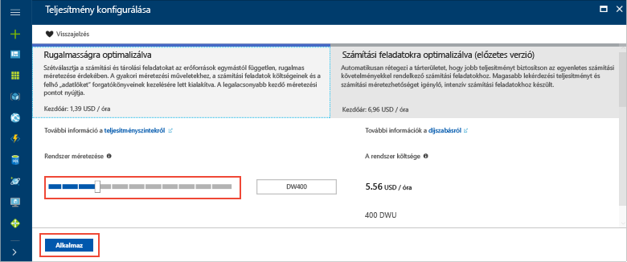

# <a name="tutorial-load-data-to-azure-sql-data-warehouse"></a>Oktatóanyag: Adatok betöltése az Azure SQL Data warehouse-bA

Ez az oktatóanyag a PolyBase segítségével tölti be a WideWorldImportersDW adattárházat az Azure Blob Storage-ból az Azure SQL Data Warehouse-ba. Az oktatóanyag az [Azure Portalt](https://portal.azure.com) és az [SQL Server Management Studiót](/sql/ssms/download-sql-server-management-studio-ssms) (SSMS) használja a következőkhöz: 

> [!div class="checklist"]
> * Adattárház létrehozása az Azure Portalon
> * Kiszolgálószintű tűzfalszabály létrehozása az Azure Portalon
> * Csatlakozás az adattárházhoz az SSMS használatával
> * Adatok betöltésére kijelölt felhasználó létrehozása
> * Azure-blobot adatforrásként használó külső táblák létrehozása
> * Adatok betöltése az adattárházba a CTAS T-SQL-utasítás használatával
> * Az adatok állapotának megtekintése betöltés közben
> * Egy évnyi adat létrehozása a dátumdimenzió és értékesítés ténytáblában
> * Statisztikák készítése az újonnan betöltött adatokról

Ha nem rendelkezik Azure-előfizetéssel, [hozzon létre egy ingyenes fiókot](https://azure.microsoft.com/free/) a feladatok megkezdése előtt.

## <a name="before-you-begin"></a>Előkészületek

Az oktatóanyag megkezdése előtt töltse le és telepítse az [SQL Server Management Studio](/sql/ssms/download-sql-server-management-studio-ssms) (SSMS) legújabb verzióját.


## <a name="log-in-to-the-azure-portal"></a>Bejelentkezés az Azure Portalra

Jelentkezzen be az [Azure Portalra](https://portal.azure.com/).

## <a name="create-a-blank-sql-data-warehouse"></a>Üres SQL-adattárház létrehozása

Az Azure SQL Data Warehouse [számítási erőforrások](memory-and-concurrency-limits.md) egy meghatározott készletével együtt jön létre. Az adatbázis egy [Azure-erőforráscsoporton](../azure-resource-manager/resource-group-overview.md) belül egy [Azure SQL logikai kiszolgálón](../sql-database/sql-database-features.md) jön létre. 

Kövesse az alábbi lépéseket egy üres SQL-adattárház létrehozásához. 

1. Kattintson az Azure Portal bal felső sarkában található **Erőforrás létrehozása** gombra.

2. Az **Új** oldalon válassza az **Adatbázisok** elemet, majd az **Új** oldal **Kiemelt** területén válassza az **SQL Data Warehouse** lehetőséget.

    

3. Adja meg az alábbi adatokat a SQL Data Warehouse-űrlapon:   

   | Beállítás | Ajánlott érték | Leírás | 
   | ------- | --------------- | ----------- | 
   | **Adatbázis neve** | SampleDW | Az érvényes adatbázisnevekkel kapcsolatban lásd az [adatbázis-azonosítókat](/sql/relational-databases/databases/database-identifiers) ismertető cikket. | 
   | **Előfizetés** | Az Ön előfizetése  | Az előfizetései részleteivel kapcsolatban lásd az [előfizetéseket](https://account.windowsazure.com/Subscriptions) ismertető cikket. |
   | **Erőforráscsoport** | SampleRG | Az érvényes erőforráscsoport-nevekkel kapcsolatban lásd az [elnevezési szabályokat és korlátozásokat](https://docs.microsoft.com/azure/architecture/best-practices/naming-conventions) ismertető cikket. |
   | **Forrás kiválasztása** | Üres adatbázis | Megköveteli egy üres adatbázis létrehozását. Megjegyzés: Az adattárház az adatbázisok egy típusa.|

    

4. Kattintson a **Kiszolgáló** lehetőségre új kiszolgáló létrehozásához és konfigurálásához az új adatbázis számára. Adja meg az alábbi adatokat az **Új kiszolgálóűrlapon**: 

    | Beállítás | Ajánlott érték | Leírás | 
    | ------- | --------------- | ----------- |
    | **Kiszolgálónév** | Bármely globálisan egyedi név | Az érvényes kiszolgálónevekkel kapcsolatban lásd az [elnevezési szabályokat és korlátozásokat](https://docs.microsoft.com/azure/architecture/best-practices/naming-conventions) ismertető cikket. | 
    | **Kiszolgálói rendszergazdai bejelentkezés** | Bármely érvényes név | Az érvényes bejelentkezési nevekkel kapcsolatban lásd az [adatbázis-azonosítókat](https://docs.microsoft.com/sql/relational-databases/databases/database-identifiers) ismertető cikket.|
    | **Jelszó** | Bármely érvényes jelszó | A jelszónak legalább nyolc karakter hosszúságúnak kell lennie, és tartalmaznia kell karaktereket a következő kategóriák közül legalább háromból: nagybetűs karakterek, kisbetűs karakterek, számjegyek és nem alfanumerikus karakterek. |
    | **Hely** | Bármely érvényes hely | A régiókkal kapcsolatos információkért lásd [az Azure régióit](https://azure.microsoft.com/regions/) ismertető cikket. |

    

5. Kattintson a **Kiválasztás** gombra.

6. Kattintson a **Teljesítményszint** elemre az adattárházegységek számának, valamint annak meghatározásához, hogy az adattárház rugalmasságra vagy számítási feladatokra legyen optimalizálva. 

7. A jelen oktatóanyag esetében válassza a **Rugalmasságra optimalizált** szolgáltatásszintet. A csúszka alapértelmezés szerint a **DW400** értéken áll.  Csúsztassa fel és le, hogy kipróbálja a működését a gyakorlatban. 

    

8. Kattintson az **Alkalmaz** gombra.
9. Az SQL Data Warehouse lapon válasszon **rendezést** az üres adatbázishoz. A jelen oktatóanyag esetében használja az alapértelmezett értéket. A rendezésekkel kapcsolatos további információkért lásd: [Rendezések](/sql/t-sql/statements/collations)

11. Most, hogy kitöltötte az SQL Database űrlapját, kattintson a **Létrehozás** gombra az adatbázis létrehozásához. Az üzembe helyezés eltarthat néhány percig. 

    

12. Az eszköztáron kattintson az **Értesítések** parancsra az üzembe helyezési folyamat megfigyeléséhez.
    
     

## <a name="create-a-server-level-firewall-rule"></a>Kiszolgálószintű tűzfalszabály létrehozása

Az SQL Data Warehouse szolgáltatás egy tűzfalat hoz létre a kiszolgáló szintjén, amely megakadályozza, hogy a külső alkalmazások és eszközök csatlakozzanak a kiszolgálóhoz vagy a kiszolgálón lévő adatbázisokhoz. A csatlakozás engedélyezéséhez hozzáadhat tűzfalszabályokat, amelyek adott IP-címekkel engedélyezik a kapcsolódást.  A következő lépéseket követve hozzon létre egy [kiszolgálószintű tűzfalszabályt](../sql-database/sql-database-firewall-configure.md) az ügyfél IP-címéhez. 

> [!NOTE]
> Az SQL Data Warehouse az 1433-as portot használja a kommunikációhoz. Ha vállalati hálózaton belülről próbál csatlakozni, elképzelhető, hogy a hálózati tűzfal nem engedélyezi a kimenő forgalmat az 1433-as porton keresztül. Ebben az esetben nem tud csatlakozni az Azure SQL Database-kiszolgálóhoz, ha az informatikai részleg nem nyitja meg az 1433-as portot.
>

1. Az üzembe helyezés befejezése után kattintson az **SQL-adatbázisok** elemre a bal oldali menüben, majd kattintson a **SampleDW** adatbázisra az **SQL-adatbázisok** lapon. Megnyílik az adatbázis áttekintőoldala, amelyen látható a teljes kiszolgálónév (például: **sample-svr.database.windows.net**), valamint a további konfigurálható beállítások. 

2. Másolja le ezt a teljes kiszolgálónevet, mert a későbbi rövid útmutatók során szüksége lesz rá a kiszolgálóhoz és az adatbázisokhoz való csatlakozáshoz. A kiszolgáló beállításainak megnyitásához kattintson a kiszolgálónévre.

     

3. A kiszolgáló beállításainak megnyitásához kattintson a kiszolgálónévre.

     

5. Kattintson a **Tűzfalbeállítások megjelenítése** elemre. Megnyílik az SQL Database kiszolgálóhoz tartozó **Tűzfalbeállítások** oldal. 

     

4.  Az aktuális IP-címét az eszköztár **Ügyfél IP-címének hozzáadása** elemére kattintva veheti fel egy új tűzfalszabályba. A tűzfalszabály az 1433-as portot egy egyedi IP-cím vagy egy IP-címtartomány számára nyithatja meg.

5. Kattintson a **Save** (Mentés) gombra. A rendszer létrehoz egy kiszolgálószintű tűzfalszabályt az aktuális IP-címhez, és megnyitja az 1433-as portot a logikai kiszolgálón.

6. Kattintson az **OK** gombra, majd zárja be a **Tűzfalbeállítások** lapot.

Mostantól csatlakozhat az SQL-kiszolgálóhoz és annak adattárházaihoz erről az IP-címről. A csatlakozás az SQL Server Management Studio vagy más, választott eszköz használatával lehetséges. A csatlakozáskor használja a korábban létrehozott ServerAdmin-fiókot.  

> [!IMPORTANT]
> Alapértelmezés szerint az összes Azure-szolgáltatás számára engedélyezett a hozzáférés az SQL Database tűzfalán keresztül. A tűzfal az összes Azure-szolgáltatásra vonatkozó letiltásához kattintson ezen az oldalon a **KI** gombra, majd a **Mentés** parancsra.

## <a name="get-the-fully-qualified-server-name"></a>A teljes kiszolgálónév lekérése

Kérje le az SQL-kiszolgáló teljes kiszolgálónevét az Azure Portalon. Később ezt a teljes nevet fogja majd használni a kiszolgálóhoz való kapcsolódás során.

1. Jelentkezzen be az [Azure Portalra](https://portal.azure.com/).
2. Válassza az **SQL-adatbázisok** elemet a bal oldali menüben, majd kattintson az új adatbázisra az **SQL-adatbázisok** oldalon. 
3. Az Azure Portalon az adatbázishoz tartozó lap **Alapvető erőforrások** ablaktábláján keresse meg, majd másolja ki a **Kiszolgáló nevét**. Ebben a példában a teljes név a következő: mynewserver-20171113.database.windows.net. 

      

## <a name="connect-to-the-server-as-server-admin"></a>Csatlakozás a kiszolgálóhoz kiszolgáló-rendszergazdaként

Ebben a részben az [SQL Server Management Studio](/sql/ssms/download-sql-server-management-studio-ssms) használatával építjük fel a kapcsolatot az Azure SQL-kiszolgálóval.

1. Nyissa meg az SQL Server Management Studiót.

2. A **Connect to Server** (Kapcsolódás a kiszolgálóhoz) párbeszédpanelen adja meg a következő adatokat:

    | Beállítás      | Ajánlott érték | Leírás | 
    | ------------ | --------------- | ----------- | 
    | Kiszolgáló típusa | Adatbázismotor | Kötelezően megadandó érték |
    | Kiszolgálónév | A teljes kiszolgálónév | A **sample-svr.database.windows.net** például egy teljes kiszolgálónév. |
    | Hitelesítés | SQL Server-hitelesítés | Ebben az oktatóanyagban az SQL-hitelesítésen kívül más hitelesítéstípus nincs konfigurálva. |
    | Bejelentkezés | A kiszolgálói rendszergazdai fiók | Ez az a fiók, amely a kiszolgáló létrehozásakor lett megadva. |
    | Jelszó | A kiszolgálói rendszergazdai fiók jelszava | Ezt a jelszót adta meg a kiszolgáló létrehozásakor. |

    

4. Kattintson a **Connect** (Csatlakozás) gombra. Megnyílik az Object Explorer ablak az SSMS-ben. 

5. Az Object Explorerben bontsa ki a **Databases** (Adatbázisok) elemet. Ezután bontsa ki a **System databases** (Rendszeradatbázisok) és a **master** elemeket az objektumok megtekintéséhez a master adatbázisban.  Bontsa ki a **mySampleDatabase** csomópontot az új adatbázisban található objektumok megtekintéséhez.

     

## <a name="create-a-user-for-loading-data"></a>Felhasználó létrehozása az adatok betöltéséhez

A kiszolgáló rendszergazdai fiókjának célja, hogy felügyeleti műveleteket végezzenek vele, és nem alkalmas a felhasználói adatok lekérdezésére. Az adatok betöltése memóriaigényes művelet. A memória maximális értékei a használt SQL Data Warehouse létrehozása, az [adattárházegységek](what-is-a-data-warehouse-unit-dwu-cdwu.md) és az [erőforrásosztály](resource-classes-for-workload-management.md) szerint vannak definiálva. 

Érdemes létrehozni egy adatok betöltésére kijelölt felhasználót és fiókot. Ezután adja hozzá a betöltést végző felhasználót egy olyan [erőforrásosztályhoz](resource-classes-for-workload-management.md), amely lehetővé teszi a megfelelő mértékű maximális memórialefoglalást.

Mivel jelenleg a kiszolgálói rendszergazdaként csatlakozik, létrehozhat bejelentkezéseket és felhasználókat. Kövesse ezeket a lépéseket egy **LoaderRC60** nevű fiók és felhasználó létrehozásához. Ezután rendelje hozzá a felhasználót a **staticrc60** erőforrásosztályhoz. 

1.  Az SSMS-ben kattintson jobb gombbal a **master** elemre egy legördülő menü megjelenítéséhez, majd válassza a **New Query** (Új lekérdezés) elemet. Megnyílik egy új lekérdezési ablak.

    

2. A lekérdezési ablakban adja meg ezeket a T-SQL-parancsokat egy LoaderRC60 nevű fiók és felhasználó létrehozásához, az „a123STRONGpassword!” helyett pedig adjon meg egy saját jelszót. 

    ```sql
    CREATE LOGIN LoaderRC60 WITH PASSWORD = 'a123STRONGpassword!';
    CREATE USER LoaderRC60 FOR LOGIN LoaderRC60;
    ```

3. Kattintson az **Execute** (Végrehajtás) parancsra.

4. Kattintson a jobb gombbal a **SampleDW** elemre, majd válassza a **New Query** (Új lekérdezés) elemet. Megnyílik egy új lekérdezési ablak.  

    
 
5. A következő T-SQL-parancsok begépelésével hozzon létre egy LoaderRC60 nevű felhasználót a LoaderRC60-fiókhoz. A második sor az új adattárházra vonatkozó CONTROL (vezérlési) engedélyeket ad az új felhasználónak.  Ezen engedélyek megadása ahhoz hasonló, mintha az adatbázis tulajdonosává tenné a felhasználót. A harmadik sor a staticrc60 [erőforrásosztály](resource-classes-for-workload-management.md) tagjaként veszi fel az új felhasználót.

    ```sql
    CREATE USER LoaderRC60 FOR LOGIN LoaderRC60;
    GRANT CONTROL ON DATABASE::[SampleDW] to LoaderRC60;
    EXEC sp_addrolemember 'staticrc60', 'LoaderRC60';
    ```

6. Kattintson az **Execute** (Végrehajtás) parancsra.

## <a name="connect-to-the-server-as-the-loading-user"></a>Csatlakozás a kiszolgálóhoz a betöltést végző felhasználóként

Az adatok betöltésének első lépése a LoaderRC60-ként való bejelentkezés.  

1. Az Object Explorerben kattintson a **Connect** (Csatlakozás) legördülő menüre, majd válassza a **Database Engine** (Adatbázismotor) elemet. A **Connect to Server** (Kapcsolódás a kiszolgálóhoz) párbeszédpanel jelenik meg.

    

2. Írja be a teljes kiszolgálónevet, és adja meg a **LoaderRC60** felhasználónevet.  Adja meg a LoaderRC60-hoz tartozó jelszót.

3. Kattintson a **Connect** (Csatlakozás) gombra.

4. Ha a kapcsolat készen áll, az Object Explorerben két kiszolgálói kapcsolat lesz látható. Az egyik kapcsolat ServerAdmin-ként, a másik pedig LoaderRC60-ként jelenik meg.

    

## <a name="create-external-tables-and-objects"></a>Külső táblák és objektumok létrehozása

Készen áll megkezdeni az adatok az új adattárházba való betöltésének folyamatát. Ha később szeretné megismerni az adatok Azure Blob Storage-ba való áthelyezésének vagy a forrásból közvetlenül az SQL Data Warehouse-ba való betöltésének a módját, olvassa el a [betöltés áttekintését](sql-data-warehouse-overview-load.md).

Futtassa a következő SQL-szkripteket a betölteni kívánt adatokra vonatkozó információk megadásához. Ezen információk közé tartozik az adatok helye, az adatok tartalmának formátuma és az adatok tábladefiníciója. Az adatok egy nyilvános Azure-blobban találhatók.

1. Az előző szakaszban LoaderRC60-ként jelentkezett be az adattárházba. Az SSMS-ben kattintson a jobb gombbal a LoaderRC60-kapcsolat alatt található **SampleDW** elemre, és válassza a **New Query** (Új lekérdezés) elemet.  Megnyílik egy új lekérdezési ablak. 

    

2. Hasonlítsa össze a lekérdezési ablakot az előző képpel.  Győződjön meg arról, hogy az új lekérdezési ablak LoaderRC60-ként fut, és a SampleDW adatbázison hajt végre lekérdezéseket. A betöltés összes lépését ebben a lekérdezési ablakban végezze el.

3. Hozzon létre egy főkulcsot a SampleDW adatbázishoz. Adatbázisonként csak egyszer kell főkulcsot létrehoznia. 

    ```sql
    CREATE MASTER KEY;
    ```

4. Futtassa a következő [CREATE EXTERNAL DATA SOURCE](/sql/t-sql/statements/create-external-data-source-transact-sql) utasítást az Azure blob helyének meghatározásához. Ez a külső taxiadatok helye.  A lekérdezési ablakhoz hozzáfűzött parancsok futtatásához jelölje ki a futtatni kívánt parancsokat, majd kattintson az **Execute** (Végrehajtás) elemre.

    ```sql
    CREATE EXTERNAL DATA SOURCE WWIStorage
    WITH
    (
        TYPE = Hadoop,
        LOCATION = 'wasbs://wideworldimporters@sqldwholdata.blob.core.windows.net'
    );
    ```

5. Futtassa a következő [CREATE EXTERNAL FILE FORMAT](/sql/t-sql/statements/create-external-file-format-transact-sql) T-SQL-utasítást a külső adatfájl formázási jellemzőinek és beállításainak megadásához. Ez az utasítás adja meg, hogy a külső adatok szövegként legyenek tárolva, továbbá azt is, hogy az értékeket függőleges vonal („|”) karakter válassza el egymástól.  

    ```sql
    CREATE EXTERNAL FILE FORMAT TextFileFormat 
    WITH 
    (   
        FORMAT_TYPE = DELIMITEDTEXT,
        FORMAT_OPTIONS
        (   
            FIELD_TERMINATOR = '|',
            USE_TYPE_DEFAULT = FALSE 
        )
    );
    ```

6.  Futtassa a következő [CREATE SCHEMA](/sql/t-sql/statements/create-schema-transact-sql)-utasításokat egy séma a külső fájlformátum számára történő létrehozásához. A séma lehetővé teszi a létrehozni kívánt külső táblák rendszerezését. A wwi-séma rendszerezi a standard táblákat, amelyek majd az adatokat tartalmazzák. 

    ```sql
    CREATE SCHEMA ext;
    GO
    CREATE SCHEMA wwi;
    ```

7. Hozza létre a külső táblákat. A tábladefiníciókat az SQL Data Warehouse tárolja, de a táblák az Azure Blob Storage-ban tárolt adatokra hivatkoznak. A következő T-SQL-parancsok futtatásával hozzon létre több külső táblát, amelyek mind a külső adatforrásban korábban meghatározott Azure-blobra mutatnak.

    ```sql
    CREATE EXTERNAL TABLE [ext].[dimension_City](
        [City Key] [int] NOT NULL,
        [WWI City ID] [int] NOT NULL,
        [City] [nvarchar](50) NOT NULL,
        [State Province] [nvarchar](50) NOT NULL,
        [Country] [nvarchar](60) NOT NULL,
        [Continent] [nvarchar](30) NOT NULL,
        [Sales Territory] [nvarchar](50) NOT NULL,
        [Region] [nvarchar](30) NOT NULL,
        [Subregion] [nvarchar](30) NOT NULL,
        [Location] [nvarchar](76) NULL,
        [Latest Recorded Population] [bigint] NOT NULL,
        [Valid From] [datetime2](7) NOT NULL,
        [Valid To] [datetime2](7) NOT NULL,
        [Lineage Key] [int] NOT NULL
    )
    WITH (LOCATION='/v1/dimension_City/',   
        DATA_SOURCE = WWIStorage,  
        FILE_FORMAT = TextFileFormat,
        REJECT_TYPE = VALUE,
        REJECT_VALUE = 0
    );  
    CREATE EXTERNAL TABLE [ext].[dimension_Customer] (
        [Customer Key] [int] NOT NULL,
        [WWI Customer ID] [int] NOT NULL,
        [Customer] [nvarchar](100) NOT NULL,
        [Bill To Customer] [nvarchar](100) NOT NULL,
        [Category] [nvarchar](50) NOT NULL,
        [Buying Group] [nvarchar](50) NOT NULL,
        [Primary Contact] [nvarchar](50) NOT NULL,
        [Postal Code] [nvarchar](10) NOT NULL,
        [Valid From] [datetime2](7) NOT NULL,
        [Valid To] [datetime2](7) NOT NULL,
        [Lineage Key] [int] NOT NULL
    )
    WITH (LOCATION='/v1/dimension_Customer/',   
        DATA_SOURCE = WWIStorage,  
        FILE_FORMAT = TextFileFormat,
        REJECT_TYPE = VALUE,
        REJECT_VALUE = 0
    );  
    CREATE EXTERNAL TABLE [ext].[dimension_Employee] (
        [Employee Key] [int] NOT NULL,
        [WWI Employee ID] [int] NOT NULL,
        [Employee] [nvarchar](50) NOT NULL,
        [Preferred Name] [nvarchar](50) NOT NULL,
        [Is Salesperson] [bit] NOT NULL,
        [Photo] [varbinary](300) NULL,
        [Valid From] [datetime2](7) NOT NULL,
        [Valid To] [datetime2](7) NOT NULL,
        [Lineage Key] [int] NOT NULL
    )
    WITH ( LOCATION='/v1/dimension_Employee/',   
        DATA_SOURCE = WWIStorage,  
        FILE_FORMAT = TextFileFormat,
        REJECT_TYPE = VALUE,
        REJECT_VALUE = 0
    );
    CREATE EXTERNAL TABLE [ext].[dimension_PaymentMethod] (
        [Payment Method Key] [int] NOT NULL,
        [WWI Payment Method ID] [int] NOT NULL,
        [Payment Method] [nvarchar](50) NOT NULL,
        [Valid From] [datetime2](7) NOT NULL,
        [Valid To] [datetime2](7) NOT NULL,
        [Lineage Key] [int] NOT NULL
    )
    WITH ( LOCATION ='/v1/dimension_PaymentMethod/',   
        DATA_SOURCE = WWIStorage,  
        FILE_FORMAT = TextFileFormat,
        REJECT_TYPE = VALUE,
        REJECT_VALUE = 0
    );
    CREATE EXTERNAL TABLE [ext].[dimension_StockItem](
        [Stock Item Key] [int] NOT NULL,
        [WWI Stock Item ID] [int] NOT NULL,
        [Stock Item] [nvarchar](100) NOT NULL,
        [Color] [nvarchar](20) NOT NULL,
        [Selling Package] [nvarchar](50) NOT NULL,
        [Buying Package] [nvarchar](50) NOT NULL,
        [Brand] [nvarchar](50) NOT NULL,
        [Size] [nvarchar](20) NOT NULL,
        [Lead Time Days] [int] NOT NULL,
        [Quantity Per Outer] [int] NOT NULL,
        [Is Chiller Stock] [bit] NOT NULL,
        [Barcode] [nvarchar](50) NULL,
        [Tax Rate] [decimal](18, 3) NOT NULL,
        [Unit Price] [decimal](18, 2) NOT NULL,
        [Recommended Retail Price] [decimal](18, 2) NULL,
        [Typical Weight Per Unit] [decimal](18, 3) NOT NULL,
        [Photo] [varbinary](300) NULL,
        [Valid From] [datetime2](7) NOT NULL,
        [Valid To] [datetime2](7) NOT NULL,
        [Lineage Key] [int] NOT NULL
    )
    WITH ( LOCATION ='/v1/dimension_StockItem/',   
        DATA_SOURCE = WWIStorage,  
        FILE_FORMAT = TextFileFormat,
        REJECT_TYPE = VALUE,
        REJECT_VALUE = 0
    );
    CREATE EXTERNAL TABLE [ext].[dimension_Supplier](
        [Supplier Key] [int] NOT NULL,
        [WWI Supplier ID] [int] NOT NULL,
        [Supplier] [nvarchar](100) NOT NULL,
        [Category] [nvarchar](50) NOT NULL,
        [Primary Contact] [nvarchar](50) NOT NULL,
        [Supplier Reference] [nvarchar](20) NULL,
        [Payment Days] [int] NOT NULL,
        [Postal Code] [nvarchar](10) NOT NULL,
        [Valid From] [datetime2](7) NOT NULL,
        [Valid To] [datetime2](7) NOT NULL,
        [Lineage Key] [int] NOT NULL
    )
    WITH ( LOCATION ='/v1/dimension_Supplier/',   
        DATA_SOURCE = WWIStorage,  
        FILE_FORMAT = TextFileFormat,
        REJECT_TYPE = VALUE,
        REJECT_VALUE = 0
    );
    CREATE EXTERNAL TABLE [ext].[dimension_TransactionType](
        [Transaction Type Key] [int] NOT NULL,
        [WWI Transaction Type ID] [int] NOT NULL,
        [Transaction Type] [nvarchar](50) NOT NULL,
        [Valid From] [datetime2](7) NOT NULL,
        [Valid To] [datetime2](7) NOT NULL,
        [Lineage Key] [int] NOT NULL
    )    
    WITH ( LOCATION ='/v1/dimension_TransactionType/',   
        DATA_SOURCE = WWIStorage,  
        FILE_FORMAT = TextFileFormat,
        REJECT_TYPE = VALUE,
        REJECT_VALUE = 0
    );
    CREATE EXTERNAL TABLE [ext].[fact_Movement] (
        [Movement Key] [bigint] NOT NULL,
        [Date Key] [date] NOT NULL,
        [Stock Item Key] [int] NOT NULL,
        [Customer Key] [int] NULL,
        [Supplier Key] [int] NULL,
        [Transaction Type Key] [int] NOT NULL,
        [WWI Stock Item Transaction ID] [int] NOT NULL,
        [WWI Invoice ID] [int] NULL,
        [WWI Purchase Order ID] [int] NULL,
        [Quantity] [int] NOT NULL,
        [Lineage Key] [int] NOT NULL
    )
    WITH ( LOCATION ='/v1/fact_Movement/',   
        DATA_SOURCE = WWIStorage,  
        FILE_FORMAT = TextFileFormat,
        REJECT_TYPE = VALUE,
        REJECT_VALUE = 0
    );
    CREATE EXTERNAL TABLE [ext].[fact_Order] (
        [Order Key] [bigint] NOT NULL,
        [City Key] [int] NOT NULL,
        [Customer Key] [int] NOT NULL,
        [Stock Item Key] [int] NOT NULL,
        [Order Date Key] [date] NOT NULL,
        [Picked Date Key] [date] NULL,
        [Salesperson Key] [int] NOT NULL,
        [Picker Key] [int] NULL,
        [WWI Order ID] [int] NOT NULL,
        [WWI Backorder ID] [int] NULL,
        [Description] [nvarchar](100) NOT NULL,
        [Package] [nvarchar](50) NOT NULL,
        [Quantity] [int] NOT NULL,
        [Unit Price] [decimal](18, 2) NOT NULL,
        [Tax Rate] [decimal](18, 3) NOT NULL,
        [Total Excluding Tax] [decimal](18, 2) NOT NULL,
        [Tax Amount] [decimal](18, 2) NOT NULL,
        [Total Including Tax] [decimal](18, 2) NOT NULL,
        [Lineage Key] [int] NOT NULL
    )
    WITH ( LOCATION ='/v1/fact_Order/',   
        DATA_SOURCE = WWIStorage,  
        FILE_FORMAT = TextFileFormat,
        REJECT_TYPE = VALUE,
        REJECT_VALUE = 0
    );
    CREATE EXTERNAL TABLE [ext].[fact_Purchase] (
        [Purchase Key] [bigint] NOT NULL,
        [Date Key] [date] NOT NULL,
        [Supplier Key] [int] NOT NULL,
        [Stock Item Key] [int] NOT NULL,
        [WWI Purchase Order ID] [int] NULL,
        [Ordered Outers] [int] NOT NULL,
        [Ordered Quantity] [int] NOT NULL,
        [Received Outers] [int] NOT NULL,
        [Package] [nvarchar](50) NOT NULL,
        [Is Order Finalized] [bit] NOT NULL,
        [Lineage Key] [int] NOT NULL
    )
    WITH ( LOCATION ='/v1/fact_Purchase/',   
        DATA_SOURCE = WWIStorage,  
        FILE_FORMAT = TextFileFormat,
        REJECT_TYPE = VALUE,
        REJECT_VALUE = 0
    );
    CREATE EXTERNAL TABLE [ext].[fact_Sale] (
        [Sale Key] [bigint] NOT NULL,
        [City Key] [int] NOT NULL,
        [Customer Key] [int] NOT NULL,
        [Bill To Customer Key] [int] NOT NULL,
        [Stock Item Key] [int] NOT NULL,
        [Invoice Date Key] [date] NOT NULL,
        [Delivery Date Key] [date] NULL,
        [Salesperson Key] [int] NOT NULL,
        [WWI Invoice ID] [int] NOT NULL,
        [Description] [nvarchar](100) NOT NULL,
        [Package] [nvarchar](50) NOT NULL,
        [Quantity] [int] NOT NULL,
        [Unit Price] [decimal](18, 2) NOT NULL,
        [Tax Rate] [decimal](18, 3) NOT NULL,
        [Total Excluding Tax] [decimal](18, 2) NOT NULL,
        [Tax Amount] [decimal](18, 2) NOT NULL,
        [Profit] [decimal](18, 2) NOT NULL,
        [Total Including Tax] [decimal](18, 2) NOT NULL,
        [Total Dry Items] [int] NOT NULL,
        [Total Chiller Items] [int] NOT NULL,
        [Lineage Key] [int] NOT NULL
    )
    WITH ( LOCATION ='/v1/fact_Sale/',   
        DATA_SOURCE = WWIStorage,  
        FILE_FORMAT = TextFileFormat,
        REJECT_TYPE = VALUE,
        REJECT_VALUE = 0
    );
    CREATE EXTERNAL TABLE [ext].[fact_StockHolding] (
        [Stock Holding Key] [bigint] NOT NULL,
        [Stock Item Key] [int] NOT NULL,
        [Quantity On Hand] [int] NOT NULL,
        [Bin Location] [nvarchar](20) NOT NULL,
        [Last Stocktake Quantity] [int] NOT NULL,
        [Last Cost Price] [decimal](18, 2) NOT NULL,
        [Reorder Level] [int] NOT NULL,
        [Target Stock Level] [int] NOT NULL,
        [Lineage Key] [int] NOT NULL
    )
    WITH ( LOCATION ='/v1/fact_StockHolding/',   
        DATA_SOURCE = WWIStorage,  
        FILE_FORMAT = TextFileFormat,
        REJECT_TYPE = VALUE,
        REJECT_VALUE = 0
    );
    CREATE EXTERNAL TABLE [ext].[fact_Transaction] (
        [Transaction Key] [bigint] NOT NULL,
        [Date Key] [date] NOT NULL,
        [Customer Key] [int] NULL,
        [Bill To Customer Key] [int] NULL,
        [Supplier Key] [int] NULL,
        [Transaction Type Key] [int] NOT NULL,
        [Payment Method Key] [int] NULL,
        [WWI Customer Transaction ID] [int] NULL,
        [WWI Supplier Transaction ID] [int] NULL,
        [WWI Invoice ID] [int] NULL,
        [WWI Purchase Order ID] [int] NULL,
        [Supplier Invoice Number] [nvarchar](20) NULL,
        [Total Excluding Tax] [decimal](18, 2) NOT NULL,
        [Tax Amount] [decimal](18, 2) NOT NULL,
        [Total Including Tax] [decimal](18, 2) NOT NULL,
        [Outstanding Balance] [decimal](18, 2) NOT NULL,
        [Is Finalized] [bit] NOT NULL,
        [Lineage Key] [int] NOT NULL
    )
    WITH ( LOCATION ='/v1/fact_Transaction/',   
        DATA_SOURCE = WWIStorage,  
        FILE_FORMAT = TextFileFormat,
        REJECT_TYPE = VALUE,
        REJECT_VALUE = 0
    );
    ```

8. Az Object Explorerben bontsa ki a SampleDW elemet az imént létrehozott külső táblák listájának megtekintéséhez.

    

## <a name="load-the-data-into-your-data-warehouse"></a>Az adatok betöltése az adattárházba

Ez a szakasz az imént definiált külső táblák használatával tölti be a példaadatokat az Azure-blobból az SQL Data Warehouse-ba.  

> [!NOTE]
> Ez az oktatóanyag az adatokat közvetlenül a végső táblázatba tölti be. Éles környezetben általában a CREATE TABLE AS SELECT utasítás használatával végez betöltést egy előkészítési táblába. Amíg az adatok az előkészítési táblában vannak, bármilyen szükséges átalakítás elvégezhető rajtuk. Az előkészítési táblában lévő adatok éles táblához való hozzáfűzéséhez használhatja az INSERT...SELECT utasítást. További információkért lásd: [Adatok beszúrása egy éles táblába](guidance-for-loading-data.md#inserting-data-into-a-production-table).
> 

A szkript a [CREATE TABLE AS SELECT (CTAS)](/sql/t-sql/statements/create-table-as-select-azure-sql-data-warehouse) T-SQL-utasítást használja az adatok betöltéséhez az Azure Storage-blobból az adattárházban található új táblákba. A CTAS egy új táblát hoz létre egy kiválasztási utasítás eredményei alapján. Az új tábla oszlopai és adattípusai megegyeznek a kiválasztási utasítás eredményeivel. Amikor a kiválasztási utasítás egy külső táblából választ, az SQL Data Warehouse egy relációs táblába importálja az adatokat az adattárházban. 

A szkript nem tölt be adatokat a wwi.dimension_Date és a wwi.fact_Sales táblába. Ezek a táblák egy későbbi lépésben jönnek létre, hogy a tábláknak megfelelő számú sora legyen.

1. Futtassa a következő szkriptet az adatok betöltéséhez az adattárházban található új táblákba.

    ```sql
    CREATE TABLE [wwi].[dimension_City]
    WITH
    ( 
        DISTRIBUTION = REPLICATE,
        CLUSTERED COLUMNSTORE INDEX
    )
    AS
    SELECT * FROM [ext].[dimension_City]
    OPTION (LABEL = 'CTAS : Load [wwi].[dimension_City]')
    ;

    CREATE TABLE [wwi].[dimension_Customer]
    WITH
    ( 
        DISTRIBUTION = REPLICATE,
        CLUSTERED COLUMNSTORE INDEX
    )
    AS
    SELECT * FROM [ext].[dimension_Customer]
    OPTION (LABEL = 'CTAS : Load [wwi].[dimension_Customer]')
    ;

    CREATE TABLE [wwi].[dimension_Employee]
    WITH
    ( 
        DISTRIBUTION = REPLICATE,
        CLUSTERED COLUMNSTORE INDEX
    )
    AS
    SELECT * FROM [ext].[dimension_Employee]
    OPTION (LABEL = 'CTAS : Load [wwi].[dimension_Employee]')
    ;

    CREATE TABLE [wwi].[dimension_PaymentMethod]
    WITH
    ( 
        DISTRIBUTION = REPLICATE,
        CLUSTERED COLUMNSTORE INDEX
    )
    AS
    SELECT * FROM [ext].[dimension_PaymentMethod]
    OPTION (LABEL = 'CTAS : Load [wwi].[dimension_PaymentMethod]')
    ;

    CREATE TABLE [wwi].[dimension_StockItem]
    WITH
    ( 
        DISTRIBUTION = REPLICATE,
        CLUSTERED COLUMNSTORE INDEX
    )
    AS
    SELECT * FROM [ext].[dimension_StockItem]
    OPTION (LABEL = 'CTAS : Load [wwi].[dimension_StockItem]')
    ;

    CREATE TABLE [wwi].[dimension_Supplier]
    WITH
    ( 
        DISTRIBUTION = REPLICATE,
        CLUSTERED COLUMNSTORE INDEX
    )
    AS
    SELECT * FROM [ext].[dimension_Supplier]
    OPTION (LABEL = 'CTAS : Load [wwi].[dimension_Supplier]')
    ;

    CREATE TABLE [wwi].[dimension_TransactionType]
    WITH
    ( 
        DISTRIBUTION = REPLICATE,
        CLUSTERED COLUMNSTORE INDEX
    )
    AS
    SELECT * FROM [ext].[dimension_TransactionType]
    OPTION (LABEL = 'CTAS : Load [wwi].[dimension_TransactionType]')
    ;

    CREATE TABLE [wwi].[fact_Movement]
    WITH
    ( 
        DISTRIBUTION = HASH([Movement Key]),
        CLUSTERED COLUMNSTORE INDEX
    )
    AS
    SELECT * FROM [ext].[fact_Movement]
    OPTION (LABEL = 'CTAS : Load [wwi].[fact_Movement]')
    ;

    CREATE TABLE [wwi].[fact_Order]
    WITH
    ( 
        DISTRIBUTION = HASH([Order Key]),
        CLUSTERED COLUMNSTORE INDEX
    )
    AS
    SELECT * FROM [ext].[fact_Order]
    OPTION (LABEL = 'CTAS : Load [wwi].[fact_Order]')
    ;

    CREATE TABLE [wwi].[fact_Purchase]
    WITH
    ( 
        DISTRIBUTION = HASH([Purchase Key]),
        CLUSTERED COLUMNSTORE INDEX
    )
    AS
    SELECT * FROM [ext].[fact_Purchase]
    OPTION (LABEL = 'CTAS : Load [wwi].[fact_Purchase]')
    ;

    CREATE TABLE [wwi].[seed_Sale]
    WITH
    ( 
        DISTRIBUTION = HASH([WWI Invoice ID]),
        CLUSTERED COLUMNSTORE INDEX
    )
    AS
    SELECT * FROM [ext].[fact_Sale]
    OPTION (LABEL = 'CTAS : Load [wwi].[seed_Sale]')
    ;

    CREATE TABLE [wwi].[fact_StockHolding]
    WITH
    ( 
        DISTRIBUTION = HASH([Stock Holding Key]),
        CLUSTERED COLUMNSTORE INDEX
    )
    AS
    SELECT * FROM [ext].[fact_StockHolding]
    OPTION (LABEL = 'CTAS : Load [wwi].[fact_StockHolding]')
    ;

    CREATE TABLE [wwi].[fact_Transaction]
    WITH
    ( 
        DISTRIBUTION = HASH([Transaction Key]),
        CLUSTERED COLUMNSTORE INDEX
    )
    AS
    SELECT * FROM [ext].[fact_Transaction]
    OPTION (LABEL = 'CTAS : Load [wwi].[fact_Transaction]')
    ;
    ```

2. A betöltés közben megtekintheti az adatokat. Több GB-nyi adatot tölt be és tömörít nagy teljesítményű fürtözött oszlopcentrikus indexekbe. Nyisson meg egy új lekérdezési ablakot a SampleDW adatbázison, és futtassa az alábbi lekérdezést a betöltés állapotának megjelenítéséhez. A lekérdezés elindítása után igyon egy kávét, vagy szerezzen valami rágcsálnivalót, amíg az SQL Data Warehouse keményen dolgozik.

    ```sql
    SELECT
        r.command,
        s.request_id,
        r.status,
        count(distinct input_name) as nbr_files,
        sum(s.bytes_processed)/1024/1024/1024 as gb_processed
    FROM 
        sys.dm_pdw_exec_requests r
        INNER JOIN sys.dm_pdw_dms_external_work s
        ON r.request_id = s.request_id
    WHERE
        r.[label] = 'CTAS : Load [wwi].[dimension_City]' OR
        r.[label] = 'CTAS : Load [wwi].[dimension_Customer]' OR
        r.[label] = 'CTAS : Load [wwi].[dimension_Employee]' OR
        r.[label] = 'CTAS : Load [wwi].[dimension_PaymentMethod]' OR
        r.[label] = 'CTAS : Load [wwi].[dimension_StockItem]' OR
        r.[label] = 'CTAS : Load [wwi].[dimension_Supplier]' OR
        r.[label] = 'CTAS : Load [wwi].[dimension_TransactionType]' OR
        r.[label] = 'CTAS : Load [wwi].[fact_Movement]' OR
        r.[label] = 'CTAS : Load [wwi].[fact_Order]' OR
        r.[label] = 'CTAS : Load [wwi].[fact_Purchase]' OR
        r.[label] = 'CTAS : Load [wwi].[fact_StockHolding]' OR
        r.[label] = 'CTAS : Load [wwi].[fact_Transaction]'
    GROUP BY
        r.command,
        s.request_id,
        r.status
    ORDER BY
        nbr_files desc, 
        gb_processed desc;
    ```

3. Tekintse meg az összes rendszerlekérdezést.

    ```sql
    SELECT * FROM sys.dm_pdw_exec_requests;
    ```

4. Láthatja, ahogy adatai szépen betöltődnek az adattárházba.

    

## <a name="create-tables-and-procedures-to-generate-the-date-and-sales-tables"></a>Táblák és eljárások létrehozása a Date és Sales táblák létrehozásához

Ez a szakasz létrehozza a wwi.dimension_Date és wwi.fact_Sales táblát. Létrehoz sorok millióinak előállítására képes tárolt eljárásokat is a wwi.dimension_Date és a wwi.fact_Sales táblában.

1. Hozza létre a dimension_Date és a fact_Sale táblát.  

    ```sql
    CREATE TABLE [wwi].[dimension_Date]
    (
        [Date] [datetime] NOT NULL,
        [Day Number] [int] NOT NULL,
        [Day] [nvarchar](10) NOT NULL,
        [Month] [nvarchar](10) NOT NULL,
        [Short Month] [nvarchar](3) NOT NULL,
        [Calendar Month Number] [int] NOT NULL,
        [Calendar Month Label] [nvarchar](20) NOT NULL,
        [Calendar Year] [int] NOT NULL,
        [Calendar Year Label] [nvarchar](10) NOT NULL,
        [Fiscal Month Number] [int] NOT NULL,
        [Fiscal Month Label] [nvarchar](20) NOT NULL,
        [Fiscal Year] [int] NOT NULL,
        [Fiscal Year Label] [nvarchar](10) NOT NULL,
        [ISO Week Number] [int] NOT NULL
    )
    WITH 
    (
        DISTRIBUTION = REPLICATE,
        CLUSTERED INDEX ([Date])
    );
    CREATE TABLE [wwi].[fact_Sale]
    (
        [Sale Key] [bigint] IDENTITY(1,1) NOT NULL,
        [City Key] [int] NOT NULL,
        [Customer Key] [int] NOT NULL,
        [Bill To Customer Key] [int] NOT NULL,
        [Stock Item Key] [int] NOT NULL,
        [Invoice Date Key] [date] NOT NULL,
        [Delivery Date Key] [date] NULL,
        [Salesperson Key] [int] NOT NULL,
        [WWI Invoice ID] [int] NOT NULL,
        [Description] [nvarchar](100) NOT NULL,
        [Package] [nvarchar](50) NOT NULL,
        [Quantity] [int] NOT NULL,
        [Unit Price] [decimal](18, 2) NOT NULL,
        [Tax Rate] [decimal](18, 3) NOT NULL,
        [Total Excluding Tax] [decimal](18, 2) NOT NULL,
        [Tax Amount] [decimal](18, 2) NOT NULL,
        [Profit] [decimal](18, 2) NOT NULL,
        [Total Including Tax] [decimal](18, 2) NOT NULL,
        [Total Dry Items] [int] NOT NULL,
        [Total Chiller Items] [int] NOT NULL,
        [Lineage Key] [int] NOT NULL
    )
    WITH
    (
        DISTRIBUTION = HASH ( [WWI Invoice ID] ),
        CLUSTERED COLUMNSTORE INDEX
    )
    ```

2. A [wwi].[seed_Sale] sorszámának nyolcszorosára növeléséhez a [wwi].[InitialSalesDataPopulation] létrehozására van szükség. 

    ```sql
    CREATE PROCEDURE [wwi].[InitialSalesDataPopulation] AS
    BEGIN
        INSERT INTO [wwi].[seed_Sale] (
            [Sale Key], [City Key], [Customer Key], [Bill To Customer Key], [Stock Item Key], [Invoice Date Key], [Delivery Date Key], [Salesperson Key], [WWI Invoice ID], [Description], [Package], [Quantity], [Unit Price], [Tax Rate], [Total Excluding Tax], [Tax Amount], [Profit], [Total Including Tax], [Total Dry Items], [Total Chiller Items], [Lineage Key]
        )
        SELECT
            [Sale Key], [City Key], [Customer Key], [Bill To Customer Key], [Stock Item Key], [Invoice Date Key], [Delivery Date Key], [Salesperson Key], [WWI Invoice ID], [Description], [Package], [Quantity], [Unit Price], [Tax Rate], [Total Excluding Tax], [Tax Amount], [Profit], [Total Including Tax], [Total Dry Items], [Total Chiller Items], [Lineage Key]
        FROM [wwi].[seed_Sale]

        INSERT INTO [wwi].[seed_Sale] (
            [Sale Key], [City Key], [Customer Key], [Bill To Customer Key], [Stock Item Key], [Invoice Date Key], [Delivery Date Key], [Salesperson Key], [WWI Invoice ID], [Description], [Package], [Quantity], [Unit Price], [Tax Rate], [Total Excluding Tax], [Tax Amount], [Profit], [Total Including Tax], [Total Dry Items], [Total Chiller Items], [Lineage Key]
        )
        SELECT
            [Sale Key], [City Key], [Customer Key], [Bill To Customer Key], [Stock Item Key], [Invoice Date Key], [Delivery Date Key], [Salesperson Key], [WWI Invoice ID], [Description], [Package], [Quantity], [Unit Price], [Tax Rate], [Total Excluding Tax], [Tax Amount], [Profit], [Total Including Tax], [Total Dry Items], [Total Chiller Items], [Lineage Key]
        FROM [wwi].[seed_Sale]

        INSERT INTO [wwi].[seed_Sale] (
            [Sale Key], [City Key], [Customer Key], [Bill To Customer Key], [Stock Item Key], [Invoice Date Key], [Delivery Date Key], [Salesperson Key], [WWI Invoice ID], [Description], [Package], [Quantity], [Unit Price], [Tax Rate], [Total Excluding Tax], [Tax Amount], [Profit], [Total Including Tax], [Total Dry Items], [Total Chiller Items], [Lineage Key]
        )
        SELECT
            [Sale Key], [City Key], [Customer Key], [Bill To Customer Key], [Stock Item Key], [Invoice Date Key], [Delivery Date Key], [Salesperson Key], [WWI Invoice ID], [Description], [Package], [Quantity], [Unit Price], [Tax Rate], [Total Excluding Tax], [Tax Amount], [Profit], [Total Including Tax], [Total Dry Items], [Total Chiller Items], [Lineage Key]
        FROM [wwi].[seed_Sale]
    END
    ```

3. Hozza létre ezt a tárolt eljárást, amely sorokkal tölti fel a wwi.dimension_Date táblát.

    ```sql
    CREATE PROCEDURE [wwi].[PopulateDateDimensionForYear] @Year [int] AS
    BEGIN
        IF OBJECT_ID('tempdb..#month', 'U') IS NOT NULL 
            DROP TABLE #month
        CREATE TABLE #month (
            monthnum int,
            numofdays int
        )
        WITH ( DISTRIBUTION = ROUND_ROBIN, heap )
        INSERT INTO #month
            SELECT 1, 31 UNION SELECT 2, CASE WHEN (@YEAR % 4 = 0 AND @YEAR % 100 <> 0) OR @YEAR % 400 = 0 THEN 29 ELSE 28 END UNION SELECT 3,31 UNION SELECT 4,30 UNION SELECT 5,31 UNION SELECT 6,30 UNION SELECT 7,31 UNION SELECT 8,31 UNION SELECT 9,30 UNION SELECT 10,31 UNION SELECT 11,30 UNION SELECT 12,31

        IF OBJECT_ID('tempdb..#days', 'U') IS NOT NULL 
            DROP TABLE #days
        CREATE TABLE #days (days int)
        WITH (DISTRIBUTION = ROUND_ROBIN, HEAP)

        INSERT INTO #days
            SELECT 1 UNION SELECT 2 UNION SELECT 3 UNION SELECT 4 UNION SELECT 5 UNION SELECT 6 UNION SELECT 7 UNION SELECT 8 UNION SELECT 9 UNION SELECT 10 UNION SELECT 11 UNION SELECT 12 UNION SELECT 13 UNION SELECT 14 UNION SELECT 15 UNION SELECT 16 UNION SELECT 17 UNION SELECT 18 UNION SELECT 19 UNION SELECT 20    UNION SELECT 21 UNION SELECT 22 UNION SELECT 23 UNION SELECT 24 UNION SELECT 25 UNION SELECT 26 UNION SELECT 27 UNION SELECT 28 UNION SELECT 29 UNION SELECT 30 UNION SELECT 31

        INSERT [wwi].[dimension_Date] (
            [Date], [Day Number], [Day], [Month], [Short Month], [Calendar Month Number], [Calendar Month Label], [Calendar Year], [Calendar Year Label], [Fiscal Month Number], [Fiscal Month Label], [Fiscal Year], [Fiscal Year Label], [ISO Week Number] 
        )
        SELECT
            CAST(CAST(monthnum AS VARCHAR(2)) + '/' + CAST([days] AS VARCHAR(3)) + '/' + CAST(@year AS CHAR(4)) AS DATE) AS [Date]
            ,DAY(CAST(CAST(monthnum AS VARCHAR(2)) + '/' + CAST([days] AS VARCHAR(3)) + '/' + CAST(@year AS CHAR(4)) AS DATE)) AS [Day Number]
            ,CAST(DATENAME(day, CAST(CAST(monthnum AS VARCHAR(2)) + '/' + CAST([days] AS VARCHAR(3)) + '/' + CAST(@year AS CHAR(4)) AS DATE)) AS NVARCHAR(10)) AS [Day]
            ,CAST(DATENAME(month, CAST(CAST(monthnum AS VARCHAR(2)) + '/' + CAST([days] AS VARCHAR(3)) + '/' + CAST(@year as char(4)) AS DATE)) AS nvarchar(10)) AS [Month]
            ,CAST(SUBSTRING(DATENAME(month, CAST(CAST(monthnum as varchar(2)) + '/' + CAST([days] as varchar(3)) + '/' + CAST(@year as char(4)) AS DATE)), 1, 3) AS nvarchar(3)) AS [Short Month]
            ,MONTH(CAST(CAST(monthnum as varchar(2)) + '/' + CAST([days] as varchar(3)) + '/' + CAST(@year as char(4)) AS DATE)) AS [Calendar Month Number]
            ,CAST(N'CY' + CAST(YEAR(CAST(CAST(monthnum as varchar(2)) + '/' + CAST([days] as varchar(3)) + '/' + CAST(@year as char(4)) AS DATE)) AS nvarchar(4)) + N'-' + SUBSTRING(DATENAME(month, CAST(CAST(monthnum as varchar(2)) + '/' + CAST([days] as varchar(3)) + '/' + CAST(@year as char(4)) AS DATE)), 1, 3) AS nvarchar(10)) AS [Calendar Month Label]
            ,YEAR(CAST(CAST(monthnum as varchar(2)) + '/' + CAST([days] as varchar(3)) + '/' + CAST(@year as char(4)) AS DATE)) AS [Calendar Year]
            ,CAST(N'CY' + CAST(YEAR(CAST(CAST(monthnum as varchar(2)) + '/' + CAST([days] as varchar(3)) + '/' + CAST(@year as char(4)) AS DATE)) AS nvarchar(4)) AS nvarchar(10)) AS [Calendar Year Label]
            ,CASE WHEN MONTH(CAST(CAST(monthnum as varchar(2)) + '/' + CAST([days] as varchar(3)) + '/' + CAST(@year as char(4)) AS DATE)) IN (11, 12)
            THEN MONTH(CAST(CAST(monthnum as varchar(2)) + '/' + CAST([days] as varchar(3)) + '/' + CAST(@year as char(4)) AS DATE)) - 10
            ELSE MONTH(CAST(CAST(monthnum as varchar(2)) + '/' + CAST([days] as varchar(3)) + '/' + CAST(@year as char(4)) AS DATE)) + 2 END AS [Fiscal Month Number]
            ,CAST(N'FY' + CAST(CASE WHEN MONTH(CAST(CAST(monthnum as varchar(2)) + '/' + CAST([days] as varchar(3)) + '/' + CAST(@year as char(4)) AS DATE)) IN (11, 12)
            THEN YEAR(CAST(CAST(monthnum as varchar(2)) + '/' + CAST([days] as varchar(3)) + '/' + CAST(@year as char(4)) AS DATE)) + 1
            ELSE YEAR(CAST(CAST(monthnum as varchar(2)) + '/' + CAST([days] as varchar(3)) + '/' + CAST(@year as char(4)) AS DATE)) END AS nvarchar(4)) + N'-' + SUBSTRING(DATENAME(month, CAST(CAST(monthnum as varchar(2)) + '/' + CAST([days] as varchar(3)) + '/' + CAST(@year as char(4)) AS DATE)), 1, 3) AS nvarchar(20)) AS [Fiscal Month Label]
            ,CASE WHEN MONTH(CAST(CAST(monthnum as varchar(2)) + '/' + CAST([days] as varchar(3)) + '/' + CAST(@year as char(4)) AS DATE)) IN (11, 12)
            THEN YEAR(CAST(CAST(monthnum as varchar(2)) + '/' + CAST([days] as varchar(3)) + '/' + CAST(@year as char(4)) AS DATE)) + 1
            ELSE YEAR(CAST(CAST(monthnum as varchar(2)) + '/' + CAST([days] as varchar(3)) + '/' + CAST(@year as char(4)) AS DATE)) END AS [Fiscal Year]
            ,CAST(N'FY' + CAST(CASE WHEN MONTH(CAST(CAST(monthnum as varchar(2)) + '/' + CAST([days] as varchar(3)) + '/' + CAST(@year as char(4)) AS DATE)) IN (11, 12)
            THEN YEAR(CAST(CAST(monthnum as varchar(2)) + '/' + CAST([days] as varchar(3)) + '/' + CAST(@year as char(4)) AS DATE)) + 1
            ELSE YEAR(CAST(CAST(monthnum as varchar(2)) + '/' + CAST([days] as varchar(3)) + '/' + CAST(@year as char(4)) AS DATE))END AS nvarchar(4)) AS nvarchar(10)) AS [Fiscal Year Label]
            , DATEPART(ISO_WEEK, CAST(CAST(monthnum as varchar(2)) + '/' + CAST([days] as varchar(3)) + '/' + CAST(@year as char(4)) AS DATE)) AS [ISO Week Number]
    FROM #month m
        CROSS JOIN #days d
    WHERE d.days <= m.numofdays

    DROP table #month;
    DROP table #days;
    END;
    ```
4. Hozza létre ezt az eljárást, amely feltölti a wwi.dimension_Date és a wwi.fact_Sales táblát. Meghívja a [wwi].[PopulateDateDimensionForYear] eljárást a wwi.dimension_Date feltöltéséhez.

    ```sql
    CREATE PROCEDURE [wwi].[Configuration_PopulateLargeSaleTable] @EstimatedRowsPerDay [bigint],@Year [int] AS
    BEGIN
        SET NOCOUNT ON;
        SET XACT_ABORT ON;

        EXEC [wwi].[PopulateDateDimensionForYear] @Year;

        DECLARE @OrderCounter bigint = 0;
        DECLARE @NumberOfSalesPerDay bigint = @EstimatedRowsPerDay;
        DECLARE @DateCounter date; 
        DECLARE @StartingSaleKey bigint;
        DECLARE @MaximumSaleKey bigint = (SELECT MAX([Sale Key]) FROM wwi.seed_Sale);
        DECLARE @MaxDate date;
        SET @MaxDate = (SELECT MAX([Invoice Date Key]) FROM wwi.fact_Sale)
        IF ( @MaxDate < CAST(@YEAR AS CHAR(4)) + '1231') AND (@MaxDate > CAST(@YEAR AS CHAR(4)) + '0101')
            SET @DateCounter = @MaxDate
        ELSE
            SET @DateCounter= CAST(@Year as char(4)) + '0101';

        PRINT 'Targeting ' + CAST(@NumberOfSalesPerDay AS varchar(20)) + ' sales per day.';

        DECLARE @OutputCounter varchar(20);
        DECLARE @variance DECIMAL(18,10);
        DECLARE @VariantNumberOfSalesPerDay BIGINT;

        WHILE @DateCounter < CAST(@YEAR AS CHAR(4)) + '1231'
        BEGIN
            SET @OutputCounter = CONVERT(varchar(20), @DateCounter, 112);
            RAISERROR(@OutputCounter, 0, 1);
            SET @variance = (SELECT RAND() * 10)*.01 + .95
            SET @VariantNumberOfSalesPerDay = FLOOR(@NumberOfSalesPerDay * @variance)

            SET @StartingSaleKey = @MaximumSaleKey - @VariantNumberOfSalesPerDay - FLOOR(RAND() * 20000);
            SET @OrderCounter = 0;

            INSERT [wwi].[fact_Sale] (
                [City Key], [Customer Key], [Bill To Customer Key], [Stock Item Key], [Invoice Date Key], [Delivery Date Key], [Salesperson Key], [WWI Invoice ID], [Description], Package, Quantity, [Unit Price], [Tax Rate], [Total Excluding Tax], [Tax Amount], Profit, [Total Including Tax], [Total Dry Items], [Total Chiller Items], [Lineage Key]
            )
            SELECT TOP(@VariantNumberOfSalesPerDay)
                [City Key], [Customer Key], [Bill To Customer Key], [Stock Item Key], @DateCounter, DATEADD(day, 1, @DateCounter), [Salesperson Key], [WWI Invoice ID], [Description], Package, Quantity, [Unit Price], [Tax Rate], [Total Excluding Tax], [Tax Amount], Profit, [Total Including Tax], [Total Dry Items], [Total Chiller Items], [Lineage Key]
            FROM [wwi].[seed_Sale]
            WHERE 
                 --[Sale Key] > @StartingSaleKey and /* IDENTITY DOES NOT WORK THE SAME IN SQLDW AND CAN'T USE THIS METHOD FOR VARIANT */
                [Invoice Date Key] >=cast(@YEAR AS CHAR(4)) + '-01-01'
            ORDER BY [Sale Key];

            SET @DateCounter = DATEADD(day, 1, @DateCounter);
        END;

    END;
    ```

## <a name="generate-millions-of-rows"></a>Sorok millióinak előállítása
A létrehozott tárolt eljárásokat használhatja arra, hogy sorok millióit állítsa elő a wwi.fact_Sales táblában, illetve a hozzájuk tartozó adatokat a wwi.dimension_Date táblában. 


1. Futtassa ezt az eljárást, hogy a [wwi].[seed_Sale] további sorokkal töltődjön fel.

    ```sql    
    EXEC [wwi].[InitialSalesDataPopulation]
    ```

2. Ezt az eljárást futtatva a 2000-es év minden napján 100 000 sorral töltheti fel a wwi.fact_Sales táblát.

    ```sql
    EXEC [wwi].[Configuration_PopulateLargeSaleTable] 100000, 2000
    ```
3. Az előző lépésben ismertetett adat-előállítás eltarthat egy darabig, ahogy előrehaladunk az évben.  Annak megtekintéséhez, hogy a jelenlegi folyamat melyik napnál tart, nyisson meg egy új lekérdezést, és futtassa az alábbi SQL-parancsot:

    ```sql
    SELECT MAX([Invoice Date Key]) FROM wwi.fact_Sale;
    ```

4. A felhasznált terület megtekintéséhez futtassa az alábbi parancsot.

    ```sql
    EXEC sp_spaceused N'wwi.fact_Sale';
    ```

## <a name="populate-the-replicated-table-cache"></a>A replikált táblák gyorsítótárának feltöltése
Az SQL Data Warehouse az adatoknak az egyes Compute-csomópontokon való gyorsítótárazásával replikál egy táblát. A gyorsítótárat akkor tölti fel a rendszer, amikor egy lekérdezés fut a táblán. Egy replikált tábla első lekérdezése hosszabb időt vehet igénybe a gyorsítótár feltöltése miatt. A gyorsítótár feltöltése után a replikált táblákon futó lekérdezések gyorsabbak lesznek.

Ezeket az SQL-lekérdezéseket futtatva feltöltheti a replikált tábla gyorsítótárát a Compute-csomópontokon. 

    ```sql
    SELECT TOP 1 * FROM [wwi].[dimension_City];
    SELECT TOP 1 * FROM [wwi].[dimension_Customer];
    SELECT TOP 1 * FROM [wwi].[dimension_Date];
    SELECT TOP 1 * FROM [wwi].[dimension_Employee];
    SELECT TOP 1 * FROM [wwi].[dimension_PaymentMethod];
    SELECT TOP 1 * FROM [wwi].[dimension_StockItem];
    SELECT TOP 1 * FROM [wwi].[dimension_Supplier];
    SELECT TOP 1 * FROM [wwi].[dimension_TransactionType];
    ```

## <a name="create-statistics-on-newly-loaded-data"></a>Statisztikák készítése az újonnan betöltött adatokról

A jó lekérdezési teljesítmény eléréséhez fontos statisztikákat létrehozni minden tábla minden oszlopához az első betöltéskor. Fontos a statisztikák frissítése is az adatok lényeges módosításai után. 

1. Hozza létre ezt a tárolt eljárást, amely frissíti az összes tábla összes oszlopának statisztikáit.

    ```sql
    CREATE PROCEDURE    [dbo].[prc_sqldw_create_stats]
    (   @create_type    tinyint -- 1 default 2 Fullscan 3 Sample
    ,   @sample_pct     tinyint
    )
    AS

    IF @create_type IS NULL
    BEGIN
        SET @create_type = 1;
    END;

    IF @create_type NOT IN (1,2,3)
    BEGIN
        THROW 151000,'Invalid value for @stats_type parameter. Valid range 1 (default), 2 (fullscan) or 3 (sample).',1;
    END;

    IF @sample_pct IS NULL
    BEGIN;
        SET @sample_pct = 20;
    END;

    IF OBJECT_ID('tempdb..#stats_ddl') IS NOT NULL
    BEGIN;
        DROP TABLE #stats_ddl;
    END;
    
    CREATE TABLE #stats_ddl
    WITH    (   DISTRIBUTION    = HASH([seq_nmbr])
            ,   LOCATION        = USER_DB
            )
    AS
    WITH T
    AS
    (
    SELECT      t.[name]                        AS [table_name]
    ,           s.[name]                        AS [table_schema_name]
    ,           c.[name]                        AS [column_name]
    ,           c.[column_id]                   AS [column_id]
    ,           t.[object_id]                   AS [object_id]
    ,           ROW_NUMBER()
                OVER(ORDER BY (SELECT NULL))    AS [seq_nmbr]
    FROM        sys.[tables] t
    JOIN        sys.[schemas] s         ON  t.[schema_id]       = s.[schema_id]
    JOIN        sys.[columns] c         ON  t.[object_id]       = c.[object_id]
    LEFT JOIN   sys.[stats_columns] l   ON  l.[object_id]       = c.[object_id]
                                        AND l.[column_id]       = c.[column_id]
                                        AND l.[stats_column_id] = 1
    LEFT JOIN    sys.[external_tables] e    ON    e.[object_id]        = t.[object_id]
    WHERE       l.[object_id] IS NULL
    AND            e.[object_id] IS NULL -- not an external table
    )
    SELECT  [table_schema_name]
    ,       [table_name]
    ,       [column_name]
    ,       [column_id]
    ,       [object_id]
    ,       [seq_nmbr]
    ,       CASE @create_type
            WHEN 1
            THEN    CAST('CREATE STATISTICS '+QUOTENAME('stat_'+table_schema_name+ '_' + table_name + '_'+column_name)+' ON '+QUOTENAME(table_schema_name)+'.'+QUOTENAME(table_name)+'('+QUOTENAME(column_name)+')' AS VARCHAR(8000))
            WHEN 2
            THEN    CAST('CREATE STATISTICS '+QUOTENAME('stat_'+table_schema_name+ '_' + table_name + '_'+column_name)+' ON '+QUOTENAME(table_schema_name)+'.'+QUOTENAME(table_name)+'('+QUOTENAME(column_name)+') WITH FULLSCAN' AS VARCHAR(8000))
            WHEN 3
            THEN    CAST('CREATE STATISTICS '+QUOTENAME('stat_'+table_schema_name+ '_' + table_name + '_'+column_name)+' ON '+QUOTENAME(table_schema_name)+'.'+QUOTENAME(table_name)+'('+QUOTENAME(column_name)+') WITH SAMPLE '+CONVERT(varchar(4),@sample_pct)+' PERCENT' AS VARCHAR(8000))
            END AS create_stat_ddl
    FROM T
    ;

    DECLARE @i INT              = 1
    ,       @t INT              = (SELECT COUNT(*) FROM #stats_ddl)
    ,       @s NVARCHAR(4000)   = N''
    ;

    WHILE @i <= @t
    BEGIN
        SET @s=(SELECT create_stat_ddl FROM #stats_ddl WHERE seq_nmbr = @i);
        PRINT @s
        EXEC sp_executesql @s
        SET @i+=1;
    END

    DROP TABLE #stats_ddl;
    ```

2. Ezt a parancsot futtatva létrehozhat statisztikákat az adattárház összes táblájának összes oszlopához.

    ```sql
    EXEC [dbo].[prc_sqldw_create_stats] 1, NULL;
    ```

## <a name="clean-up-resources"></a>Az erőforrások eltávolítása

Az adattárházába betöltött számítási erőforrások és adatok díjkötelesek. Ezeket külön-külön számlázzuk.  

Kövesse az alábbi lépéseket a fölöslegessé vált erőforrások eltávolítására.

1. Jelentkezzen be az [Azure Portalra](https://portal.azure.com), és kattintson az adattárházra.

    

2. Ha szeretné az adatokat megtartani a tárolóban, a számítási erőforrásokat szüneteltetheti, amíg nem használja az adattárházat. A számítás felfüggesztése esetén csak az adattárolásért kell fizetni, és folytathatja a számítást, amikor már készen áll az adatokkal való munkára. A számítási erőforrások szüneteltetéshez kattintson a **Szüneteltetés** gombra. Ha az adattárház szüneteltetve van, az **Indítás** gomb látható.  A számítási erőforrások újraindításához kattintson az **Indítás** gombra.

3. Ha szeretné megelőzni a jövőbeli kiadásokat, az adattárházat törölheti is. Ha el szeretné távolítani az adattárházat, hogy a számítási és tárolási erőforrásokért se kelljen fizetnie, kattintson a **Törlés** parancsra.

4. A korábban létrehozott SQL-kiszolgáló eltávolításához kattintson az előző képen látható **sample-svr.database.windows.net** elemre, majd a **Törlés** parancsra.  Ezzel kapcsolatban legyen körültekintő, mert a kiszolgáló törlésével a kiszolgálóhoz rendelt összes adatbázis is törölve lesz.

5. Az erőforráscsoport törléséhez kattintson a **SampleRG** elemre, majd az **Erőforráscsoport törlése** parancsra.

## <a name="next-steps"></a>További lépések 
Ennek az oktatóanyagnak a segítségével megtanulta, hogyan hozhat létre egy adattárházat, illetve egy felhasználót az adatok betöltéséhez. Külső táblákat hozott létre, hogy definiálhassa az Azure Storage-blobban tárolt adatok struktúráját, majd a PolyBase CREATE TABLE AS SELECT utasításával adatokat töltött be az adattárházába. 

A következőket hajtotta végre:
> [!div class="checklist"]
> * Egy adattárház létrehozása az Azure Portalon
> * Kiszolgálószintű tűzfalszabály létrehozása az Azure Portalon
> * Csatlakozás az adattárházhoz az SSMS használatával
> * Adatok betöltésére kijelölt felhasználó létrehozása
> * Külső táblák létrehozása az Azure Storage-blobban található adatokhoz
> * Adatok betöltése az adattárházba a CTAS T-SQL-utasítás használatával
> * Az adatok állapotának megtekintése betöltés közben
> * Statisztikák készítése az újonnan betöltött adatokról

Folytassa az áttelepítés áttekintésével, amelyből megtudhatja, hogyan telepíthet át egy meglévő adatbázist az SQL Data Warehouse-ba.

> [!div class="nextstepaction"]
>[Ismerje meg, hogyan telepíthet át egy meglévő adatbázist az SQL Data Warehouse-ba](sql-data-warehouse-overview-migrate.md)
