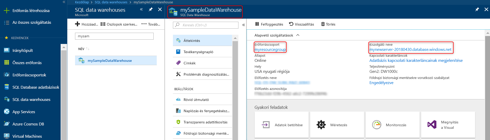

# <a name="quickstart-pause-and-resume-compute-in-azure-sql-data-warehouse-with-powershell"></a>Gyors útmutató: Szünet és folytatás számítási az Azure SQL Data Warehouse a PowerShell-lel
PowerShell-lel történő szüneteltetése compute az Azure SQL Data Warehouse költségek csökkentése érdekében. [Folytathatja a számítást](sql-data-warehouse-manage-compute-overview.md) Ha készen áll az adattárház használata.

Ha nem rendelkezik Azure-előfizetéssel, első lépésként mindössze néhány perc alatt létrehozhat egy [ingyenes](https://azure.microsoft.com/free/) fiókot.

Az oktatóanyaghoz az Azure PowerShell-modul 5.1.1-es vagy újabb verziója szükséges. A jelenleg rendelkezésére álló verzió azonosításához futtassa a következőt: ` Get-Module -ListAvailable AzureRM`. Ha telepíteni vagy frissíteni szeretne, olvassa el [az Azure PowerShell-modul telepítését](/powershell/azure/install-azurerm-ps) ismertető cikket.

## <a name="before-you-begin"></a>Előkészületek

Ez a rövid útmutató feltételezi, hogy már rendelkezik egy SQL data warehouse, amely akkor szüneteltetéséről és folytatásáról. Ha szeretne létrehozni egyet, akkor használhatja [létrehozás és csatlakozás – portál](create-data-warehouse-portal.md) nevű adattárház létrehozásához **mySampleDataWarehouse**.

## <a name="log-in-to-azure"></a>Jelentkezzen be az Azure-ba

Jelentkezzen be az Azure-előfizetésbe a [Connect-AzureRmAccount](/powershell/module/azurerm.profile/connect-azurermaccount) parancs használatával, és kövesse a képernyőn megjelenő útmutatást.

```powershell
Connect-AzureRmAccount
```

A használt előfizetés megtekintéséhez futtassa a [Get-AzureRmSubscription](/powershell/module/azurerm.profile/get-azurermsubscription) parancsot.

```powershell
Get-AzureRmSubscription
```

Ha szeretne egy másik előfizetést, mint az alapértelmezett, futtassa [Set-AzureRmContext](/powershell/module/azurerm.profile/set-azurermcontext).

```powershell
Set-AzureRmContext -SubscriptionName "MySubscription"
```

## <a name="look-up-data-warehouse-information"></a>Adattárház-információk megkeresése

Keresse meg a felfüggeszteni és folytatni tervezett adattárházhoz tartozó adatbázis nevét, a kiszolgáló nevét és az erőforráscsoportot.

Keresse meg adattárháza helyinformációit ezekkel lépésekkel.

1. Jelentkezzen be az [Azure Portalra](https://portal.azure.com/).
2. Az Azure Portal bal oldali paneljén kattintson az **SQL-adatbázisok** elemre.
3. Az **SQL-adatbázisok** lapon jelölje ki a **mySampleDataWarehouse** elemet. Ekkor megnyílik az adattárház.

    

4. Jegyezze fel az adatraktár-nevét, amely az adatbázis neve. Írja fel a kiszolgáló nevét és az erőforráscsoportot is. Ön
5.  Ezek a szünet és folytatás parancsokban.
6. Ha a kiszolgáló valami.database.windows.net, csak az első részt használja kiszolgálónévként a PowerShell-parancsmagokban. A fenti ábrán a teljes kiszolgálónév newserver-20171113.database.windows.net. Az utótag dobja el, és használja **newserver-20171113** a PowerShell-parancsmagot a kiszolgálónevet.

## <a name="pause-compute"></a>Számítás szüneteltetése
Költségek csökkentése érdekében is szüneteltetése és folytatása a számítási erőforrások igény szerinti. Például ha az adatbázis nem használ, az éjszaka és hétvégén, is szüneteltetheti, ilyen alkalmakkor, és folytathatja a nap folyamán. Nem jár költséggel a számítási erőforrásokat, miközben az adatbázis fel van függesztve. Azonban továbbra is tárolásért kell fizetnie.

Egy adatbázis szüneteltetése, használja a [Suspend-AzureRmSqlDatabase](/powershell/module/azurerm.sql/suspend-azurermsqldatabase) parancsmagot. A következő példa leállítja nevű adattárház **mySampleDataWarehouse** nevű kiszolgálón található **newserver-20171113**. A kiszolgáló része egy Azure-erőforráscsoportot **myResourceGroup**.


```Powershell
Suspend-AzureRmSqlDatabase –ResourceGroupName "myResourceGroup" `
–ServerName "newserver-20171113" –DatabaseName "mySampleDataWarehouse"
```

Egy módosított névvel, a következő példa kérdezi le az adatbázist a $database objektumba. Ezt követően átadja a kívánt objektum [Suspend-AzureRmSqlDatabase](/powershell/module/azurerm.sql/suspend-azurermsqldatabase). Az eredmények tárolása az objektum resultDatabase. A végső parancs megjeleníti az eredményeket.

```Powershell
$database = Get-AzureRmSqlDatabase –ResourceGroupName "myResourceGroup" `
–ServerName "newserver-20171113" –DatabaseName "mySampleDataWarehouse"
$resultDatabase = $database | Suspend-AzureRmSqlDatabase
$resultDatabase
```


## <a name="resume-compute"></a>Számítási folytatása
Egy adatbázis indításához használja a [Resume-AzureRmSqlDatabase](/powershell/module/azurerm.sql/resume-azurermsqldatabase) parancsmagot. A következő példa elindítja a mySampleDataWarehouse nevű newserver-20171113 tartományban található, a kiszolgálón futtatott nevű adatbázis. A kiszolgáló van egy myResourceGroup nevű Azure-erőforráscsoportot.

```Powershell
Resume-AzureRmSqlDatabase –ResourceGroupName "myResourceGroup" `
–ServerName "newserver-20171113" -DatabaseName "mySampleDataWarehouse"
```

Egy módosított névvel, a következő példa kérdezi le az adatbázist a $database objektumba. Ezt követően átadja a kívánt objektum [Resume-AzureRmSqlDatabase](/powershell/module/azurerm.sql/resume-azurermsqldatabase) és $resultDatabase tárolja az eredményeket. A végső parancs megjeleníti az eredményeket.

```Powershell
$database = Get-AzureRmSqlDatabase –ResourceGroupName "ResourceGroup1" `
–ServerName "Server01" –DatabaseName "Database02"
$resultDatabase = $database | Resume-AzureRmSqlDatabase
$resultDatabase
```

## <a name="clean-up-resources"></a>Az erőforrások eltávolítása

Az adattárházegységek és az adattárházban tárolt adatok díjkötelesek. Ezek a számítási és tárolási erőforrások elkülönítve lesznek kiszámlázva.

- Ha szeretné megőrizni az adatokat a tárolás, számítás szüneteltetésére.
- Ha szeretné megelőzni a jövőbeli kiadásokat, az adattárházat törölheti is.

Kövesse az alábbi lépéseket a fölöslegessé vált erőforrások eltávolítására.

1. Jelentkezzen be a [az Azure portal](https://portal.azure.com), és kattintson az adattárházra.

    

1. A számítási erőforrások szüneteltetéshez kattintson a **Szüneteltetés** gombra. Ha az adattárház szüneteltetve van, az **Indítás** gomb látható.  A számítási erőforrások újraindításához kattintson az **Indítás** gombra.

2. Ha el szeretné távolítani az adattárházat, hogy a számítási és tárolási erőforrásokért se kelljen fizetnie, kattintson a **Törlés** parancsra.

3. A létrehozott SQL-kiszolgáló eltávolításához kattintson **mynewserver-20171113.database.windows.net**, és kattintson a **törlése**.  A törléssel bánjon óvatosan, mivel a kiszolgálóval együtt a hozzá rendelt összes adatbázis is törölve lesz.

4. Az erőforráscsoport törléséhez kattintson a **myResourceGroup** elemre, majd az **Erőforráscsoport törlése** parancsra.


## <a name="next-steps"></a>További lépések
Most fel van függesztve, és az adatraktár számítási folytatódik. Ha bővebb információra van szüksége az Azure SQL Data Warehouse-zal kapcsolatban, folytassa az adatok betöltésével foglalkozó oktatóanyaggal.

> [!div class="nextstepaction"]
>[Adatok betöltése az SQL Data Warehouse-okba](load-data-from-azure-blob-storage-using-polybase.md)
