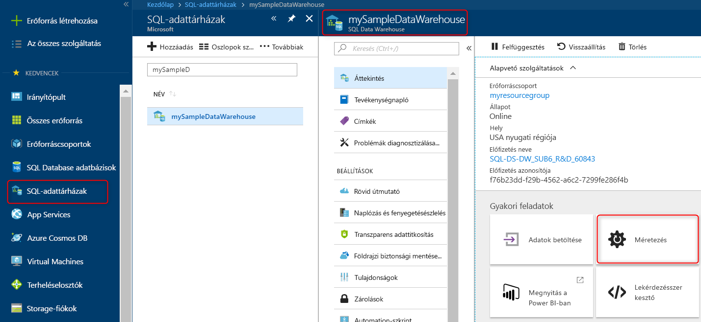

# Gyors útmutató: Azure SQL Data Warehouse-beli számítási bővítés az Azure Portalon

Azure SQL Data Warehouse-beli számítási bővítés az Azure Portalon. [Bővítéssel](sql-data-warehouse-manage-compute-overview.md) a számítások teljesítménye növelhető, szűkítéssel a költségek csökkenthetők. 

Ha nem rendelkezik Azure-előfizetéssel, első lépésként mindössze néhány perc alatt létrehozhat egy [ingyenes](https://azure.microsoft.com/free/) fiókot.

## Jelentkezzen be az Azure Portalra

Jelentkezzen be az [Azure Portalra](https://portal.azure.com/).

## Előkészületek

Méretezhet egy meglévő adattárházat, vagy létrehozhat egy **mySampleDataWarehouse** nevű adattárházat a [Létrehozás és csatlakozás – portál](create-data-warehouse-portal.md) útmutató követésével.  A jelen gyors útmutató a **mySampleDataWarehouse** nevű adattárház méretezését mutatja be.

## Számítások méretezése

Az SQL Data Warehouse-ban növelheti vagy csökkentheti a számítási erőforrásokat az adattárházegységek számának módosításával. A [Létrehozás és csatlakozás – portál](create-data-warehouse-portal.md) gyorsútmutató létrehozta a **mySampleDataWarehouse** adattárházat, és inicializálta azt 400 adattárházegységgel. Az alábbi lépésekkel módosíthatja a **mySampleDataWarehouse** adattárházban az adattárházegységek számát.

Az adattárházegységek számának módosításához:

1. Az Azure Portal bal oldali paneljén kattintson az **SQL-adatbázisok** elemre.
2. Az **SQL-adatbázisok** lapon jelölje ki a **mySampleDataWarehouse** elemet. Ekkor megnyílik az adattárház.
3. Kattintson **Méretezés** lehetőségre.

    

2. A Méretezés panelen húzza a csúszkát balra vagy jobbra az adattárházegységek (DWU-k) beállításának módosításához.

    

3. Kattintson a **Save** (Mentés) gombra. Ekkor megjelenik egy megerősítő üzenet. Kattintson az **igen** gombra a megerősítéshez vagy a **nem** gombra az elvetéshez.

    

## További lépések
Ebből az útmutatóból megtudhatta, hogyan tudja méterezni egy adattárház számítási kapacitását. Ha bővebb információra van szüksége az Azure SQL Data Warehouse-zal kapcsolatban, folytassa az adatok betöltésével foglalkozó oktatóanyaggal.

> [!div class="nextstepaction"]
>[Adatok betöltése az SQL Data Warehouse-okba](load-data-from-azure-blob-storage-using-polybase.md)
