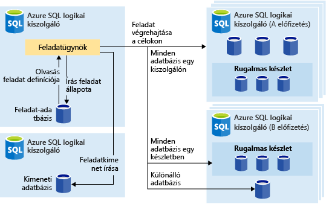
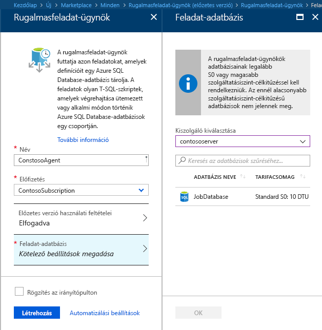
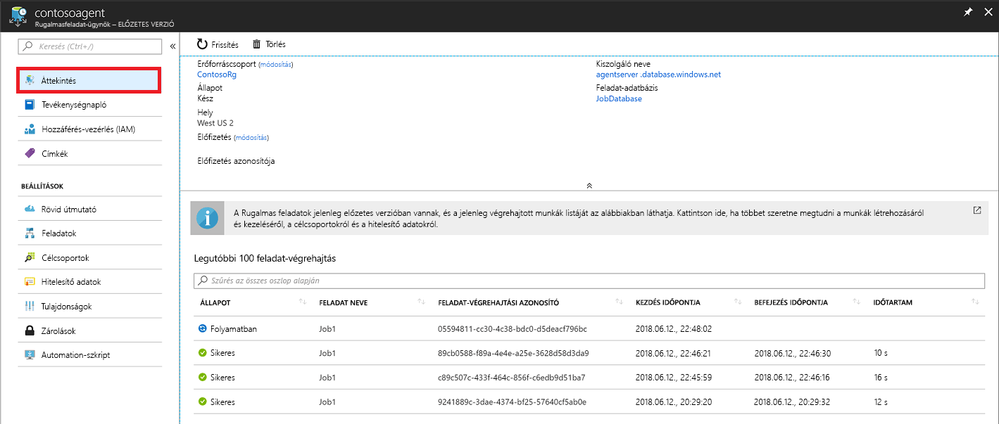
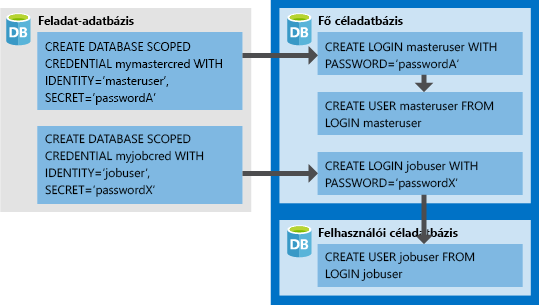

# <a name="manage-groups-of-databases-with-elastic-database-jobs"></a>Adatbáziscsoportok kezelése rugalmas adatbázis-feladatokkal

**Rugalmas adatbázis-feladatok** segítségével egy vagy több T-SQL-szkriptet párhuzamosan, nagy számú adatbázison, ütemezve vagy igény szerint futtathat.

**Adatbázisok bármilyen kombinációján futtathat feladatokat**: egy vagy több különálló adatbázison, egy kiszolgáló összes adatbázisán, egy rugalmas készletben található összes adatbázison vagy egy szegmenstérképen – ráadásul a további rugalmasság érdekében adott adatbázisokat is bevonhat vagy kizárhat. **A feladatok több kiszolgálón, több készleten, vagy akár különböző előfizetésekhez tartozó adatbázisokon is futtathatók.** A kiszolgálókat és készleteket a rendszer futásidőben dinamikusan veszi számba, ezért a feladatok az összes olyan adatbázison futnak, amelyek a célcsoportban a végrehajtáskor megtalálhatók.

Az alábbi képen egy feladatügynök látható, amely különböző típusú célcsoportokon hajt végre feladatokat:




## <a name="why-use-elastic-jobs"></a>Miért érdemes rugalmas feladatokat használni?

### <a name="manage-many-databases"></a>Több adatbázist kezelhet

- Az adminisztratív feladatok futtatását hétköznapokra, munkaidő utánra stb. ütemezheti.
- Üzembe helyezhet sémamódosításokat, kezelheti a hitelesítő adatokat, teljesítményadatokat vagy bérlői (ügyfél-) telemetriát gyűjthet. Frissítheti a referenciaadatokat (az összes adatbázis által közösen használt információkat).
- Az indexek újraépítésével javíthatja a lekérdezési teljesítményt. Úgy konfigurálhatja a feladatokat, hogy a rendszer egy adott adatbázis-gyűjteményen rendszeres időközönként hajtsa őket végre, például csúcsidőn kívül.
- A lekérdezési adatokat az adatbázis-készletekből folyamatosan egy központi táblába gyűjtheti. A teljesítménylekérdezések folyamatosan végrehajthatók, illetve konfigurálhatók úgy, hogy további végrehajtandó feladatokat indítsanak el.

### <a name="collect-data-for-reporting"></a>Adatokat gyűjthet jelentéskészítéshez

- Összesítheti az Azure SQL Database-adatbázisok egy gyűjteményéből származó adatokat egy céltáblában.
- Olyan hosszabban futó adatfeldolgozási lekérdezéseket hajthat végre nagy adatbáziskészleteken, amilyen például az ügyfél-telemetria gyűjtése. A rendszer az eredményeket egyetlen céltáblában gyűjti össze a további elemzéshez.

### <a name="reduce-overhead"></a>Csökkentheti a többletterhelést

- Általában mindegyik adatbázist függetlenül kell csatlakoztatnia, hogy Transact-SQL utasításokat futtasson vagy egyéb adminisztratív feladatokat hajtson végre. Egy feladat kezeli a bejelentkezéseket egy célcsoport összes adatbázisába. Emellett meghatározhat, fenntarthat és megőrizhet Transact-SQL-szkripteket, amelyeket Azure SQL Database-adatbázisok egy csoportján futtat.

### <a name="accounting"></a>Könyvelés

- A feladatok naplózzák az egyes adatbázisokhoz kötődő végrehajtások állapotát. Hiba esetén a rendszer automatikusan újrapróbálkozik.

### <a name="flexibility"></a>Rugalmasság

- Meghatározhatja Azure SQL Database-adatbázisok egyéni csoportjait, valamint a feladatok futtatásának ütemezését.


## <a name="elastic-job-components"></a>Rugalmas feladat összetevői

|Összetevő  | Leírás (további részletek a táblázat alatt találhatók) |
|---------|---------|
|[**Rugalmas feladat ügynöke**](#elastic-job-agent) |  Az az Azure-erőforrás, amelyet a feladatok futtatására és kezelésére hoz létre.   |
|[**Feladat-adatbázis**](#job-database)    |    A feladatügynök által a feladatadatok, a feladatdefiníciók és egyebek tárolására használt Azure SQL Database.      |
|[**Célcsoport**](#target-group)      |  Azon kiszolgálók, készletek, adatbázisok és szegmenstérképek, amelyeken egy feladatot kíván futtatni.       |
|[**Feladat**](#job)  |  A feladatok egy vagy több [feladatlépésből](#job-step) álló munkaegységek. A feladatlépések meghatározzák a futtatandó T-SQL-szkriptet, valamint a szkript végrehajtásához szükséges egyéb részleteket.  |


### <a name="elastic-job-agent"></a>Rugalmas feladat ügynöke

A rugalmasfeladat-ügynök a feladatok létrehozásához, futtatásához és kezeléséhez használt Azure-erőforrás. A rugalmasfeladat-ügynök egy Azure-erőforrás, amelyet a portálon hozhat létre (a [PowerShell](elastic-jobs-powershell.md) és a REST is támogatott). 

**Rugalmasfeladat-ügynök** létrehozásához szükség van egy meglévő SQL-adatbázisra. Az ügynök [*feladat-adatbázisként*](#job-database) konfigurálja a meglévő adatbázist.

A rugalmasfeladat-ügynök használata ingyenes. A feladat-adatbázis díjszabása megegyezik bármely más SQL-adatbáziséval.

### <a name="job-database"></a>Feladat-adatbázis

A *feladat-adatbázis* feladatok meghatározására, valamint a feladat-végrehajtások állapotának és előzményeinek nyomon követésére szolgál. A *feladat-adatbázis* emellett az ügynökmetaadatok, a naplók, az eredmények és a feladatdefiníciók tárolására is szolgál, valamint számos hasznos tárolt eljárást és más adatbázis-objektumokat tartalmaz a feladatok T-SQL használatával történő létrehozásához, futtatásához és kezeléséhez.

A jelenlegi előzetes verzióban egy meglévő (S0 vagy magasabb szintű) Azure SQL Database szükséges a rugalmasfeladat-ügynök létrehozásához.

A *feladat-adatbázisnak* nem kell feltétlenül újnak lennie, azonban fontos, hogy üres legyen, és S0 vagy magasabb szolgáltatásszinten működjön. A *feladat-adatbázis* javasolt szolgáltatásszintje S1 vagy magasabb, ez azonban függ a feladat(ok) teljesítményigényétől, a feladatlépések számától, valamint feladatok futtatásának számától és gyakoriságától. Például egy S0 szintű adatbázis elegendő lehet egy óránként mindössze néhány feladatot futtató feladatügynök számára, percenként futtatott feladatok esetén azonban előfordulhat, hogy ez a teljesítmény nem elegendő, és érdemes magasabb szolgáltatásszintet választani.


#### <a name="job-database-permissions"></a>Feladat-adatbázis engedélyei

Feladatügynök létrehozásakor a séma, a táblák és a *jobs_reader* nevű szerepkör a *feladat-adatbázisban* jön létre. A szerepkör a következő engedéllyel jön létre, és célja, hogy részletesebb hozzáférés-vezérlést biztosítson a rendszergazdák számára a feladatok monitorozásához:


|Szerepkörnév  |'jobs' sémaengedélyek  |'jobs_internal' sémaengedélyek  |
|---------|---------|---------|
|**jobs_reader**     |    SELECT     |    None     |

> [!IMPORTANT]
> Mielőtt adatbázis-rendszergazdaként hozzáférést biztosítana a *feladat-adatbázishoz*, fontolja meg a lehetséges biztonsági következményeket. A feladatok létrehozásához és szerkesztéséhez szükséges engedélyekkel rendelkező rosszindulatú felhasználó létrehozhat vagy szerkeszthet egy olyan feladatot, amely tárolt hitelesítő adattal csatlakozik a rosszindulatú felhasználó által vezérelt adatbázishoz, ezáltal a felhasználó meghatározhatja a hitelesítő adathoz tartozó jelszót.


### <a name="target-group"></a>Célcsoport

A *célcsoport* határozza meg az azokat az adatbázisokat, amelyeket az adott feladatlépés végre lesz hajtva. A célcsoport tetszőleges számban és kombinációban tartalmazhatja a következőket:

- **Azure SQL Server** – Ha meg van adva egy kiszolgáló, a feladat végrehajtásának időpontjában a kiszolgálón található összes adatbázis a csoport része lesz. A master adatbázis hitelesítő adatait meg kell adni ahhoz, hogy a csoportot a rendszer a feladat végrehajtása előtt számba vegye és frissítse.
- **Rugalmas készlet** – Ha meg van adva egy rugalmas készlet, a feladat végrehajtásának időpontjában a rugalmas készletben található összes adatbázis a csoport tagja lesz. Kiszolgáló esetén a master adatbázis hitelesítő adatait meg kell adni ahhoz, hogy a csoport a feladat futtatása előtt frissíthető legyen.
- **Önálló adatbázis** – adjon meg egy vagy több egyedi adatbázist, amelyet a csoport részévé kíván tenni.
- **Szegmenstérkép** – egy szegmenstérkép adatbázisai.

> [!TIP]
> A feladat végrehajtásakor a *dinamikus számbavételezés* újra kiértékeli a célcsoportokban található adatbázisokat, amelyek kiszolgálókat és készletet is tartalmaznak. A dinamikus számbavételezéssel biztosítható, hogy **a feladatok a feladat végrehajtásakor a kiszolgálón vagy a készletben létező összes adatbázison fussanak**. Az adatbázisok listájának futásidőben történő ismételt kiértékelése különösen hasznos olyan esetekben, amikor a készlet- vagy a kiszolgálótagság gyakran változik.


A készletek és az önálló adatbázisok megadhatók úgy, hogy a csoport részét képezzék vagy ki legyenek zárva a csoportból. Ez lehetővé teszi, hogy az adatbázisok tetszőleges kombinációjából hozzon létre céladatbázist. Hozzáadhat például egy kiszolgálót egy céladatbázishoz, miközben kizárja egy rugalmas készlet egyes adatbázisait (vagy egy egész rugalmas készletet).

A célcsoportok több előfizetésből és több régióból származó adatbázisokat is tartalmazhatnak. Vegye figyelembe, hogy a régiók közötti végrehajtás magasabb késéssel jár, mint a régión belüli.


### <a name="job"></a>Feladat

A *feladatok* ütemezetten vagy egyszeri feladatként végrehajtható munkaegységek. Egy feladat egy vagy több *feladatlépésből* áll.

#### <a name="job-step"></a>Feladatlépés

Minden feladatlépés meghatároz egy végrehajtandó T-SQL-szkriptet, egy vagy több célcsoportot, amelyen a T-SQL-szkript futtatható és a feladatügynök számára a céladatbázishoz történő csatlakozáshoz szükséges hitelesítő adatokat. Minden feladatlépés testreszabható időtúllépési és újrapróbálkozási szabályzattal és választhatóan megadható kimeneti paraméterekkel rendelkezik.

#### <a name="job-output"></a>Feladat kimenete

A feladatok lépéseinek eredménye részletesen rögzítve lesz az egyes adatbázisokon, a szkript kimenete pedig a megadott táblában. Megadhat egy adatbázist a feladat által visszaadott adatok tárolásához.

#### <a name="job-history"></a>Feladatelőzmények

A feladatok futtatásának előzményeit a rendszer a *feladat-adatbázisban* tárolja. A rendszertisztítási feladat törli a 45 napnál régebbi végrehajtási előzményeket. A 45 napnál nem régebbi előzmények törléséhez hívja meg az **sp_purge_history** tárolt eljárást a *feladat-adatbázisban*.

## <a name="workflow-to-create-configure-and-manage-jobs"></a>Feladatok létrehozásának, konfigurálásának és kezelésének munkafolyamata

### <a name="create-and-configure-the-agent"></a>Az ügynök létrehozása és konfigurálása

1. Hozzon létre vagy azonosítson egy üres, S0 vagy magasabb szintű SQL-adatbázist. A rendszer ezt fogja *feladat-adatbázisként* használni a rugalmasfeladat-ügynök létrehozásakor.
2. Hozzon létre egy rugalmasfeladat-ügynököt a [portál](https://portal.azure.com/#create/Microsoft.SQLElasticJobAgent) vagy a [PowerShell](elastic-jobs-powershell.md#create-the-elastic-job-agent) használatával.

   

### <a name="create-run-and-manage-jobs"></a>Feladatok létrehozása, futtatása és kezelése

1. Hozzon létre egy hitelesítő adatot a feladat végrehajtásához a *feladat-adatbázisban* a [PowerShell](elastic-jobs-powershell.md#create-job-credentials-so-that-jobs-can-execute-scripts-on-its-targets) vagy a [T-SQL](elastic-jobs-tsql.md#create-a-credential-for-job-execution) használatával.
2. Határozza meg a célcsoportot (az adatbázisokat, amelyeken a feladatot futtatni szeretné) a [PowerShell](elastic-jobs-powershell.md#define-the-target-databases-you-want-to-run-the-job-against) vagy a [T-SQL](elastic-jobs-tsql.md#create-a-target-group-servers) használatával.
3. Hozzon létre feladatügynök-hitelesítő adatokat minden adatbázisban, ahol a feladat futni fog [(adja hozzá a felhasználót (vagy a szerepkört) a csoport minden adatbázisához)](https://docs.microsoft.com/azure/sql-database/sql-database-control-access). Példaként tekintse meg a [PowerShell-oktatóanyagot](elastic-jobs-powershell.md#create-job-credentials-so-that-jobs-can-execute-scripts-on-its-targets).
4. Hozzon létre egy feladatot a [PowerShell](elastic-jobs-powershell.md#create-a-job) vagy a [T-SQL](elastic-jobs-tsql.md#deploy-new-schema-to-many-databases) használatával.
5. Adjon hozzá feladatlépéseket a [PowerShell](elastic-jobs-powershell.md#create-a-job-step) vagy a [T-SQL](elastic-jobs-tsql.md#deploy-new-schema-to-many-databases) használatával.
6. Futtasson egy feladatot a [PowerShell](elastic-jobs-powershell.md#run-the-job) vagy a [T-SQL](elastic-jobs-tsql.md#begin-ad-hoc-execution-of-a-job) használatával.
7. Monitorozza a feladatvégrehajtás állapotát a portál, a [PowerShell](elastic-jobs-powershell.md#monitor-status-of-job-executions) vagy a [T-SQL](elastic-jobs-tsql.md#monitor-job-execution-status) használatával.

   

## <a name="credentials-for-running-jobs"></a>A feladatok futtatásához használt hitelesítő adatok

A feladatok [adatbázishoz kötődő hitelesítő adatokat](/sql/t-sql/statements/create-database-scoped-credential-transact-sql) használnak a célcsoport által végrehajtáskor meghatározott adatbázisokhoz történő csatlakozáshoz. Ha egy célcsoport kiszolgálókat vagy készleteket tartalmaz, az adatbázishoz kötődő hitelesítő adatokat a rendszer a master adatbázishoz történő csatlakozáshoz használja az elérhető adatbázisok számbavétele céljából.

Lehetséges, hogy a feladatfuttatáshoz szükséges megfelelő hitelesítő adatok beállítása nem egyértelmű, ezért tartsa szem előtt a következőket:

- Az adatbázishoz kötődő hitelesítő adatokat a *feladat-adatbázisban* kell létrehozni.
- **A feladat sikeres befejezéséhez minden céladatbázisnak rendelkeznie kell egy [megfelelő engedélyeket](https://docs.microsoft.com/sql/relational-databases/security/permissions-database-engine) tartalmazó bejelentkezési hozzáféréssel** (az alábbi ábrán ez a jobuser).
- A hitelesítő adatok más feladatokban is felhasználhatók, a jelszavakat pedig titkosítva, biztonságosan tárolja a rendszer, hogy a feladatobjektumokhoz csak olvasási jogosultsággal rendelkező felhasználók ne férhessenek hozzájuk.

Az alábbi kép segítséget nyújt a megfelelő hitelesítő adatok megértéséhez és beállításához. **Ne feledje létrehozni a felhasználót minden olyan adatbázisban (minden *célként megjelölt felhasználói adatbázisban*), ahol a feladatot futtatni szeretné**.



## <a name="security-best-practices"></a>Ajánlott biztonsági eljárások

Néhány megfontolandó ajánlott eljárás a rugalmas feladatokkal végzett munkához:

- Az API-k felhasználását korlátozza megbízható személyekre.
- A hitelesítő adatok a feladatlépés végrehajtásához szükséges minimális engedélyekkel rendelkezzenek. További tudnivalókat az [engedélyezés és az engedélyek az SQL-kiszolgálón való használatát](https://docs.microsoft.com/dotnet/framework/data/adonet/sql/authorization-and-permissions-in-sql-server) ismertető cikkben olvashat.
- Kiszolgáló és/vagy készlet célcsoport használatakor javasoljuk, hogy hozzon létre külön, a master adatbázison jogosultságokkal rendelkező hitelesítő adatot azon adatbázisok megtekintéséhez/listázásához, amely a feladat végrehajtása előtt a kiszolgáló(k) és/vagy készlet(ek) adatbázislistáinak kibontásához lesz használva.


## <a name="agent-performance-capacity-and-limitations"></a>Az ügynök teljesítménye, kapacitása és korlátai

A rugalmas feladatok minimális számítási erőforrást használnak, amíg a hosszan futó feladatok befejezésére várakoznak.

Az adatbázisok célcsoportjának méretétől és az adott feladat kívánt végrehajtási idejétől (az egyidejű feldolgozók számától) függően az ügynök különböző mértékű számítási kapacitást és teljesítményt igényel a *feladat-adatbázis* részéről (több cél és több feladat esetén nagyobb számítási kapacitás szükséges).

Jelenleg az előzetes verzió 100 feladat egyidejű futtatására képes.

### <a name="prevent-jobs-from-reducing-target-database-performance"></a>A feladatok a céladatbázis teljesítményét csökkentő hatásának megakadályozása

Ha szeretné elkerülni, hogy az erőforrások túlterheltek legyenek egy rugalmas SQL-készlet adatbázisain történő feladatvégrehajtás közben, akkor a feladatok esetén konfigurálhatja, hogy azok egyszerre legfeljebb hány adatbázison futhatnak.

##  <a name="differences-between-elastic-jobs-and-sql-server-agent"></a>Különbségek a rugalmas feladatok és az SQL Server Agent között

Fontos kiemelnünk néhány eltérést az SQL Server Agent (amely a helyszínen, valamint a felügyelt SQL Database-példány részeként érhető el) és az Azure SQL Database rugalmasfeladat-ügynöke között (amely jelenleg az SQL Database-hez és az SQL Data Warehouse-hoz érhető el).


|  |Rugalmas feladatok  |SQL Server Agent |
|---------|---------|---------|
|Hatókör     |  Tetszőleges számú Azure SQL Database és/vagy Data Warehouse egy Azure-felhőben, amely feladatügynökként működik. A célok lehetnek különböző logikai kiszolgálókon, előfizetésekben és/vagy régiókban. <br><br>A célcsoportok állhatnak egyedi adatbázisokból vagy adattárházakból, illetve egy kiszolgáló, készlet vagy szegmenstérkép összes adatbázisából is állhatnak (a feladat futásidejében dinamikusan számba véve). | Bármely önálló adatbázis az SQL-ügynökével azonos SQL Server-példányban. |
|Támogatott API-k és eszközök     |  Portál, PowerShell, T-SQL, Azure Resource Manager      |   T-SQL, SQL Server Management Studio (SSMS)     |


## <a name="best-practices-for-creating-jobs"></a>Ajánlott eljárások feladatok létrehozásához

### <a name="idempotent-scripts"></a>Idempotens szkriptek
A feladatok T-SQL-szkriptjeinek [idempotensnek](https://en.wikipedia.org/wiki/Idempotence) kell lenniük. Az **idempotens** azt jelenti, hogy a sikeres szkript újrafuttatása esetén ugyanaz az eredmény várható. A szkript végrehajtása átmeneti hálózati problémák következtében meghiúsulhat. Ebben az esetben a feladat automatikusan újrapróbálkozik, és a megadott számú alkalommal ismételten futtatja a szkriptet, mielőtt feladná azt. Az idempotens szkriptek akkor is azonos eredménnyel járnak, ha már két (vagy több) alkalommal sikeresen futottak.

A legegyszerűbb módszer, ha ellenőrzi az objektum meglétét, mielőtt létrehozná.


```sql
IF NOT EXIST (some_object)
    -- Create the object
    -- If it exists, drop the object before recreating it.
```

Ehhez hasonlóan a szkriptnek sikeresen végrehajthatónak kell lennie az észlelt feltételek logikai tesztelése és azokkal ellentétes műveletek révén.


## <a name="next-steps"></a>További lépések

- [Rugalmas feladatok létrehozása és kezelése a PowerShell használatával](elastic-jobs-powershell.md)
- [Rugalmas feladatok létrehozása és kezelése a Transact-SQL (T-SQL) használatával](elastic-jobs-tsql.md)