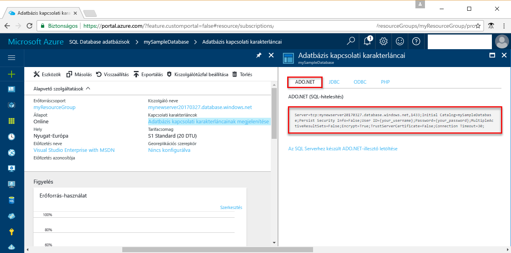

# <a name="use-net-core-c-to-query-an-azure-sql-database"></a>A .NET Core (C#) használata Azure SQL Database-adatbázisok lekérdezéséhez

Ez a rövid útmutató ismerteti, hogyan használható a [.NET](https://www.microsoft.com/net/) Core olyan C#-program létrehozásához Windows/Linux/macOS-gépeken, amely egy Azure SQL Database-adatbázishoz csatlakozik, és hogyan lehet Transact-SQL-utasításokkal adatokat lekérdezni.

## <a name="prerequisites"></a>Előfeltételek

A rövid útmutató elvégzéséhez győződjön meg arról, hogy rendelkezik az alábbiakkal:

[!INCLUDE [prerequisites-create-db](../../includes/sql-database-connect-query-prerequisites-create-db-includes.md)]

- A rövid útmutatóhoz használt számítógép nyilvános IP-címére vonatkozó [kiszolgálószintű tűzfalszabály](sql-database-get-started-portal.md#create-a-server-level-firewall-rule).

- Telepítette az [az operációs rendszerének megfelelő .NET Core-t](https://www.microsoft.com/net/core). 

## <a name="sql-server-connection-information"></a>Az SQL-kiszolgáló kapcsolatadatai

[!INCLUDE [prerequisites-server-connection-info](../../includes/sql-database-connect-query-prerequisites-server-connection-info-includes.md)]

#### <a name="for-adonet"></a>ADO.NET esetén

1. A folytatáshoz kattintson az **Adatbázis-kapcsolati karakterláncok megjelenítése** elemre.

2. Tekintse át az **ADO.NET** teljes kapcsolati karakterláncát.

    

> [!IMPORTANT]
> Rendelkeznie kell egy tűzfalszabállyal azon számítógép nyilvános IP-címéhez, amelyen ezt az oktatóanyagot elvégzi. Ha más számítógépet használ, vagy más nyilvános IP-címe van, hozzon létre egy [kiszolgálószintű tűzfalszabályt az Azure Portalon](sql-database-get-started-portal.md#create-a-server-level-firewall-rule). 
>
  
## <a name="create-a-new-net-project"></a>Új .NET-projekt létrehozása

1. Nyisson meg egy parancssort, és hozzon létre egy *sqltest* nevű mappát. Keresse meg a létrehozott mappát, és futtassa a következő parancsot:

    ```
    dotnet new console
    ```

2. Nyissa meg az ***sqltest.csproj*** fájlt egy tetszőleges szövegszerkesztővel, és adja hozzá a System.Data.SqlClient elemet függőségként a következő kóddal:

    ```xml
    <ItemGroup>
        <PackageReference Include="System.Data.SqlClient" Version="4.4.0" />
    </ItemGroup>
    ```

## <a name="insert-code-to-query-sql-database"></a>Kód beszúrása SQL-adatbázis lekérdezéséhez

1. A fejlesztői környezetben vagy egy tetszőleges szövegszerkesztőben nyissa meg a **Program.cs** fájlt.

2. Cserélje le a tartalmat a következő kódra, és adja meg a kiszolgáló és az adatbázis megfelelő adatait, valamint a felhasználót és a jelszót.

```csharp
using System;
using System.Data.SqlClient;
using System.Text;

namespace sqltest
{
    class Program
    {
        static void Main(string[] args)
        {
            try 
            { 
                SqlConnectionStringBuilder builder = new SqlConnectionStringBuilder();
                builder.DataSource = "your_server.database.windows.net"; 
                builder.UserID = "your_user";            
                builder.Password = "your_password";     
                builder.InitialCatalog = "your_database";

                using (SqlConnection connection = new SqlConnection(builder.ConnectionString))
                {
                    Console.WriteLine("\nQuery data example:");
                    Console.WriteLine("=========================================\n");
                    
                    connection.Open();       
                    StringBuilder sb = new StringBuilder();
                    sb.Append("SELECT TOP 20 pc.Name as CategoryName, p.name as ProductName ");
                    sb.Append("FROM [SalesLT].[ProductCategory] pc ");
                    sb.Append("JOIN [SalesLT].[Product] p ");
                    sb.Append("ON pc.productcategoryid = p.productcategoryid;");
                    String sql = sb.ToString();

                    using (SqlCommand command = new SqlCommand(sql, connection))
                    {
                        using (SqlDataReader reader = command.ExecuteReader())
                        {
                            while (reader.Read())
                            {
                                Console.WriteLine("{0} {1}", reader.GetString(0), reader.GetString(1));
                            }
                        }
                    }                    
                }
            }
            catch (SqlException e)
            {
                Console.WriteLine(e.ToString());
            }
            Console.ReadLine();
        }
    }
}
```

## <a name="run-the-code"></a>A kód futtatása

1. Futtassa az alábbi parancsokat a parancssorban:

   ```csharp
   dotnet restore
   dotnet run
   ```

2. Győződjön meg arról, hogy a parancssori felület visszaadta az első 20 sort, majd zárja be az alkalmazásablakot.


## <a name="next-steps"></a>További lépések

- [Bevezetés a .NET Core használatába Windows/Linux/macOS rendszeren a parancssorral](/dotnet/core/tutorials/using-with-xplat-cli).
- További információ [az Azure SQL Database-adatbázisokhoz való csatlakozásról és a lekérdezésükről a .NET-keretrendszer és a Visual Studio használatával](sql-database-connect-query-dotnet-visual-studio.md).  
- További információ [az első Azure SQL Database-adatbázisának SSMS-sel való megtervezéséről](sql-database-design-first-database.md) és [az első Azure SQL Database-adatbázisának .NET-tel való megtervezéséről](sql-database-design-first-database-csharp.md).
- A .NET-ről a [.NET dokumentációjában](https://docs.microsoft.com/dotnet/) talál további információt.
