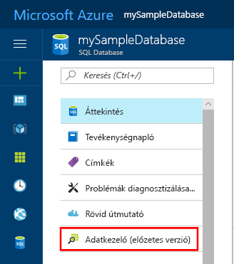
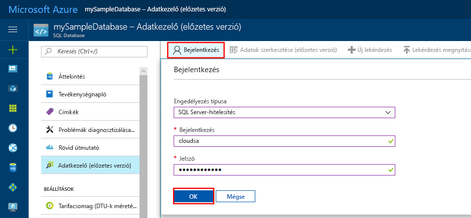
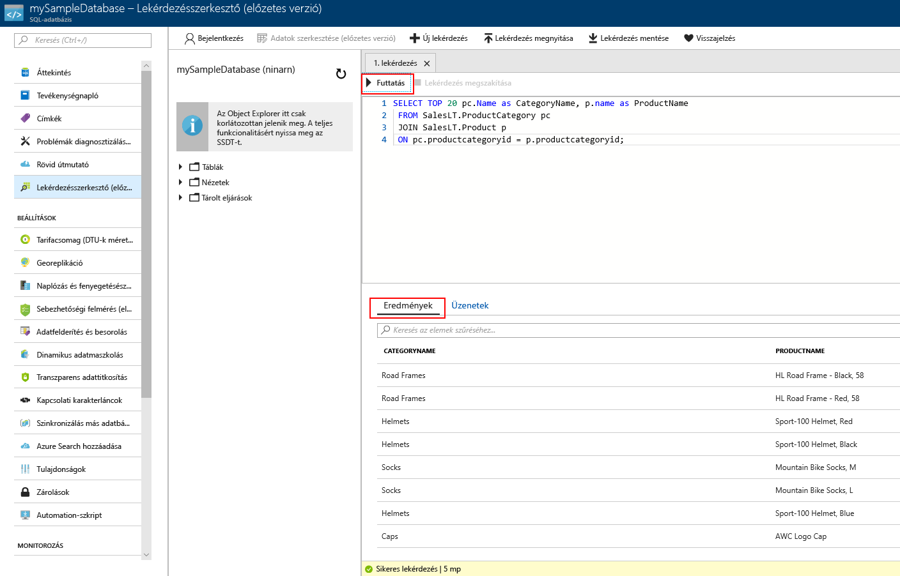

# <a name="quickstart-use-the-azure-portals-sql-query-editor-to-connect-and-query-data"></a>Gyors útmutató: Csatlakozás és adatok lekérdezése az Azure portal SQL-Lekérdezésszerkesztő használatával

Az SQL-Lekérdezésszerkesztő egy SQL-lekérdezések végrehajtása az Azure SQL Database vagy Azure SQL Data Warehouse egyszerű módot biztosít az Azure portal böngésző eszköz. Ez a rövid útmutatóban való csatlakoztatása SQL-adatbázishoz, majd futtassa a Transact-SQL-utasítások használatával lekérdezni, beszúrni, frissíteni és törli az adatokat a Lekérdezésszerkesztő használni kívánt.

## <a name="prerequisites"></a>Előfeltételek

Az oktatóanyag elvégzéséhez a következőkre lesz szüksége:

[!INCLUDE [prerequisites-create-db](../../includes/sql-database-connect-query-prerequisites-create-db-includes.md)]

> [!NOTE]
> Győződjön meg arról, hogy a **Azure-szolgáltatásokhoz való hozzáférés engedélyezése** beállítás **ON** az SQL server Tűzfalbeállításaiban. Ezt a lehetőséget biztosít az SQL-lekérdezésszerkesztőnek az adatbázisokhoz és az adattárházakhoz.

## <a name="sign-in-the-azure-portal"></a>Jelentkezzen be az Azure Portalon

Jelentkezzen be az [Azure Portalra](https://portal.azure.com/).

## <a name="connect-using-sql-authentication"></a>Csatlakozás az SQL-hitelesítés használata

1. Válassza ki **SQL-adatbázisok** a bal oldali menüben válassza ki **mySampleDatabase**.

2. A bal oldali menüben, kereséséhez és kijelöléséhez **Lekérdezésszerkesztő (előzetes verzió)**. A **bejelentkezési** lap jelenik meg.

    

3. Az a **engedélyezési típus** legördülő menüjében válassza **SQL Server-hitelesítés** , és adja meg a felhasználói Azonosítót és jelszót a kiszolgálói rendszergazdai fiók az adatbázis létrehozásakor használt.

     

4. Kattintson az **OK** gombra.


## <a name="connect-using-azure-active-directory"></a>Csatlakozás az Azure Active Directory használatával

Az Active Directory (AD) rendszergazda konfigurálása lehetővé teszi, hogy egyetlen identitással jelentkezzen be az Azure portal és az SQL-adatbázis. Az SQL Server egy AD-rendszergazda konfigurálása az alábbi lépésekkel.

> [!NOTE]
* E-mail-fiókok (például outlook.com, gmail.com, yahoo.com és így tovább) még nem támogatottak az AD-rendszergazdaként. Ellenőrizze, hogy válassza ki a felhasználó vagy natív módon az Azure AD-ben létrehozott, vagy összevonták az Azure ad-ben.
* Jelentkezzen be az Azure AD-rendszergazda nem működik olyan fiókokkal, amelyeken 2 többtényezős hitelesítés engedélyezve van.

1. Válassza ki **összes erőforrás** elemet a bal oldali menüben, majd az SQL Serverhez.

2. Az SQL-kiszolgáló **beállítások** menüjében válassza **Active Directory-rendszergazda**.

3. AD admin oldal eszköztárán válassza **rendszergazda beállítása** , és válassza ki a felhasználó vagy csoport az AD-rendszergazdaként

    

4. AD admin oldal eszköztárán válassza **mentése**.

5. Keresse meg a **mySampleDatabase** adatbázisra, majd a bal oldali menüből válassza **Lekérdezésszerkesztő (előzetes verzió)**. A **bejelentkezési** lap jelenik meg. Ha Ön AD rendszergazda, majd a jobb oldali alatt **Active Directory egyszeri bejelentkezés**, megjelenik egy üzenet közli, hogy már bejelentkezett. 
   
6. Kattintson az **OK** gombra.


## <a name="view-data"></a>Adatok megtekintése

1. Miután, a hitelesítés, illessze be a következő SQL kategóriánként az első 20 terméket beolvasni a Lekérdezésszerkesztő.

   ```sql
    SELECT TOP 20 pc.Name as CategoryName, p.name as ProductName
    FROM SalesLT.ProductCategory pc
    JOIN SalesLT.Product p
    ON pc.productcategoryid = p.productcategoryid;
   ```

2. Válassza az eszköztár **futtatása** és tekintse át a kimenetet a a **eredmények** ablaktáblán.



## <a name="insert-data"></a>Adat beszúrása

Futtassa a következő [BESZÚRÁSA](https://msdn.microsoft.com/library/ms174335.aspx) hozzáadása egy új terméket a Transact-SQL utasítást a `SalesLT.Product` tábla.

1. Ehhez cserélje le az előző lekérdezést.

   ```sql
   INSERT INTO [SalesLT].[Product]
           ( [Name]
           , [ProductNumber]
           , [Color]
           , [ProductCategoryID]
           , [StandardCost]
           , [ListPrice]
           , [SellStartDate]
           )
     VALUES
           ('myNewProduct'
           ,123456789
           ,'NewColor'
           ,1
           ,100
           ,100
           ,GETDATE() );
   ```


2. Válassza ki **futtatása** az új sor beszúrásához a `Product` tábla. A **üzenetek** ablaktáblán megjelennek azok **sikeres lekérdezés: Érintett sorok: 1**.


## <a name="update-data"></a>Adatok frissítése

Futtassa a következő [frissítés](https://msdn.microsoft.com/library/ms177523.aspx) Transact-SQL utasítás használatával módosíthat az új termék.

1. Ehhez cserélje le az előző lekérdezést.

   ```sql
   UPDATE [SalesLT].[Product]
   SET [ListPrice] = 125
   WHERE Name = 'myNewProduct';
   ```

2. Válassza ki **futtatása** egy megadott sorának frissítéséhez a `Product` tábla. A **üzenetek** ablaktáblán megjelennek azok **sikeres lekérdezés: Érintett sorok: 1**.

## <a name="delete-data"></a>Adat törlése

Futtassa a következő [törlése](https://msdn.microsoft.com/library/ms189835.aspx) Transact-SQL utasítást az új termék eltávolítása.

1. Cserélje le az előző lekérdezés erre:

   ```sql
   DELETE FROM [SalesLT].[Product]
   WHERE Name = 'myNewProduct';
   ```

2. Válassza ki **futtatása** egy megadott sorának törléséhez a `Product` tábla. A **üzenetek** ablaktáblán megjelennek azok **sikeres lekérdezés: Érintett sorok: 1**.


## <a name="query-editor-considerations"></a>Lekérdezés-szerkesztő szempontok

Ha a Lekérdezésszerkesztő néhány dolgot lehet.

* A virtuális hálózaton nem használható a Lekérdezésszerkesztő az SQL server-adatbázisok lekérdezése.

* F5 billentyű lenyomásával frissíti a Lekérdezésszerkesztő lapja, és bármilyen szerkesztett lekérdezést elvész.

* A Lekérdezésszerkesztő nem támogatja a Kapcsolódás a `master` adatbázis.

* A lekérdezés végrehajtása 5 perces időtúllépés van.

* A Lekérdezésszerkesztő csak geográfiai adattípusokhoz tartozó hengervetületet támogatja.

* Nincs adatbázis-táblák és nézetek tartozó IntelliSense nem támogatott. A szerkesztő azonban támogatja az automatikus kiegészítés, amely már beírt nevek alapján.


## <a name="next-steps"></a>További lépések

Az Azure SQL-adatbázisokban támogatott Transact-SQL kapcsolatos további információkért lásd: [feloldása Transact-SQL különbségek az SQL Database áttelepítése során](sql-database-transact-sql-information.md).
