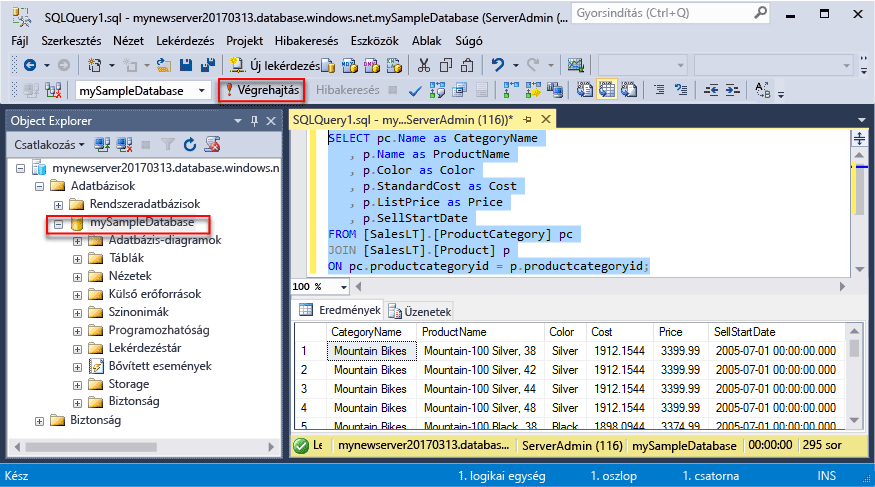
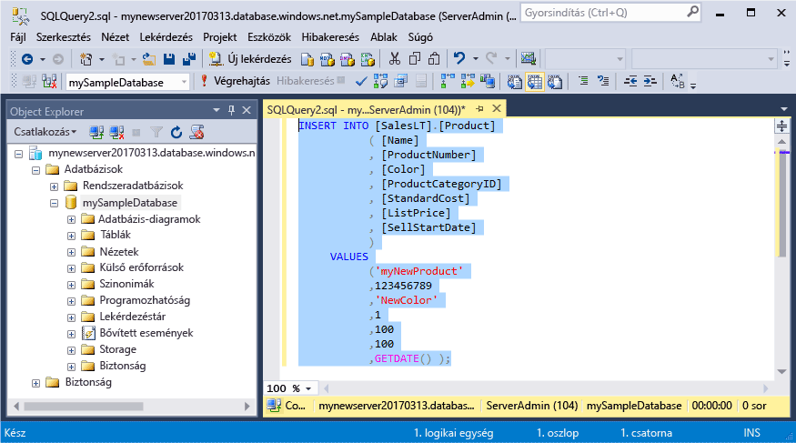
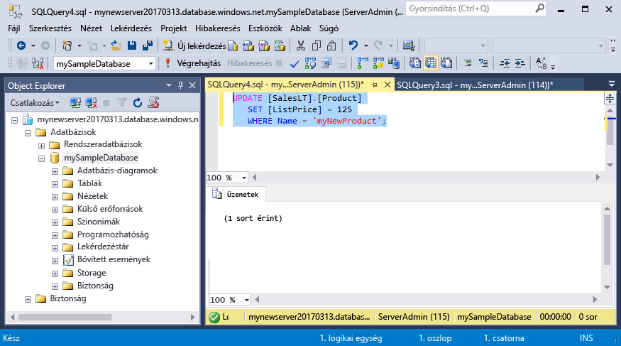
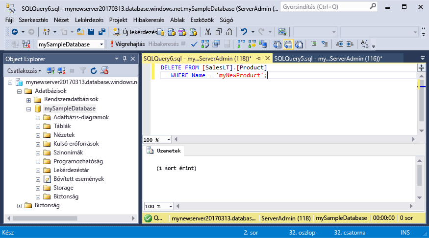

# <a name="azure-sql-database-use-sql-server-management-studio-to-connect-and-query-data"></a>Azure SQL Database: Az SQL Server Management Studio segítségével csatlakozhat és kérdezhet le adatokat

Az [SQL Server Management Studio](https://msdn.microsoft.com/library/ms174173.aspx) (SSMS) egy felügyeleti eszköz, amely az SQL Server-erőforrások felhasználói felületről vagy szkriptekkel történő létrehozására és kezelésére használható. Ez a gyors üzembehelyezési útmutató ismerteti, hogyan használható az SSMS egy Azure SQL Database-adatbázishoz való csatlakozáshoz, majd hogyan lehet Transact-SQL-utasítások használatával adatokat lekérdezni, beszúrni, frissíteni és törölni az adatbázisban. 

Ez a rövid útmutató az alábbi rövid útmutatók egyikében létrehozott erőforrásokat használja kiindulási pontnak:

- [DB létrehozása – portál](sql-database-get-started-portal.md)
- [DB létrehozása – CLI](sql-database-get-started-cli.md)

A kezdés előtt győződjön meg arról, hogy az [SSMS](https://msdn.microsoft.com/library/mt238290.aspx) legújabb verziója van telepítve. 

## <a name="get-connection-information"></a>Kapcsolatadatok lekérése

Kérje le az Azure SQL-adatbázishoz való csatlakozáshoz szükséges kapcsolatadatokat. A későbbi eljárásokban szüksége lesz a teljes kiszolgálónévre, az adatbázis nevére és a bejelentkezési adatokra.

1. Jelentkezzen be az [Azure portálra](https://portal.azure.com/).
2. Válassza az **SQL-adatbázisok** elemet a bal oldali menüben, majd kattintson az új adatbázisra az **SQL-adatbázisok** oldalon. 
3. Az adatbázis **Áttekintés** lapján tekintse meg a teljes kiszolgálónevet, amint az alábbi képen is látható. Ha a mutatót a kiszolgáló neve fölé viszi, megjelenik a **Kattintson a másoláshoz** lehetőség.

    

4. Amennyiben elfelejtette Azure SQL Database-kiszolgálója bejelentkezési adatait, lépjen az SQL Database-kiszolgáló oldalára, és itt megtudhatja a kiszolgáló rendszergazdájának nevét, valamint szükség esetén visszaállíthatja a jelszót. 

## <a name="connect-to-your-database-in-the-sql-database-logical-server"></a>Csatlakozás az adatbázishoz az SQL Database logikai kiszolgálóban

Az SQL Server Management Studióban építse fel a kapcsolatot az Azure SQL Database kiszolgálóval. 

> [!IMPORTANT]
> Egy Azure SQL Database logikai kiszolgáló figyel az 1433-as porton. Ha vállalati tűzfalon belülről szeretne csatlakozni egy Azure SQL Database logikai kiszolgálóhoz, ennek a portnak nyitva kell lennie a vállalati tűzfalon a sikeres csatlakozáshoz.
>

1. Nyissa meg az SQL Server Management Studiót.

2. A **Connect to Server** (Kapcsolódás a kiszolgálóhoz) párbeszédpanelen adja meg a következő adatokat:
   - **Server type** (Kiszolgáló típusa): Adja meg az adatbázismotort
   - **Server name** (Kiszolgáló neve): Írja be a teljes kiszolgálónevet, például **mynewserver20170313.database.windows.net**
   - **Authentication** (Hitelesítés): Válassza az SQL Server Authentication (SQL Server-hitelesítés) beállítást
   - **Login** (Bejelentkezés): Adja meg a kiszolgálói rendszergazdai fiókot
   - **Password** (Jelszó): Adja meg a kiszolgálói rendszergazdai fiók jelszavát

     

3. A **Connect to server** (Kapcsolódás a kiszolgálóhoz) párbeszédpanelen kattintson az **Options** (Beállítások) elemre. A **Connect to database** (Csatlakozás az adatbázishoz) szakaszban adja meg a következőt: **mySampleDatabase** az adatbázishoz való csatlakozáshoz.

     

4. Kattintson a **Connect** (Csatlakozás) gombra. Megnyílik az Object Explorer ablak az SSMS-ben. 

     

5. Az Object Explorerben bontsa ki a **Database** (Adatbázisok), majd a **mySampleDatabese** csomópontot a mintaadatbázisban található objektumok megtekintéséhez.

## <a name="query-data"></a>Adatok lekérdezése

A következő kód használatával lekérdezheti kategóriánként az első 20 terméket a [SELECT](https://msdn.microsoft.com/library/ms189499.aspx) Transact-SQL-utasítással.

1. Az Object Explorerben kattintson a jobb gombbal a **mySampleDatabase** adatbázisra, majd kattintson a **New Query** (Új lekérdezés) elemre. Megnyílik egy, az adatbázishoz csatlakoztatott üres lekérdezési ablak.
2. A lekérdezési ablakban írja be a következő lekérdezést:

   ```sql
   SELECT pc.Name as CategoryName, p.name as ProductName
   FROM [SalesLT].[ProductCategory] pc
   JOIN [SalesLT].[Product] p
   ON pc.productcategoryid = p.productcategoryid;
   ```

3. Az eszköztáron kattintson az **Execute** (Végrehajtás) elemre a Product és ProductCategory táblák adatainak lekérdezéséhez.

    

## <a name="insert-data"></a>Adat beszúrása

A következő kód használatával beszúrhat egy új terméket a SalesLT.Product táblába az [INSERT](https://msdn.microsoft.com/library/ms174335.aspx) Transact-SQL-utasítással.

1. A lekérdezési ablakban cserélje le az előző lekérdezést a következő lekérdezésre:

   ```sql
   INSERT INTO [SalesLT].[Product]
           ( [Name]
           , [ProductNumber]
           , [Color]
           , [ProductCategoryID]
           , [StandardCost]
           , [ListPrice]
           , [SellStartDate]
           )
     VALUES
           ('myNewProduct'
           ,123456789
           ,'NewColor'
           ,1
           ,100
           ,100
           ,GETDATE() );
   ```

2. Az eszköztáron kattintson az **Execute** (Végrehajtás) elemre az új sor Product táblába történő beszúrásához.

    

## <a name="update-data"></a>Adatok frissítése

A következő kód használatával frissítheti az előzőleg hozzáadott új terméket az [UPDATE](https://msdn.microsoft.com/library/ms177523.aspx) Transact-SQL-utasítással.

1. A lekérdezési ablakban cserélje le az előző lekérdezést a következő lekérdezésre:

   ```sql
   UPDATE [SalesLT].[Product]
   SET [ListPrice] = 125
   WHERE Name = 'myNewProduct';
   ```

2. Az eszköztáron kattintson az **Execute** (Végrehajtás) elemre a Product tábla egy megadott sorának frissítéséhez.

    

## <a name="delete-data"></a>Adat törlése

A következő kód használatával törölheti az előzőleg hozzáadott új terméket a [DELETE](https://msdn.microsoft.com/library/ms189835.aspx) Transact-SQL-utasítással.

1. A lekérdezési ablakban cserélje le az előző lekérdezést a következő lekérdezésre:

   ```sql
   DELETE FROM [SalesLT].[Product]
   WHERE Name = 'myNewProduct';
   ```

2. Az eszköztáron kattintson az **Execute** (Végrehajtás) elemre a Product tábla egy megadott sorának törléséhez.

    

## <a name="next-steps"></a>Következő lépések

- Az SSMS eszközről további információt [az SQL Server Management Studio használatát ismertető cikkben talál](https://msdn.microsoft.com/library/ms174173.aspx).
- A Visual Studio Code használatával történő csatlakozásról és lekérdezésről lásd a [Visual Studio Code használatával végzett csatlakozásról és lekérdezésről](sql-database-connect-query-vscode.md) szóló témakört.
- A .NET használatával történő csatlakozásról és lekérdezésről lásd a [.NET használatával végzett csatlakozásról és lekérdezésről](sql-database-connect-query-dotnet.md) szóló témakört.
- A PHP-vel történő csatlakozásról és lekérdezésről lásd a [PHP-vel végzett csatlakozásról és lekérdezésről](sql-database-connect-query-php.md) szóló témakört.
- A Node.js használatával történő csatlakozásról és lekérdezésről lásd a [Node.js használatával végzett csatlakozásról és lekérdezésről](sql-database-connect-query-nodejs.md) szóló témakört.
- A Java használatával történő csatlakozásról és lekérdezésről lásd a [Java használatával végzett csatlakozásról és lekérdezésről](sql-database-connect-query-java.md) szóló témakört.
- A Python használatával történő csatlakozásról és lekérdezésről lásd a [Python használatával végzett csatlakozásról és lekérdezésről](sql-database-connect-query-python.md) szóló témakört.
- A Ruby használatával történő csatlakozásról és lekérdezésről lásd a [Ruby használatával végzett csatlakozásról és lekérdezésről](sql-database-connect-query-ruby.md) szóló témakört.

