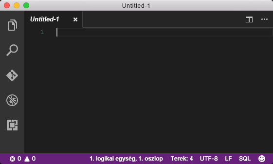
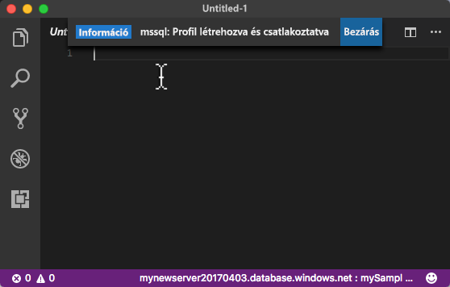

# <a name="azure-sql-database-use-visual-studio-code-to-connect-and-query-data"></a>Azure SQL Database: Csatlakozás, majd adatok lekérdezése a Visual Studio Code használatával

A [Visual Studio Code](https://code.visualstudio.com/docs) egy grafikus kódszerkesztő Linux, macOS és Windows rendszerekre, amely támogatja a bővítményeket, beleértve az [mssql bővítményt](https://aka.ms/mssql-marketplace) a Microsoft SQL Server, az Azure SQL Database és az SQL Data Warehouse lekérdezéséhez. Ez a rövid útmutató azt ismerteti, hogyan használható a Visual Studio Code egy Azure SQL Database-adatbázishoz való csatlakozáshoz, és hogyan lehet Transact-SQL-utasításokkal adatokat lekérdezni, beszúrni, frissíteni és törölni az adatbázisban.

## <a name="prerequisites"></a>Előfeltételek

Ez a rövid útmutató az alábbi rövid útmutatókban létrehozott erőforrásokat használja kiindulási pontként:

[!INCLUDE [prerequisites-create-db](../../includes/sql-database-connect-query-prerequisites-create-db-includes.md)]

#### <a name="install-vs-code"></a>A VS Code telepítése

A kezdés előtt győződjön meg arról, hogy a [Visual Studio Code](https://code.visualstudio.com/Download) legújabb verziója van telepítve, és be van töltve az [mssql bővítmény](https://aka.ms/mssql-marketplace). Az mssql bővítmény telepítési lépéseinek megismeréséhez olvassa el [a VS Code telepítését](https://docs.microsoft.com/sql/linux/sql-server-linux-develop-use-vscode#install-vs-code) és a [Visual Studio Code-hoz használható mssql-t](https://marketplace.visualstudio.com/items?itemName=ms-mssql.mssql) ismertető cikkeket. 

## <a name="configure-vs-code"></a>A VS Code konfigurálása 

### <a name="mac-os"></a>**Mac OS**
macOS esetén telepíteni kell az OpenSSL-t, amely az mssql bővítmény által használt .Net Core előfeltétele. Nyissa meg a terminált, és adja meg az alábbi parancsokat a **brew** és az **OpenSSL** telepítéséhez. 

```bash
ruby -e "$(curl -fsSL https://raw.githubusercontent.com/Homebrew/install/master/install)"
brew update
brew install openssl
mkdir -p /usr/local/lib
ln -s /usr/local/opt/openssl/lib/libcrypto.1.0.0.dylib /usr/local/lib/
ln -s /usr/local/opt/openssl/lib/libssl.1.0.0.dylib /usr/local/lib/
```

### <a name="linux-ubuntu"></a>**Linux (Ubuntu)**

Nincs szükség különleges konfigurációra.

### <a name="windows"></a>**Windows**

Nincs szükség különleges konfigurációra.

## <a name="sql-server-connection-information"></a>Az SQL-kiszolgáló kapcsolatadatai

Kérje le az Azure SQL-adatbázishoz való csatlakozáshoz szükséges kapcsolatadatokat. A későbbi eljárásokban szüksége lesz a teljes kiszolgálónévre, az adatbázis nevére és a bejelentkezési adatokra.

[!INCLUDE [prerequisites-server-connection-info](../../includes/sql-database-connect-query-prerequisites-server-connection-info-includes.md)]

## <a name="set-language-mode-to-sql"></a>A nyelvmód SQL értékre állítása

Az mssql-parancsok és a T-SQL IntelliSense engedélyezéséhez ügyeljen arra, hogy a nyelvmód beállítása **SQL** legyen a Visual Studio Code-ban.

1. Nyisson meg egy új Visual Studio Code-ablakot. 

2. Kattintson az **Egyszerű szöveg** elemre az állapotsor jobb alsó sarkában.
3. A megnyíló **Nyelvmód kiválasztása** legördülő menübe írja be az **SQL** kifejezést, majd nyomja le az **ENTER** billentyűt a nyelvmód SQL értékre állításához. 

   

## <a name="connect-to-your-database"></a>Csatlakozás az adatbázishoz

A Visual Studio Code segítségével kapcsolatot hozhat létre az Azure SQL Database-kiszolgálóval.

> [!IMPORTANT]
> A folytatás előtt győződjön meg arról, hogy rendelkezésére állnak a kiszolgálóval és az adatbázissal kapcsolatos, valamint a bejelentkezési adatok. Ha elkezdi beírni a csatlakozási profil információit, és áthelyezi a fókuszt a Visual Studio Code-ról, újra kell kezdenie a csatlakozási profil létrehozását.
>

1. A VS Code-ban nyomja le a **CTRL+SHIFT+P** billentyűkombinációt (vagy az **F1** billentyűt) a parancskatalógus megnyitásához.

2. Írja be az **sqlcon** parancsot, és nyomja le az **ENTER** billentyűt.

3. A **Kapcsolati profil létrehozása** kiválasztásához nyomja le az **ENTER** billentyűt. Ezzel létrehoz egy kapcsolati profilt az SQL Server-példányhoz.

4. Az útmutatást követve adja meg az új kapcsolati profil kapcsolati tulajdonságait. Az egyes értékek kiválasztása után a folytatáshoz nyomja le az **ENTER** billentyűt. 

   | Beállítás       | Ajánlott érték | Leírás |
   | ------------ | ------------------ | ------------------------------------------------- | 
   | **Kiszolgálónév | A teljes kiszolgálónév | A névnek valami ehhez hasonlónak kell lennie: **mynewserver20170313.database.windows.net**. |
   | **Adatbázis neve** | mySampleDatabase | A kiszolgáló neve, amelyhez kapcsolódni szeretne. |
   | **Hitelesítés** | SQL-bejelentkezés| Az SQL-hitelesítés az egyetlen hitelesítési típus, amelyet ebben az oktatóanyagban konfiguráltunk. |
   | **Felhasználónév** | A kiszolgálói rendszergazdai fiók | Ez az a fiók, amely a kiszolgáló létrehozásakor lett megadva. |
   | **Jelszó (SQL-bejelentkezés)** | A kiszolgálói rendszergazdai fiók jelszava | Ez az a jelszó, amely a kiszolgáló létrehozásakor lett megadva. |
   | **Menti a jelszót?** | Igen vagy nem | Válassza az Igen lehetőséget, ha nem szeretné minden alkalommal megadni a jelszót. |
   | **Adja meg a profil kívánt nevét** | Egy profilnév, például: **mySampleDatabase** | A mentett profilnév felgyorsítja a csatlakozást a későbbi bejelentkezések során. | 

5. Az **ESC** billentyűt lenyomva zárja be a profil létrehozásáról és csatlakoztatásáról tájékoztató üzenetet.

6. Ellenőrizze a kapcsolatot az állapotsávon.

   

## <a name="query-data"></a>Adatok lekérdezése

A következő kód használatával lekérdezheti kategóriánként az első 20 terméket a [SELECT](https://msdn.microsoft.com/library/ms189499.aspx) Transact-SQL-utasítással.

1. A **szerkesztő** ablakában írja be a következő lekérdezést az üres lekérdezési ablakba:

   ```sql
   SELECT pc.Name as CategoryName, p.name as ProductName
   FROM [SalesLT].[ProductCategory] pc
   JOIN [SalesLT].[Product] p
   ON pc.productcategoryid = p.productcategoryid;
   ```

2. A **CTRL+SHIFT+E** billentyűkombinációt lenyomva lekérheti az adatokat a Product és ProductCategory táblából.

    

## <a name="insert-data"></a>Adat beszúrása

A következő kód használatával beszúrhat egy új terméket a SalesLT.Product táblába az [INSERT](https://msdn.microsoft.com/library/ms174335.aspx) Transact-SQL-utasítással.

1. A **szerkesztő** ablakában törölje az előző lekérdezést, és adja meg a következő lekérdezést:

   ```sql
   INSERT INTO [SalesLT].[Product]
           ( [Name]
           , [ProductNumber]
           , [Color]
           , [ProductCategoryID]
           , [StandardCost]
           , [ListPrice]
           , [SellStartDate]
           )
     VALUES
           ('myNewProduct'
           ,123456789
           ,'NewColor'
           ,1
           ,100
           ,100
           ,GETDATE() );
   ```

2. A **CTRL+SHFT+E** billentyűkombinációt lenyomva beszúrhat egy új sort a Product táblába.

## <a name="update-data"></a>Adatok frissítése

A következő kód használatával frissítheti az előzőleg hozzáadott új terméket az [UPDATE](https://msdn.microsoft.com/library/ms177523.aspx) Transact-SQL-utasítással.

1.  A **szerkesztő** ablakában törölje az előző lekérdezést, és adja meg a következő lekérdezést:

   ```sql
   UPDATE [SalesLT].[Product]
   SET [ListPrice] = 125
   WHERE Name = 'myNewProduct';
   ```

2. A **CTRL+SHFT+E** billentyűkombinációt lenyomva frissítheti a megadott sort a Product táblában.

## <a name="delete-data"></a>Adat törlése

A következő kód használatával törölheti az előzőleg hozzáadott új terméket a [DELETE](https://docs.microsoft.com/sql/t-sql/statements/delete-transact-sql) Transact-SQL-utasítással.

1. A **szerkesztő** ablakában törölje az előző lekérdezést, és adja meg a következő lekérdezést:

   ```sql
   DELETE FROM [SalesLT].[Product]
   WHERE Name = 'myNewProduct';
   ```

2. A **CTRL+SHFT+E** billentyűkombinációt lenyomva törölheti a megadott sort a Product táblából.

## <a name="next-steps"></a>További lépések

- Az SQL Server Management Studióval történő csatlakozáshoz és lekérdezéshez lásd [az SSMS segítségével történő csatlakozással és lekérdezéssel](sql-database-connect-query-ssms.md) foglalkozó témakört.
- Az Azure Portal használatával történő csatlakozásról és lekérdezésről lásd az [Azure Portal SQL-lekérdezésszerkesztővel végzett csatlakozásról és lekérdezésről](sql-database-connect-query-portal.md) szóló témakört.
- Az MSDN magazin Visual Studio Code használatáról szóló cikkéhez lásd az [Adatbázis IDE létrehozása az MSSQL bővítménnyel blogbejegyzést](https://msdn.microsoft.com/magazine/mt809115).
